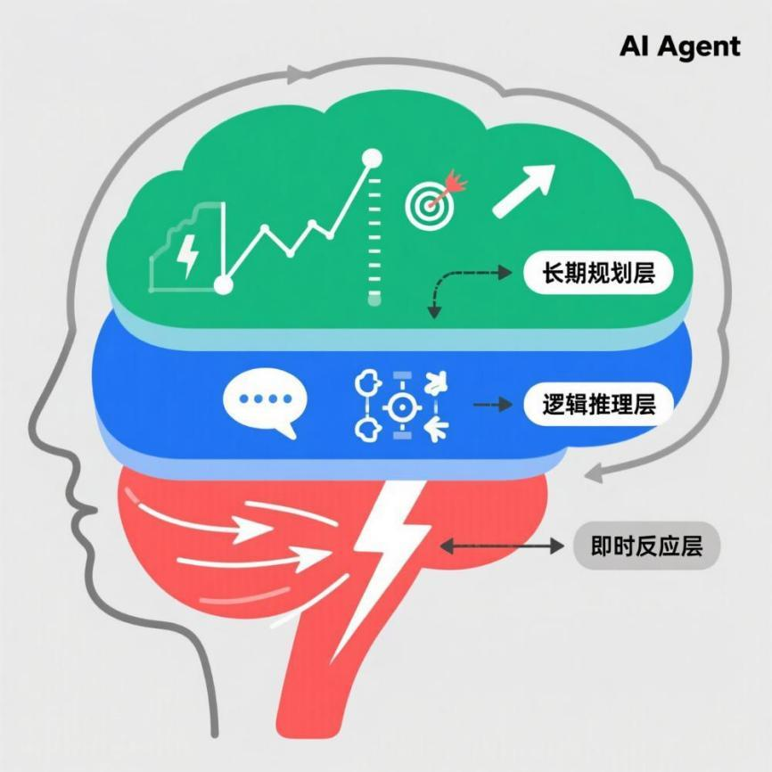
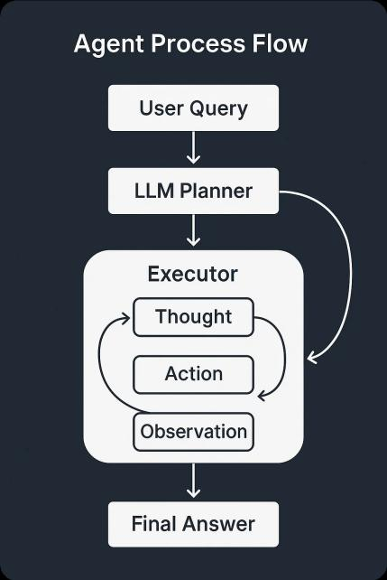
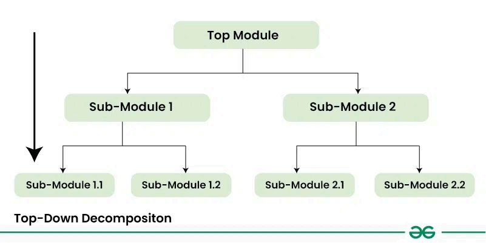
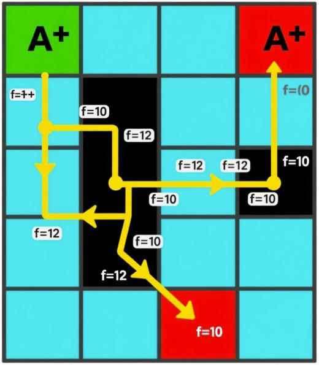
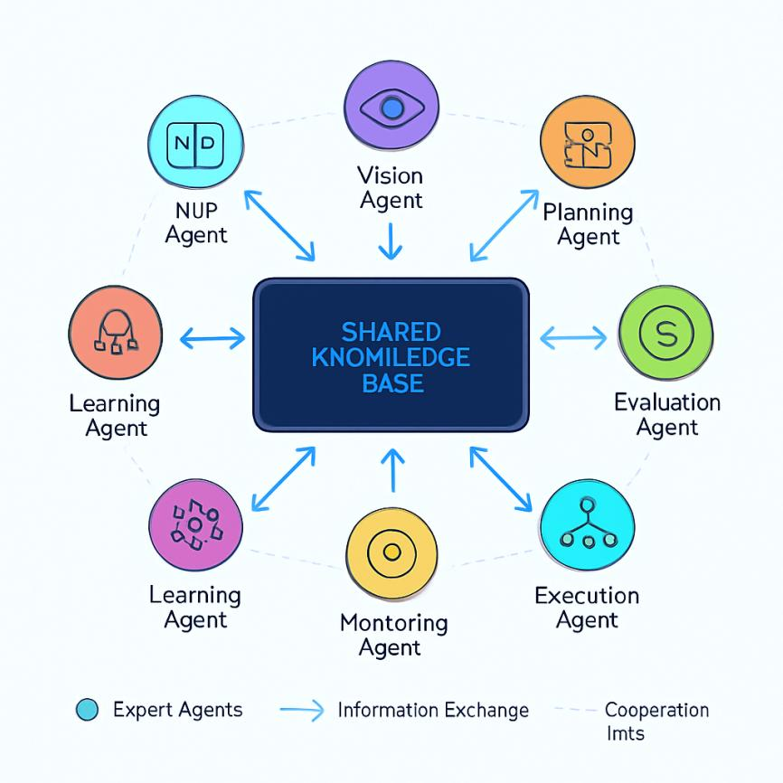

# 第1章 AI助手的思考引擎

这本书包括什么内容
本书内容可以分为四大部分，共八章。
第一部分 AI 助手的智慧之核包括第 1 章和第 2 章，介绍 AI Agent 的决策与推理系统
（思考引擎），以及高效信息管理与知识沉淀（记忆宫殿）。
第二部分AI 助手的能力延伸包括第3 章和第4 章，讲解工具调用原理与流程，以及跨
领域效率场景的深度应用。
第三部分AI 助手的复杂应用包括第5 章和第6 章，探讨多智能体协同系统和主流开源
智能体框架（LangChain、LlamaIndex、MetaGPT 等），并新增了新一代桌面智能体的介绍。
第四部分 AI 助手的持续进化包括第7 章和第 8 章，涵盖AI 助手的部署与性能优化，
以及自我成长能力（故障排查、持续学习、未来展望），并新增了 Skills 与 Soul 等前沿内
容的介绍。
读者阅读本书过程中遇到问题可以通过邮件与笔者联系。
作者介绍
作者简介：邵可佳，雨根科技软件大数据事业部总监，美国北亚利桑那州大学数据分析
硕士，工作二十年来，先后在马上金融、河狸家、墨迹天气从事算法工作，在机器人具身智
能、智能家居、金融风控、电商推荐、O2O 派单等领域具有算法实际落地经验。在墨迹天
气工作期间，通过多项关键专利技术的突破，显着提升 了预报准确率，推动产品在
Forecastwatch 国际评测中跻身全球前列， 获得业界广泛认可。 目前在雨根主导碳寻大模型、
生态智能体的研发。
本书读者对象
⚫ AI 技术爱好者，希望系统学习AI Agent 开发的人员；
⚫ 软件开发工程师，想要转型或扩展到AI Agent 领域的开发者；
⚫ 产品经理和创业者，寻找AI 产品落地思路的从业者；
⚫ 高校学生，学习人工智能、大语言模型相关课程的学生；
⚫ 各行各业希望利用AI 提升工作效率的知识工作者。

第 1 部分：AI 的智慧之核

第 1 章 AI 助手的思考引擎
欢迎来到本书的第一部分！在这里，我们将一起揭开 AI Agent（智能代理）那神秘的
黑箱，探寻其智慧之核。你是否曾好奇，当你向智能助理下达一个指令时，它究竟是如何思
考并做出回应的？是简单的关键词匹配，还是背后隐藏着一套复杂的决策逻辑？
本章，我们将化身神经外科医生，深入AI Agent 的大脑皮层，剖析其核心的决策与推
理系统。这不仅仅是理论的堆砌，更是一次激动人心的探险。我们将看到，一个优秀的 AI
Agent，其决策机制远比我们想象的要精妙，它就像一个高度协同的作战指挥中心，能够根
据任务的复杂程度，调动不同层级的兵力来应对。
本章涉及的知识点有：
⚫ 智能体的响应机制；

⚫ 智能体的决策模型；
⚫ 任务拓扑分解与优化。
1.1 智能决策三层响应机制
想象一下你开车时遇到的各种状况：前方红灯，你下意识地踩下刹车；导航提示前方拥
堵，你开始思考是否要更换路线；为了赶上三个月后的重要家庭聚会，你正在规划一条横跨
数个省份的长途自驾路线。这三种场景，你的大脑分别启动了完全不同的处理模式：本能反
应、逻辑分析和长期规划。
一个设计精良的 AI Agent，其决策系统也遵循着类似的逻辑分层。我们将其概括为智
能决策三层响应机制。这种分层设计并非故弄玄虚，而是效率与能力的最佳平衡。正如危机
管理专家会构建分层响应金字塔（Tiered Response Pyramid）来应对不同规模的灾难一样，
我们的 AI Agent 也需要一个类似的框架来处理从秒回到深思熟虑的各类任务。它确保了
Agent 在处理简单、高频的任务时能快如闪电，而在面对复杂、开放式的挑战时又能深谋远
虑。如图1-1 所示

，为大脑智能

决策三层响应的示意。

图 1-1 智能决策三层响应机制示意

图，用大脑不同区域比喻 AI 的三个决策层
接下来， 让我们逐层解构这三个神奇的反应层， 看看它们是如何协同工作， 赋予AI Agent
思考能力的。

1.1.1 即时反应层：AI 的膝跳反射
即时反应层（Instantaneous Reaction Layer）是AI Agent 决策系统的第一道防线，也是
最高效的一层。它处理的是那些明确、固定、无需复杂思考的应激任务。你可以把它想象成
人类的膝跳反射——当医生用小锤敲击你的膝盖， 你的小腿会不假思索地弹起。这个过程无
需经过大脑的复杂分析，是一种预设好的、自动化的反应。
在 AI Agent 的世界里，这一层通常由一系列预定义的规则驱动。这些规则就像一个个
如果……就……的指令集，清晰而直接。这种方法在计算机科学中被称为基于规则的系统
（Rule-Based Systems），它追求的是极致的速度和可靠性。
场景举例： 假设你正在打造一个邮件管理 Agent。你可以为它设定一条简单的即时反
应规则：
IF 邮件发件人 == "你的老板" OR 邮件标题.包含("紧急", "重要") THEN
将邮件标记为 "星标邮件"并立即发送手机通知
看到吗？这个过程没有任何模糊地带。Agent 不需要理解邮件的深层含义，只需进行简
单的模式匹配，然后执行预设动作。这使得它在处理海量、重复性的任务时效率极高，比如
自动分类邮件、过滤垃圾信息、响应简单的客服问询（我的订单到哪了？）等。
优点：速度快、可靠性高、易于理解和调试。
缺点：缺乏灵活性。它只能处理预先定义好的情况，一旦遇到规则之外的新问题，就会
束手无策。它就像一个只会按乐谱弹奏的钢琴手，无法即兴创作。
因此，即时反应层是AI Agent 不可或缺的快车道，但要让Agent 真正变得智能，我们
还需要更强大的引擎。
1.1.2 逻辑推理层：AI 的理性大脑
当任务变得复杂， 不再是简单的非黑即白时， 我们就需要启动决策的第二层——逻辑推
理层（Logical Reasoning Layer）。如果说即时反应层是AI 的脊髓，那么逻辑推理层就是它
的大脑皮层，负责处理需要理解、分析、推理和上下文感知的问题。
这一层的核心驱动力，正是当前大放异彩的大型语言模型（LLMs），如 GPT 系列、
Gemini 等。与基于规则的系统不同，LLMs 通过在海量数据上进行训练，获得了强大的语言
理解和生成能力。它们能够处理模糊的指令，理解上下文，并进行多步骤的推理。
然而， 直接把一个复杂的任务扔给LLM， 就像让一个天才去解决一个定义不清的问题，
结果可能并不理想。 为了让 LLM 高效工作，我们需要 一种关键技术：任务分解（Task
Decomposition）。这是一种将复杂目标拆解成一系列更小、更易于管理子任务的策略，就像
项目经理在启动一个大项目前，会先制定详细的WBS（工作分解结构）一样。
场景举例： 你对你的AI 助理说：帮我总结一下上周所有关于‘天狼星项目’的会议纪
要，并根据要点起草一封项目进展邮件，发给团队成员。
这个任务显然超出了即时反应层的能力范围。逻辑推理层接到指令后， 会像一个聪明的
秘书一样，开始分解任务：
# 初始目标：总结会议纪要并起草邮件

# 任务分解后的计划 (由LLM 生成):
1.识别关键信息： 从指令中提取关键词天狼星项目和时间范围上周。
2.搜索文档： 调用内部文件搜索工具，查找所有符合条件的会议纪要。
3.阅读与总结： 逐一阅读找到的纪要，提取核心决策、待办事项和关键数据。
4.整合要点： 将所有纪要的要点进行汇总、去重，形成一份结构化的总结。
5.起草邮件： 调用邮件撰写工具，根据总结的要点，生成一封清晰、专业的项目进展邮件
6.等待确认： 将草稿呈现给你，等待最终的发送确认。
在这个过程中，AI Agent 利用 LLM 的推理能力进行规划， 并将每一步 （如搜索、 总结）
映射到具体的工具或能力上。这种思考-行动的循环， 有时被称为ReAct（Reasoning and Action）
框架，是现代AI Agent 的核心工作模式之一。
逻辑推理层让 Agent 从一个指令执行者蜕变为一个问题解决者。它能够处理需要创造
性、灵活性和深度理解的复杂工作，是AI Agent 真正展现其智能的关键所在。
1.1.3 长期规划层：AI 的人生规划师
现在，我们来到了决策机制的最顶层——长期规划层（Long-Term Planning Layer）。如
果说前两层关注的是现在该做什么， 那么这一层则着眼于未来要实现什么。它处理的是那些
跨度长、目标宏大、充满不确定性的任务，需要Agent 具备记忆、学习和动态调整策略的能
力。
这一层的运作方式， 可以类比于人类为自己设定长期目标， 比如一年内学会一门新语言
或五年内成为行业专家。这不仅仅是一系列行动的简单堆砌，更是一个需要持续反馈、不断
优化的动态过程。在 AI 领域，这通常与强化学习（Reinforcement Learning, RL）等技术紧
密相关。
强化学习的理念非常直观，就像训练宠物一样：当它做出正确的行为（比如听到坐下指
令后坐下），就给予奖励（一小块零食）；做出错误行为则不予理会。久而久之，它就会学
会为了最大化奖励而做出正确的决策。AI Agent 在长期规划层也是如此，它在一个环境中
不断尝试，通过奖励或惩罚的反馈信号，学习如何达成最终目标。
场景举例：你赋予你的AI 健康助理一个长期目标：帮我制定并执行一个为期三个月的
减重5 公斤的计划。
长期规划层不会一次性给出一个固定不变的计划， 而是会启动一个持续的、 动态的管理
循环：
1.初始规划 (Planning): 结合你的身体数据（身高、体重、年龄）和偏好，生成一个初步的饮食和运
动计划。这本身可能就需要逻辑推理层的参与。
2.执行与监控 (Execution & Monitoring): 每天提醒你打卡、记录饮食和运动情况，并连接智能手环等
设备获取实时数据。
3.评估与反馈 (Evaluation & Feedback):  每周分析你的体重变化、运动频率等数据。如果进展顺利
（获得正向奖励），则维持当前策略。如果进展停滞（获得负向奖励或无奖励），则需要调整。
4.策略调整 (Policy Adjustment): 发现你连续三天没有进行有氧运动， 它可能会主动提问： 是最近太
忙了吗？或者我们可以尝试一些你更喜欢的运动，比如游泳或跳舞？然后根据你的反馈，动态调整运
动计划。
这个过程的核心是⻢尔可夫决策过程（Markov Decision Process, MDP），一个用于在不

确定环境中进行决策的数学框架。 它帮助Agent 在每个状态 （比如本周体重

下降0.5kg） 下，
选择一个能带来最大长期回报（最终减重5kg）的行动（比如增加力量训练）。
如图 1-2 所示，为智能决策的分层架构示意图。

图 1-2 AI 智能决策分层架构图
用户输入首先由逻辑推理层（LLM Planner ）进行任务分解和规划，然后交由执行器
（Executor）进入思考-行动-观察的循环，执行器在需要时可以向规划器请求反馈和调整，
最终输出答案。
长期规划层赋予了 AI Agent 远见和适应性，让它能够陪伴用户共同成长，完成那些需
要耐心、智慧和持续努力的宏伟目标。它代表了 AI Agent 从一个工具向一个真正的伙伴演
进的终极方向。
至此，我们已经完整地剖析了AI Agent 决策的三层响应机制。 从快如闪电的即时反应，
到深思熟虑的逻辑推理，再到高瞻远瞩的长期规划，这三层结构协同工作，共同构成了 AI
Agent 的智慧之核。在接下来的章节中，我们将进一步探讨支撑这些决策的另一个关键要素
——记忆，看看AI Agent 是如何记住过去，并用经验指导未来的。
1.2 决策模型与算法：AI 如何权衡利弊
你有没有想过， 当你对智能音箱说播放我喜欢的音乐时， 它究竟是如何从成千上万首歌
中挑出那一首的？当你问导航软件最快的回家路线时，它又是如何在无数条路径中做出选
择的？这背后，就是AI Agent 的决策核心——一系列精心设计的模型和算法，它们构成了
AI 的思考引擎。
如果说上一节我们了解了 AI Agent 需要一个大脑来思考，那么这一节，我们将亲手打
开这个大脑的工具箱，看看里面都藏着哪些神奇的工具。这些工具，有的像一本严谨的规则

手册，有的像一棵不断生长的智慧之树，还有的则像一个在游戏中不断试错、越挫越勇的玩
家。准备好了吗？让我们一起探索AI Agent 决策的奥秘。
1.2.1 最直接的思考者：基于规则的模型
想象一下你家里的自动恒温器。它的工作原理简单粗暴：如果温度低于20 度，就开启
暖气；如果高于26 度，就开启冷气。这就是最基础的决策模型——基于规则的模型（Rule-
Based Model） 。 它就像一个严格执行命令的士兵， 根据一系列预先设定的如果…那么… （IF-
THEN）指令来行动。
在 AI Agent 的早期，这种模型是绝对的主角。开发者会像编写剧本一样，为Agent 可
能遇到的每一种情况都设定好应对策略。比如，开发一个客服机器人，规则可能是：如果用
户输入‘查询订单’，那么就询问‘请输入您的订单号’。
注意：基于规则的模型就像一本详尽的《傻瓜操作指南》。每一步都有明确的指示，只
要按部就班，就能完成任务。它简单、透明、可预测，非常适合处理那些逻辑清晰、边界明
确的问题。
然而，它的缺点也同样明显。现实世界充满了模糊和不确定性。如果用户问查下我买的
东西到哪了？，而不是标准的查询订单，这个一根筋的机器人可能就懵了。它缺乏灵活性和
学习能力，维护起来也极其繁琐——每增加一种新情况，都得手动添加新规则。因此，我们
需要更聪明的决策者。
1.2.2 聪明的学徒：决策树模型
为了克服规则模型的僵化，我们引入了一个更强大、更直观的工具：决策树（Decision
Tree）。它模仿了人类做决策时的思考过程，通过一系列的是/否问题，层层递进，最终得出
一个结论。
这就像玩二十个问题的游戏。你想猜出我心中的动物，你会问：是哺乳动物 吗？、它
吃肉吗？、它有条纹吗？……每一个问题都帮你排除掉一部分可能性，让你离答案越来越
近。 决策树就是这样工作的， 它从一个根节点 （最初的问题） 开始， 根据特征 （问题的答案）
分裂成不同的分支，直到抵达一个叶子节点（最终的决策）。
与纯粹的规则模型不同， 决策树可以通过机器学习算法从大量数据中长出来。 算法会自
动寻找最优的问题（特征）和分裂点，来构建这棵树。这让它具备了初步的学习能力，能够
处理比固定规则更复杂的情况。在很多场景下，比如垃圾邮件过滤、用户行为预测等，决策
树都表现得非常出色， 而且它的决策过程非常透明， 我们能清楚地看到它是如何一步步得出
结论的。
1.2.3 终极试炼：强化学习
现在， 让我们进入AI 决策的高级玩家领域——强化学习 （Reinforcement Learning，RL）。

如果说决策树是聪明的学徒， 那么强化学习就是一位在实践中不断成长的宗师。 它不需要一
本教科书或者现成的规则， 而是通过与环境的互动， 在一次次的试错中学习如何做出最优决
策。
这个过程的核心思想非常符合直觉：好的行为得到奖励，坏的行为受到惩罚。
注意：想象一下你正在训练一只小狗。当它按照你的指令坐下时，你给它一块零食（正
向奖励）；当它随地大小便时，你可能会严厉地制止它（负向反馈）。久而久之，小狗就学
会了哪些行为能带来好处，从而更频繁地执行这些行为。这就是强化学习的精髓。
在 AI Agent 的世界里，Agent 就是那只小狗，环境是它所处的数字世界（比如一个游
戏、一个操作系统），行动是它能做的操作（比如点击、输入），而 奖励则是一个量化的
分数，用来衡量行动的好坏。Agent 的目标就是通过不断尝试，找到一套能最大化长期总奖
励的行动策略（Policy）。
从下棋的 AlphaGo 到复杂的机器人控制，强化学习已经展现出惊人的力量。它让 AI
Agent 能够应对那些规则极其复杂甚至未知的动态环境，真正实现了在战斗中学习。我们未
来要打造的24 小时智能助理，其许多高级自主能力，正是源于这种强大的学习范式。
1.2.4 小结：没有最好的，只有最合适的
我们探索了AI Agent 决策引擎的三种核心模型：1.基于规则的模型：简单、直接，适用
于逻辑固定的场景。2.决策树模型：直观、可解释，能从数据中学习，是规则模型的有力升
级。3.强化学习：强大、自适应，通过与环境互动学习，适用于复杂动态的任务。
在实际开发中， 选择哪种模型并非非黑即白。一个复杂的AI Agent 往往是一个混合体，
可能会在顶层使用强化学习来制定宏观策略， 在具体执行某个子任务时， 则调用一个基于规
则或决策树的模块。就如同一个公司的CEO 负责战略方向（强化学习），而部门经理则根
据具体指标制定计划（决策树），基层员工则严格遵守操作手册（规则模型）。
理解这些模型的原理和适用场景，是你成为一名合格 AI Agent 开发者的基石。在接下
来的章节中，我们将更深入地探讨如何将这些决策模型与 Agent 的感知和行动能力结合起
来，构建一个真正能干的智能助理。
1.3 任务拓扑分解与执行优化
把大象放进冰箱需要几步？——这个经典脑筋急转弯，其实完美诠释了任务分解的精
髓。AI Agent 在面对复杂指令时，首要任务就是将这个模糊的大象（比如分析上一季度的销
售数据并生成报告）分解成一个个可以操作的小步骤（打开冰箱门、把大象放进去、关上冰
箱门）。这个过程，我们称之为任务拓扑分解。随着2024-2025 年大型语言模型（LLM）驱
动的Agent 和多智能体系统的兴起，任务分解框架变得日益复杂，融合了层次化规划、递归
优化甚至多智能体间的社会化协作。

1.3.1 任务图谱构建
任务分解并非简单的线性切割，而是一个构建任务图谱的系统工程。AI Agent 通过分
析任务目标，识别出所有子任务及其依赖关系，最终形成一张清晰的地图。传统的自顶向下
（Top-Down）和自底向上（Bottom-Up）分解方法为我们提供了基础框架，而当前沿技术则
为这个过程注入了更强大的思考能力。图 1-3 为将课程管理功能分解为子模块的过程示意
图。

图 1-3 功能分解将复杂系统（如课程管理）分解为更易于管理的功能模块
近年来，研究者们从人类认知过程中汲取灵感，开发出多种先进的推理与规划框架，极
大地提升了Agent 分解和解决复杂问题的能力：
ReAct (Reason+Act)：该框架将推理（Reason）和行动（Act）紧密结合。Agent 不再是
先规划好所有步骤再执行，而是像人一样边想边做。它会生成一个推理轨迹（我需要知道今
天的日期才能查询天气），然后执行一个动作（调用日历工具），再根据动作结果进行下一
步推理。这种交错进行的模式使Agent 能更好地处理需要实时信息的动态任务。
Reflexion (反思)：这是一种让Agent“从错误中学习”的机制。当Agent 执行任务失败
或结果不佳时，它会进入一个自我反思循环。它会分析失败的原因（我提供的 API 参数不
正确），并将这些经验总结成“记忆”，在下一次尝试时避免重蹈覆辙。这显着提高了Agent
在多次尝试中解决难题的成功率。
思维树 (Tree-of-Thoughts, ToT)：面对需要探索多种可能性的问题 （如写一个有创意的
故事大纲），简单的线性思维（Chain-of-Thought）往往不够。ToT 允许 Agent 同时探索多
个不同的推理路径，形成一棵思维树。Agent 可以在树

的节点上评估不同想法的优劣，进行
前瞻和回溯，最终选择最有希望的分支继续深入，从而在复杂问题上做出更优决策。
图 1-4 为通过自顶向下的思路，将模块逐步分解为子模块的过程示意

图。

图 1-4 自顶向下分解将一个顶层模块逐级拆分为更小的子模块
此外，神经符号（Neuro-Symbolic）融合方法也成为一大趋势。它结合了神经网络的模
式识别能力和符号逻辑的严谨推理能力， 让Agent 在分解任务时既能理解模糊的自然语言，
又能进行精确的逻辑规划，尤其在需要结构化推理的组合任务中表现出色。
1.3.2 动态路径规划
任务图谱构建完成后，Agent 需要规划出一条从起点到终点的最优执行路径。然而，现
实世界充满不确定性，一个优秀的Agent 必须具备动态调整路径的能力。近年来， 基于LLM
的规划（LLM-based planning）取得了显着进展，它将 LLM 强大的语言理解和生成能力与
规划算法相结合，催生了更灵活、更智能的动态路径规划方法。
一个好的计划，不是因为它完美无缺，而是因为它能灵活应对一切变化。
这些前沿方法的核心思想是利用LLM 生成和评估不同的行动序列：
思维链 (Chain-of-Thought, CoT)：这是最基础也最重要的方法。通过引导LLM 一步一
步地思考，将复杂的推理过程分解为一系列连贯的中间步骤。这不仅提高了 LLM 在逻辑、
算术和符号推理任务上的准确性，也使其规划过程更加透明和可解释。
思维图谱 (Graph-of-Thoughts, GoT)：作为CoT 的升级版，GoT 将LLM 生成的想法组
织成一个图结构。这种非线性的结构允许Agent 对想法进行聚合（合并相似路径）、提炼和
增强， 从而能够解决比CoT 更复杂的任务。 它使Agent 的思考过程从单线程升级为网络化，
能更全面地分析问题。
层次化规划 (Hierarchical Planning)：该方法将复杂的规划问题分解为不同抽象层次。例
如， 在自动驾驶中， 顶层规划负责从A 到 B 的路线， 中层规划负责在当前路

段变道或跟车，
底层规划则控制方向盘和油门。LLM 在其中可以扮演关键⻆色，如利用其世界知识生成高
层级的任务分解（HTN 规划），再由专门的算法处理底层细节，实现了策略与执行的解耦。

图 1-5 为A*算法探索最优路径的过程示意

图，算法通过思维链等工具不断逼近目标。

图 1-5 A*算法在探索路径时会智能地朝向目标，并绕开障碍物
这些基于LLM 的规划方法，使得AI Agent 不再局限于传统的、基于固定规则的算法，
而是能够利用 LLM 强大的先验知识和推理能力，在动态变化的环境中生成和调整更合理、
更鲁棒的执行路径。
1.3.3 并行与协同
一个人的力量终究有限，一个团队才能创造奇迹。当任务被分解后，许多子任务可以并
行处理，这就引出了多智能体系统（Multi-Agent System）的概念。在2025 年的技术趋势预
测中， 多智能体协作被视为核心发展方向， 它将使企业能够解决以往单Agent 无法应对的复
杂挑战。
在现代多智能体架构中， 不同Agent 扮演着特定⻆色， 通过高效的协调机制共同完成目
标。其核心技术正朝着更智能、更自主的方向发展：
LLM 与多智能体强化学习 (MARL) 的结合： 传统的MARL 在通信和协调上存在挑战。
而 LLM 的引入彻底改变了这一点。LLM 可以作为智能体之间沟通的通用语言，帮助它们
理解彼此的意图、协商策略。同时，LLM 强大的情景理解能力可以为强化学习提供更丰富
的上下文信息，从而制定出更优的联合策略，尤其在需要复杂协作和谈判的场景中效果显
着。
自主智能体集群 (Autonomous Agent Swarms)：这是一种去中心化的协作模式，灵感来
源于自然界的蜂群或蚁群。系统中没有中央指挥官，每个 Agent 都遵循一套简单的本地规
则，通过与邻近Agent 和环境的互动，涌现出复杂的集体智能行为。这种架构具有极高的鲁
棒性和可扩展性，即使部分 Agent 失效，整个系统也能继续运行。先进的协调机制：除了传
统的黑板系统 （Blackboard Systems） 和合约网协议 （Contract Net Protocol） ， 动态

任务路由、
双向反馈和并行评估等新机制正在兴起。这些机制允许 Agent 根据实时的工作负载和置信

度动态地重新分配任务， 通过结构化的批评来迭代改进彼此的输出， 甚至在模糊任务上进行
竞争，由评估者选择最佳结果。
图 1-6 为多个智能体通过共享的黑板模型信息协作完成复杂任务的架构示意

。

图 1-6 在黑板模型中，多个专家Agent 围绕一个共享知识库进行协作，共同解决问题
通过这些先进的并行与协同技术，AI Agent 的执行效率和解决问题的能力实现了质的
⻜跃。它不再是一个单打独斗的孤胆英雄，而是一个组织严密、分工明确、能够涌现集体智
慧的超级团队。
到这里， 我们已经揭开了AI Agent 思考引擎的神秘面纱。从基于前沿框架的任务分解，
到利用 LLM 进行动态规划，再到智能体集群的高效协同，正是这些2024-2025 年最尖端的
技术，赋予了 AI Agent 解决复杂问题的强大能力。在下一章，我们将继续探索它的另一大
核心能力——记忆。毕竟，一个没有记忆的思考者，是无法从经验中学习和成长的。
