# 第2章 智能体的记忆宫殿

度动态地重新分配任务， 通过结构化的批评来迭代改进彼此的输出， 甚至在模糊任务上进行
竞争，由评估者选择最佳结果。
图 1-6 为多个智能体通过共享的黑板模型信息协作完成复杂任务的架构示

意

。

图 1-6 在黑板模型中，多个专家Agent 围绕一个共享知识库进行协作，共同解决问题
通过这些先进的并行与协同技术，AI Agent 的执行效率和解决问题的能力实现了质的
⻜跃。它不再是一个单打独斗的孤胆英雄，而是一个组织严密、分工明确、能够涌现集体智
慧的超级团队。
到这里， 我们已经揭开了AI Agent 思考引擎的神秘面纱。从基于前沿框架的任务分解，
到利用 LLM 进行动态规划，再到智能体集群的高效协同，正是这些2024-2025 年最尖端的
技术，赋予了 AI Agent 解决复杂问题的强大能力。在下一章，我们将继续探索它的另一大
核心能力——记忆。毕竟，一个没有记忆的思考者，是无法从经验中学习和成长的。

第 2 章 智能体的记忆宫殿
在开发智能体的过程中， 决策与记忆是其智慧的两大支柱。 如果说决策系统决定了智能
体能做什么， 那么记忆系统则决定了它能记住什么、 如何利用过去的经验更好地服务未来。
本章将带你深入探索智能体的记忆宫殿——一个高效、可扩展的信息管理与知识沉淀机制。
我们将从记忆的结构设计出发， 解析如何构建支持长期记忆与上下文理解的系统， 帮助你的
智能体不仅能听懂当下， 更能记住过去， 从而成为真正懂你、 随你成长的24 小时智能助理。
本章涉及的知识点有：
⚫ 智能体的动态记忆管理；
⚫ 个人知识库构建；
⚫ 记忆的遗忘、重构与泛化。
2.1 动态记忆管理
想象一下，你每天都要和一位新朋友打交道，每次见面都得重新自我介绍，重复昨天的
对话。这听起来是不是很累？如果一个智能体助手没有记忆，那它就是这位健忘的朋友。每
一次互动都是一次冷启动，无法提供真正个性化、有连续性的服务。这正是为什么记忆是区
分一个普通聊天机器人和一个真正智能助理的智慧之核。
在这一章， 我们将一起探索智能体助手的记忆宫殿是如何构建的。我们将揭开智能体如
何像我们一样， 拥有不同类型的记忆， 来处理从刚刚说了什么到去年夏天我们讨论过的计划
等各种信息。准备好了吗
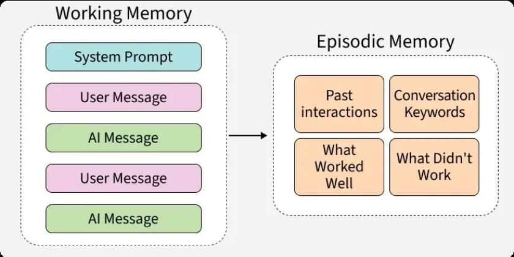
？让我们推开这扇通往智能体内心世界的大门。如图2-1 所示，为
智能体的多层记忆架构示意。

图 2-1 智能体的多层记忆架构

2.1.1 工作记忆：智能体的临时便签
你正在和朋友聊天，他问你：你觉得那部电影怎么样？你能立刻回答，是因为你还记得
你们正在讨论的是哪部电影。这种短暂、即时的记忆，就是工作记忆（Working Memory）。

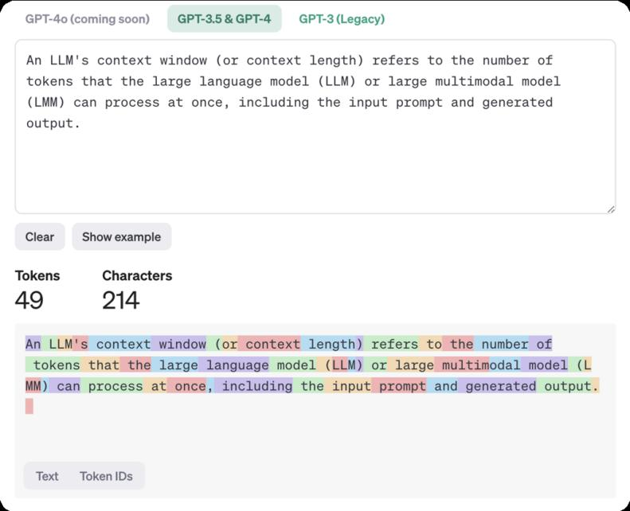
对于智能体助手来说， 工作记忆就像一张随手记的便签， 让它能在一次连续的对话中保持上
下文的连贯性。如图2-2 所示，为智能体工作记忆中的上下文窗口机制。

图 2-2 工作记忆中的上下文窗口机制
从技术上讲，这通常是通过一个叫做上下文窗口（Context Window）的机制实现的。就
像一个滚动的缓冲区，它会保留最近的对话历史。当你问ChatGPT：它（指代上文提到的电
影）的导演是谁？ChatGPT 能理解它指代的是什么，正是因为工作记忆在发挥作用。
然而，这张便签的空间是有限的。一旦对话过长，或者你关闭了聊天窗口，这些信息就
会被擦掉。这就是为什么标准的智能体模型无法记得你上周跟它说过什么。 工作记忆保证了
短期交互的流畅，但要实现真正的懂你，我们还需要更持久的记忆类型。
2.1.2 情景记忆：智能体的人生阅历
你还记得第一次学会骑车的那个下午吗？或者上次旅行时住过的酒店？这些都是你独
一无二的情景记忆（Episodic Memory）。它不是关于巴黎是法国的首都这类事实知识，而
是关于我亲身经历过的特定事件。
为智能体助手赋予情景记忆， 就等于给了它一本可以随时翻阅的人生阅历日记。当一个
智能客服记得你上次联系是因为订单延迟， 并主动询问问题是否解决时， 它就在使用情景记
忆。这种能力让智能体从一个冷冰冰的工具，变成一个有温度、能建立长期关系的伙伴。
那么，这本日记是如何写入和读取的呢？目前，主流的技术是检索增强生成（Retrieval-
Augmented Generation，RAG）。简单来说，智能体会将重要的交互（比如用户的偏好、关

键决策、历史问题）转换成一种叫做向量嵌入的数学表示，并存
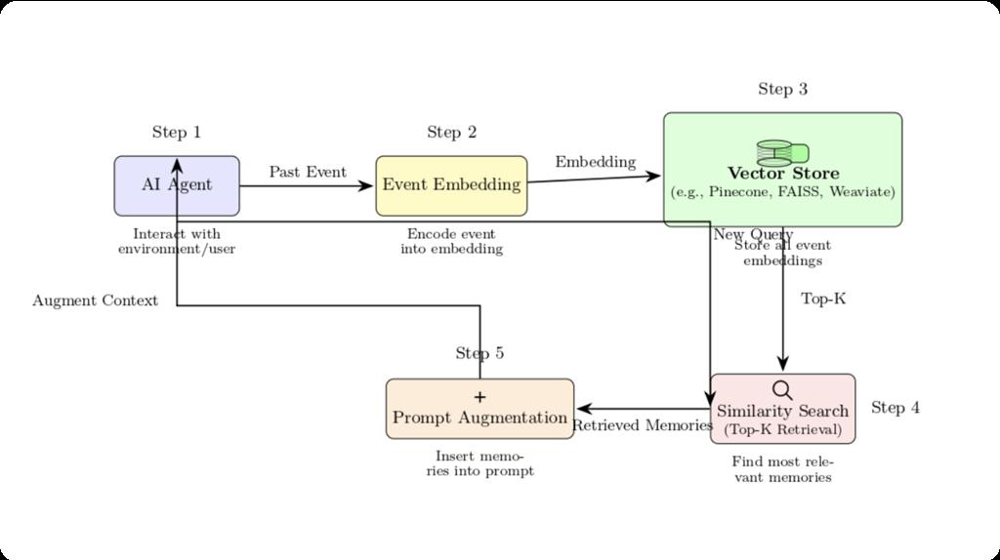
储在专门的数据库中。当遇
到新情况时，

 智能体会先在这个记忆库中检索最相关的过往经历， 然后将这些信息和当前问
题一起思考，从而给出更具个性化和洞察力的回答。如图2-3 所示，通过RAG 流程，智能
体将经历存入记忆库并按需检索。

图 2-3 智能体的 RAG 流程示意

2.1.3 技能记忆：智能体的肌肉记忆
当你学会打字后，你不会去想每个字母在键盘上的位置，手指会自然而然地移动。这就
是技能记忆（Procedural Memory），也就是我们常说的肌肉记忆。它关乎如何做一件事，是
一种内化于心的流程和技巧。
对于智能体助手而言， 技能记忆意味着它能通过学习和反馈， 掌握并优化完成特定任务
的套路。比如，一个邮件助理在几次帮你起草周报后，逐渐学会了你喜欢的格式和语气，甚
至能自动提取关键数据点。它不再是每次都从零开始思考如何写周报，而是调用已经固化的
技能。
这种记忆的形成，往往依赖于反馈循环。当你对智能体的表现给出评价（例如，这次总
结太啰嗦了， 下次简单点） ， 系统就会调整其内部的指令或模型。 通过一次次的练习和纠正，
智能体的技能会越来越娴熟， 执行任务的效率和准确性也随之提升， 最终将一套复杂的行动
流程内化为一种近乎本能的技能。如图2-4 所示，为智能体通过反馈循环优化自身指令，形
成技能记忆。

图 2-4 智能体形成技能记忆示意
我们已经为智能体助手构建了三种核心的记忆模块： 用于即时对话的临时便签， 记录个
人经历的人生日记，以及沉淀任务方法的技能手册。拥有了这座结构丰富的记忆宫殿，我们
的 智能体助手才真正具备了从过去学习、为现在服务、并持续进化的能力。
2.2 知识库构建
上一节我们讨论了 智能体 记忆的两种基本形态吗？现在， 我们要从理论走向实践， 亲
手为我们的 智能体 助手建造一座宏伟的记忆宫殿——也就是它的个人知识库。这不仅仅
是给它一个存放文件的地方，更是为它打造一个能够理解、关联、并最终运用知识的第二大
脑。准备好了吗？让我们一起拿起工具，开始这场激动人心的建造之旅！
想象一下，你有一个无所不知的图书管理员，他不仅知道每一本书的位
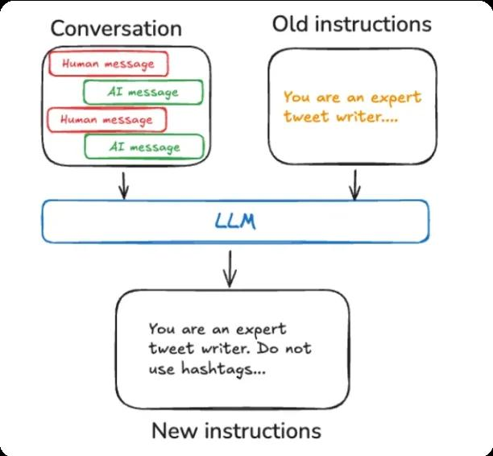
置，还能理解书
中的内容

， 甚至能将不同书本里的知识点串联起来， 为你解答复杂的问题。构建个人知识库，
就是要把我们的 智能体 助手训练成这样一位超级图书管理员。这个知识库将成为它所有
独特知识和个性化信息的来源，无论是你的工作文档、 学习笔记， 还是那些零散的灵感火花。
如图2-5 所示，为个人知识库系统所包含的整体元素和模块全景。

图 2-5 个人知识库整体架构示意

图
2.2.1 知识表示与存储
我们把一堆PDF、Word 文档和网页链接丢给智能体， 它能直接看懂吗？答案是否定的。
就像我们需要将食材切块、调味才能烹饪一样，信息也需要经过处理，才能被智能体消化。
这个处理过程，就是知识表示。
最直接的方法是文本分块（Chunking）。想象一下，你把一本厚厚的书拆成一页一页，
或者一个一个的段落。智能体处理的就是这些小知识块。这种方法简单粗暴，但有个问题：
它破坏了上下文的连续性，就像只看一页书，很难理解整个故事的来⻰去脉。
于是，更优雅的方式出现了—
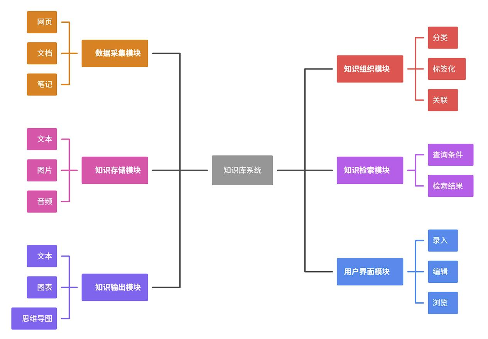
—知识图谱（Knowledge 

Graph）。这听起来很高级，但
你可以把它想象成一张巨大的思维导图。智能体 不再是简单地存储文字， 而是像侦探一样，
从文本中找出关键实体（比如人物、地点、概念），并用关系（比如居住在、发明了、属于）
将它们连接起来。这样一来，零散的信息就变成了一张相互关联的知识网络。当智能体看到
乔布斯和苹果公司， 它知道它们之间是创始人的关系， 而不是两个孤立的词。如图2-6 所示，
为计算机体系中的知识表示过程：将非结构化数据转化为结构化知识。

图 2-6 知识表示过程示意
打个比方： 文本分块就像是把你的笔记记在无数张散乱的便签上。知识图谱则是将这些
便签贴在一块巨大的软木板上， 并用不
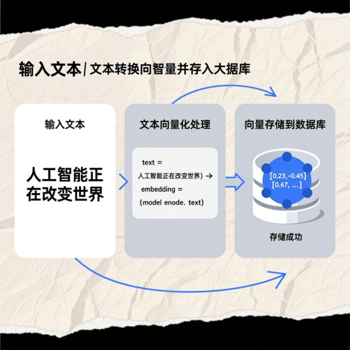
同颜色的图钉和细绳将相关

联的便签连接起来， 形成
一幅清晰的关系地图。
那么， 这些处理好的知识存放在哪里呢？不是普通的文件夹， 而是一个叫做向量数据库
（Vector Database）的魔法书架。在这里，每一条知识（无论是文本块还是图谱节点）都被
转换成一串独特的数字坐标——也就是向量。这个书架的神奇之处在于， 它会把意思相近的
知识自动放在一起。比如，如何提高工作效率和高效办公技巧这两条知识，即使文字完全不
同， 在向量空间里， 它们的位置也会非常接近。这为我们下一步的智能检索埋下了关键伏笔。
如图2-7 所示，为文本向量化的简单示意。

图 2-7 将文本转换为向量并存入数据库的简化代码示例
2.2.2 知识检索与推理
现在，我们的记忆宫殿已
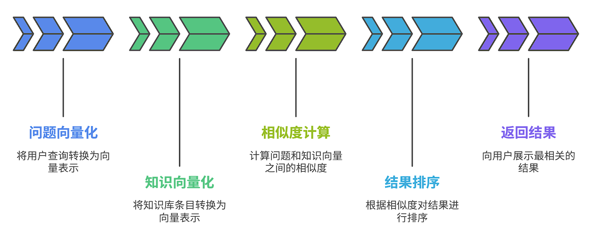
经装满了整理好的知识。当用户提出一个问题时，智能体如何
快速、准确地找到答案呢？这就是知识检索的艺术。
传统的关键词搜索就像一个老派的图书管理员， 你必须告诉他准确的书名或作者， 他才
能找到书。如果你记错了，或者用了同义词，他就无能为力了。这种方式死板且效率低下。
而基于向量数据库的语义搜索则是一位善解人意的智慧馆员。你不需要说出关键词， 只
需要用自然语言描述你的问题， 比如：我想找一些关于文艺复兴时期佛罗伦萨艺术家们的资
料。智能体会将你的问题也转换成一个向量， 然后在它的魔法书架里寻找与你问题向量位置
最接近的那些知识。它找到的可能包含米开朗基罗、达芬奇、美第奇家族等内容，即使你的
问题里一个名字都没提！如图 2-8 所示，为标准的语义搜索流程，不管是主流的搜索引擎还
是当前先进的智能体，都遵循着这个语义搜索流程。

图 2-8 语义搜索流程：将问题与知识进行向量化匹配
但仅仅找到相关资料还不够， 智能体还需要进行推理， 将这些碎片化的信息整合成一个
流畅、 有逻辑的答案。这个过程， 在业界有一个非常流行的叫法：RAG（Retrieval-Augmented
Generation），即检索增强生成。
注意：RAG就像一场开卷考试：
审题：智能体理解你的问题。
翻书：它利用语义搜索，从知识库中快速找到最相关的几段参考资料。
作答：它将你的问题和找到的参考资料一起交给它的大脑核心（大语言模型），并下达
指令：请根据这些资料，回答这个问题。
交卷：最终，它会生成一个既基于知识库事实，又语言流畅、逻辑清晰的全新答案，而
不是简单地把原文复述一遍。
通过 RAG，我们的智能体助手就拥有了引经据典的能力，它的回答不再是空泛的胡言
乱语，而是有据可查、高度定制化的智慧结晶。
2.2.3 知识更新与维护
一座再宏伟的宫殿，如果无人打理，也会布满蛛网，变得陈旧。我们的智能体知识库也
是如此，它不是一次性工程，而是一个需要持续照料的知识花园。
信息是有时效性的。上周的项目周报，到这周可能就过时了；你新收藏的一篇好文章，
需要及时种到花园里。因此，知识的更
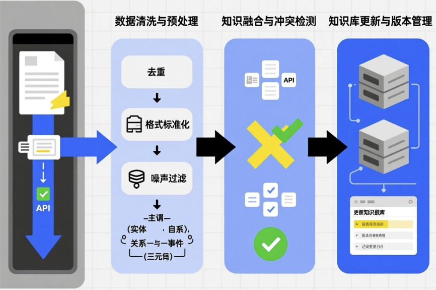
新与维护至

关重要。
维护策略可以分为几种：
手动维护：最简单的方式，就像整理书桌一样。你可以手动上传新文件，或者删除、修
改旧的知识条目。对于小规模的个人知识库来说，这完全足够。
自动化管道：对于更高级的玩家， 可以建立一个自动化灌溉系统。 比如， 设置一个程序，
让它每天自动检查你指定的文件夹（如Google Drive、Notion 页面），一旦发现有新文件或
文件被修改， 就自动触发前面提到的知识表示和存储流程， 将新知识无缝地融入到向量数据
库中。

定期重构：就像电脑需要定期磁盘清理一样，知识库也需要大扫除。可以设定一个周期
（比如每月一次），让系统重新读取所有源文件，完整地重建一次索引。这能清除掉那些可
能因零散更新而产生的数据碎片，保证知识库的整体健康。如图 2-9 所示，为知识库的自动
化更新示意。

图 2-9 知识库自动化更新管道示意

图
更进一步，一个真正智能的助手还应该学会遗忘。保留所有过时、无用、甚至错误的信
息，只会让它的记忆宫殿变得拥挤不堪，影响检索效率和答案质量。设计合理的遗忘机制，
比如为知识条目设置有效期， 或者根据使用频率淘汰冷门信息， 是让智能体保持头脑清晰的
关键一步。
至此，我们已经为智能体搭建起了记忆宫殿的骨架。从如何理解和存储知识，到如何精
准地检索和回答，再到如何让知识库保持生机与活力，你已经掌握了核心的理念和方法。在
下一节中，我们将深入探讨智能体的另一大核心——决策引擎，看看它是如何利用这些记
忆，做出聪明的行动。
2.3 记忆的遗忘与重构
你是否曾有过这样的体验： 拼命想回忆起一个刚认识的人的名字， 却只记得他有趣的谈
吐；或者，你清晰地记得上周会议的核心结论，却忘了是谁提出的。这种不完美的记忆，常
常被我们视
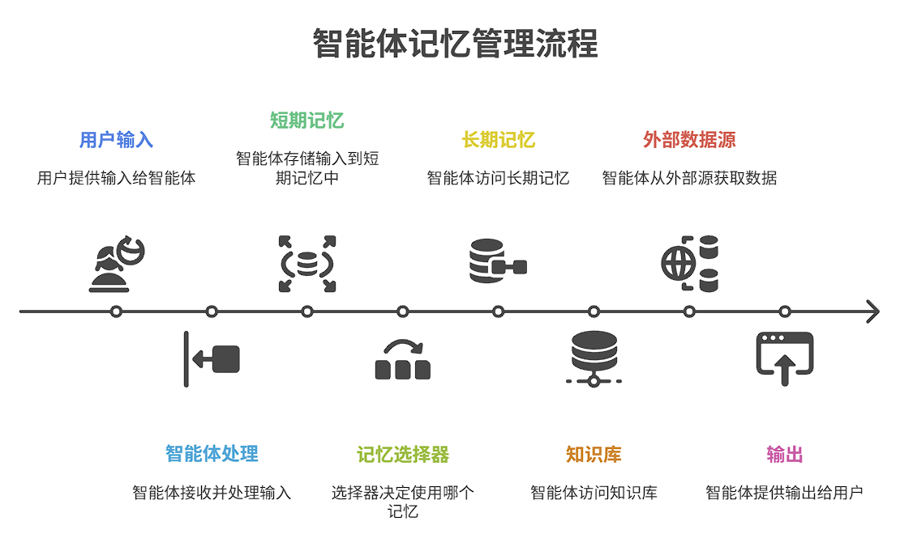
为大脑的缺陷。但如果我告诉你， 对于一个真正智能的系统——无论是人类还是
智能体——遗忘并非 bug，而是一项至关重要的核心功能呢？如图 2-10 所示，智能体的遗
忘和重构循环是智能体从数据处理到智慧涌现的关键。

图 2-10 智能体遗忘与重构循环示意
欢迎来到智能体记忆管理的深水区。在这里，我们将探讨一个反直觉却极其深刻的话
题：如何教会我们的智能体忘记和重塑记忆。这不仅仅是删除过期数据，更是一种高级的智
能表现，是智能体从一个信息仓库蜕变为一个有洞察力、懂变通的智慧伙伴的关键一步。
想象一下，如果你的智能体记得你每 一次的点击、每一次的提问、每一天的天气查
询……它的大脑很快就会被海量的、琐碎的、无关紧要的信息淹没。当你想让它帮你规划下
个月的旅行时，它可能还在纠结三年前你问过的一家餐厅。这显然不是我们想要的智能。因
此，一个高效的记忆系统，必须同时精通记忆和遗忘的艺术。如图 2-11 所示，为智能体记
忆管理的全部流程。

图 2-11 智能体的记忆流程
2.3.1 记忆衰减机制
人类的记忆遵循着一条著名的艾宾浩斯遗忘曲线——新获取的信息， 如果不加复习， 会
随时间迅速遗忘。这看似是种缺陷，实则是一种高效的筛选机制，帮助我们的大脑优先保留
重要的、常用的信息，而让那些一次性的琐事自然淡出。在智能体的设计中，我们正是在模
拟这种智慧的衰减。如图2-12 为艾宾
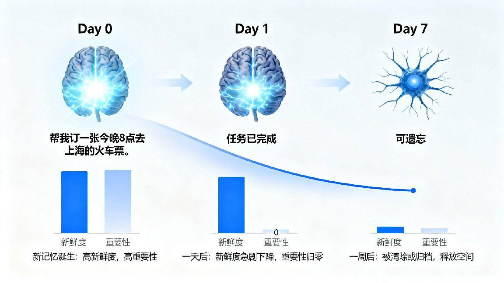
浩斯遗忘曲线，红色曲线代表自然遗

忘过程，信息在
初期迅速丢
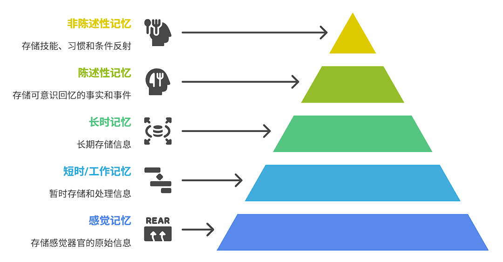
失，随后速率减缓。

图 2-12 艾宾浩斯遗忘曲线
遗忘，是保持专注的代价，也是保

持敏锐的前提。一个不懂遗忘的智能体，就像一个从

不清理的房间，最终会被垃圾吞噬，找不到任何有价值的东西。
那么，智能体如何决定哪些记忆该被淡忘呢？通常，我们会引入几种策略，为每一条记
忆信息打上保质期标签：
时间衰减（Recency）：这是最简单的规则。一条记忆被访问或创建后，它的新鲜度会
随着时间的流逝而降低。比如，你昨天搜索的附近咖啡馆可能很重要，但一个月后，这个信
息的价值就大大降低了。
访问频率（Frequency）：有些记忆虽然不新鲜，但被反复提及。比如你家的 Wi-Fi 密
码。高频访问的记忆会被标记为重要，从而在衰减过程中幸存下来。
重要性加权（Importance）：这是更高级的机制。例如，当你说记住，我下周三要给妈
妈过生日时，智能体应识别出其高优先级，并赋予极高的重要性分数。
如图 2-13 所示，记忆优先级如同金字塔，越顶层的信息越关键，越不容易被遗忘。

图 2-13 记忆优先级分层示意

图
如图 2-14 所示，可视化的展示了一例智能体任务：购买火车票的记忆周期演化过程。
途中可发现新鲜度和重要性是决定了记忆存在的主要因素。

图 2-14 可视化演示一条记忆的生命周期
2.3.2 记忆重构与泛化
如果说记忆衰减是断舍离， 那么记忆重构与泛化就是整合与升华。人类的记忆并非一成
不变的录像带，每次回忆，我们其实都在根据新的情境和知识重构那段记忆。这个过程虽然
可能导致细节失真，但却能让我们提炼出规律、形成观点，实现真正的理解。如图2-15 所
示，智能体将孤立的信息点（记忆碎片）连接、重组，形成有价值的洞察。

图 2-15 智能体的洞察形成过程
一个顶级的智能体也必须具备这种能力。它不应仅仅是存储孤立的事实， 更要能将这些
事实碎片拼接成一幅完整的、 有意义的图景。这个过程， 我们称之为泛化 （Generalization）。
注意：记忆的最高境界不是复现，而是洞察。智能体需要学会的，正是从无数个点状记
忆中，连接出线，最终编织成面的能力。
让我们看一个具体的例子，智能体是如何从零散的记忆中进行重构与泛化的。如图 2-
16 所示，通过对用户行为偏好的分析，实现了智能体记忆的重构与泛化。

图 2-16 智能体的记忆重构与泛化流程
看到了吗？通过重构与泛化， 智能体完成了从数据记录员到贴心观察者的蜕变。 当下次
你感到疲惫时，它可能不会再机械地推荐音乐，而是主动提议：需要我为您找一个附近新开
的、评价很高的书店咖啡厅吗？据说那里很适合放松和阅读。
这种能力的实现，背后依赖于强大的模式识别、知识图谱构建和推理能力。智能体将新
的交互信息与已有的用户画像、知识库进行关联，不断地更新和优化其内部的世界模型。每
一次交互，都是一次对记忆的重塑，也是一次对理解的加深。
最终，一个懂得遗忘与重构的智能体，才是一个能够与你共同成长的伙伴。它不会被过
去束缚，而是永远立足于当下，并以积累的智慧洞察未来。这就是我们致力于打造的24 小
时智能助理的智慧之核。
