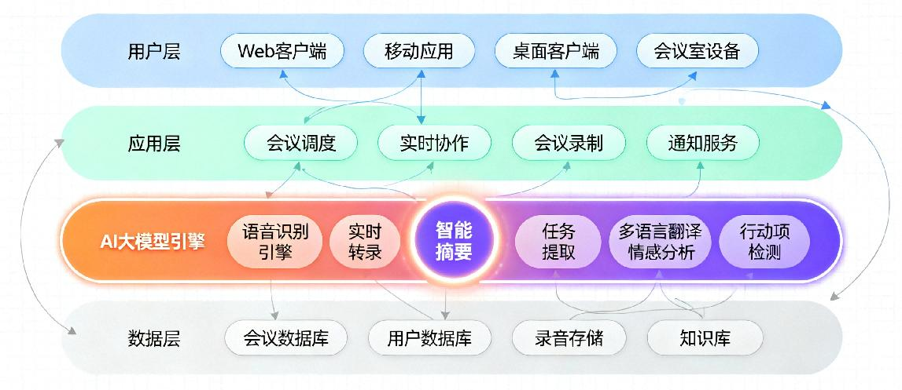
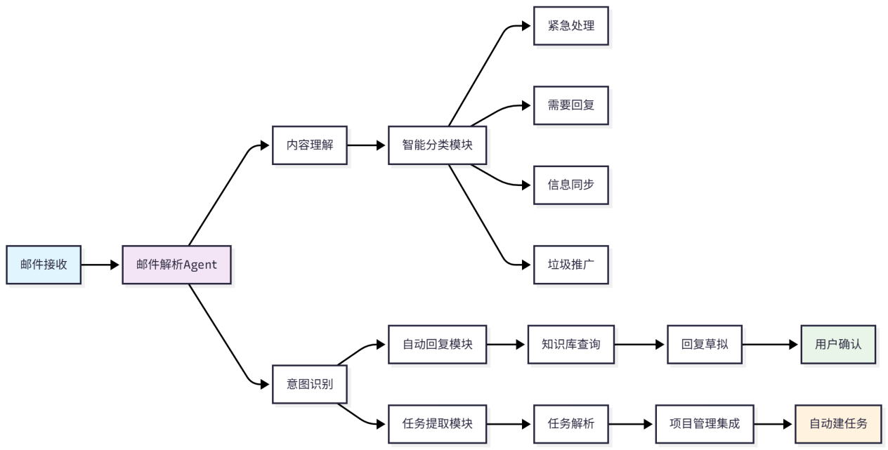
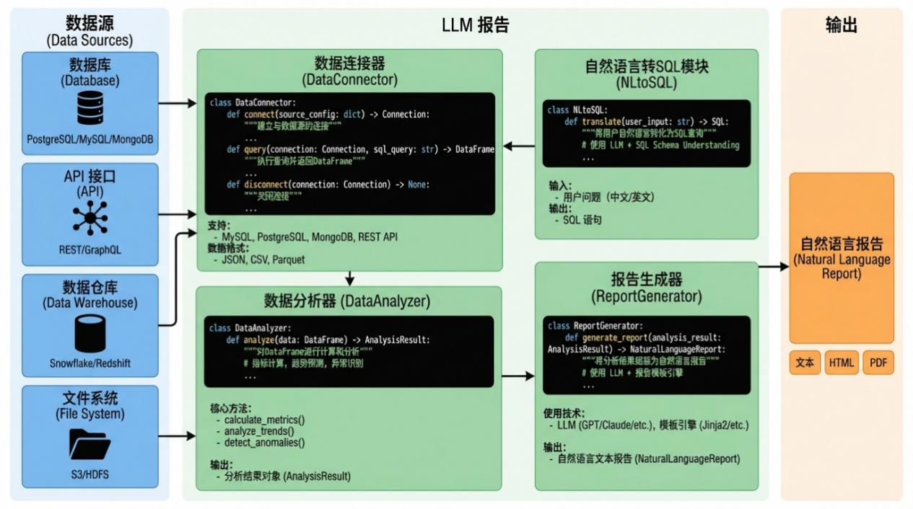
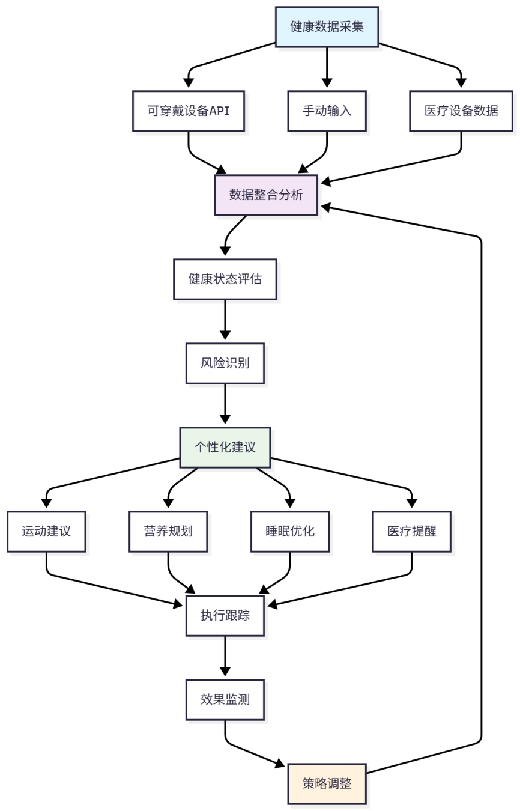
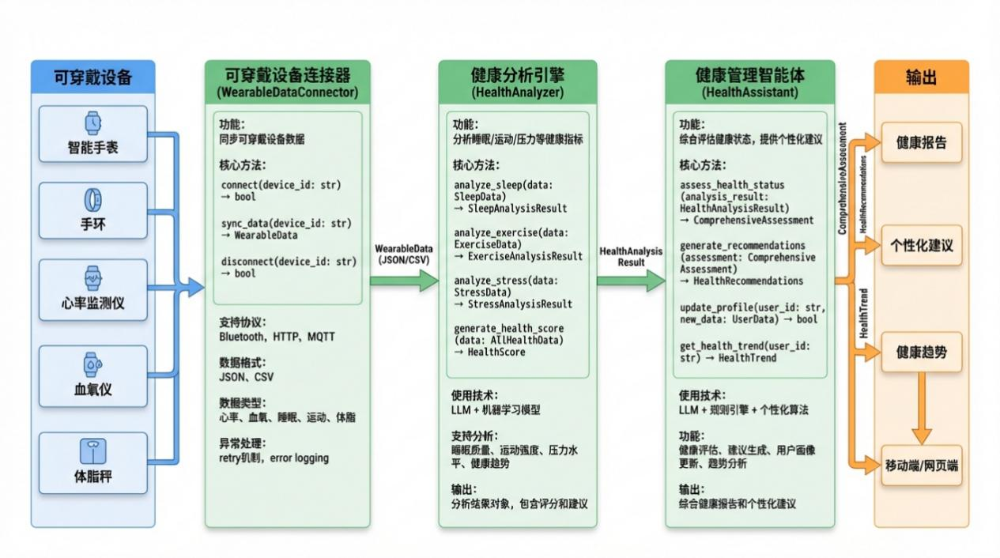
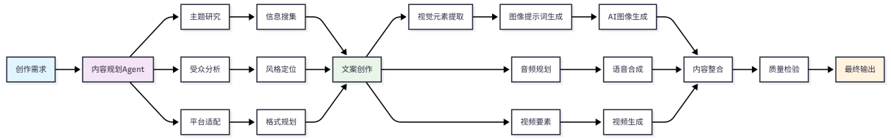
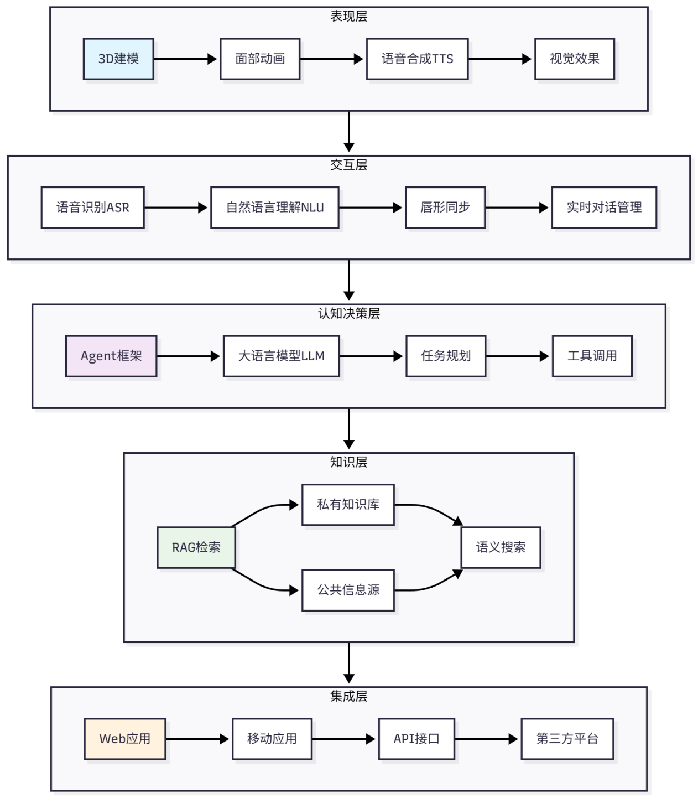
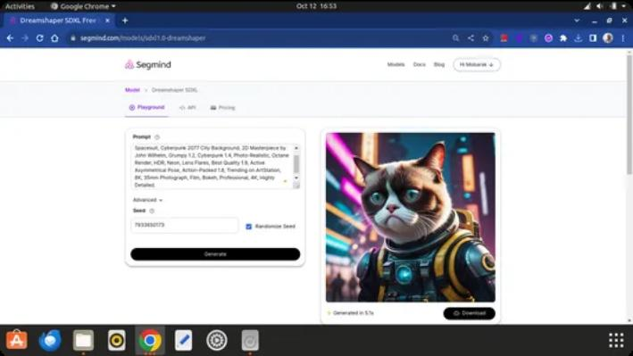
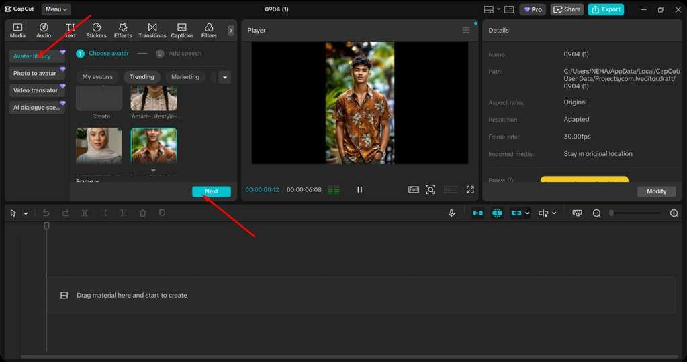

# 第4章 AI助手高级实战

})

    # 4. 生成最终纪要，标注不确定性
    final_minutes = format_minutes(
        draft_minutes,
        verified_facts,
        show_uncertainty=True
    )

    return final_minutes
表3-5 智能体从失败中学到的经验
问题类型 根本原因 解决方案 预防措施
时间冲突 缺少全局可用性检查 增加日历冲突检测 单元测试覆盖边界情况
跨文化误解 时区处理不当 明确时区、增强验证 集成测试覆盖多时区
会议纪要幻觉 缺少事实核查 引入验证机制 自动标注不确定性
恭喜你！学完本节，你已经掌握了编排复杂工具链的三大核心技巧：顺序与分支、并行
与合并、错误与回滚。这标志着你的智能体已经从一个简单的工具人进化为了一个懂得流
程、效率和⻛险控制的项目经理。
在本章中， 我们深入探讨了智能体工具调用的原理与实践。 我们从为什么需要工具调用
这一根本问题出发，揭示了 LLM 知识截止日期的局限性，以及工具调用如何扩展智能体的
能力边界。
我们详细讲解了工具调用的四个核心步骤：工具定义与描述、意图识别与工具选择、参
数提取与填充、工具执行与结果解析。每一个步骤都包含丰富的技术细节和最佳实践。
在工具封装部分，我们介绍了API设计原则、SDK封装和无代码集成三种主要方法，帮
助你根据具体场景选择最合适的工具开发策略。 在复杂工具链编排部分， 我们探讨了顺序执
行、条件分支、并行处理和错误处理等高级话题，让你的智能体能够处理真正复杂的任务。
最后，我们分享了实战中的坑点与解决方案，以及从真实失败案例中学习的经验。这些“血
的教训”希望能帮助你在开发过程中少走弯路。
通过本章的学习， 你应该已经理解了工具调用的核心概念， 并具备了为智能体开发实用
工具的能力。在接下来的章节中，我们将探索更高级的集成方式，让你的智能体变得更加无
所不能。

第 4 章：AI 助手高级实战
欢迎回来，未来的智能体开发者！在上一章，我们已经为 AI 助手装上了眼睛和耳朵，
让它能够感知世界。现在，是时候给它一双万能的手，让它真正深入我们的工作流，成为那
个传说中别人家的助理。
本章涉及的知识点有
⚫ 智能会议管理系统；
⚫ 高级邮件自动化；
⚫ 数据驱动的报告生成。
4.1 职场效率倍增器
你是否曾被无休止的会议、 堆积如山的邮件和繁琐的周报压得喘不过气？别担心， 这几
乎是每个职场人的日常。但想象一下，如果你的AI 助手能像一位经验丰富的行政专家，帮
你打理好这一切，让你能专注于真正需要创造力和智慧的工作。这一章，我们就将这个想象
变为现实！
4.1.1 智能会议管理系统
会议，是团队协作的必要环节，但也常常是效率的黑洞。从协调时间、准备材料，到会
议记录、追踪待办事项，每一个环节都充满了琐碎的重复劳动。现在，让我们看看智能体如
何化身会议管理大师，解放你的生产力。如图4-1 所示

，为一个典型的智能体驱动的智能会
议管理系统架构。

图 4-1 智能体驱动的智能会议管理系统架构
智能体如同一个永不疲倦的会议秘书，连接着日历、文档和任务管理工具。

一个智能会议管理智能体的核心能力，是串联与理解。它不再是一个个孤立的工具，而
是一个能够贯穿会议全流程的智能中枢。
会前：智能调度与准备。你的智能体可以连接团队成员的日历，自动寻找所有人的空闲
时段，并发送会议邀请。更进一步，它可以根据会议主题，自动从公司的知识库（如
Confluence 或共享文档）中搜集相关资料，并生成一份简洁的会前预习材料。
会中：实时记录与纪要。在会议进行时，智能体可以调用语音转文字服务，实时生成会
议记录。这不仅仅是简单的文字转录，通过自然语言处理（NLP），它能识别出谁在发言，
并自动提炼出关键决策（Decisions）和待办事项（Action Items）。
会后：自动追踪与闭环。会议结束后，智能体会自动整理出一份结构化的会议纪要，并
将其发送给所有与会者。更神奇的是，它能将识别出的待办事项，自动创建到你的项目管理
工具（如Jira、Trello）中，并指派给相应的负责人，甚至设置好截止日期。从此，再也不用
担心会而不议，议而不决，决而不行了。
💡 极客洞察：语音转文字的技术原理与延迟分析
问题：会议中实时语音转文字的延迟是多少？能否做到边说边显示？
技术拆解：
语音转文字（ASR - Automatic Speech Recognition）的典型延迟构成：
总延迟 = 音频采集 + 网络传输 + 模型推理 + 结果返回
       (10-50ms)  (20-100ms)  (100-300ms)  (10-50ms)
典型值：150-500ms
如表 4-1 所示，为主流ASR服务数据对比（基于我们的实测数据）。
表4-1 主流ASR 服务实测数据对比
服务 平均延迟 准确率(中文) 成本/小时 实时流式支持
阿里云ASR 280ms 95.2% ¥0.5 ✅
讯飞ASR 350ms 96.1% ¥0.8 ✅
Google Speech-to-Text 220ms 93.5% ~$0.01 ✅
Whisper (本地) 150ms 94.8% 算力成本 ✅
优化策略：
流式处理：不使用整句识别，而是一边说一边识别；
说话人分离：区分不同人的发言（diarization）；
本地缓存：减少重复传输；
增量识别：只识别变化的部分；
核心代码实现如下：
python
# 工具定义 = LLM 的"说明书"
weather_tool_definition = { ... }

# 工具函数 = 实际执行
def get_weather(city: str, date: str = None) -> dict:
    response = call_weather_api(city, date or today())
    return {"city": city, "temperature": response["temp"], ...}

# 调用流程：工具选择 → 参数提取 → 执行 → 结果注入
response = llm.chat(messages, tools=[weather_tool_definition])
if response.tool_calls:
    result = get_weather(**response.tool_calls[0].arguments)
    final_answer = llm.chat(messages + [tool_result])

心智锚点：LLM 通过description 理解工具，通过tool_calls 调用工具。
这种智能化的变革正在迅速成为主流。有研究预测，全球项目管理中的AI 市场规模将
从 2023 年的约 25 亿美元增长到 2028 年的 57 亿美元。这背后，正是无数个像我们即将打
造的智能会议智能体在推动着效率革命。
4.1.2 高级邮件自动化
如果说会议是定时的效率挑战，那么邮件则是24 小时不间断的注意力杀手。传统的邮
件规则只能做简单的分类和过滤，但面对复杂多变的工作邮件，我们常常感到力不

从心。是
时候让智能体来接管你的收件箱了！如图4-2 所示，为智能体驱动的自动邮件系统的典型流
程。

图 4-2 智能体驱动的邮件自动化流程
高级邮件自动化智能体的核心是意图识别和自主行动。它不再满足于根据发件人或主
题进行分类，而是能读懂每一封邮件的内容，并判断出它想干什么。
智能体像一个聪明的分拣员，能理解每封信件的真实意图。
智能分类与优先级排序
想象一下，你的智能体每天早上自动帮你整理好收件箱。它会将邮件分为几类：
紧急处理：例如，来自大客户的投诉、服务器宕机警报。需要你回复：例如，同事提出
的问题、需要你审批的请求。信息同步：例如，公司通知、项目周报、订阅的资讯。
垃圾/推广：自动归档，眼不见心不烦。

这种分类不是基于简单的关键词， 而是基于对邮件内容和上下文的深度理解。 智能体知
道，项目延期风险比下周团建活动的优先级更高。
自动回复与任务提取
这才是真正激动人心的部分！当一封常规咨询邮件（例如：请问如何申请报销？）进来
时，智能体可以自动在知识库中找到答案，并草拟一封回复邮件，等你一键确认发送。对于
那些包含任务请求的邮件（例如：@你，请在本周五前提供一下 Q3 的 销售数据），智能
体不仅能提醒你，还能像会议助手一样，直接在你的任务列表里创建一个新任务，并附上邮
件原文链接。
💡 极客洞察：邮件分类的准确率分析
如表 4-2 所示，为基于1000封真实邮件的测试数据。
表 4-2 基于真实邮件的分类方法测试数据
分类方法 准确率 召回率 F1-Score
关键词规则 72% 68% 0.70
传统ML (TF-IDF + SVM) 85% 82% 0.83
BERT微调模型 94% 91% 0.93
Claude/GPT分类 96% 94% 0.95
关键发现：深度学习模型比传统规则准确率高20%+（94% vs 72%）；LLM分类在处理模
糊邮件时表现更。
成本考虑：传统ML在纯文本分类场景性价比更高。
邮件分类器核心代码实现：
python
class EmailClassifier:
    async def classify(self, email: Dict) -> ClassifiedEmail:
        # 用 LLM 分析邮件意图
        result = await self.llm.generate(prompt)
        return ClassifiedEmail(category=..., confidence=...)

邮件自动回复核心代码实现：
python
class EmailAutoResponder:
    async def generate_draft(self, email: Dict) -> str:
        # 根据类型选择模板
        templates = {'inquiry': "...", 'request': "...", ...}
        return templates.get(email.get('type'))

心智锚点：LLM 负责理解（分类），模板负责执行（回复）。
通过这种方式，你的收件箱不再是一个待办事项列表，而是一个已经由AI 预处理过的
信息流。 你只需要处理那些真正需要你智慧和决策的邮件， 其余的， 都交给你的智能助理吧。
4.1.3 数据驱动的报告生成
小王，把上个月的用户增长数据拉一下，做个报告，明天早上开会要用。——这是不是

你最熟悉的噩梦？手动从各种系统（Excel、数据库、CRM）导出数据，复制粘贴，调整格
式，再绞尽脑汁写下分析和洞察……这个过程不仅耗时，还极易出错。
现在， 让我们为智能体赋予数据分析师和报告撰写人的双重角色。 它将彻底改变你与数
据互动的方式。
从杂乱的数据到清晰的洞察，智能体帮你完成最关键的跳跃。如图4-3 所示，为智能体
驱动的数据报告生成系统流程，将数据与报告由AI 能力有机的联系在了一起。

图 4-3 智能体驱动的数据报告生成流程
一个报告生成智能体的工作流大致如下：
① 连接数据源：你首先需要授权智能体访问你的数据源。 这可以是本地的Excel 文件，
也可以是云端的数据库或Google Analytics 等第三方服务。
② 理解你的需求：你不再需要编写复杂的SQL 查询语句或Excel 公式。你只需要用自
然语言告诉它你的需求，比如：帮我生成一份上周的网站流量报告，对比一下新老
用户的访问时长和跳出率，并分析主要流量来源渠道的变化。
③ 自动执行与分析：智能体接收到指令后， 会自动连接相应的数据源， 执行数据提取、
清洗和整合。它会运用内置的分析模型，计算出你关心的各项指标，并找出数据中
的显着趋势、异常点或相关性。
④ 生成可视化报告： 最后，智能体会将分析结果以一种清晰易懂的方式呈现出来。
这不是冰冷的数字和图表， 它还能生成一段完整的文字摘要， 用通俗的语言解释数据背
后的故事。例如：上周，我们的总流量增长了 15%，主要得益于在社交媒体渠道的推广活
动。新用户的平均访问时长增加了 30 秒，但跳出率略有上升，建议优化落地页内容。
正如一些 AI 报告工具所展示的，这种自动化能力正在将商业分析从少数专家的领域，
普及到每一位业务人员手中。你的智能体，就是你

专属的、7×24 小时在线的数据分析师，
让你的每一个决策都有据可依。
编程视角的系统核心组件架构如图4-4 所示。

图 4-4 数据驱动的LLM 报告生成系统架构图
心智锚点：NL2SQL 是数据报告的核心桥梁。
到这里，你是否已经对智能体的强大能力感到兴奋不已？从会议到邮件，再到数据报
告， 我们仅仅触及了智能体在职场中应用的冰山一角。 在接下来的章节中， 我们将深入代码，
一步步实现这些酷炫的功能。准备好，一起打造你的终极效率神器吧！

4.2 个人生活优化大师
欢迎回来，勇敢的开发者！在上一节中，我们为智能体装上了眼睛和耳朵，让它能够感
知世界。现在，我们将进入一个更激动人心的领域：让智能体成为你生活的优化大师。它不
再仅仅是一个被动的工具，而是一个主动的、能够跨领域调动资源、为你量身定制解决方案
的 24 小时智能助理。准备好了吗？让我们一起探索如何将 AI 的智慧深度融入个人生活的
方方面面。
4.2.1 个性化健康管理
想象一下，你的 AI 助手不再只是机械地记录你走了多少步，而是真正关心你的健康。
通过集成可穿戴设备（如

智能手表、手环）的API，你的智能体可以成为一个全天候的健康
顾问。它能获取你的心率、睡眠质量、活动强度等实时数据，并将这些孤立的数字转化为有
意义的洞察。如图4-5 所示，为一个典型的个性化健康管理流程。

图 4-5 个性化健康管理流程
例如，你的智能体可以这样工作：
① 数据整合与分析：智能体自动同步你昨晚的睡眠数据，发现你的深度睡眠比例偏
低。同时，它注意到你今天的日程安排非常紧张。
② 主动建议与干预：它不会只告诉你睡眠不足，而是会主动提出建议：我注意到你昨
晚深度睡眠较少，今天工作压力可能较大。建议中午进行15 分钟的冥想放松。需要我为你
设置一个提醒并播放引导音频吗？
③ 智能营养规划：当你用手机拍下你的午餐时，智能体通过计算机视觉识别食物，并
结合你的健身目标（例如增肌或减脂）和当天的能量消耗，给出饮食建议。一些研究表明，
AI 在生成减肥

饮食计划方面显示出巨大潜力，但仍需完善宏量营养素的精确配比。因此，

你的智能体可以基于权威营养指南生成初步方案， 并提示你此食谱仅供参考， 关键营养素的
精确配比建议咨询专业营养师。
编程视角的系统核心组件架构如图4-6 所示。

图 4-6 LLM 支持的个性化健康管理系统架构图
心智锚点：多数据源融合 + 健康评分算法。
当然，我们必须正视其中的挑战。可穿戴设备的数据并非永远精确，其准确性会受到佩
戴方式、用户活动等因素的影响。因此，在开发这类功能时，我们应将AI 定位为辅助而非
诊断工具，并始终在关键决策上建议用户寻求专业医疗意见。同时，健康数据是极其敏感的
个人隐私，确保数据的安全和合规是开发过程中的重中之重。
4.2.2 智能旅行管家
告别在数十个网站之间切换、 反复比价和整理繁杂行程的痛苦吧！一个高级的智能体可
以化身为你的私人旅行管家，将复杂的旅行规划过程简化为几次愉快的对话。
通过调用航班、酒店、租车和本地活动等多种API，你的智能体可以为你打造一次真正
“省心”的旅行。这个过程远不止是简单的信息聚合，而是深度的个性化定制。如图4-7 所
示，为智能旅行管家的一个典型工作流程。

图 4-7 智能旅行管家工作流程
设想一下你与智能体的互动：
你：嗨，我想在下个月找个周末去海边放松一下，预算 3000 元，从上海出发，喜欢安静、人少的地
方。
智能体：好的，为您筛选了三个目的地：浙江舟山东极岛、福建平潭岛和山东威海。东极岛以其原始
的渔村⻛貌和清澈海水着称，但交通稍有不便。平潭岛有独特的蓝眼泪奇观和⻛车田。威海则以其干
净的海岸线和舒适的气候闻名。您对哪个更感兴趣？
在你做出选择后， 智能体可以立即为你规划出包含交通、 住宿和特色活动的详细行程，
并提供预订链接。更进一步，它还能成为你的随行导游：
实时翻译：当你身处异国他乡，智能体可以调用实时翻译API，让你与当地人无障碍交
流。这不仅仅是文字翻译，甚至可以实现语音到语音的实时对话。
智能推荐：根据你的实时位置和时间，智能体可以推荐附近评价高且符合你口味的餐
厅，或者告诉你附近某个博物馆今天有临时展览。
应急处理：如果你的航班延误，智能体可以自动监测并通知你，同时为你搜索备选的交
通方案。
然而，AI 旅行管家并非完美。它可能难以发掘那些只有本地人才知道的隐藏宝藏，其
推荐有时会偏向于热门和商业化的地点。此外，规划过程需要收集大量个人偏好和行为数
据，这再次引发了对数据隐私的担忧。作为开发者，我们需要在提供便利性和保护用户隐私
之间找到一个健康的平衡点。
4.2.3 学习与技能提升伴侣
在知识爆炸的时代，如何高效学习和管理知识，成为了每个人都面临的挑战。你的智能
体可以演变成一个强大的学习与技能提升伴侣，帮助你构建和导航属于你自己的知识体系。
这不仅仅是创建一个数字笔记簿，而是利用AI 来自动化知识的获取、组织和应用。AI
能够将传统上用于企业知识管理的强大功能，微缩并应用到个人层面。
想象一下，你想学习一门新技能，比如数据分析。你的AI 学习伴侣可以：
① 构建个性化学习路径： 它会先询问你的现有基础和学习目标， 然后从网络上筛选高
质量的免费课程、文章和项目案例，为你生成一个从入门到进阶的个性化学习地图。AI 平
台能够通过分析用户行为来识别技能差距，并推荐相应的学习内容。

② 智能知识库与语义搜索： 当你阅读文章或观看视频时， 可以一键将关键信息喂给智
能体。它会自动为这些信息打上标签、 进行分类， 并构建成一个相互关联的知识网络。未来，
当你遇到问题时，你可以直接用自然语言提问，比如帮我解释一下什么是‘P 值’，并找出
我之前保存过的相关案例， 智能体会利用语义搜索理解你的意图，并从你的个人知识库中提
取、整合并生成答案。
③ 主动提醒与巩固： 根据艾宾浩斯遗忘曲线， 智能体会智能地在适当的时候推送你之
前学习过的知识点，让你进行复习。它甚至可以根据你保存的笔记，自动生成小测验来检验
你的掌握程度。
在教育和学习领域，AI 的伦理问题同样不容忽视。算法的偏见可能会导致推荐的学习
资源存在局限性，从而固化甚至加剧现有的信息茧房。此外，过度依赖AI 进行信息整理和
总结，可能会削弱我们独立思考和深度理解的能力。因此，一个优秀的AI 学习伴侣应该鼓
励探索、激发好奇，而不是仅仅提供标准答案。
至此，我们已经看到了智能体作为个人生活优化大师的巨大潜力。从健康到旅行，再到
学习，通过巧妙的工具调用和高级集成，它正在从一个简单的执行者，转变为一个能够理解
你、预测你需求并主动为你服务的智能伙伴。在下一章，我们将深入探讨如何将这些能力整
合，打造一个真正统一和协同工作的超级智能体。
4.3 创意与内容生成：让你的智能体成为创作大师
欢迎来到智能体高级实战的创意篇章。在前面的章节中， 我们已经让智能体掌握了信息
检索、数据分析等强大的左脑能力。现在，我们将唤醒它的右脑，赋予它艺术创作与内容生
成的能力。一个成熟的智能体不仅是高效的执行者，更应是富有创造力的合作伙伴。本节将
带你探索如何利用智能体进行多模态内容创作，并打造一个能代表你或你的品牌的个性化
数字分身，让你的智能助理真正实现24 小时全方位在线。
4.3.1 多模态内容创作：超越文本的无限可能
人类的交流天然就是多模态的。我们不仅使用语言，还依赖视觉、听觉和肢体动作来传
递完整的信息。要让AI 真正理解并与世界互动，就必须教会它用同样的方式思考。
传统的AI 内容生成主要集中在文本领域，例如撰写文章、生成代码。然而，一个真正
强大的内容创作智能体需要具备跨越多种媒介（模态）的能力，将文本、图像、音频、视频
等元素无缝融合，创造出更丰富、更具吸引力的内容。这正是多模态AI（Multimodal AI）
的核心价值所在。
什么是多模态AI？
多模态 AI 是指能够处理、理解和生成来自多种不同数据类型（如文本、图像、音频、
视频等）信息的人工智能系统。与只能处理单一数据类型的单模态（Unimodal）AI 不同，
多模态AI 通过整合不同来源的信息，能够获得更全面、更接近人类的上下文理解能力。例

如，当看到一张猫在弹钢琴的图片时，多模态AI 不仅能看懂图像内容，还能将其与文字描
述一只猫在弹奏一首爵士乐联系起来，甚至生成一段匹配的背景音乐。
根据 IBM 的定义，多模态 AI 通过结合和分析不同形式的数据输入，实现更全面的理
解并生成更鲁棒的输出。这种能力在企业应用中尤为重要，因为企业数据本身就是多模态
的，例如客户反馈可能包含文字评论、截图和语音信息。如表4-1 所示，为单模态AI 与多
模态AI 的特性对比。
表 4-1 单模态AI vs 多模态AI
特性 单模态AI (Unimodal AI) 多模态AI (Multimodal AI)
数据类型 处理单一类型数据（如纯文
本或纯图像）
同时处理多种类型数据（文本、图像、音频、视频等）
上下文理
解
有限，仅基于单一数据源 更全面、更深入，通过关联不同模态信息补充上下文
应用复杂
度
相对简单，模型结构单一 更复杂，需要融合不同模态的架构
典型应用 文本翻译、图像分类
(YOLO)
视觉问答(VQA)、图像描述生成、文本到视频生成(Sora)
多模态内容生成的关键技术
要实现强大的多模态内容生成， 智能体需要掌握几项关键技术， 这些技术决定了它能否
真正理解并创造跨模态的内容。
技术一：多模态融合 (Multimodal Fusion)
多模态融合是指将来自不同模态的信息组合起来， 以提升模型性能的过程。这类似于人
类大脑在聆听对话时，会同时处理对方的语言、语调和面部表情。根据融合发生的阶段，主
要分为三种策略：
早期融合 (Early Fusion)：在输入层级就将不同模态的特征向量连接起来，形成一个统
一的特征表示，然后送入一个模型进行处理。这种方法适合模态间关联紧密的数据，但对特
征对⻬要求高。
晚期融合 (Late Fusion)：为每个模态单独训练一个模型，在最后决策层将各个模型的
输出结果（如预测分数）进行合并（如投票或加权平均）。这种方法模块化程度高，实现简
单，但无法学习模态间的深层交互。
中间/混合融合 (Intermediate/Hybrid Fusion)：结合了前两者的优点，在模型的中间层
进行多次、分阶段的特征融合。这种方法既能学习模-态间的复杂交互，又保持了一定的模
块化，是当前主流的研究方向。
注意：一篇关于多模态机器学习的综述论文详细对比了这几种融合策略的优劣， 指出晚
期融合更简单，而早期融合适合处理紧密耦合的数据。
技术二：跨模态学习与联合嵌入 (Cross-Modal Learning & Joint Embedding)
这项技术的核心思想是学习一个共享的嵌入空间（Embedding Space），将不同模态的
数据映射到这个空间中。在这个空间里，语义上相似的内容（无论其原始模态是什么）在向
量表示上会彼此靠近。
例如，狗的图片和单词dog 的文本会被映射到该空间中非常接近的位置。
CLIP（Contrastive Language-Imag

e Pre-training）模型是这一领域的典型代表。它通过对

比学习的方式，在海量的图像-文本对上进行训练，学会了将图像和描述其内容的文本进行
关联。这种能力使得智能体可以实现零样本分类，即在没有见过任何特定类别样本的情况
下，仅通过文本描述就能识别出对应的图像。如图4-8 所示，为多模态内容创作的典型工作
流。

图 4-8 多模态内容创作工作流
实战演练：构建一个多模态内容生成智能体
现在， 让我们动手构建一个能够根据用户需求创作图文并茂社交媒体帖子的智能体。这
个智能体将接收一个主题，自动搜索相关信息，生成文案，并配上由AI 生成的图片。
第一步：定义目标与工作流
我们的智能体需要完成以下任务：
① 接收用户主题：例如，为一款新型咖啡豆写一篇推广帖子。
② 规划任务：将大任务分解为：研究主题、撰写文案、生成配图、整合发布。
③ 执行任务：
研究：调用搜索工具，了解该咖啡豆的特点、⻛味、产地等。
文案创作：基于研究结果，调用大语言模型（LLM）生成吸引人的文案。
图像生成：从文案中提炼关键视觉元素（如热气腾腾的咖啡、饱满的咖啡豆），生成高质量的图
像提示词（Prompt），然后调用文生图模型（如 Stable Diffusion）生成配图。
整合：将文案和图片组合成最终的帖子内容。
④ 输出结果：返回格式化的图文内容。
这个流程可以通过LangGraph 等框架构建为一个状态图（State Graph），清晰地定义每
个节点（任务）和边（流转条件），实现可控且透明的工作流。
第二步：选择合适的技术栈
一个典型的多模态内容生成智能体技术栈可能如表4-2 所示。
表 4-2 典型的多模态智能体技术栈
组件 技术/工具选项 作用
智能体框架 LangGraph, CrewAI, AutoGen 负责任务编排、状态管理和工具调用。
LangGraph对复杂流程控制更强。
核心LLM（大脑） Gemini系列, GPT-4系列, Claude
3.5
负责理解、推理、规划和生成文本内
容。
文生图模型 Stable Diffusion, Midjourney,
DALL-E 3
根据文本提示词生成高质量图像。
外部工具 Serper (网页搜索), Stable
Diffusion API (如 Segmind)
提供智能体与外部世界交互的能力。
第三步：代码实现（以LangGraph 和 Gemini 为例）
使用 Python 和相关库，我们可以快速搭建智能体。以下是伪代码示例，展示了核心逻
辑。完整的实现
可以参考LangChain 的官方多模态研究项目。

# 1. 导入必要的库
from langchain_google_genai import ChatGoogleGenerativeAI
from langchain_community.tools import SerperDevTool
from langchain.智能体s import 智能体 Executor, create_react_智能体
from langgraph.graph import StateGraph, END
from replicate import Client # 用于调用 Stable Diffusion

# 2. 定义智能体的状态
class 智能体 State(TypedDict):
topic: str
research_result: str
draft_text: str
image_prompt: str
image_url: str
final_content: dict

# 3. 定义各个节点的执行函数
def research_node(state): # 调用搜索工具
search_tool = SerperDevTool()
result = search_tool.run(state['topic'])
state['research_result'] = result
return state

def draft_node(state): # 调用LLM 生成文案
llm = ChatGoogleGenerativeAI(model="gemini-1.5-pro-latest")
prompt = f" 根据以下研究资料，为 '{state['topic']}' 撰写 一篇社交媒体推 广文 案：
\n{state['research_result']}"
draft = llm.invoke(prompt).content
state['draft_text'] = draft
return state

def image_prompt_node(state): # 调用LLM 生成图像提示词
llm = ChatGoogleGenerativeAI(model="gemini-1.5-pro-latest")
prompt = f" 为以下 文案生成一个简洁、富有画 面感的图像提 示词（英 文）：
\n{state['draft_text']}"
image_prompt = llm.invoke(prompt).content
state['image_prompt'] = image_prompt
return state

def image_generation_node(state): # 调用文生图 API
replicate_client = Client(api_token="YOUR_REPLICATE_API_KEY")
model = "stability-ai/stable-diffusion:..."
output = replicate_client.run(model, input={"prompt": state['image_prompt']})
state['image_url'] = output[0]
return state

# 4. 构建LangGraph 工作流
workflow = StateGraph(智能体State)
workflow.add_node("research", research_node)
workflow.add_node("draft", draft_node)
workflow.add_node("create_image_prompt", image_prompt_node)
workflow.add_node("generate_image", image_generation_node)

# 5. 定义流程的边
workflow.set_entry_point("research")
workflow.add_edge("research", "draft")
workflow.add_edge("draft", "create_image_prompt")
workflow.add_edge("create_image_prompt", "generate_image")
workflow.add_edge("generate_image", END)

# 6. 编译并执行
app = workflow.compile()
inputs = {"topic": "为一款来自埃塞俄比亚耶加雪菲产区的新型日晒处理咖啡豆写一篇推广帖子"}
result = app.invoke(inputs)
print(result)
4.3.2 个性化数字分身：打造你的 AI 虚拟形象
数字分身（Digital Avatar）不再是科幻小说的概念。它们正在成为品牌、教育者和个人
在数字世界中建立信任、规模化沟通和传递情感的全新媒介。
如果说多模态内容生成是让智能体掌握了创作的技能，那么打造个性化数字分身就是
为智能体塑造一个具象化的身份。一个拥有逼真形象、 独特声音和个性化知识的数字分身，
可以作为你的24 小时在线助理、品牌代言人、课程讲师或客服代表，提供更具亲和力和沉
浸感的交互体验。
数字分身：从概念到现实
数字分身，或称数字人（Digital Human），是利用AI 技术创建的虚拟人物。它们能够
模拟人类的外 观、表情、声音和行为，并与用户进行实时互动。与简单的卡通头像不同，
现代AI 数字分身追求高度的真实感（Form Realism）和行为真实感（Behavioral Realism）。
根据 Synthesia 的解释，虚拟人可以是一个简单的 3D 模型，也可以是一个由 AI 驱动、
能够进行实时对话的复杂⻆色。如今，像 D-ID、HeyGen 和 RAVATAR 等平台，已经将这
项技术商业化，广泛应用于市场营销、客户服务和在线教育等领域。 如图 4-9 所示，为
RAVATAR 的数字分身介绍页面。

图 4-9 RAVATAR 展示了从 AI 虚拟形象到交互式数字人的技术演进
构建数字分身的技术架构
创建一个功能完备的数字分身， 需要一个分层的技术架构， 协同工作以实现形神兼备的
效果。这个架构通常包括以下几个核心层次：
① 表现层 (Presentation Layer)：负责数字分身的视觉和听觉呈现。包括3D 建模、材
质渲染、面部动画和语音合成（TTS）。
② 交互层 (Interaction Layer)：处理与用户的实时互动。包括语音识别（ASR）、自然
语言理解（NLU）和唇形同步（Lip-Sync）。
③ 认知/决策层 (Cognition/Decision Layer)：这是数字分身的大脑，由智能体框架和
LLM 驱动。负责理解用户意图、规划回应、调用工

具和管理对话状态。
④ 知识层 (Knowledge Layer)：为数字分身提供信息和记忆。通常通过检索增强生成
（RAG）技术连接到私有知识库（如产品手册、公司文档）或公共信息源。
⑤ 集成层 (Integration Layer)：通过API 和SDK 将数字分身嵌入到各种应用中，如网
站、App 或元宇宙平台。
如图 4-10 所示，为数字分身的架构示意图，涵盖上述5 个主要步骤。

图 4-10 数字分身技术架构图
实战演练：从零到一创建你的AI 数字分身
我们将分四步走，创建一个基础的交互式数字分身。你可以选择使用开源工具从头构
建，也可以利用现有平台（如D-ID, HeyGen）的服务来加速开发。
第一步：创建静态形象——训练你的面孔。
要让 AI 认识你，首先需要提供你的图像数据。最流行的方法是使用像 Dreambooth 这
样的技术，对预训练的Stable Diffusion 模型进行微调。你需要准备10-20 张不同⻆度、光线
和表情的高质量个人照片。 通过训练，模型会将你的 面部特征与一个独特的标识符（如

ohwx_man）关联起来。

训练完成后，你就可以通过 API 调用这个定制模型，生成你在任何场景下的照片，例
如：“A photo of ohwx_man giving a presentation on a stage, cinematic lighting”。如图4-11 所
示，为使用该提示词生成的虚拟形象示意图。

图 4-11 利用 Segmind 等平台的API Playground，开发者可测试复杂的图像生成提示词
第二步：赋予声音与口型——实时语音与唇形同步
有了静态形象，下一步是让它开口说话。这个过程包含两个关键技术：
文本到语音 (Text-to-Speech, TTS)：将智能体生成的文本回复转换成自然流畅的语音。
你可以选择克隆自己的声音，或使用高质量的预设声音。
唇形同步 (Lip-Sync)： 这是实现真实感的关键。AI 模型需要分析TTS 生成的音频波形，
并实时驱动静态形象的面部关键点（特别是嘴唇），使其动画与声音完美匹配。根据 D-ID
的技术解析，这个过程必须在毫秒级内完成，以确保交互的流畅性。
第三步：注入灵魂——集成对话能力与知识库
这是将数字分身从一个播放器变成一个思考者的核心步骤。在这一步， 我们将之前章节
学到的智能体技术集成进来。
对话管理：使用LangChain 或LangGraph 构建一个对话智能体，负责处理用户输入、维
持对话上下文、并调用LLM 生成回应。
知识集成：通过RAG 技术，将智能体连接到你的专属知识库。例如，你可以上传公司
产品文档、个人简历或课程讲义，让数字分身能够基于这些私有数据回答问题，而不是泛泛
而谈。
Fidelity 应用技术中心（FCAT）在他们创建品牌大使Katalina 的实践指南中，就详细介
绍了如何通过 RAG 和语义搜索，让数字分身能够精准回答关于公司研究报告的专业问题。
第四步：部署与交互——让你的分身活起来
最后一步是将所有组件整合并通过Web 技术呈现给用户。这通常需要：

前端界面：一个网页或应用，用于显示数字分身

的视频流，并捕捉用户的麦克⻛输入或
文本输入。
后端服务：处理前端请求，编排ASR、智能体、TTS 和视频生成等一系列服务。
实时流媒体技术：使用 WebRTC 等技术，将后端实时生成的数字分身视频流低延迟地
传输到用户的前端，实现流畅的面对面对话体验。
像 CapCut 这样的视频编辑工具也开始集成 AI Avatar 功能，允许用户选择形象、输入
脚本， 然后直接导出带有虚拟形象讲解的视频， 极大地简化了非实时场景下的数字分身内容
创作。如图4-12 所示，为CapCut 的视频数字分身工具界面。

图 4-12 CapCut 等工具提供了用户友好的界面，让用户轻松选择或创建虚拟形象并为其配音
应用场景与商业价值
数字分身的应用前景广阔，正在为各行各业创造切实的商业价值。根据Hypervsn 的预
测，全球数字分身市场规模预计到2031 年将达到4547.5 亿美元。
表 4-3 数字分身在各行业的应用案例
行业 应用场景 价值与优势 案例参考
客户
服务
24/7虚拟客服、产品导
购、FAQ应答
降低人力成本，提升响应速度，提
供标准化的多语言服务。
美国银行的Erica，处理超过
15亿次互动。
市场
营销
品牌代言人、个性化视
频广告、社交媒体互动
大规模生成个性化营销内容，提升
用户参与度和品牌记忆 点。
荷兰保健品牌Holland &
Barrett在天猫上使用虚拟主
播进行24小时直播。
教育
培训
虚拟教师、企业内部培
训、个性化辅导
提供沉浸式、可重复的学习体验，
适应不同学习⻛格，降低培训门
槛。
斯坦福大学研究发现，使用
虚拟形象学习能提升20%的学
生参与度。
医疗
健康
患者教育、虚拟健康助
手、心理陪伴、外科手
术模拟训练
提供标准化的健康信息，进行初步
诊断，为患者提供情感支持。
Inizio Medical使用AI化身
制作患者故事视频，将内容
制作周期从4个月缩短至6
周。

4.3.3 伦理与法律边界：不可忽视的红线
技术的发展总是伴随着责任。 在创建和使用数字分身时， 我们必须警惕并遵守相关的伦
理和法律规范，否则可能面临严重的声誉和法律⻛险。
当我们能够轻易地复制和操控一个人的数字身份时， 关于同意、 所有权和尊严的基本问
题就变得至关重要。技术的发展必须与法律和伦理框架的完善同步进行。——世界经济论
坛。
以下是开发者和企业在部署数字分身时必须考虑的关键⻛险点：
表 4-4 数字分身的核心法律与伦理⻛险及应对策略
⻛险类别 具体问题 应对策略
肖像权与公开
权 (Right of
Publicity)
未经授权使用他人（包括员工、名人或普
通人）的形象、声音或姓名进行商业活
动。即使是AI生成的⻛格化形象，如果能
明确指向某一个人，也可能构成侵权。
签署详尽的授权协议，明确使用范
围、期限、地域和用途。协议应特别
涵盖AI训练、衍生作品和未来技术应
用。
数据隐私与生
物信息安全
创建数字分身需要收集面部、声音等生物
识别数据。这些数据一旦泄露，将造成不
可逆的伤害，因为生物特征无法像密码一
样重置。
遵循GDPR、CCPA等数据保护法规；对
生物数据进行高强度加密存储；明确
告知用户数据用途并获得明确同意；
定期进行安全审计。
深度伪造
(Deepfake) 与
虚假信息
数字分身技术可能被滥用于制造虚假视
频、冒充他人身份进行欺诈或传播不实信
息，损害个人和品牌声誉。
为AI生成内容添加明确的、不可移除
的标识或数字水印；建立严格的内容
审核机制；禁止将技术用于恶意或欺
骗性目的。
版权与所有权 由AI分身生成的内容（如文章、代码、音
乐）的版权归属问题复杂。根据美国版权
局目前 的指导意见，完全由AI自主生成的
内容不受版权保护。
在合同中明确约定AI生成内容的版权
归属。如果有人类进行实质性的创意
贡献（如详细的脚本编写、后期编
辑），则可以主张版权。
死后权利与数
字遗产
在个人去世后，其数字分身的使用权和管
理权归谁？这涉及到复杂的伦理和法律问
题，不同文化和地区对此有不同看法。
在授权协议中加入关于死后权利的条
款，明确指定继承人或管理方，并尊
重逝者的意愿和尊严。
重要法规更新：请密切关注所在地区的 AI 相关立法。例如，加州在 2025 年最终确定
了针对自动化决策技术（ADMT）的法规，对在招聘、绩效评估等场景使用AI 系统提出了
明确的告知和⻛险评估要求。
总之， 创意与内容生成为智能体开辟了激动人心的新领域。 无论是创作引人入胜的多模
态内容，还是打造一个有血有肉的数字分身，都需要开发者不仅掌握前沿的技术，更要怀有
对伦理和法律的敬畏之心。只有这样，我们才能确保技术向善，创造出真正有价值、负责任
的AI 应用。
