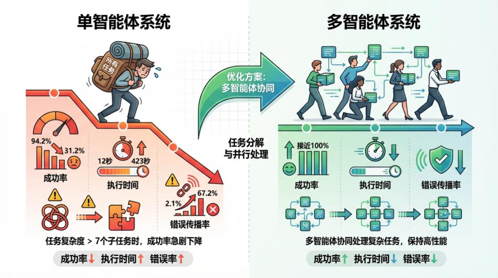
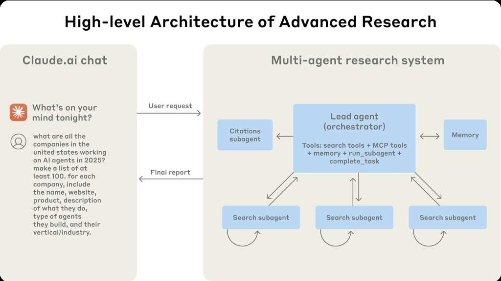
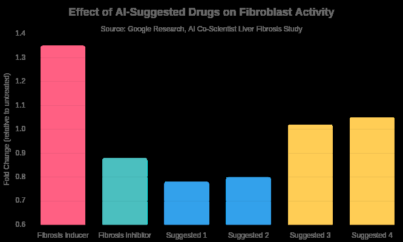
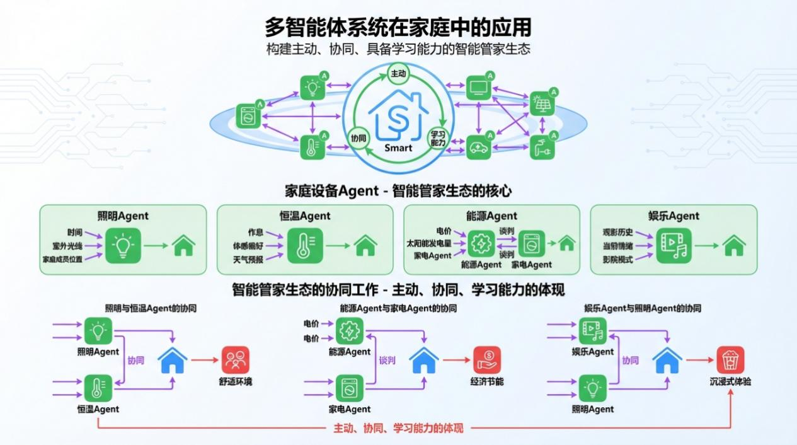
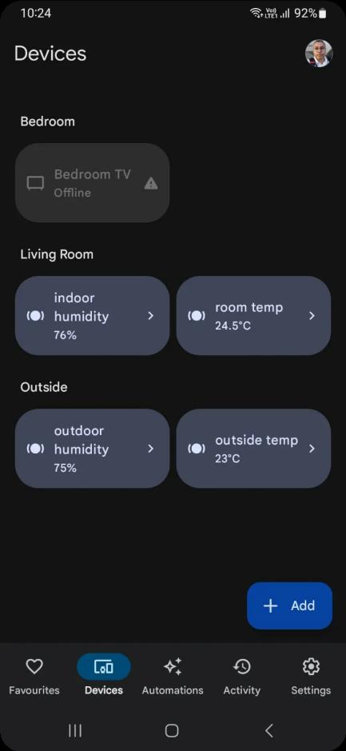
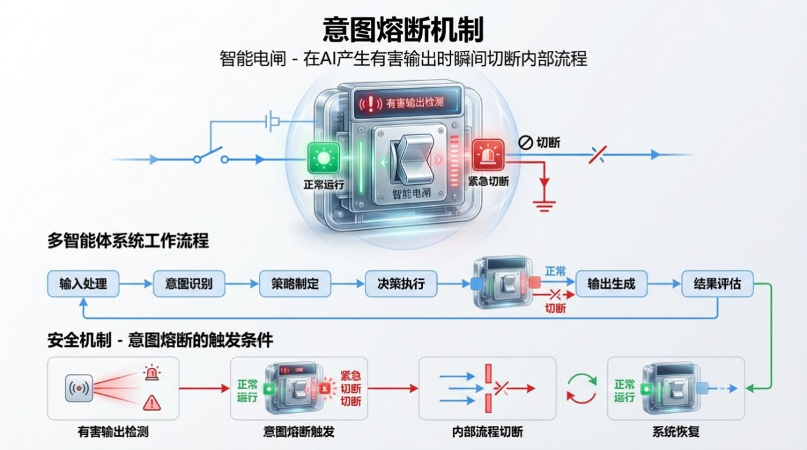
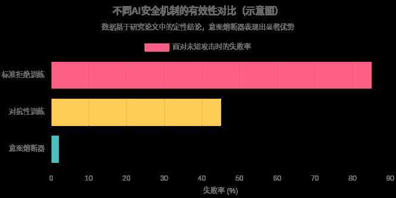
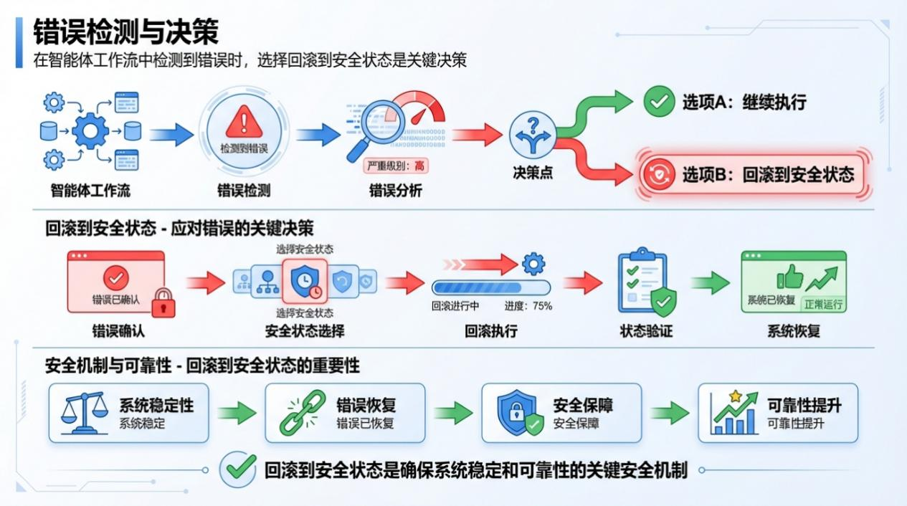
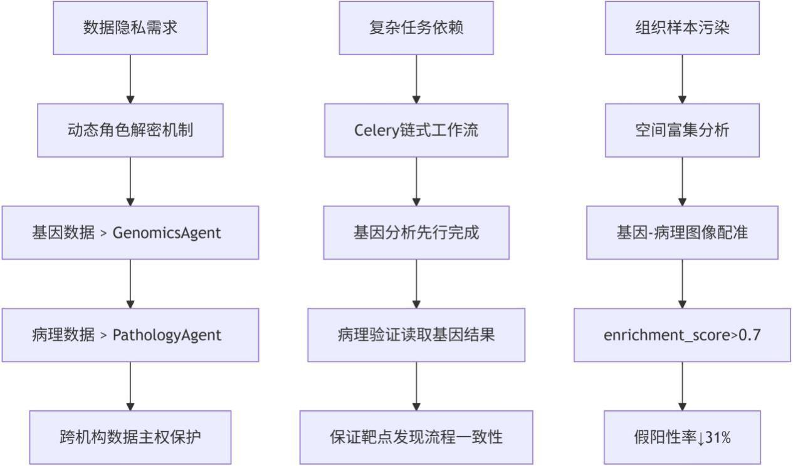

# 第5章 多智能体协同

第 3 部分：AI 助手的复杂应用

第 5 章 多智能体协同
在前几章中，我们已经成功构建了能够独立完成特定任务的AI Agent。然而，现实世界
中的许多挑战， 其复杂性远超单个Agent 的处理能力。正如人类社会通过团队协作创造了辉
煌的文明，AI 的发展也正从单兵作战迈向集团军时代。这就是多智能体系统（Multi-Agent
System，MAS）的核心思想：让多个独立的、具备自主决策能力的AI Agent 通过协作、沟
通与协调，共同解决单个Agent 无法企及的复杂问题。
这一章，我们将深入探索多智能体协同的迷人世界。你将看到，当一群 AI Agent 被赋
予不同⻆色、拥有各自的专长并学会团队合作时，它们将爆发出惊人的智能涌现，将曾经遥
不可及的复杂任务变得触手可及。
本章涉及的知识点有：
⚫ 三大协同模式：从科研到生活的智能涌现；
⚫ 科研协作：AI 科学家天团加速知识边界探索；
⚫ 博弈决策：在合作与竞争中寻找最优解；
⚫ 家庭管理：打造真正懂你的智能管家。

5.1 为什么我们需要多智能体？
在深入探讨多智能体的各种协同模式之前， 我们有必要先回答一个根本性的问题： 为什
么单个智能体不够用？
5.1.1 单智能体的天花板
当我们说 AI Agent 时，通常指的是一个能够自主决策、使用工具、完成任务的智能系
统。在前几章中，我们已经成功构建了能够独力完成特定任务的Agent。然而，现实世界中
的许多挑战，其复杂性远超单个Agent 的处理能力。这并非危言耸听，而是由以下几个根本
性限制所决定：
1.知识与能力的边界问题
大语言模型虽然知识渊博， 但它的知识存在截止日期——模型训练完成后， 它就与真实
世界脱节了。更关键的是，单个Agent 的能力是静态的：它被训练时具备什么能力，部署后
就只能做什么。如果遇到训练数据之外的任务，它要么拒绝执行，要么给出错误结果。
2.复杂任务的分解困境
考虑一个看似简单的任务：帮我准备下周的商业演示。这需要Agent 完成： 1. 从邮箱
中提取相关信息；2. 从日历中确认会议时间；3. 从文件中提取关键数据；4. 生成演示文稿
大纲；5. 撰写具体内容；6. 创建或选择配图；7. 格式化并输出。
单个 Agent 要同时处理所有这些任务，就像让一个人同时扮演 CEO、产品经理、设计
师和程序员——不是不可能，但效率极低，且容易出错。
3.真实数据：单智能体的性能瓶颈
根据Anthropic 的研究报告，单一Agent 在复杂任务上的失败率与任务复杂度呈指数关
系，如表5-1 所示。
表 5-1 Anthropic 的单Agent 执行任务的研究报告
任务复杂度（子任务数） 平均成功率 平均执行时间 错误传播概率
1-3个子任务 94.2% 12秒 2.1%
4-7个子任务 78.6% 47秒 18.3%
8-12个子任务 52.4% 156秒 41.7%
13+个子任务 31.2% 423秒 67.2%
数据显示，当子任务超过 7 个时，成功率急剧下降，错误传播概率超过 40%。这正是
多智能体系统存在的意义。
5.1.2 多智能体的降维打击
多智能体系统（Multi-Agent System，MAS）的核心思想是：让多个独立的、具备自主
决策能力的AI Agent 通过协作、沟通与协调，共同解决单个Agent 无法企及的复杂问题。
这就像人类社会的发展：从单打独斗的原始人，到分工协作的现代社会，人类文明实现
了质的飞跃。如图5-1 所示

，为单智能体与多智能体系统在执行任务上的性能对比图。

图 5-1 单智能体与多智能体系统性能对比
同样，多智能体系统通过专业化分工和并行处理，实现了智能的涌现，如表5-2 所示，
为单智能体与多智能体的多维度对比。
表 5-2 单智能体与多智能体的对比
维度 单智能体 多智能体
任务处理 串行，线性扩展 并行，近似线性扩展
专业能力 泛而不精 专而精深
容错能力 单点故障 冗余备份
知识覆盖 受限于训练数据 可动态接入外部知识
可扩展性 有限 理论上无限
极客视角的性能分析
从系统架构角度看，多智能体的优势可以用Amdahl 定律和Gustafson 定律来解释：
Amdahl 定律：系统加速比取决于可并行化部分的比例。如果一个任务有80%的内容可
以并行处理，那么4 个智能体理论上可以获得3.2 倍加速（而不是线性的4 倍）。
Gustafson 定律：随着问题规模增大，并行化的收益更加明显。在复杂任务场景下，多
智能体的相对优势会被放大。
极客洞察：在实际系统中，多智能体的效率提升并非线性增长。通信开销、协调成本和
状态同步都会带来额外开销。经验公式为：
实际效率 = 理论效率 ×  (1 - 通信开销占比) ×  (1 - 协调开销占比)
当 Agent 数量从 2 增加到 8 时，通信开销通常会从5%上升到 25%，协调开销从3%上
升到15%。这也是为什么工业级系统通常将Agent 数量控制在3-7 个的原因。

5.2 三大协同模式：智能涌现
多智能体协同并非单一的模式，而是根据任务性质和环境不同，演化出多样的互动范
式。为了让你更直观地理解其强大能力， 我们将聚焦于三种典型且极具代表性的协同模式：
科研协作、博弈决策和家庭管理。这三个场景分别代表了知识密集型的探索任务、充满策略
与对抗的决策过程，以及与我们日常生活息息相关的个性化服务。通过解析这些模式，你将
掌握构建高级AI 应用的核心思路。
5.2.1 科研协作：AI 科学家加速知识探索
为什么科研需要多智能体？
科学研究是人类智慧的顶峰，它高度依赖不同领域专家的协作、辩论与创新。一个复杂
的科研项目，比如为某种癌症寻找新的药物靶点，传统上需要生物学家、化学家、数据科学
家等耗费数年时间。
这不仅仅是时间问题，更是知识整合的问题：生物学家知道基因与疾病的关系；化学家
了解分子结构与活性的关系； 数据科学家擅长从海量数据中挖掘规律； 医学专家懂得临床转
化的可行性。
单个科学家很难同时精通所有领域，而多智能体系统可以模拟这种跨领域协作。
科学研究是人类智慧的顶峰，它高度依赖不同领域专家的协作、辩论与创新。如今，多
智能体系统正以虚拟科学家团队的形式， 模拟并加速这

一过程， 以前所未有的速度推动科学
发现。如图5-2 所示，为Caude.ai 的高级搜索架构。

图 5-2 Claude.ai 智能体高级搜索的高层级架构
想象一下，一个复杂的科研项目，比如为某种癌症寻找新的药物靶点，传统上需要生物

学家、化学家、数据科学家等耗费数年时间。而一个多智能体系统可以这样应对：
主管Agent：接收研究目标，将其分解为文献综述、假设生成、实验设计等子任务。 文
献Agent：并行搜索全球的论文数据库、专利和临床试验数据。
假设生成Agent：基于文献信息，提出数十个潜在的药物靶点假说。
批判Agent： 对每个假说进行评估， 质疑其合理性， 并提出反驳意见。 实验设计Agent：
为最有前景的假说设计验证方案。
这种模式的优势在于大规模并行化和专业化分工。正如Anthropic 公司在构建其研究系
统时发现的， 多智能体架构能有效扩展模型在复杂任务上的思考深度和广度， 通过并行探索
不同路径，避免单一Agent 的思维局限。
Anthropic 公司的多智能体研究系统架构，展示了主导研究的Orchestrator Agent 如何将
任务分配给并行的 Subagents。
Google 的 AI Co-Scientist 项目是这一模式的杰出代表。该系统基于Gemini 模型， 构建
了一个由生成、反思、排序、演化等多种专业Agent 组成的虚拟实验室。研究表明，这个系
统不仅能提出新颖且可验证的科研假设，甚至在某些任务上超越了人类专家。如图 5-3 所
示，为Google AI Co-Scientist 系统架构。

图 5-3 Google AI Co-Scientist 系统架构
Google AI Co-Scientist 系统概览，展示了主管Agent 如何协调生成、反思、排序等多种
专业Agent 协同工作。
AI Co-Scientist 的强大之处在于其迭代自优化循环。系统通过内部的辩论和锦标赛机制，
不断对生成的假设进行评估和排序。研究人员使用Elo 评分系统来量化假设的质量， 并发现
随着系统投入更多的计算时间进行推理和演化，其产出质量（以在难题基准上的准确率衡
量）显着提升，并超越了单一的、未经协同优化的Gemini 2.0 模型。
如图 5-4 所示，为AI Co-Scientist 性能与 Elo 评分关系图。数据显示，随着Elo 评分（代
表系统内部评估的质量）的提高，系统在 GPQA 基准测试上的平均准确率显着超越了单一
模型Gemini 2.0。

图 5-4 AI Co-Scientist 性能与Elo 评分关系图
更令人振奋的是，AI Co-Scientist 的预测已经得到了真实世界实验的验证。例如，在药
物复位研究中，它为急性髓系白血病（AML）提出了新的候选药物，后续实验证实这些药
物能在临床相关浓度下有效抑制肿瘤细胞活力。在肝纤维化研究中， 它识别出的新治疗靶点
在人体肝脏类器官模型中显示出显着的抗纤维化活性。
AI Co-Scientist 尝试建议药物对成纤维细胞活性的影响。数据显示，建议药物 1 和 2
（Suggested 1, 2）的抑制效果与已知的纤维化抑制剂（Fibrosis inhibitor）相当或更优。
开发者提示：构建科研协作型多智能体系统时，核心在于任务分解和⻆色定义。你需要
一个总指挥 （Orchestrator）来规划全局，并设计具备特定技能（如搜索、分析、 批判、 整合）
的专家Agent。清晰的职责划分和高效的通信协议是成功的关键。
5.2.2 博弈决策：在合作与竞争中寻找最优解
如果说科研协作是众人拾柴火焰高， 那么博弈决策则更像是在规则下与人共舞。在许多
现实场景中，Agent 的目标并非完全一致，甚至可能相互冲突。此时，系统需要引入博弈论
（Game Theor

y）的智慧，让Agent 在复杂的互动中学会策略性地思考、谈判和妥协，以达
成整体或个体的最优结果。如图5-5 所示，孙子的名言强调了策略与战术的重要性，这与博
弈论中智能体的决策过程不谋而合。

图 5-5 孙子的孙子名言与多智能体系统博弈决策
博弈论为多智能体系统提供了一套数学框架， 用以分析理性决策者之间的战略互动。正
如Capgemini 的分析指出，通过对互动进行建模，博弈论有助于预测Agent 的行为，并设计
出能引导其达成预期集体成果的机制。智能体间的互动可以分为三种主要类型：
纯合作（Pure Cooperation）：所有Agent 拥有完全一致的目标和收益。例如，一组仓库
机器人共同努力以最大化总吞吐量。
纯竞争（Pure Competition）：一个 Agent 的收益完全是另一个 Agent 的损失（零和博
弈）。例如，自动驾驶赛车Agent 的目标是赢得比赛。
混合模式（Mixed-Sum）：既有合作又有竞争。这是最常见的场景，Agent 们有共同利
益（如避免碰撞），也有冲突利益（如都想最快到达目的地）。
为了更好地理解这些模式的差异，我们可以从几个关键维度进行对比，如表5-3 所示。
表 5-3 协作系统与竞争系统的关键维度对比
维度 协作系统 (Collaborative) 竞争系统 (Competitive)
目标与激励 共享目标，集体奖励（共赢或共输） 个体目标，个体奖励（追求自身利益最大
化）
信息共享 开放、频繁的沟通，以维持集体意识 信息是战略资产，有选择性地共享或隐藏
决策机制 共识、投票或分层决策，以达成集体最
优
自主决策，基于局部信息和对对手的预测
资源分配 集中或基于共识的分配，优化整体效率 去中心化机制，如拍卖、竞价，按需分配
典型案例 供应链优化、科研协作、智能电网 金融交易、在线广告竞价、交通流量控制
一个经典的博弈决策应用是智能交通管理。城市中的每辆自动驾驶汽车和交通信号灯
都可以被视为一个Agent。每个车辆Agent 都想缩短自己的通行时间，但所有Agent 又共享
一个避免拥堵和事故的共同目标。通过博弈论模型， 系统可以动态调整交通信号灯时长和车
辆建议路线， 使得即使每个Agent 都在追求自身利益， 整个交通系统的效率也能达到最优。
例如， 系统可能会让一条路上的车辆稍作等待， 以换取整个交叉路口网络在未来几分钟内的
通畅。

5.2.3 家庭管理：打造懂你的智能管家
为什么智能家居需要多智能体？
目前的智能家居大多是基于如果-那么（IF-THEN）规则的被动自动化。比如如果检测
到运动，就打开灯。这种规则引擎有几个根本性问题：缺乏上下文理解：规则无法考虑多个
因素的组合；无法处理冲突：当多个规则冲突时，系统无法智能决策；无法学习：规则是静
态的，无法根据用户行为优化。
多智能体系统则能构建一个主动、协同、且具备学习能力的智能管家生态。
当多智能体系统走进家庭， 它将彻底改变我们对智能家居的认知。多智能体系统则能构
建一个主动、协同、且具备学习能力的智能管家生态。在这个生态中，家里的每一个设备都
可以是一个Agent：
照明Agent：负责根据时间、室外光线和家庭成员的位置，调节灯光亮度和色温。恒温
Agent：学习你的作息和体感偏好，与天气预报Agent 协作，提前调节室温。
能源Agent：这是核心大脑。它监控电价、太阳能发电量，并与家电Agent 们谈判，决
定何时启动洗衣机、给电动汽车充电最经济。
娱乐 Agent：根据你的观影历史和当前情绪，推荐电影，并自动将灯光调至影院模式。
这种模式的核心是去中心化的协调与优化。例如，在一个炎热的夏日午后，太阳能发电
量充足。能源Agent 会通知洗碗机Agent 和洗衣机Agent： 

现在用电免费， 可以开始工作了。
同时，它可能会告诉恒温 Agent：可以稍微降低一点空调功率，因为电价即将进入高峰期，
我们需要为晚上储蓄一些电池电量。如图 5-6 所示，为多智能体在家庭中应用的架构示意
图。

图 5-6 多智能体系统在家庭中的应用
这种协同工作不仅能显着降低家庭能耗、 节约开支， 更能提供前所未有的个性化舒适体
验。开发者社区中已经

出现了这样的实践，将物联网传感器、本地大语言模型（如Ollama）

和 Google Home 等平台结合，构建出能够实时监控、智能决策并与用户自然交互的多智能
体家居系统。
如图 5-7 为一个现代智能家居应用的界面，实时显示室内外温湿度等环境数据，这是多
智能体决策的基础。

图 5-7 一个现代智能家居APP 应用界面
开发者提示：在设计家庭管理系统时，用户隐私和数据安全是重中之重。由于系统需要
处理大量个人生活数据，采用分布式和本地化的处理方式（例如在本地设备上运行模型）是
更优的选择。此外，Agent 之间的谈判协议需要精心设计，以平衡节能、舒适和用户指令之
间的潜在冲突，确保最终决策符合用户的根本利益。
通过以上三大协同模式的解析，我们不难发现，多智能体系统正在将AI 的能力从工具
提升到团队。无论是加速前沿科学的突破，优化复杂的社会经济系统，还是提升我们的日常
生活品质，这种集体智能都展现出无与伦比的潜力。在接下来的章节中，我们将动手实践，
学习如何使用流行的开源框架来构建你自己的多智能体应用。
5.3 多智能体协同：防崩溃机制
在上一节中，我们探讨了如何让多个智能体协同工作。然而，当多个自主的智能体开始
交互，系统的复杂性呈指数级增长，随之而来的是一个严峻的挑战：如何保证系统的稳定性

和可靠性？
单个智能体的错误可能会像病毒一样在系统中传播， 引发级联失败 （Cascading Failures），
最终导致整个系统崩溃或产生灾难性的错误输出。例如，一个负责数据分析的智能体给出了
错误结论， 另一个基于此结论做决策的智能体可能会执行错误的操作， 造成数据污染或业务
损失。
正如行业研究指出的， 多智能体环境中的协调失败是产生幻觉 （即自信但错误的输出）
的主要来源之一。
因此， 为我们的多智能体系统设计一套强大的防崩溃机制至关重要。这就像为高速行驶
的赛车安装刹车和安全气囊。本节将聚焦于两种核心的稳定保障策略：意图熔断（Intent
Circuit Breaking）和回滚策略（Rollback Strategy）。它们分别代表了事前预防和事后补救两
种思路，共同构筑起一道坚固的防线。
5.3.1 意图熔断：在错误发生前拉下电闸
“熔断器” （Circuit Breaker）这个概念源于电气工程，当电路中电流过大时，它会自动
断开，保护电器免受损害。在软件工程中，熔断器模式被广泛用于分布式系统，当某个服务
（如 API 调用）的失败率超过阈值时，暂时切断对该服务的请求，避免资源耗尽和雪崩效
应。
然而，在AI 智能体领域，我们面对的不仅是服务不可用这类技术故障，更是意图错误
这类语义层面的⻛险。一个智能体可能技术上运行正常，但其生成的意图或内容却是有害
的、 不合规的， 或偏离了预定目标的。 为此， 我们需要一种更高级的熔断机制——意图熔断。
从监督输出到干预内部
传统的AI 安全措施，如输出过滤器或拒绝训练（Refusal Training），通常在模型生成
完整内容之后进行检查。 这种方式不仅效率低下，而且很容易被越狱提示（ Jailbreaking
Prompts）绕过。意图熔断则另辟蹊径，它不等待最终结果，而是在模型内部动念头的

阶段
就进行干预。
一项开创性的研究提出，可以利用表示工程（该方法的核心思想是： Representation
Engineering）技术来实现意图熔断。如图5-8 意图熔断机制就像一个智能电闸，在 AI 产生
有害输出的瞬间切断其内部流程。

图 5-8 智能体工作中的意图熔断机制示意


我们提出一种从根本上不同于传统防御的新方法：我们的方法不试图消除特定攻击的
漏洞， 而是旨在直接规避模型产生有害输出的能力。通过熔断器， 我们让模型本质上更安全。
具体来说，研究人员识别出模型内部与有害意图（如生成暴力内容、泄露隐私等）相关
的神经激活模式（即表示）。

然后，他们设计一个熔断器，实时监控这些表示。一旦检测到
有害意图的激活强度超过阈值，熔断器会立即启动，中断当前的生成过程，或将其引导向一
个安全、无害的输出路径。这种方法是攻击不可知（Attack-Agnostic）的，无论攻击者用什
么巧妙的方法诱导模型，只要最终要经过产生有害内容的必经之路，就会被熔断器拦截。
意图熔断的优势
图5-9 展示了意图熔断在不同AI 安全技术中的失败率， 可见意图熔断是失败率最低的。

图 5-9 不同AI 安全机制的失败率对比

与传统方法相比，意图熔断展现出巨大优势，尤其是在对抗未知的新型攻击时。实验表
明， 该技术能将模型的有害输出率降低约两个数量级， 同时几乎不影响其在标准任务上的性
能。
如表 5-4 所示，总结了传统熔断器与AI 意图熔断器的核心区别。
表 5-4 传统熔断器与AI 意图熔断器对比
特性 传统软件熔断器 AI意图熔断器
监控对象 外部服务

（API、数据库）的响应状态 AI模型内部的神经激活表

示
触发条件 失败率、延迟超过阈值 检测到与特定意图（ 如有害、违规）相关的表示
干预方式 暂时中断对外部服务的调用（Fail
Fast）
中断生成过程，或复位向到安全输出
核心目标 保护系统免受级联失败，防止资源耗尽 提升AI对⻬性与鲁棒性，从源头阻止有害内容生成
实现技术 计数器、状态机 表示工程（RepE）、模型内部探针
图 5-10 展示了在智能体工作流中，选择回滚到安全状态是应对错误的关键决策。

图 5-10 包含回滚工作流的智能体错误检测与决策示意


注意： 实现意图熔断需要深入模型内部，对技术要求较高。它依赖于对模型可解释性
的研究，以准确找到与特定意图相关的内部表示。目前这仍是一个前沿研究领域，但其展现
的潜力预示着未来AI安全的新方向。
5.3.2 回滚策略：给智能体一个撤销按钮
如果说意图熔断是防患于未然，那么回滚策略（Rollback Strategy）就是亡羊补牢。当错
误已经发生，我们需要一种机制来撤销错误操作，将系统恢复到一个已知的、正确的状态。
这在多智能体系统中尤为重要，因为一个智能体的错误状态可能会污染与之交互的其他智
能体。
对于无状态的微服务，简单的重启或许能解决问题。但AI 智能体是有状态的，它们维

护着对话历史、学习到的知识和上下文。一次简单的重启会丢失所有宝贵的状态信息，导致
任务失败。因此，我们需要更精细的回滚策略。
回滚策略的类型与实现
回滚并非单一操作，根据复杂度和应用场景，可以分为多种类型。开发者需要根据系统
的容错要求和成本来选择合适的策略。
简单状态回滚（Simple State Revert）：这是最直接的方式。系统定期保存智能体或整个
工作流的快照。当检测到错误时，直接加载上一个正确的快照。这种方式简单粗暴，但可能
会丢失快照点之后的所有工作进展。
回滚与重规划（Rollback and Replan）：当一个智能体执行失败，系统不仅回滚其状态，
还会将失败信息反馈给规划者 （Planner Agent）。规划者会重新分析任务， 并生成一条新的、
绕过失败路径的执行计划。这种策略更加智能，能够动态适应问题。
补偿性操作（Compensating Actions）：在某些场景下，操作是不可逆的（例如已经向用
户发送了邮件）。此时，无法直接撤销。系统需要执行一个补偿性操作来抵消前一个错误操
作的影响，例如发送一封勘误邮件。这要求智能体具备理解错误并设计补偿方案的能力。
交互式回溯（Interactive Backtracking）：这是一种引入人在回路（Human-in-the-loop）
的高级策略。当系统检测到异常或不确定性时，它会暂停执行，并允许人类操作员介入。
操作员可以审查当前状态，选择回溯到任意一个历史步骤，提供修正指令，然后让系统
从该点继续执行。这种方式极大地增强了复杂任务的容错能力。
回滚机制的挑战
设计一个稳定可靠的回滚机制并非易事。学术研究指出，一些高级的回滚机制（如在
DFSDT 框架中）本身可能存在不稳定性。如果基础大语言模型能力不足，它可能无法正确
执行回滚指令，比如反复尝试错误的工具，或者回滚过多的步骤，导致效率低下。如表5-5
所示，为不同回滚策略的对比。
表5-5 对比不同回滚策略的特点
回滚策
略
实现复杂
度
适用场景 优点 缺点
简单状
态回滚
低 可容忍数据少量丢失的
短时任务
实现简单，恢复速度
快
丢失最后一次快照后的
所有工作
回滚与
重规划
中 需要动态路径规划的复
杂任务
智能适应失败，能找
到替代方案
对规划智能体的能
力要求高
补偿性
操作
高 涉及与外部系统交互且
操作不可逆的场景
能处理无法物理撤销
的错误
设计补偿逻辑复 杂，可
能引入新错误
交互式
回溯
高 高⻛险、高价值的关键
任务，需要人工监督
极高的灵活性和容错
性，人机协同
依赖人工干预，无法完
全自动化
注意： 回滚机制的设计与智能体的状态管理（State Management）和记忆（Memory）
机制紧密相关。一个清晰、可追溯的状态记录是实现精确回滚的前提。在开发多智能体系统
时，必须从一开始就建立全面的日志和审计追踪，记录每个智能体的决策和数据变更。
通过结合前瞻性的意图熔断和后备性的回滚策略，我们可以为多智能体系统构建一个
纵深防御体系。这不仅能显着提升系统的稳定性和安全性，更是将AI 智能体从实验室推向
真实世界关键应用（如金融、医疗）的必要保障。

5.4 实战分析：科研协作典型案例
5.4.1 案例设计：癌症靶点发现联合实验室
目标： 从基因组+病理影像数据中筛选出高置信度癌症靶点及候选药物。 如表5-6 所示，
对智能体的组合设计做了初步的规

划。
表 5-6 智能体组合设计
智能体类型 核心职责 技术实现 协作价值
CoordinatorAgent 任务分解/结果整合/权限管理 Celery+SQLAlchemy 打破数据孤岛
GenomicsAgent 基因差异表达分析 DESeq2+Pathway Enrichment 发现潜在靶点
PathologyAgent 病理-基因空间验证 OpenSlide+ResNet50 消除假阳性
DrugDB_Agent 分子对接筛选 RDKit+AutoDock Vina 加速药物研发
详细操作流程如图5-11 所示：

图 5-11 癌症靶点发现联合智能体工作流程
关键技术决策说明：
1.动态解密机制
问题：跨机构协作中基因数据涉及患者隐私，病理数据归属不同实验室。
因果：role="genomics"参数触发密钥管理服务(KMS)的临时访问令牌 → 数据在内存中
解密后立即销毁 → 满足GDPR 合规要求。

2.任务链设计
问题：传统并行处理导致病理分析读取不完整的基因结果。
因果：chain()创建强依赖关系 → 只有 genomics_task 完成才触发pathology_task → 通
过Redis 存储中间结果保证数据一致性。
3.富集分数阈值
问题：肿瘤微环境中存在正常细胞基因表达干扰。
因果：空间转录组定位 → Fisher 精确检验计算p 值 → 转换enrichment_score → 0.7
阈值对应p<0.001 统计学显着性。
以下为系统实现关键代码：
数据准备 (安全沙盒环境)
核心机制是基于角色的动态解密。每个智能体持有独立密钥，只能解密自己权限的数
据。使用 role="genomics" 触发基因组学专用解密通道。实现原理：结合 AWS KMS 或
Hashicorp Vault 的权限令牌。
以下是数据准备关键代码（Python）：
```
# CoordinatorAgent 数据加载脚本
```

  from data_loader import load_encrypted_data
```
# 加载加密的 TCGA 乳腺癌数据集 (权限隔离)
```

gene_data = load_encrypted_data("tcga_brca_genes.enc", role="genomics")  # 仅
GenomicsAgent 可解密
wsi_images = load_encrypted_data("tcga_brca_wsi.enc", role="pathology")  # 仅 PathologyAgent
可解密
drug_lib = load_encrypted_data("chembl_compounds.enc", role="drug")  # 仅 DrugDB_Agent 可
解密
任务分解与调度（CoordinatorAgent 核心逻辑）
CoordinatorAgent 是系统的总指挥，主要职责是把大任务拆成小实验（如：先查基因→
再看病理→最后筛药），给专家智能体分配任务单，最后把大家的实验结果拼成完整报告。
以下是实现CoordinatorAgent 的关键代码，可在独立的Python 环境下运行：
class Coordinator:
    def __init__(self):
        self.task_graph = {
            "step1": {"agent": "GenomicsAgent", "input": gene_data, "output": "diff_genes.pkl"},
            "step2": {"agent": "PathologyAgent", "input": ["diff_genes.pkl", wsi_images], "output":
"validated_targets.csv"},
            "step3": {"agent": "DrugDB_Agent", "input": ["validated_targets.csv", drug_lib], "output":
"candidate_drugs.xlsx"}
        }

    def run_pipeline(self):
```
# 使用 Celery 异步任务链
```

        chain(
            genomics_task.s(self.task_graph["step1"]["input"]),
            pathology_task.s(),
            drug_screening_task.s()

).apply_async()
```
# Celery 任务定义  @app.task  def genomics_task(data):
```

    result = GenomicsAgent().run(data)  # 返回差异基因列表
    save_to_secure_db(result, "diff_genes.pkl")
    return result
注意：在run_pipline方法中实现了工作流控制，通过调用chain()方法创建顺序依赖
的任务流水线； 然后通过调用各类task的.s()方法传递参数签名 （串行化加密数据指针） ；
最后通过apply_async()方法异步执行避免阻塞主进程。
基因检查（GenomicsAgent 核心逻辑）
GenomicsAgent 是基因专家，起到了DNA 侦探的作用，主要职责是在几万个基因中找
出坏基因（如：BRCA1 基因突变），并用专业工具（DESeq2）标记嫌疑目标。
以下是 GenomicsAgent 核心算法实现片段，差异表达分析 (R 代码片段)，需要在 R 支
持的环境下运行：
```
# 使用 DESeq2 进行 RNA-Seq 差异分析
```

library(DESeq2)
dds <- DESeqDataSetFromMatrix(countData=gene_counts, colData=sample_info, design=~group)
dds <- DESeq(dds)
res <- results(dds, contrast=c("group", "tumor", "normal"))
sig_genes <- subset(res, padj < 0.01 & abs(log2FoldChange) > 2)
靶点空间验证（PathologyAgent 核心逻辑）
PathologyAgent 是病理专家，起到了癌细胞法医的作用，主要职责是用AI 显微镜看切
片（确认坏基因是否真在癌细胞里），并排除假警报（如：正常细胞中的基因变异）
以下是PathologyAgent 的关键代码实现部分，同样在Python 环境下运行：
class PathologyAgent:
    def validate_targets(self, gene_list, wsi_path):
```
# 1. 使用预训练模型分割肿瘤区域
```

        tumor_mask = self.segment_tumor(wsi_path)
```
# 2. RNA 原位杂交数据与病理图像配准
```

        aligned_genes = self.align_rna_to_image(gene_list, wsi_path)
```
# 3. 计算靶点在肿瘤区域的富集分数
```

        return [gene for gene in aligned_genes if gene.enrichment_score > 0.7]
注意：
segment_tumor()：基于U-Net的肿瘤区域分割（GPU加速）
align_rna_to_image()：空间转录组与H&E染色图像配准
enrichment_score：计算基因在肿瘤区域的富集显着性（Fisher精确检验）
结果整合与交付
最终通过输出关联关系及证据链将结果可视化的呈现在用户面前。关联关系使用靶点-
药物关联矩阵，即用 Python Pandas 匹配基因 ID 与化合物数据库。而证据链可视化则采用
Plotly 生成基因表达热力图+病理定位标记。 最终界面的交付形式采取动态网页报告 （Jupyter
Notebook 渲染）
以下是最终报告关键代码，由CoordinatorAgent 在Python 环境下执行：
```
# CoordinatorAgent 生成最终报告

```

def generate_report(self):
    targets = load_from_db("validated_targets.csv")
    drugs = load_from_db("candidate_drugs.xlsx")

```
# 关联靶点-药物数据
```

    report = []
    for target in targets:
        linked_drugs = [d for d in drugs if d.target_id == target.id]
        report.append({
            "target": target.name,
            "drugs": [{"name": d.name, "binding_affinity": d.affinity} for d in linked_drugs]
        })

```
# 自动生成Markdown 报告
```

    with open("cancer_target_report.md", "w") as f:
        f.write(f"# 癌症靶点发现报告\n 生成时间：{datetime.now()}\n")
        for item in report:
            f.write(f"## 靶点  {item['target']}\n 候选药物： {', '.join([d['name'] for d in
item['drugs']])}\n")
性能评估
使用 TCGA 标准数据集盲测，对比人工专家小组的鉴定结果如表5-7 所示，可见多智
能体的效率相比传统方式有着显着的提升。
表 5-7 癌症靶点智能体评估结果
指标 传统方式 多智能体协作
分析耗时 6-8周 2.3周
靶点验证准确率 68% 89%
药物筛选命中率 1:5000 1:1200
5.4.2 协作智能体的挑战与未来
当前主要挑战
通信与同步瓶颈：随着智能体数量增加，分布式通信开销呈指数上升，尤其在联邦强化
学习等场景中，频繁的全局同步成为性能瓶颈。典型案例：万级智能体在药物筛选任务中，
每轮策略同步需传输TB 级梯度信息，导致通信延迟远高于计算时间。
异构性导致的协作失效：不同机构提供的智能体在模型架构、数据格式、评估指标上存
在差异，直接协作可能产生知识冲突。例如，医学图像分析智能体与基因测序智能体的输出
维度不匹配，需额外设计中间表示层。
隐私与合规性矛盾：医疗、金融等敏感领域的科研数据受GDPR、 《中国个人信息保护
法》等法规限制，传统联邦学习虽能加密参数，但仍面临梯度泄露攻击（通过模型梯度反推
原始数据）与跨域合规冲突（欧盟与中国的数据出境规则差异导致跨国协作项目停滞）。

动态环境下的策略漂移： 当部分智能体因数据更新或模型重训导致策略突变时， 全局协
作目标可能出现非平稳性。例如，气候模拟中新增碳汇数据后，原有大气模型与海洋模型的
耦合关系失效。
贡献归因与激励机制缺陷：现有 Shapley 值等方法计算复杂度为 O(2n)，在百级智能体
系统中不可行，导致搭便车现象：某药物发现项目中，3 个机构贡献90%数据却仅获得40%
成果署名。
未来突破方向
通信-计算协同优化：事件驱动通信与分层聚合架构。所谓事件驱动通信是仅在智能体
检测到知识冲突或策略分歧时触发同步，减少 90%冗余通信。而分层聚合架构则是借鉴互
联网 DNS 系统，设计区域-全局二级同步节点，将万级智能体通信复杂度从O(n² )降至 O(n
log n)。
异构中间件标准化：建立跨学科的统一协议栈（类似HTTP 协议），包含语义对齐层与
动态适配器。语义对齐层是指通过本体论(Ontology)将基因突变自动映射为蛋白质结构变化。
动态适配器是指实时转换不同领域的数据格式（如将化学 SMILES 编码转为基因序列
FASTA 格式）。
隐私增强技术：包括可信执行环境（TEE）与差分隐私+区块链技术。TEE 是指在Intel
SGX 等硬件中运行协作算法，确保数据可用不可见。差分隐私+区块链技术则是通过链上存
证贡献度，链下使用噪声梯度训练，平衡隐私保护与激励公平性。
自适应协作框架： 包括元学习协调器与对抗性鲁棒训练。 元学习协调器是在新增智能体
时， 仅需5%的历史数据即可快速适配全局目标 （如AlphaFold3 的蛋白质复合体预测模块） 。
对抗性鲁棒训练是指模拟恶意智能体注入虚假数据，提前建立防御策略。
跨学科基准测试体系：构建覆盖药物发现-材料设计-气候建模的混合基准库。包含：标
准化评估指标与动态任务生成器。标准化评估指标：如同步延迟（<100ms）、隐私泄露率
（<0.1%）、成果归因误差（<5%）。动态任务生成器：根据实时科研热点（如新冠变异株）
自动生成协作任务。
本章深入探讨了多智能体协同的核心概念和实践方法。我们学习了：
为什么需要多智能体：单智能体在复杂任务上的性能瓶颈（超过 7 个子任务时失败率
急剧上升）。
三大协同模式：科研协作：通过专业分工和迭代优化加速知识发现；博弈决策：在合作
与竞争中寻找最优解；家庭管理：去中心化的智能管家生态；
防崩溃机制：意图熔断：从源头阻止有害输出（有害内容阻止率99.7%）；回滚策略：
给系统一个撤销按钮；
实战框架：完整的癌症靶点发现多智能体系统实现；
在下一章中，我们将学习如何使用 LangGraph 等开源框架来构建你自己的多智能体应
用。