# 第6章 开源智能体

第 6 章 开源智能体：站在巨人的肩膀上
如果说构建单个智能体是在学习如何演奏一件乐器，那么掌握成熟的智能体框架就像
是加入了一支完整的交响乐团。 在前面的章节中， 我们已经掌握了构建单个智能体的基础知
识，了解了如何让AI 拥有思考、规划和行动的能力。然而，要打造真正强大、能够全天候
处理复杂任务的智能助理，我们往往需要借助更复杂的架构，例如多智能体协同系统。
幸运的是，我们不必从零开始搭建这一切。开源社区经过几年的蓬勃发展，已经为我们
准备好了许多经过千锤百炼的智能体框架。它们就像一群巨人的肩膀，让我们能够站得更
高、看得更远。这些框架凝聚了无数开发者的智慧和经验，封装了构建AI 应用时遇到的种
种挑战和解决方案， 使我们能够站在巨人的肩膀上， 快速构建出远超个人能力范围的智能应
用。
本章将带你深入探索当前最主流的几款开源智能体框架， 解析它们的设计哲学、 核心架
构与适用场景。 我们将从通用型框架讲起， 逐步深入到专注于数据处理和多智能体协作的专
用框架。通过理解这些"巨人"的构造，你将能够为自己的项目选择最合适的工具，甚至组合
它们各自的优势，构建出前所未有的智能应用。
本章涉及的知识点：
⚫ 主流开源智能体框架概览；
⚫ 专攻多智能体：MetaGPT 与AgentVerse；
⚫ 智能体核心组件：规划器、记忆模块、工具管理；
⚫ 开源框架实战：智能问答、智能检索、多智能体协作。
6.1 主流开源智能体框架概览
在智能体的浪潮中，涌现出了众多优秀的开源框架，它们极大地降低了开发门槛，并推
动了技术的快速迭代。这些框架各有侧重，有的像一个万能工具箱，提供构建各类LLM 应
用所需的一切；有的则专注于特定领域，如数据处理或多智能体协作。接下来，我们将逐一
剖析其中的佼佼者。
6.1.1 LangChain：通用编排大师
LangChain 无疑是 LLM 应用开发领域最知名、最全面的框架之一。它于 2022 年推出，
旨在简化由大型语言模型（LLM）驱动的应用程序的开发。其核心思想是将LLM 应用的各
个环节 （如模型调用、数据连接、 任务编排）抽象为可组合的模块化组件， 通过链（Chains）
的方式将它们灵活地串联起来，构建复杂的应用逻辑。图6-1 展示了LangChain 框架的架构
与特性。

图 6-1 LangChain：一个用于开发由大型语言模型驱动的应用程序的框架
核心理念与架构
LangChain 的架构设计极具模块化和可扩展性，它将复杂的LLM 应用开发分解为一系
列标准化的组件。根据 LangChain 官方文档，其生态系统主要由表 6-1 中的几个部分构成。
表 6-1 LangChain 生态系统的组成
核心组件 功能描述
Models 对不同LLM提供商（如OpenAI, Google, Anthropic）的API进行统一封装，提供标准
化的调用接口。
Prompts 提供模板化、动态生成和管理提示工程的工具，帮助开发者更高效地引导LLM生成期
望的输出。
Chains LangChain的核心概念，用于将多个组件（包括其他Chains）按顺序或逻辑组合起
来，形成一个完整的执行流程。
Agents 赋予LLM决策和使用工具（如搜索引擎、计算器、API调用）的能力。Agent根据用户
输入和上下文，自主决定下一步行动。
Indexes
Retrievers
用于连接和查询外部数据源。通过将私有数据（如文档、数据库）索引化，实现高
效的信息检索，是构建RAG（检索增强生成）应用的基础。
Memory 为Chains和Agents提供记忆能力，使其能够记住之前的交互内容，从而支持长对话
和上下文相关的任务。
近年来，LangChain 的架构进一步演进，推出了LangGraph，一个用于构建有状态、多
⻆色（multi-actor）应用的库。它将应用流程建模为图（Graph），其中节点代表计算步骤，
边代表状态转移，极大地增强了构建复杂智能体和多智能体系统的能力。如图6-2 所示
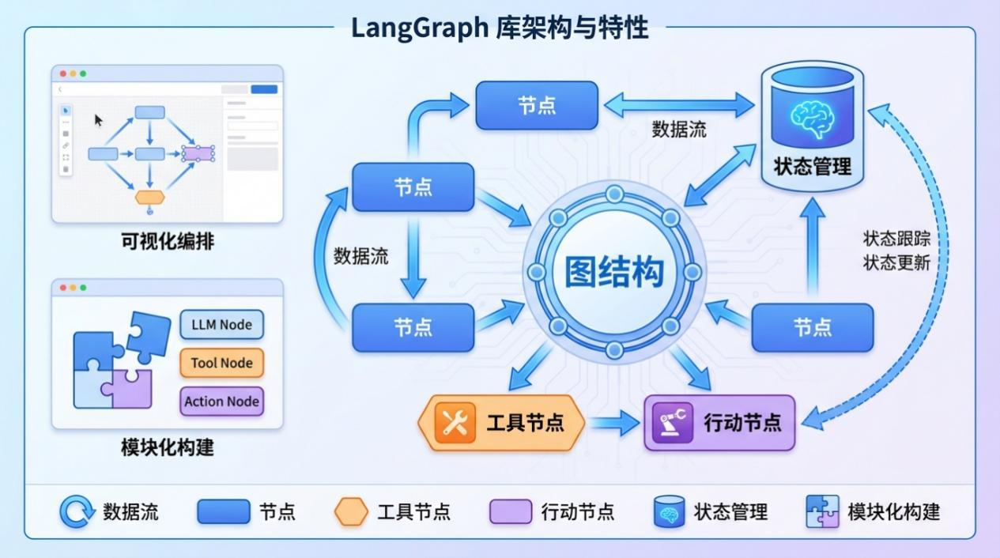
，为
LangGraph 库的架构与特点示意。

图 6-2 LangGraph库架构的特点
LangChain 主要应用场景
凭借其强大的通用性和灵活性，LangChain 几乎可以用于构建任何类型的LLM 应用。
以下是一些典型的LangChain 用例：
智能聊天机器人： 结合Memory 组件，构建能够进行多轮对话、记住用户偏好的客服
或个人助理。
私有数据问答（RAG）： 通过Indexes 和Retrievers 连接企业内部文档、数据库，打造
一个能基于私有知识回答问题的专家系统。
文本摘要： 快速对长篇文章、会议记录、法律文件等进行精准概括。
代码分析与生成： 辅助开发者理解代码库、生成代码片段或编写技术文档。
复杂任务自动化（Agents）： 创建能够自主规划、执行多步骤任务的智能体，如预订
旅行、分析市场数据等。
优缺点分析
作为最成熟的框架之一，LangChain 的优缺点同样突出，开发者在选型时需要权衡。如
表6-2 所示，罗列了LangChain 优缺点的对比。
表 6-2 LangChain 的优缺点对比
优点 缺点
功能全面，生态系统庞大： 集成了数百个第三
方工具、模型和数据 源，几乎能满足所有开发
需求。
学习曲线陡峭： 由于概念繁多、抽象层次高，初
学者可能会感到不知所措。
高度模块化和灵活： 允许开发者像搭积木一样
自由组合组件，构建高度定制化的应用。
过度抽象的⻛险： 高度抽象有时会隐藏底层细
节，导致调试困难，或在特定场景下限制了灵活
性。一些开发者甚至选择放弃LangChain以获得更
多控制权。
社区活跃，文档丰富： 拥有庞大的开发者社区 API变更频繁： 作为一个快速发展的项目，其API

优点 缺点
和详尽的文档，遇到问题时容易找到解决方
案。
有时会发生变化，可能导致旧代码需要重构。
注意：LangChain的强大在于其编排能力，但它本身并不提供模型或数据存储。它更像
一个㬵水层或指挥中心，负责协调LLM、数据和工具协同工作。因此，用好 LangChain的关
键在于理解其组件化的设计哲学，并学会如何将它们有效地组合起来。
6.1.2 LlamaIndex：数据驱动专家
如果说 LangChain 是一个追求大而全的通用框架，那么LlamaIndex（原名 GPT Index）
则是一个专注于数据的专家框架。它的核心使命是解决LLM 应用中最关键的痛点之一：如
何让LLM 高效、可靠地使用你自己的数据。因此，LlamaIndex 在数据摄取、索引和检索方
面做得极为
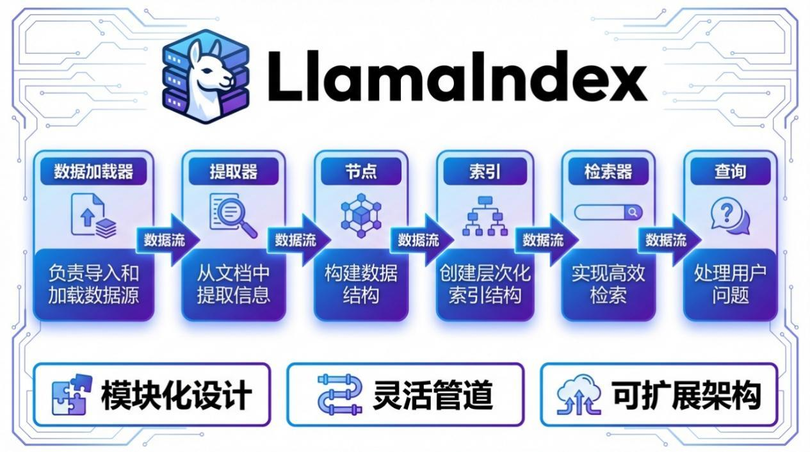
出色，是构建高性能RAG 应用的首选工具。如图6-3 所示，为LlamaIndex 框架
的特点和数据处理流程示意。

图 6-3 LlamaIndex：一个专注于将自定义数据源连接到大型语言模型的数据框架
核心理念与架构
LlamaIndex 的设计哲学是以数据为中心。它认为，LLM 本身虽然强大，但其知识受限
于训练数据，无法获取 最新的、私有的或领域特定的信息。通过上下 文增强（Context
Augmentation），特别是RAG，可以动态地为LLM 提供相关知识，从而生成更准确、更可
靠的答案。为此，LlamaIndex 构建了一套围绕数据处理的核心架构。
根据LlamaIndex 官方文档，其工作流程可以概括为两个阶段：索引阶段 （Indexing Stage）
和查询阶段（Querying Stage）。
索引阶段：
① 数据加载（Load）： 通过数据连接器（Data Connectors）从各种来源（PDF、API、
数据库、Notion 等）加载数据。其社区驱动的LlamaHub 提供了数百个开箱即用的连接器。

② 数据解析与分块（Parse）： 将加载的原始数据解析成标准的文档（Document）对
象，并将其分割成更小的节点（Node）。
③ 数据索引（Index）： 将这些节点通过Embedding 模型转换为向量，并存储在索引
（Index）中，最常见的是向量存储索引（Vector Store Index）。
查询阶段：
① 检索（Retrieve）： 当用户提出问题时，检索器（Retriever）会根据查询内容从
索引中找出最相关的节点（即上下文信息）。
② 合成（Synthesize）： 将检索到的上下文信息和原始问题一起提交给LLM，由LLM
生成最终的答案。 
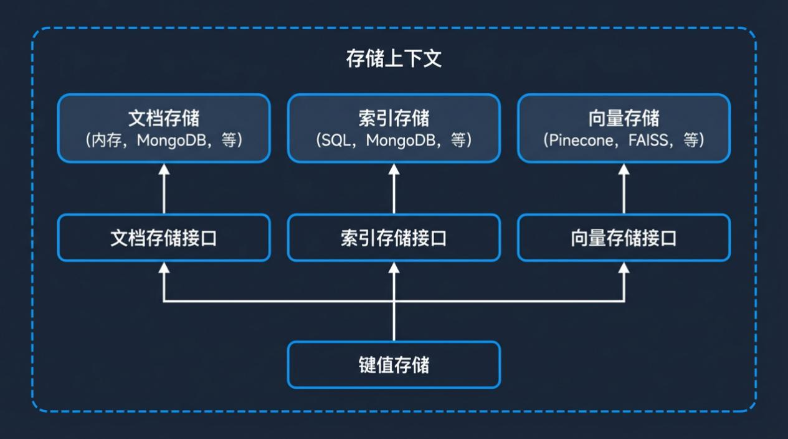
这个过程由查询引擎 （Query Engine） 或聊天引擎 （Chat Engine） 负责。
如图 6-4 所示，为LlamaIndex 的存储上下文（Storage Context）架构，展示了其如何管
理文档、索引和向量存储。

图 6-4 LlamaIndex的存储上下文架构
LangChain vs LlamaIndex：协作而非竞争
初学者常常会问：我应该用 LangChain 还是 LlamaIndex？事实上，这并非一个非此即
彼的选择。它们虽然有重叠之处，但核心焦点不同，并且经常被结合使用以发挥各自最大的
优势。
LlamaIndex 专注于RAG 系统的数据摄取和检索，而LangChain 专注于工作流编排、智
能体和工具使用。在实践中，它们经常一起使用来构建更强大的 AI 应用。 —— Hyscaler
Insights
表 6-3 清晰地对比了两者的差异与协同关系：
表 6-3 LangChain 与 LlamaIndex 的差异
对比维度 LangChain LlamaIndex
核心定位 通用的LLM应用编排框架 专注于RAG的数据框架
核心优势 构建复杂的、多步骤的、涉及多种工具的智能 高效地摄取、索引和检索大量异构数据，提供高

对比维度 LangChain LlamaIndex
体和工作流 质量的RAG能力
抽象层次 更高，更通用，提供了广泛的组件和集成 更专注于数据处理流程，提供了精细化的数据索
引和检索优化
典型场景 需要复杂逻辑和外部工具交互的应用，如自动
化任务的智能体
需要与大量私有文档或数据进行问答的应用，如
企业知识库
如何协作：在 LangChain 构建的复杂 Agent 中，可以把 LlamaIndex 作为一个强大的工
具来使用。例如，当智能体需要查询私有知识库时，它会调用由 LlamaIndex 构建的高性能
查询引擎来获取信息，然后再进行下一步的决策。
注意：如果你的项目核心是围绕自有数据构建问答或聊天功能，LlamaIndex 通常是更
好的起点，因为它提供了更简单直接的 API 和针对 RAG 的深度优化。如果你需要构建一个
能调用多种 API、执行复杂任务序列的智能体，LangChain（尤其是 LangGraph）则更具优
势。
6.1.3 专攻多智能体：MetaGPT 与 AgentVerse
除了上述两个通用和数据框架外，社区还涌现出 一些专为构建多智能体系统（Multi-
Agent Systems）而设计的框架。这类框架的核心思想不再是单个智能体的单打独斗，而是模
拟一个团队， 让多个拥有不同⻆色和能力的智
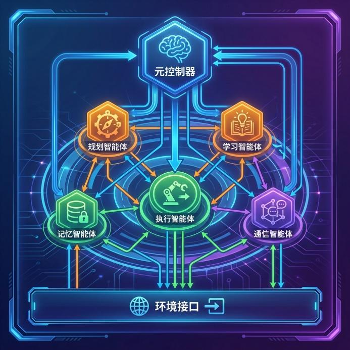
能体协同工作， 以解决单个智能体难以完成的
复杂任务。 MetaGPT 和AgentVers

e 是其中的杰出代表。
MetaGPT：模拟软件公司的协作流程
如图 6-5 所示，MetaGPT 通过为智能体分配不同⻆色（如产品经理、架构师、工程师）
来模拟一个软件公司的运作流程。

图 6-5 MetaGPT的核心工作框架示意

图
MetaGPT 是一个极具创意的多智能体框架，它的核心理念是将人类软件公司的标准化

操作流程（SOPs）编码到LLM Agent 的协作中。它不只是让Agent 们自由对话，而是为它
们分配明确的⻆色，如产品经理、架构师、项目经理、工程师和测试工程师，并要求它们按
照预设的流程和标准，生成结构化的输出（如需求文档、设计图、代码、测试用例）。
根据其原始论文，MetaGPT 的目标是通过模拟一个高效的组织结构，来解决复杂任务
中的逻辑不一致和幻觉问题。 用户只需输入一句简单的需求 （例如， 开发一个贪吃蛇游戏） ，
MetaGPT 就能自动完成需求分析、系统设计、任务分配、代码编写和测试的全过程。
优点：
结构化协作：基于 SOP 的流程确保了输出的质量和一致性，有效减少了 Agent 间的无
效沟通和错误累积。
任务分解能力强：能够将一个模糊的复杂任务，系统性地分解为具体的、可执行的子任
务。
产出完整：不仅生成代码，还产出需求文档、设
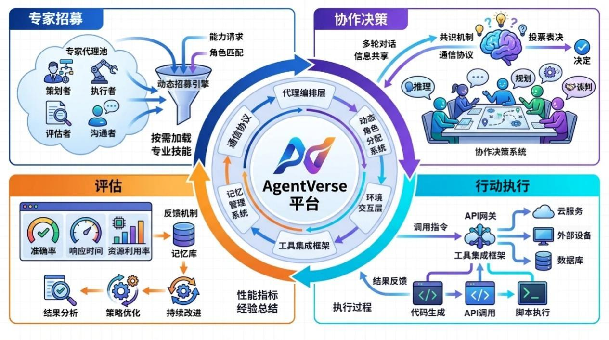
计文档等一系列软件工程产物。
缺点：
灵活性较低：严格的 SOP 流程在提高稳定性的同时，也限制了灵活性，不适合需要高
度创造性或探索性的任务。
缺乏可视化工具：对于非技术用户来说， 缺少无代码或低代码的界面， 上手有一定门槛。
AgentVerse：动态协作与任务仿真
如图 6-6 所示，为 AgentVerse 的四模块架构：通过专家招募、协作决策、行动执行和
评估的循环来动态解决问题。

图 6-6 AgentVerse的四模块架构
AgentVerse 是另一个专注于多智能体协作的框架，但它的思路与MetaGPT 不同。它不
强制固定的组织架构，而是旨在模拟一个动态的、 自适应的群体决策过程。根据其设计理念，
AgentVerse 的核心是一个包含四个阶段的循环（Round）：
专家招募 (Expert Recruitment)： 根据当前任务目标，动态地从一个专家池中选择最合

适的智能体组成临时团队。
协作决策 (Collaborative Decision-Making)：团队成员进行多轮讨论，达成共识，并制定
出下一步的行动计划。
行动执行 (Action Execution)：智能体根据决策分头执行各自的任务。
评估 (Evaluation)：评估行动结果与最终目标的差距，并作为下一轮循环的输入，以决
定是否需要调整团队成员或行动计划。
这种设计使得 AgentVerse 非常适合模拟和研究人类群体解决问题的过程，以及处理那
些需要根据环境变化动态调整策略的复杂任务。
优点：
高度动态和自适应：能够根据任务进展动态调整团队构成和策略，灵活性强。
适合仿真研究：为研究多智能体协作、群体智能和社会行为提供了强大的仿真平台。
缺点：
目标导向性可能较弱：相
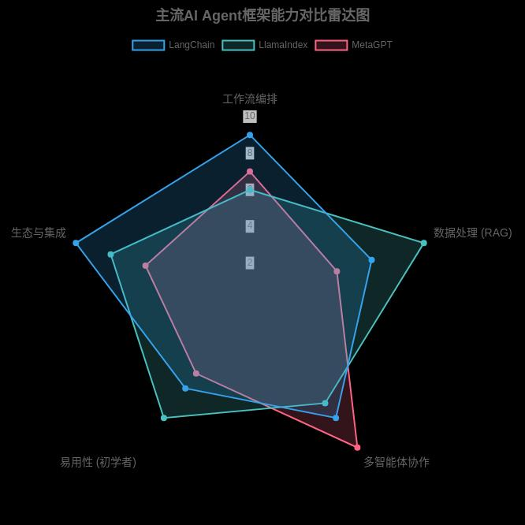
较于MetaGPT 严格的SOP，其开放式的讨论过程可能导致任
务收敛速度较慢或偏离目标。
应用场景相对聚焦：更偏向于任务仿真和协作过程模拟，而非直接的工程化应用开发。
6.1.4 框架能力对比与选型建议
在了解了各个主流框架的特点后，我们通过一个直观的图表来总结它们在不同维度上
的能力侧重，并为你提供在实际项目中如何选择的建议。如图6-7 所示，为主流智能体的
对比雷达图。

图 6-7 主流智能体对比雷达图
选型建议：
如果你想构建一个复杂的、需要调用多种外部工具和API 的自动化工作流或Agent，
LangChain 是你的不二之选。它的通用性和强大的编排能力能满足你的需求。
如果你的核心需求是围绕大量私有文档或数据构建一个高性能的问答系统（RAG），
请优先考虑 LlamaIndex。它为数据处理和检索提供了极致的优化和简洁的API。
如果你想探索如何将一个复杂的工程任务自动化，并希望过程高度结构化、结果可
控，可以尝试 MetaGPT。它独特的SOP 理念在软件开发等领域表现出色。
如果你对群体智能、动态协作或社会行为仿真感兴趣，AgentVerse 将为你提供一个理
想的实验平台。
不要忘记，组合使用是王道！ 在一个复杂的项目中，你完全可以用LangChain 作为
总指挥，调度一个由LlamaIndex 赋能的知识检索Agent，和一个由MetaGPT 模式构建的
代码生成Agent，让它们协同完成任务。
通过本节的学习，我们站在了这些开源巨人的肩膀上，对构建复杂AI Agent 的武器库
有了全面的了解。在接下来的章节中，我们将动手实践，选择合适的框架来打造我们自己
的高级智能助理。
6.2 核心组件与设计模式

开源智能体架构通常由若干核心组件组成，包括规划器、记忆模块和工具管理等。这
些组件各司其职，又通过一定的设计模式协同工作，实现智能体的自主思考与行动。本节
我们将深入解析这些核心组件的功能与实现方式，并探讨常见的设计模式（如 ReAct、
Plan-and-Solve、Self-Reflection 等），帮助读者理解如何构建一个健壮高效的智能体系
统。
6.2.1 规划器（Planner）
规划器是智能体的大脑，负责根据用户目标制定行动方案。简单来说，规划就是智能
体决定先做什么、后做什么的过程，它涉及将复杂目标拆解为一系列可执行的步骤。规划
器通常由大型语言模型（LLM）或专用算法充当，通过推理和决策生成任务计划。例如，
当用户让智能体为本地汽车维修店起草一份商业计划时，规划器会将这一总目标拆解为若
干子任务（如市场调研、竞品分析、财务预算等），并规划执行顺序。
规划能力对智能体至关重要，它使智能体能够未雨绸缪、提前思考最佳行动路径。通
过规划，智能体可以分解复杂任务、预估潜在问题并制定应变策略。这类似于人类在完成
艰巨任务前先制定计划，以避免走弯路。有研究指出，规划是自主智能体最重要的能力之
一，因为它直接决定了智能体能否高效、准确地达成目标。
规划器的实现方式多种多样。早期的经典规划算法（如 A* 搜索、状态空间规划等）
依赖明确的领域知识和状态表示，适用于规则清晰的环境。而如今基于 LLM 的智能体则
更多采用提示规划的方法：通过精心设计提示词，引导 LLM 输出任务的步骤方案。例
如，我们可以让 LLM 扮演项目经理的⻆色，将复杂请求分解成一个个小任务。这种方法
利用了 LLM 的推理和语言生成能力，让模型直接想出计划。此外，也有一些开源框架提
供专用的规划模块，如 LangChain 引入了不同类型的规划代理，包括基于 ReAct 的逐步
推理型和基于 Plan-and-Solve 的两步规划型等。
规划设计模式方面，目前有几种主流范式值得关注：
ReAct 模式（推理-行动模式）：ReAct 是 Reason + Act 的缩写，即让智能体交替进行
推理和行动。在这种模式下，智能体每一步都会先思考下一步该做什么（Reason），然后
执行相应操作（Act），并将操作结果反馈给下一步思考。这是一种逐步探索的规划方
式，适用于需要动态调整的任务。例如，在问答场景中，ReAct 智能体可能先推理我需要
查资料验证这一点，然后调用搜索工具获取信息，再将信息纳入后续推理。ReAct 模式的
优点是灵活，能根据环境反馈不断修正思路，但有时可能因为缺乏全局规划而效率不高。
Plan-and-Solve 模式（先规划后执行模式）：这是一种两步走的策略，先由规划器制
定一个整体计划，再按计划逐步执行。典型实现是在智能体中引入规划器-执行器架构：规
划器负责生成多步计划，执行器则按照计划调用工具完成每一步任务。Plan-and-Solve 类
似于项目管理中的 WBS（工作分解结构），先分解任务再逐个击破。例如，AutoGPT 和
BabyAGI 等早期自治代理就采用了任务列表和循环执行的方式，先由 LLM 列出待办任
务，然后逐项完成并更新任务列表。这种模式的优点是全局观强，减少了盲目试错，可避
免 ReAct 模式中常见的循环和跑题问题。但缺点在于缺乏弹性：如果初始计划有缺陷，

可能导致后续执行全部偏离，需要回溯修改计划。因此，实践中常在执行过程中加入反馈
和重规划机制，让智能体定期检查计划效果并调整（例如 OpenAI 的规划代理在每步执行
后都会决定是否需要重新规划）。
Self-Reflection 模式（自我反思模式）：自我反思是指智能体在行动过程中能够审视
和评估自身的思考与决策，相当于让智能体拥有元认知能力。具体实现通常是在关键节点
插入一个反思步骤：让 LLM 回顾刚刚的推理或行动，找出可能的错误或改进点。例如，
一个具备反思能力的智能体在完成一轮推理后，会自问我刚才的结论合理吗？有没有遗漏
信息？，然后根据反思
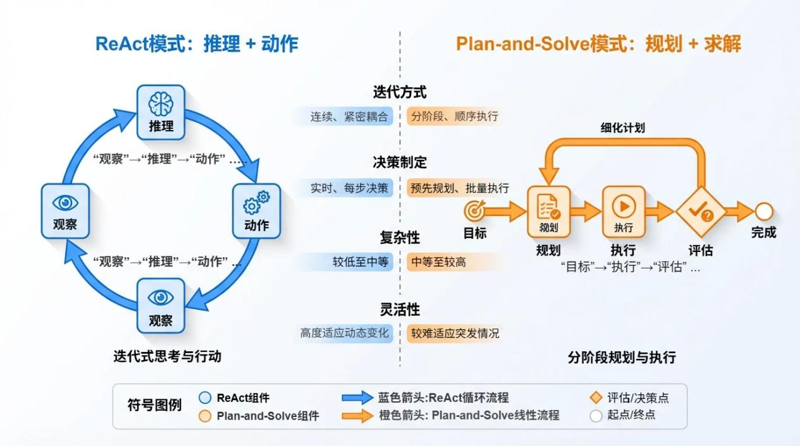
结果调整下一步行动。这种模式借鉴了人类的双重思考系统（丹尼
尔·卡尼曼提出的系统 1 直觉思维 vs 系统2 理性思维）。通过自我反思，智能体可以从
自己的错误中学习，避免重复踩坑，提高任务成功率。值得注意的是，反思并不需要修改
模型权重，而是通过提示工程让模型自己给自己反馈，因此实现成本较低。一些研究将其
称为语言强化学习，即通过语言反馈来强化模型的良好行为。
为了更直观地理解这些模式，图6-8 展示了两种主要的规划架构：ReAct 模式与Plan-
and-Solve 模式的工作流程差异。

图 6-8 智能体ReAct模式与Plan-and-Solve模式的工作流程差异
上述这些规划模式并非彼此排斥，开发者可以根据任务特点组合使用。例如，一个智
能体可以在宏观上采用 Plan-and-Solve 来制定整体方案，在微观步骤上采用 ReAct 来处
理细节，并在关键节点加入 Self-Reflection 来纠偏。总之，规划器的设计需要在全局规划
与局部适应之间取得平衡：既要避免毫无计划的随机探索，也要防止过度僵化的计划导致
无法应对变化。
为了更直观地比较这些模式，我们将其主要特点总结在下表中：
表 6-4 自我反思的工作原理及主要特点
规划模式 工作原理 优点 缺点
Self- 在推理或行动后增加反思步 提高决策质量，能从自身错 增加了计算开销（多一次 LLM

Reflection
（自我反
思）
骤，由智能体自我检查之前的
思考与行 为，找出问题并修
正策略。
误中学习，减少重复失误；
无需额外训练，通过提示即
可实现。
调用）；反思效果依赖提示设
计，不当的反思可能流于形
式。
通过合理运用上述规划模式，开发者可以显着提升智能体解决复杂任务的能力。在实
际开发中，还需考虑任务的性质：如果任务环境动态多变，ReAct 式的灵活探索可能更适
合；如果任务目标明确且步骤可预期，Plan-and-Solve 式的结构化规划会更高效；而在高
可靠性要求的场景下，加入Self-Reflection 能有效降低出错率。
6.2.2 记忆模块（Memory）
智能体的记忆模块相当于它的知识库和经验库，负责存储和管理智能体在运行过程中
获得的信息。正如人类需要记忆来累积知识、保持对话连贯一样，AI 智能体也需要记忆
来实现上下文感知和持续学习。没有记忆模块的智能体，每次与用户交互都是从零开始，
无法记住之前聊过的内容或做过的事，这会极大限制其能力。相反，引入记忆后，智能体
可以在不同对话或任务之间保持状态，从而表现得更连贯、更个性化。
记忆模块的功能可以分为短期记忆和长期记忆两大类，它们在智能体运行中发挥着不
同的作用，具体对比如下：
短期记忆（工作记忆）：短期记忆保存智能体当前会话或任务中的上下文信息，例如
最近的对话内容、刚获取的事实、临时计算结果等。它类似于计算机的 RAM，容量有限
但读写快速，用于支持实时决策。在对话智能体中，短期记忆通常就是对话历史，LLM
需要这些近期对话来理解用户最新提问的含义。然而，由于 LLM 上下文窗口大小有限，
短期记忆必须动态更新：保留最重要的近期信息，丢弃次要内容，以免超出模型输入长度
限制。很多开源框架（如 LangChain）提供了短期记忆组件（如 Conversation Buffer
Memory），会自动将最近的几轮对话注入给模型，从而实现上下文连贯的对话。
长期记忆：长期记忆用于持久化存储智能体获取的知识和经验，使其能够跨会话、跨
任务地利用过去学到的信息。长期记忆容量大且持久，相当于智能体的知识库或外脑。它
可以存储用户的偏好、历史交互记录、领域知识、任务结果等等，让智能体随着时间推移
变得越来越聪明。例如，一个个人助理智能体可以将用户以往的日程安排、邮件内容存入
长期记忆，这样即使隔了几天再询问，它依然能参考过去的记录给出合适的回答。实现长
期记忆的关键是在需要时快速检索相关信息。目前常用的技术是向量数据库（Vector
Database）：将文本信息编码为向量嵌入，然后通过向量相似度搜索，从海量记忆中找出
与当前查询最相关的内容。这种检索增强生成（RAG）技术能够大幅提升智能体回答的准
确性和相关性。除了向量检索外，长期记忆还可以采用知识图谱、关系数据库等多种形
式，具体取决于应用需求。
在实现记忆模块时，有一些设计要点需要注意：
容量管理：无论短期还是长期记忆，都要考虑容量限制。短期记忆受限于 LLM 上下
文长度，需要通过摘要、截断等方式控制长度。长期记忆虽然容量大，但也不能无限制增
长，否则检索效率会下降。因此需要制定遗忘策略，例如定期清理过时的信息，或根据重
要性对记忆进行分级存储。

隐私与安全：如果智能体服务于个人或企业，其记忆中可能包含敏感信息（个人隐
私、商业机密等）。必须对记忆数据采取严格的访问控制和加密措施，确保只有授权的智
能体或用户可以读取特定记忆。此外，根据法规要求，可能需要提供记忆清除功能，让用
户可以删除自己相关的历史记录。
实时性与一致性：对于长期记忆，当新信息加入后，要确保智能体在后续查询中能够
及时获取更新。这涉及到索引更新和缓存策略的问题。如果使用向量数据库，新的嵌入向
量应及时插入索引；如果有缓存机制，要防止使用过期的旧数据。另外，当记忆内容发生
变化时（例如用户修改了某条记录），智能体需要感知这种变化，避免基于过时记忆做出
错误决策。
与规划/工具的联动：记忆模块应方便地与规划器和工具模块交互。例如，规划器在制
定计划时可以查询长期记忆，了解过去类似任务的执行情况以作参考；工具执行的结果
（如查询数据库得到的数据）应存入短期或长期记忆，供后续步骤使用。设计良好的接口
能让智能体各组件高效共享信息。
目前，许多开源项目提供了可复用的记忆模块实现，例如：
LangChain Memory：LangChain 内置了多种记忆类，包括用于短期对话记忆的
Conversation Buffer Memory、用于总结对话的 Conversation Summary Memory，以及将对
话存入向量数据库的 Conversation KG Memory 等。开发者可以根据需要选择合适的记忆
类型，方便地为智能体添加上下文记忆功能。
Chroma / FAISS：这两个都是常用的向量数据库/索引库。Chroma 是专为 LLM 应用
设计的轻量级向量数据库，可用于存储智能体的长期记忆并实现快速相似查询。FAISS 则
是 Facebook 开源的高性能向量相似度搜索库，许多项目（如 LangChain 默认）利用
FAISS 来构建向量索引。通过这些工具，开发者能够轻松实现记忆-检索功能，让智能体
拥有长期记忆能力。
MemGPT 等扩展库：MemGPT 是一个开源项目，旨在为 GPT 等模型添加长期记忆
和自主思考能力。它通过在对话中插入特殊的记忆提示，让模型可以访问和更新外部存储
的记忆信 息。类似的项目还有 LangChain 生态中的 LangMem 等，提供了更高级的记忆
管理策略（如根据对话主题自动检索记忆、定期总结压缩记忆等）。
总之，记忆模块是智能体的大脑缓存和硬盘，为其提供持续学习和上下文理解的基
础。通过合理的架构设计和工具选型，我们可以让智能体记住该记住的信息，并在需要时
迅速调取，从而表现出更加智能、连贯的行为。
6.2.3 工具管理（Tool Management）
智能体的强大之处不仅在于会思考，还在于会动手——通过调用外部工具来完成单一
模型无法胜任的任务。工具管理模块负责为智能体提供可用工具的集合，并管理工具的调
用和结果处理。有了工具，智能体就如同人类配备了各种仪器，能够扩展自身能力边界。
例如，一个智能体本身不会上网搜索，但通过调用搜索引擎工具，它就能获取实时信息；
它也不擅长数学计算，但借助计算器工具就能给出精确的计算结果。可以说，工具是智能

体的四肢，让其能够与外部世界交互、执行具体操作。
工具的类型多种多样，常见的有：
信息检索工具：如网页搜索引擎、数据库查询接口、知识库检索等。这类工具用于获
取智能体不知道的外部信息。例如调用 Google 搜索获取新闻，或查询公司内部数据库获
取客户资料。
计算分析工具：如计算器、统计分析库、代码执行环境等。这类工具用于执行数学运
算、数据分析或代码运行。例如让智能体调用 Python 解释器执行一段代码来处理数据，
或调用统计库计算平均值、绘制图表等。
操作控制工具：如文件系统操作、操作系统命令、硬件接口等。这类工具让智能体能
够影响环境。例如读取/写入文件、发送邮件、控制物联网设备等。通过这些工具，智能体
可以执行自动化任务，如整理文件、发送通知，甚至控制机器人完成物理动作。
专用API 工具：很多互联网服务提供了 API 接口，如天气API、地图API、电商API
等。将这些 API 封装成工具，智能体就能直接利用第三方服务的功能。例如查询天气、规
划路线、下单购物等。
为了让智能体恰当地使用工具，需要有良好的工具管理机制：
工具注册与发现：首先要将可用的工具注册到智能体系统中，通常包括工具的名称、
功能描述、输入输出格式等元数据。这样智能体才能知道有哪些工具可用，以及每个工具
能做什么。一些框架（如 LangChain）允许通过定义工具函数并添加描述，来让 LLM 自
动识别工具。OpenAI 在其函数调用接口中也采用了类似思路，让模型根据函数签名选择
调用哪个函数。工具管理模块需要维护一个工具库，并提供查询接口，以便规划器/智能体
在决策时检索合适的工具。
调用协议与安全：当智能体决定调用某个工具时，工具管理模块需要负责实际执行该
工具，并将结果返回给智能体。这涉及定义调用协议，例如参数如何传递、返回值如何解
析等。对于外部API，还需要处理认证信息（API Key 等）的管理，确保调用合法且安
全。工具管理应实现严格的权限控制：不同工具可能有不同的访问权限，智能体只能调用
被授权的工具，敏感操作（如删除文件、支付）可能需要额外的确认机制，以防止滥用。
错误处理与重试：工具调用难免会出错（网络故障、参数错误、权限不足等）。管理
模块需要捕获这些错误，并采取适当的处理策略。例如，网络超时可以尝试重试，参数错
误则可能需要提示智能体调整输入。有些框架提供了错误回退机制：当工具调用失败时，
将错误信息反馈给智能体，让其自行决定下一步动作（是换一个工具，还是调整参数重新
调用）。这种设计使智能体具备一定的容错能力，不会因为一次工具失败就整个任务崩
溃。
工具组合与编排：复杂任务往往需要多个工具协同工作。工具管理模块可以支持链式
调用或并行调用工具。例如，先调用搜索工具获取数据，再调用分析工具处理数据，最后
调用报告生成工具输出结果。这种工具链可以预先编排成固定流程，也可以由智能体根据
任务动态组合。对于并行执行，需要考虑线程/异步管理，确保多个工具调用不会互相阻
塞，并能将结果汇总。
工具管理的核心流程可以概括为一个典型的感知-思考-行动循环，如下图所示。智能

体通过感知获取信息，由规划器进行推理决策，决定调用合适的工具执行动作，最后将工
具的观察结果反馈回系统，形成闭环。
在开源社区，已经有许多成熟的工具管理实践：
LangChain Tools：LangChain 定义了 Tool 接口，开发者可以很容易地将任意 Python
函数包装成工具，并指定其描述供 LLM 理解。LangChain 内置了一些常用工具（如
Python REPL、Shell 命令执行、Google 搜索等），也支持通过插件集成更多工具。其
Agent 模块会根据工具描述自动决定调用哪个工具，并将工具返回值再交由 LLM 处理，
实现了思考与工具使用的闭环。
OpenAI Function Calling：OpenAI 在其 API 中引入了函数调用功能，允许开发者定
义函数签名，模型可以在回答时选择调用某个函数并填入参数。这实际上是一种让 LLM
输出结构化操作的机制，可以看作是工具调用的标准化接口。Anthropic 等其他模型提供
商也提供了类似的工具使用接口。利用这些接口，开发者能够将自定义工具的参数规范告
诉模型，让模型直接生成调用指令，然后由系统执行该指令。
Auto-GPT 插件生态：Auto-GPT 项目带动了一系列插件的开发，这些插件为智能体
提供了丰富的工具集成，如邮件收发、网页浏览、数据库操作、Office 文档处理等。通过
插件机制，开发者可以方便地为智能体添加新工具，而无需修改其核心代码。这体现了模
块化思想：工具管理模块作为核心，负责调度，而具体工具功能由插件实现，方便扩展和
维护。
最后需要强调，工具的使用应当适度且可控。智能体调用工具虽然增强了能力，但也
带来了潜在⻛险（如调用错误工具、执行危险操作等）。因此在设计工具管理模块时，要
设定安全边界和使用策略。例如，限制单次任务中工具调用的次数上限，防止无限循环调
用；对敏感工具要求人工确认；记录所有工具调用日志以便审计等等。通过完善的工具管
理，我们可以让智能体既大胆又谨慎地使用工具，真正成为我们的得力助手。
本节小结：规划器、记忆模块和工具管理是开源智能体架构中相辅相成的三大核心组
件。规划器赋予智能体目标导向的决策能力，记忆模块提供持续学习和上下文感知的基
础，工具管理扩展了智能体与外部世界交互的手段。通过 ReAct、Plan-and-Solve、Self-
Reflection 等设计模式的运用，这三大组件有机结合，使智能体能够在复杂任务中自主思
考、自主行动。在下一节中，我们将通过几个典型的开源智能体项目案例，看看这些核心
组件是如何具体实现并协同工作的。
6.3 基于开源框架的实战案例
理论是行动的指南针，而实战则是检验真理的唯一标准。在深入探讨了智能体的底层
逻辑与架构设计后，本节将带你站在巨人的肩膀上，利用当前最主流的开源框架，亲手打
造功能强大的AI 智能助理。我们将通过三个循序渐进的案例，分别聚焦于问答、文档处
理和复杂任务协作，让你直观感受从零到一构建高级AI 应用的完整过程。

开源社区的繁荣为智能体的开发提供了前所未有的便利。以LangChain 和LlamaIndex
为代表的框架，通过模块化的组件和标准化的接口，极大地降低了开发门槛。它们如同乐
高积木，让开发者可以专注于认知架构的设计，而非重复造轮子。接下来，让我们卷起袖
子，开始实战。
6.3.1 基于 LangChain 构建智能问答助手
智能问答是智能体最核心的应用之一。我们将构建一个基于检索增强生成（Retrieval-
Augmented Generation, RAG）技术的问
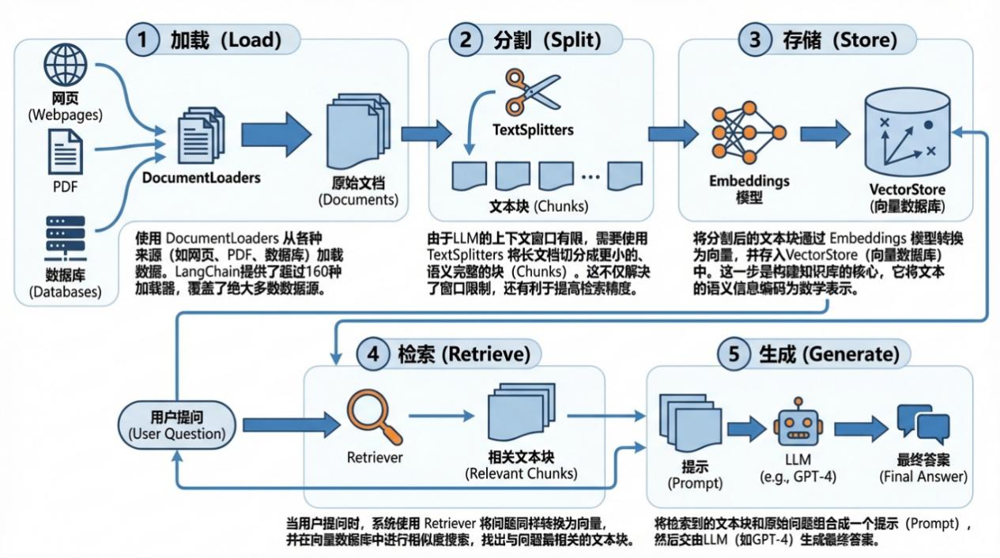
答助手。RAG 的核心思想是：当用户提问时，系统
首先从外部知识库中检索相关信息，然后将这些信息连同问题一起交给大语言模型
（LLM），让其生成更精准、更具事实依据的回答。
RAG 的核心工作流
一个典型的RAG 应用包含两个主要阶段：索引（Indexing）和检索与生成（Retrieval
and Generation）。LangChain 为这两个阶段的每一步都提供了丰富的组件。如图6-9 所
示，为RAG 的核心流程示意。

图 6-9 RAG核心流程示意

① 加载 (Load): 使用 DocumentLoaders 从各种来源（如网页、PDF、数据库）加载
数据。LangChain 提供了超过160 种加载器，覆盖了绝大多数数据源。
② 分割 (Split): 由于LLM 的上下文窗口有限，需要使用 TextSplitters 将长文档切
分成更小的、语义完整的块（Chunks）。这不仅解决了窗口限制，还有利于提高检索精
度。
③ 存储 (Store): 将分割后的文本块通过 Embeddings 模型转换为向量，并存入
VectorStore（向量数据库）中。这一步是构建知识库的核心，它将文本的语义信息编码为
数学表示。

④ 检索 (Retrieve): 当用户提问时，系统使用 Retriever 将问题同样转换为向量，并
在向量数据库中进行相似度搜索，找出与问题最相关的文本块。
⑤ 生成 (Generate): 将检索到的文本块和原始问题组合成一个提示（Prompt），然
后交由LLM（如GPT-4）生成最终答案。
LangChain 的⻆色：编排与粘合
LangChain 的真正威力在于其作为认知架构的编排能力。通过LangChain 表达式语言
（LCEL），开发者可以用一种声明式、链式的方式将上述组件优雅地组合在一起。LCEL
使用管道符 | 连接各个处理步骤，代码直观且易于维护。
# LCEL 示例代码结构
prompt = hub.pull("rlm/rag-prompt")
llm = ChatOpenAI(model_name="gpt-4", temperature=0)
retriever = vector_store.as_retriever()
rag_chain = (
{"context": retriever, "question": RunnablePassthrough()}
| prompt
| llm
| StrOutputParser()
)
# 调用链 rag_chain.invoke("What is Task Decomposition?")
LCEL 不仅简化了代码，还带来了诸多好处，如自动的并行执行优化、异步支持和无
缝的流式输出，这些对于构建生产级应用至关重要。
注意： 构建高质量RAG系统的关键在于检索质量。 如果检索出的内容不相关或不准确，
即使最强大的 LLM 也无法生成正确的答案（垃圾进，垃圾出）。因此，在文档分割策略、
Embedding模型选择和检索算法调优上投入精力，往往能获得最高的回报。
6.3.2 利用 LlamaIndex 实现文档智能检索与摘要
如果说LangChain 是一个通用的LLM 应用开发框架，那么LlamaIndex 则是一个专注
于数据的框架，旨在帮助你将私有或领域特定的数据与LLM 连接起来。它在数据索引和
检索方面提供了更为精细和强大的功能，是构建复杂RAG 系统的利器。
LlamaIndex 的核心：强大的索引能力
LlamaIndex 的核心优势在于其多样化的索引结构。不同于单一的向量索引，
LlamaIndex 提供了多种索引类型以适应不同的查询场景，让开发者可以根据数据和任务特
性选择最优方案。如表6-5 所示，列出了LlamaIndex 的主要索引类型对比。
表 6-5 LlamaIndex 主要索引类型对比
索引类型 工作原理 最佳应用场景 优势
TreeIndex 将信息组织成树状结构，父
节点是子节点的摘要。查询
时从根节点向下遍历。
需要从全局到细节探索信
息的场景，如教材问答。
能够提供不同层次的答案，
并保持上下文连贯性。
KeywordTableIndex 从每个文档中提取关键词，
构建关键词到文档的映射。
基于特定术语或关键词的
精确查找。
查询速度快，结果精确，适
合术语密集的领域。

实战：构建文档摘要应用
利用LlamaIndex 构建一个文档摘要应用非常简单。例如，要对一篇长篇报告进行摘
要，我们可以使用 SummaryIndex。
from llama_index.core import SimpleDirectoryReader, SummaryIndex
from llama_index.core.node_parser import SentenceSplitter
# 1. 加载文档
documents = SimpleDirectoryReader("your_data_directory").load_data()
# 2. 创建一个分割器
splitter = SentenceSplitter(chunk_size=1024)
# 3. 构建摘要索引
summary_index = SummaryIndex.from_documents(documents, transformations=[splitter])
# 4. 创建查询引擎并提问
query_engine = summary_index.as_query_engine(response_mode="tree_summarize")
summary = query_engine.query("Summarize the key points of the document.")
print(summary)
在这个例子中，response_mode="tree_summarize" 指示查询引擎使用一种高效的摘要
策略：首先对每个文本块进行摘要，然后递归地对这些摘要进行汇总，最终形成一个高质
量的全局摘要。这种方法比简单地将所有文本块塞给LLM 效果更好，成本也更低。
LangChain 与 LlamaIndex 的协同
LangChain 和 LlamaIndex 并非竞争关系，而是互补的。一个常见的强大模式是：使用
LlamaIndex 构建高效的检索引擎，然后将其作为工具（Tool）集成到LangChain 智能体
中。这样，智能体就可以利用LlamaIndex 强大的数据处理能力来完成更复杂的任务。
通过结合LangChain 灵活的工作流能力和LlamaIndex 高效的数据检索，你可以构建出
利用两者优势的复杂应用。 — Combining LangChain and LlamaIndex: A Practical Guide
6.3.3 多智能体协作完成复杂任务
当任务的复杂度超出单个智能体的处理能力时，多智能体系统（Multi-Agent Systems,
MAS）便应运而生。其核心思想是将一个宏大、复杂的问题分解成多个更小、更专注的子
任务，并分配给不同的、具有特定技能的智能体去执行，最终通过协作完成总目标。
为什么需要多智能体？
从单一智能体到多智能体的转变，是实现更高级别人工智能的关键一步。其优势显而
易见：
分而治之: 复杂任务被分解，降低了单个
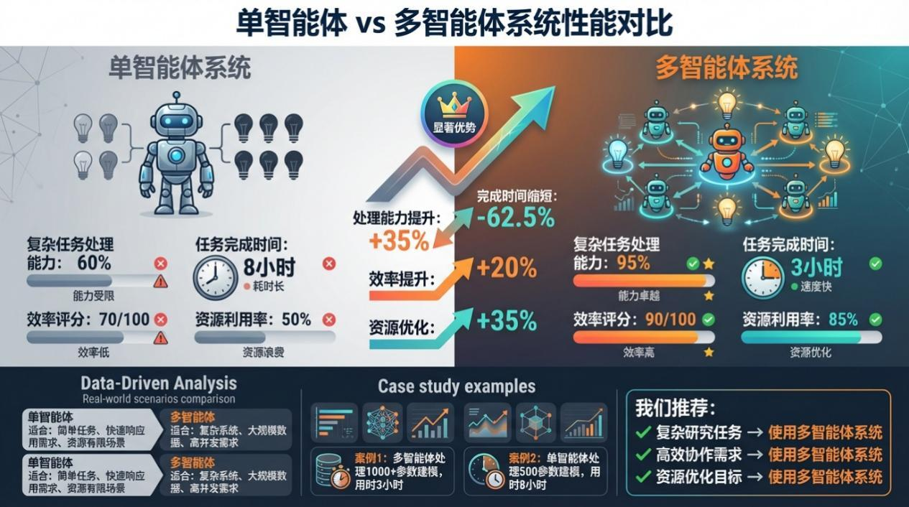
智能体的认知负担，使其能更专注于特定领
域，从而提高成功率。
并行处理: 多个智能体可以同时执行独立的子任务，大幅提升了任务完成的效率。
扩展性与模块化: 可以方便地增加或替换具有新技能的智能体，使整个系统更具灵活
性和可维护性。
突破上下文限制: 每个智能体拥有独立的上下文窗口，系统整体处理信息的能力远超
单个LLM 的限制。

Anthropic 的研究表明，在处理复杂的广度优先查询时，其多智能体研究系统性能比最
强的单智能体系统高出90.2%。这证明了多智能体架构在解决复杂问题上的巨大潜力。如
图6-10 所示，清晰的展示了多智能体相比单智能体的优势。

图 6-10：单智能体与多智能体在复杂研究任务上的性能对比
主流架构：主管-工作者模式 (Supervisor-Worker)
在众多多智能体设计模式中，主管-工作者（或称编排者-工作者）模式最为常见和实
用。该模式下，有一个中心主管智能体，负责接收用户请求、分解任务、将子任务分配给
专门的工作者智能体，并监督整个流程，最终汇总结果。
实战框架：LangGraph
对于构建需要循环、分支和状态管理的多智能体系统，传统的链式结构（如LCEL）
显得力不从心。为此，LangChain 团队推出了 LangGraph，一个专门用于构建有状态、多
⻆色应用的库。
LangGraph 将工作流建模为一个图（Graph），其中：
节点（Nodes）: 代表一个智能体或一个工具。每个节点都是一个可执行的计算单元。
边（Edges）: 代表节点之间的转换逻辑。它决定了在当前节点完成后，接下来应该执
行哪个节点。
状态（State）: 一个在图的执行过程中不断被更新的共享对象，充当了智能体之间通
信的黑板。
使用LangGraph，开发者可以清晰地定义智能体之间的协作逻辑，例如，主管智能体
可以根据当前状态决定是调用某个工作者智能体，还是结束任务并生成报告。这种基于图
的编排方式，为实现复杂的多智能体工作流提供了极大的灵活性和控制力。
注意：多智能体系统虽然强大，但也带来了新的挑战：协调复杂性和成本。智能体之间
的通信、任务分配和结果同步需要精心设计，否则可能导致混乱或重复工作。此外，多个智
能体并行运行会消耗大量LLM tokens，据 Anthropic统计，多智能体系统消耗的tokens可

能是普通聊天的15倍。因此，只有在高价值、确实需要分工协作的复杂任务上，采用多智
能体架构才最具性价比。
通过本节的三个实战案例，我们从单体智能应用逐步走向了复杂的协作系统。无论是
基于 LangChain 的快速RAG 搭建，还是利用LlamaIndex 进行深
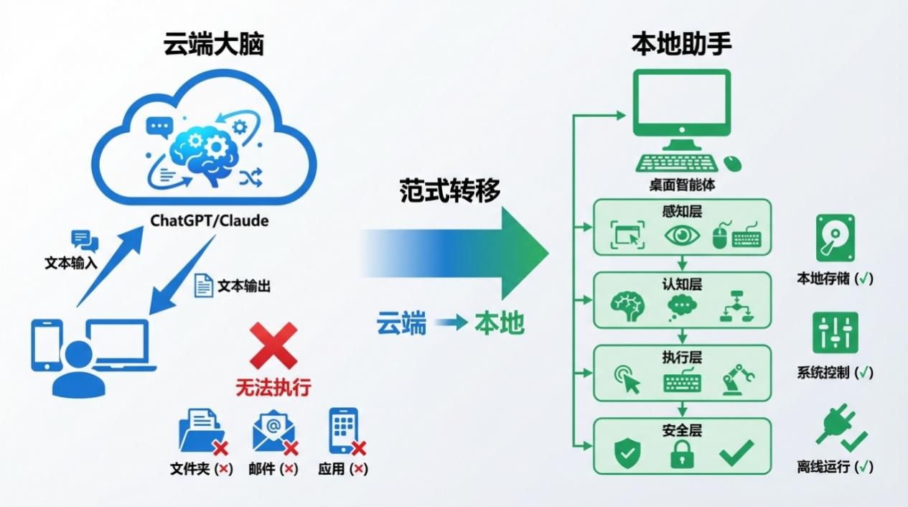
度文档处理，亦或是通过

LangGraph 编排多智能体大军，你都已掌握了利用顶级开源框架构建高级AI 智能体的核心
方法。
6.4 新一代桌面智能体：AI 的下一站
如果说前面章节介绍的LangChain、LlamaIndex 等框架是AI Agent 的中枢神经系统，
那么新一代桌面智能体则是AI 的四肢——它们让AI 真正具备了操控电脑、完成任务的能
力。2026 年，这一领域迎来了爆发式增长，OpenClaw、Claude Cowork 等产品的出现，标
志着AI Agent 从对话走向执行的关键转折。
6.4.1 桌面智能体：概念、技术与市场格局
如图 6-11，展示了智能体从云端大脑到本地助手的范式转移。

图 6-11 云端大脑到本地助手范式转移示意

传统的AI 助手（如ChatGPT、Claude）本质上是一个"云端大脑"——用户通过对话框
输入文字，大脑在云端处理后返回文字回答。这种模式有一个根本局限：AI 只能想，不能

做。它无法帮你打开文件、发送邮件、填报表格，或者操作任何桌面应用程序。
桌面智能体的出现改变了这一切。它们具有以下核心特征：
本地优先（Local-First）：与云端AI 不同，桌面智能体运行在用户自己的电脑上。这
意味着数据不需要上传到云端，保护用户隐私；可以访问本地文件、应用程序和系统资
源；不依赖网络连接即可执行许多任务；用户对自己的数据拥有完全控制权。
系统级权限（System-Level Access）：桌面智能体可以获得对操作系统的深度访问权
限，包括控制鼠标和键盘输入、读取和修改文件系统、调用操作系统API、与第三方应用
程序交互等。
持续运行（Always-On）：桌面智能体可以全天候运行在后台，随时监听用户指令，
主动执行预定任务，持续记住用户的偏好和习惯。
桌面智能体的技术架构
一个典型的桌面智能体通常包含以下四个核心层次：
感知层（Perception）：这是智能体的眼睛和耳朵。它通过屏幕截图获取当前桌面状
态，利用图像识别技术理解界面元素，监听鼠标和键盘事件以捕捉用户操作，监控系统资
源使用情况，以及读取文件系统了解可用资源。
认知层（Cognition）：这是智能体的大脑。它负责理解用户指令的真正意图，将复杂
任务分解为可执行的步骤，在多轮交互中维护上下文记忆，进行逻辑推理和决策规划，并
理解桌面应用界面的语义。
执行层（Execution）：这是智能体的“双手”。它能够模拟鼠标操作（点击、拖拽、
滚动）、模拟键盘输入（文字、快捷键）、调用系统API 实现复杂操作、与各种应用程序
通过API 交互，以及执行自动化脚本。
安全层（Security）：这是智能体的防护服。它实现了最小权限原则（默认只拥有完成
任务所需的最小权限）、用户确认机制（敏感操作需要用户明确同意）、完整的操作日志
记录以支持回溯和审计、沙盒隔离机制以限制潜在危害，以及异常行为检测系统。
2026 年市场格局：群雄并起
2026 年初，桌面智能体市场呈现出多极竞争的格局：
国际市场的两大阵营：
一方面是以OpenClaw 为代表的深度权限派——给予AI 系统级权限，实现最大程度的
自动化；另一方面是以Claude Cowork 为代表的安全优先派——在安全边界内运行，强调
可控性和企业友好。
国内市场同样热闹非凡：
阿里推出QoderWork，深度集成钉钉和企业微信；阶跃星辰发布桌面伙伴，强调多模
态交互；Minimax 推出Agent 2.0；昆仑天工发布Skywork 桌面版。这些产品在功能上与
OpenClaw、Cowork 类似，但在本地化、企业集成方面做了更多优化。如表6-6 所示，为
主流桌面智能体的特点对比。
表 6-6 桌面智能体对比
厂商/产品 定位 核心优势 目标用户
OpenClaw 深度自动化 系统级权限、创造性解决问题 开发者、技术爱好者
Claude Cowork 安全办公 安全沙盒、企业级控制 企业用户

厂商/产品 定位 核心优势 目标用户
阿里 QoderWork 办公生态 钉钉/企业微信集成 中国企业
阶跃星辰 多模态交互 图像、语音综合理解 消费级用户
6.4.2 OpenClaw：重新定义 AI 与电脑的交互方式
传奇创始人与爆火历程
OpenClaw（原名Clawdbot、Moltbot）由奥地利开发者Peter Steinberger 创建。2025 年
底，这个项目在GitHub 上突然爆火，一夜之间获得了超过16 万颗星，成为开源社区最受
关注的AI Agent 项目之一。
Peter Steinberger 的背景颇为传奇：他早在2011 年就创立了PSPDFKit——一款知名的
PDF 处理工具，并在2021 年成功退出，获得约1 亿欧元。财务自由后的他一度陷入空
虚，打高尔夫、搬到异国居住、甚至尝试了死藤水来寻找人生意义，但这些都无法填补内
心的空虚。直到2025 年重新拾起代码，创立了OpenClaw，他才找到了"灵魂的火花"。
2026 年 2 月，OpenClaw 的发展潜力得到了业界认可：OpenAI CEO Sam Altman 宣布
聘请Peter Steinberger 加入OpenAI，主导个人代理（Personal Agents）团队的研发。Altman
称其为具备卓越远见的天才，并预言其开发的智能体协作技术将很快成为OpenAI 产品的
核心。这被视为OpenAI 面对Google 与Anthropic 竞争下的战略反攻。
创造性问题解决：OpenClaw 的核心竞争力
OpenClaw 最令人惊叹的特点是其创造性解决问题的能力，这是它与传统自动化工具
的根本区别。
Peter 分享过一个典型案例：有一次他给Bot 发送了一条语音消息，但电脑上并没有安
装Whisper 语音转文字模型。如果是传统程序，此时就会报错崩溃。但OpenClaw 做了什
么？它没有选择下载巨大的模型（因为知道太慢），而是自主编写了一段curl 指令，调用
OpenAI 的API 来转录语音，然后在9 秒内完成了任务——整个过程没有任何人类预先写
好的脚本。
这种能力的本质是：AI 不仅能执行预设的流程，更能根据实际情况自主思考、创造性
地解决问题。当预设路径走不通时，它会自己找到替代方案；当遇到新问题时，它能综合
运用已有工具创造性地应对。
本地优先与隐私保护
OpenClaw 坚持本地优先的设计哲学，这与当前主流AI 厂商的云端优先策略形成了鲜
明对比。
Peter 认为，目前的AI 巨头（OpenAI、Anthropic）都在建立一个中心化的神级智慧，
并将用户的数据和记忆锁定在他们的服务器里。这带来了隐私风险——你的每一次对话、
每一个偏好都被存储在云端，供AI 公司分析和利用。
OpenClaw 的答案是：让AI 运行在你的电脑上。这样数据不会上传到云端，你可以完
全控制自己的数据；AI 可以访问本地文件为你服务；即使离线也能执行许多任务。Peter
在Y Combinator 的专访中预测：80%的应用程序将会彻底消失。在他看来，真正的AI 革
命将发生在你的本地电脑上，而非云端。表6-7 列出了传统自动化工具与OpenClaw 的主

要维度对比。
表6-7 传统自动化工具与OpenClaw 的对比
维度 传统自动化（RPA） OpenClaw
编程方式 预设流程 自然语言描述
适应能力 固定流程 动态调整
错误处理 预设规则 自主创造性解决
学习能力 无 可累积经验
权限深度 应用层 系统层
6.4.3 Claude Cowork：安全可控的桌面 AI 伙伴
Anthropic 的桌面智能体战略
Claude Cowork 是Anthropic 推出的桌面AI Agent。与OpenClaw 的深度权限不同，
Cowork 更强调安全边界内的办公自动化。
用通俗的话说：OpenClaw 是能够深度访问你电脑的超级助手，而Cowork 更像是一个
在安全边界内调用的桌面文员。
Cowork 的核心功能包括：文件整理与分类（自动整理桌面、归类文档）、数据处理
与表格操作（Excel 数据分析、报表生成）、文档生成与编辑（会议纪要、项目文档）、
会议记录与摘要（语音转文字、要点提取）、邮件草稿撰写（根据上下文生成邮件）。
安全沙盒机制：Cowork 的核心贡献
Cowork 的一个重要贡献是其安全沙盒设计。Anthropic 在AI 安全领域的深厚积累被融
入到这一产品中：
权限分级系统：Cowork 将操作权限分为多个级别——基础权限（文件读取、简单操
作）允许常规办公任务；中级权限（文件写入、邮件发送）需要用户确认；高级权限（系
统设置、敏感操作）需要显式授权。
沙盒隔离机制：每个任务在隔离的沙盒环境中执行，限制对系统其他部分的访问；操
作完成后自动清理临时文件；即使出现异常也不会影响主系统。
可配置的能力边界：用户可以定义Cowork 能做什么、不能做什么；可以设置敏感词
和禁止操作；支持白名单和黑名单机制。
完整的审计日志：所有操作都被记录在日志中；支持回溯和审查；用户可以查看AI
做了什么、什么时候做的。
企业级应用场景
Cowork 的设计定位使其特别适合企业环境：
合规要求严格的行业：金融、医疗、法律等行业对数据安全有严格要求，Cowork 的
本地化部署和完整审计功能可以满足这些需求。
需要控制AI 权限的企业：许多企业希望利用AI 提升效率，但担心给予AI 过多权限
会带来风险，Cowork 的可控权限系统提供了平衡。
需要多人协作的团队：企业环境中通常需要多个AI 助手协作工作，Cowork 提供了这
方面的支持。

6.4.4 应用场景与未来挑战
当前主要应用场景
个人效率场景涵盖多个领域。自动化办公包括自动整理桌面文件、定时执行数据备
份、邮件自动分类与回复草稿、日程管理与提醒等。创意工作方面，AI 可以辅助收集设计
素材、整理创作灵感、进行多平台内容分发。编程辅助则包括代码审查与优化建议、文档
自动生成、测试用例编写、Bug 修复辅助等。
企业应用场景同样广泛。业务流程自动化涵盖财务报表处理、订单管理与跟进、客户
数据维护、库存管理监控等。IT 运维自动化包括服务器监控与告警处理、日志分析、备份
与恢复操作等。
开发者场景是当前桌面智能体最活跃的领域。开发者可以让AI 辅助进行代码审查、
生成测试用例、理解大型代码库、自动编写文档等。
当前面临的挑战
安全风险是首要问题。赋予AI 系统级权限带来潜在风险，权限滥用可能导致数据泄
露或系统破坏；恶意指令注入可能让AI 执行有害操作；需要建立更完善的防护机制。
可靠性方面，桌面环境复杂多变，不同应用、不同时刻的状态都可能不同，AI 的可靠
性仍有提升空间；边缘情况的处理需要不断完善。
用户体验也是挑战。如何让非技术用户轻松使用桌面智能体、如何设计直观的任务描
述方式、如何处理任务执行中的不确定性，都需要进一步探索。
法律合规方面，Agent 代表用户执行操作的法律责任界定尚不清晰；AI 生成内容的版
权问题；数据隐私的合规要求等，都需要随着技术发展逐步明确。
未来展望
短期预测（2026 年）：桌面智能体将成为个人电脑的标配功能；80%的传统App 可能
被智能体替代一部分功能；智能体操作系统概念将开始兴起。
长期愿景：实现真正的数字劳动力，AI 可以独立完成许多重复性工作；人机协作模式
常态化，人类负责决策、AI 负责执行；AI Agent 生态系统完善，形成类似App Store 的技
能市场。
新一代桌面智能体代表了AI Agent 发展的重要方向——从能说会道到能说会做。
OpenClaw、Claude Cowork 等产品正在重新定义人与电脑的交互方式。对于开发者而言，
理解这一趋势并掌握相关技术，将是在AI 时代保持竞争力的关键。
6.5 主流 AI 智能体平台综述
在 AI 智能体快速发展今天，各类平台和工具层出不穷。本节将重点介绍几个目前主
流的AI 智能体平台，帮助读者了解行业现状并选择适合自己的工具。

6.5.1 Coze：字节的智能体开发平台
Coze 是字节跳动推出的AI 智能体开发平台，旨在帮助开发者快速构建和部署智能体
应用。Coze 是一个综合性的开发平台，如图6-12 为 Coze 的界面截图。

图 6-12 Coze 界面截图
其主要特点包括：
丰富的插件生态：Coze 提供了大量预置插件，支持连接各种外部服务和API，方便智
能体与外部系统进行交互。
可视化工作流：提供图形化的工作流设计器，用户可以通过拖拽方式编排智能体的行
为逻辑，降低了开发门槛。
多模型支持：支持调用多种大语言模型，包括字节自研模型和第三方模型，开发者可
以根据需求灵活选择。
易于部署：一键部署到飞书、抖音等字节系产品，也可以通过API 调用集成到其他应
用场景。
适用场景：企业内部知识库问答、客服机器人、内容创作辅助等。
6.5.2 Claude Code：编程与开发智能体
Claude Code 是Anthropic 公司推出的编程助理工具，专注于企业级开发场景。Claude
Code 是一个命令行工具，主要
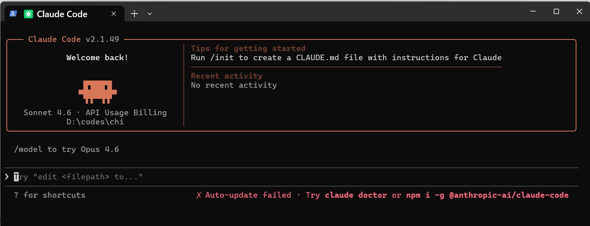
擅长编码，如图6-13 为Claude Code 的界面截图。

图 6-13 Claude Code 界面截图
其核心能力包括：
代码操作能力：可以直接读取、创建和修改文件，执行命令行操作，运行和测试代
码，真正实现了“能读会写”的编程能力。
企业级安全：提供完善的企业级安全措施和权限控制，适合在企业环境中部署使用。
多语言支持：支持主流编程语言，能够理解复杂的代码库并提供精准的修改建议。
智能调试：能够分析代码错误并提供修复方案，支持逐步调试和问题定位。
适用场景：企业级软件开发、代码重构、技术债务清理、自动化测试等。
6.5.3 Cowork：多模态智能助手
Cowork 是Anthropic 推出的多模态大模型助手，将Claude Code 的能力从编程拓展到
了桌面办公，如图6-14 所示，为其操作主界面。

图 6-14 Claude Cowork 主界面
其特点在于强大的多模态理解能力：
多模态输入：支持图片、视频、音频、PDF 等多种格式的输入，能够理解并分析各种
类型的内容。
内容理解：可以准确描述图片内容、分析视频情节、理解音频信息，实现真正的多模
态交互。
上下文保持：具有出色的长上下文处理能力，能够在长对话中保持一致的上下文理
解。
应用广泛：适用于文档分析、数据可视化、内容创作、教育辅导等多种场景。
适用场景：文档分析、内容创作、多媒体处理、教育辅助等。

6.5.4 即梦 AI：视频生成平台
即梦AI 是字节跳动推出的AI 视频生成工具，包含了目前性能最为强大的Seedance
2.0 视频生成模型，如图6-15 所示，为其操作主界面。

图 6-15 即梦 AI 主界面
即梦AI 在视频生成领域具有领先优势：
高质量视频生成：采用先进的扩散模型技术，生成的视频画面清晰、流畅，自然度
高。
智能提示词：支持自然语言描述，用户可以通过简单的文字提示生成复杂的视频内
容。
镜头控制：提供丰富的镜头控制选项，包括推、拉、摇、移等专业运镜手法。
多模态融合：支持图片、视频、文字等多种输入形式的融合创作。

应用场景广：适用于广告创意、短视频创作、影视预演、教育培训等场景。
适用场景：视频广告创意、短视频制作、内容创作、教育培训等。
如果您的目标是快速构建一个智能体应用，推荐使用Coze；如果您需要强大的编程辅
助能力，Claude Code 是更好的选择；如果您需要进行多模态内容分析，Co-work 更加适
合；如果您专注于视频内容创作，即梦AI 则是首选。
在实际项目中，也可以根据需求组合使用多个平台，例如使用Co-work 进行内容分
析，再通过Coze 构建智能体进行自动化处理。
现在，你已经站在了巨人的肩膀上，准备好去创造属于你自己的24 小时智能助理了
吗？
