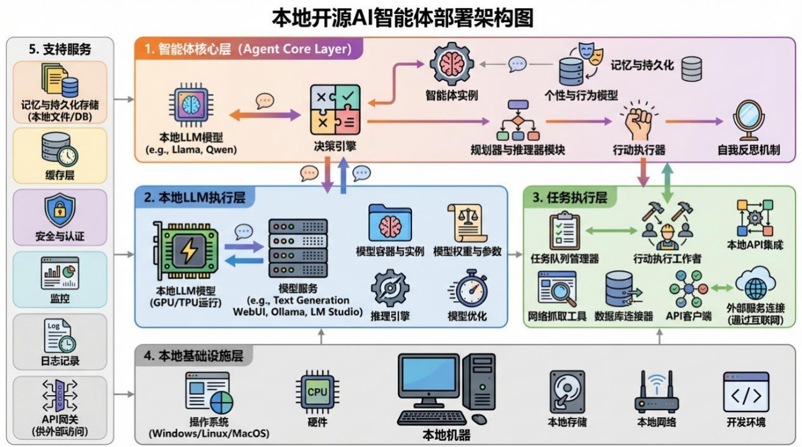
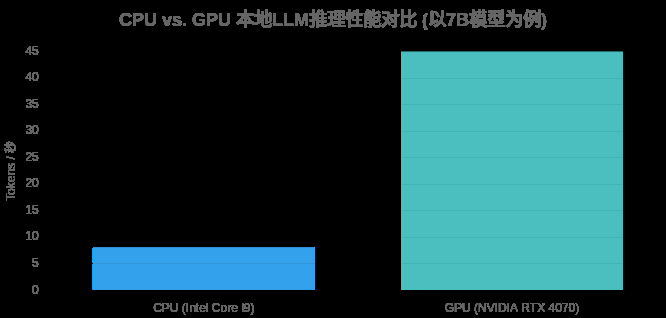
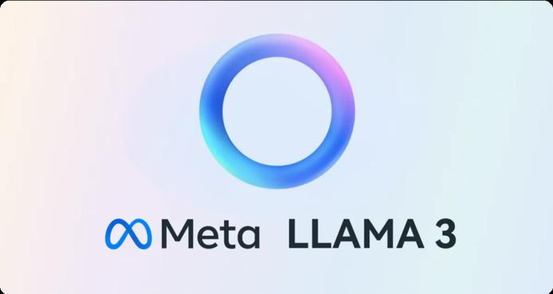
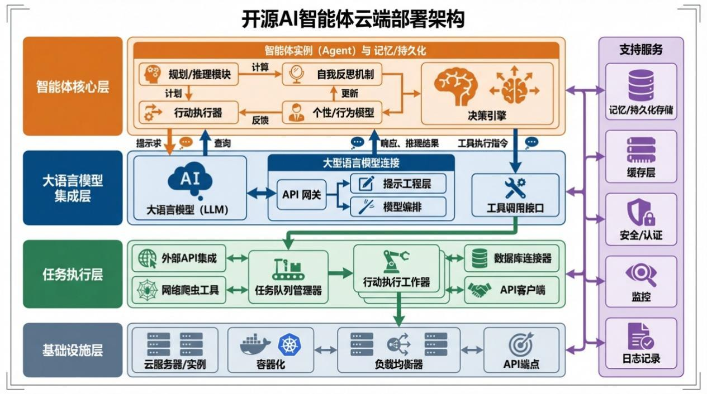
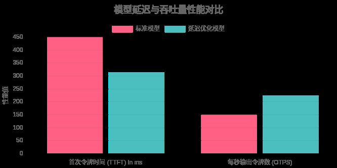
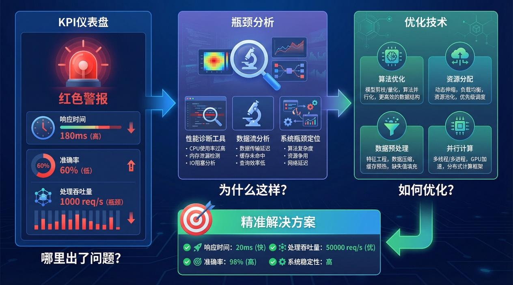

# 第7章 智能体部署与性能优化

第 4 部分 智能体的持续进化

第 7 章：智能体部署与性能优化
欢迎来到我们智能体开发之旅的第四部分。 在前面的章节中， 我们已经成功构建了智能
体的核心逻辑。现在，是时候让它走出实验室，进入真实世界了。本章将聚焦于智能体的部
署、优化与未来展望，确保你的智能助理能够7×24 小时高效、稳定地运行。
部署不仅仅是将代码放到服务器上，它是一门涉及硬件选型、环境隔离、资源调度和性
能优化的综合艺术。一个优秀的部署方案能让你的智能体如虎添翼，而糟糕的部署则可能让
它步履维艰。
7.1 本地化部署方案
随着大语言模型 （LLM） 技术的成熟和开源社区的繁荣， 本地化部署已从一个遥不可及
的梦想变为触手可及的现实。将智能体部署在本地或私有服务器上，意味着你对数据、隐私
和成本拥有了绝对的控制权。 这对于处理敏感信息、 遵守严格的合规要求或寻求极致性能和
低延迟的场景至关重要。
根据 DemoDazzle 的分析，到 2025 年，越来越多的团队正从纯云API 转向本地部署，
以控制成本、降低延迟并保护数据隐私。这不再是“备选方案”，而是一种关乎生存的战略
演进。如图7-1所示

，为本地部署时CPU与 GPU的性能对比。

图 7-1 CPU v

s GPU 本地 LLM 推理性能对比
如图 7-2 所示，为常见开源智能体的本地部署架构图，由图中可见，这种架构的关键在
于本地环境的搭建和服务支持。

图 7-2 智能体云端部署架构
本节将带你深入探索本地化部署的三大核心支柱：硬件选型、 容器化部署和轻量级模型
应用，为你打造一个私有、强大且高效的AI 系统提供全方位的实践指南。
7.1.1 硬件选型与性能调优
硬件是智能体本地化部署的基石，它的性能直接决定了你的智能助理的响应速度和处
理能力。与传统的Web 服务不同，智能体（尤其是基于LLM 的）是计算密集型应用，对硬
件有着特殊的要求。
核心组件选择：GPU 是心脏

对于运行LLM，GPU（图形处理器）的重要性远超CPU（中央处理器）。GPU 的并行
计算架构使其在处理复杂的矩阵运算时效率惊人，这正是LLM 推理的核心。正如 El Bruno
的技术分析 所指出的，在运行LLM 时，GPU 的性能始终优于CPU，尤其是在处理Llama
3 这样的大型模型时。
选择 GPU 时，最重要的指标是显存（VRAM）。你需要足够的显存来加载整个模型。
一个普遍的经验法则是：在预算范围内，选择VRAM 最大的NVIDIA RTX 系列显卡。如图
7-3 所示，为NVIDIA GeForce RTX 5090 ，凭借其GDDR7 显存和强大的核心成为2025 年
本地AI 部署的高端消费级选择。

图 7-3 NVIDIA GeForce RTX 5090
表 7-1 是2026 年值得关注的硬件配置建议：
表 7-1 本地运行大模型配置建议
组件 入门级推荐 性能级推荐 专业/企业级推荐 关键考虑
GPU NVIDIA RTX 4070
(8GB+ VRAM)
NVIDIA RTX 5090
(32GB VRAM)
NVIDIA RTX 6000
Ada Gen / Blackwell
(48GB/96GB VRAM)
VRAM是第一要素，直接
决定能运行多大
的模型。Tensor Cores
对AI加速至关重要。
CPU 16核（如Intel
Core i7/AMD
Ryzen 7)
24核+ (如Intel
Core i9-13980HX)
服务器级CPU (如
Intel Xeon W)
核心数和高主频对数据
预处理和系统响应有
益。
内存
(RAM)
32GB DDR5 64GB DDR5 128GB+ DDR5 经验法则：RAM容量至
少是GPU VRAM的两倍。
存储
(SSD)
1TB NVMe SSD 2TB+ NVMe SS

D 多块NVMe SSD组 RAID 高速NVMe SSD能极大缩
短模型和数据的加载时
间。
如图 7-4 所示，为高性能CPU 如 Intel Core i9 系列，为AI 工作负载提供强大的多核处
理能力。

图 7-4 Intel Core i9 系列 CPU 实物图
性能调优：榨干硬件的每一滴性能
选择了合适的硬件后，软件层面的调优同样关键。模型量化（Quantization）是其中最有
效的技术之一。它通过降低模型参数的精度（例如从32 位浮点数降至 8 位或 4 位整数），
大幅减小模型体积和显存占用， 从而在消费级硬件上运行更大的模型。根据 dev.to 的测试，
一个量化后的7B 模型仅需4-7GB 的VRAM 即可运行，这使得普通笔记本电脑也能成为智
能体的载体。
注意： 硬件投资是一项权衡。对于初学者，不必追求顶级配置。得益于模型量化和轻
量化趋势，一块拥有12GB以上VRAM的 RTX 3060或4060显卡，配合32GB内存，已经足以
流畅运行许多优秀的7B（70 亿参数）模型，是性价比极高的入门选择。
7.1.2 容器化部署
在我的电脑上能跑，这是开发者最头疼的魔咒之 一。智能体的依赖环境复杂，包括
Python 版本、深度学习框架（PyTorch/TensorFlow）、CUDA 驱动等。为了解决环境不一致
带来的部署难题，容器化技术应运而生，而Docker 是其中当之无愧的王者。
容器化就像是为你的智能体应用打造一个集装箱，将模型、 代码和所有依赖项打包在一
起。 这个集装箱可以在任何支持Docker 的机器上以完全相同的方式运行， 实现了一次构建，
到处运行的理想状态。
使用 Docker 封装你的智能体
下面是一个为基于Python 和Flask 的简单智能体创建 Dockerfile 的示例：
```
**1. 使用包含CUDA 支持的官方 Python 镜像作为基础**
```

FROM python:3.10-slim
```
**2. 设置工作目录**
```

WORKDIR /app
```
**3. 复制依赖文件并安装**
```

COPY requirements.txt .
RUN pip install --no-cache-dir -r requirements.txt
```
**4. 复制应用代码到容器中**

```

COPY . .
```
**5. 暴露应用端口**
```

EXPOSE 5000
```
**6. 定义容器启动时执行的命令**
```

CMD ["python", "app.py"]
通过这个 Dockerfile ，你可以使用 docker build -t my-ai-agent . 命令构建一个镜像，然
后通过 docker run -p 5000:5000 --gpus all my-ai-agent 启动你的智能体服务， 并为其分配GPU
资源。
使用 Kubernetes 进行编排与扩展
当你的智能体需要服务更多用户，或者需要更高的可用性时，单个Docker 容器就显得
捉襟见肘了。这时，你需要一个容器编排系统，而Kubernetes（K8s）是业界的事实标准。
Kubernetes 可以帮你实现：
自动扩展：根据CPU 或GPU 使用率自动增加或减少智能体的实例数量。
自我修复：当某个智能体实例崩溃时，Kubernetes 会自动启动一个新的实例来替代它。
负载均衡：将用户请求智能地分发到多个智能体实例，避免单点过载。
滚动更新：无需停机即可平滑地更新你的智能体版本。
正如 Wiz 的分析所言，Kubernetes 为 AI/ML 团队提供了一个与代码一致性和灵活资源
管理理念完美契合的容器化系统，让团队能专注于交付强大的模型，而不是陷入配置的泥
潭。
部署流程演进： 从简单的本地运行， 到使用Docker 实现环境隔离， 再到利用Kubernetes
进行大规模、 高可用的生产级部署， 这是一个清晰且成熟的技术路径。对于企业级自托管AI
应用，这套Docker + Kubernetes 的组合拳几乎是必备的。
7.1.3 轻量级模型部署
模型越大越好的时代正在过去。社区和研究机构正掀起一场小模型革命， 旨在创造出更
小、更快、更高效的语言模型（SLM, Smal

l Language Models）。这些模型虽然参数量远小
于 GPT-4 等巨无霸，但在特定任务上表现出色，且对硬件要求极低，是本地化部署的理想
选择。如图7-5 所示，为Meta 的 Llama 3 系列模型的标志。

图 7-5 Meta 的 Llama 3 系列开源模型标志
Meta 的 Llama 3 系列开源模型，提供了多种参数规模，推动了本地化AI 部署的发展。

选择一个合适的轻量级模型，是在资源有限的本地环境中取得良好效果的关键。表7-2 是一
些备受推崇的开源轻量级大模型汇总。
表7-2 轻量级大模型一览
模型 参数量 特点与优势 最佳应用场景
Mistral 7B 70 亿 性能与效率的完美平衡，在编码和推理任务上常
超越更大的模型。
通用聊天、代码生成、文档摘
要。
Llama 3 8B 80 亿 Meta出品，指令遵循能力强，经过大量
高质量数据训练。
研究、AI驱动的文档工具、知
识检索。
Phi-3 Mini 38 亿 微软推出，体积小巧，推理速度极快，在移动和
边缘设备上表现优异。
物联网应用、离线AI处理、快
速文本分类。
Gemma 3 4B 40 亿 Google的开源力作，在摘要、提取和分类任务中
性能强大。
文档密集型行业的自动化任
务。
便捷的本地运行工具
得益于社区的努力，现在有许多工具可以让你一键启动和管理本地 LLM，无需复杂的
环境配置。
Ollama: 一个极简的本地LLM 运行器。只需一条命令（如 ollama run mistral ），即可
下载并运行模型，同时提供兼容OpenAI 的API 接口，方便与现有应用集成。
LM Studio: 提供图形化界面，让你可以方便地搜索、下载和运行各种开源模型。它支
持Windows、Mac 和Linux，并能轻松在CPU 和GPU 之间切换。
Docker Model Runner：Docker 官方推出的新功能（Beta），旨在简化本地LLM 的拉取
和运行，将模型打包为标准容器工件，进一步提升了可移植性。
使用Ollama 运行 Mistral 模型的简单示例：
```
**1. 安装Ollama (访问 ollama.com)**
**2. 在终端运行 Mistral 模型 ollama run mistral**
**3. ( 在另一个终端) 使用 curl 与模型交互 curl http://localhost:11434/api/generate -d '{ "model":**
```

"mistral",
"prompt": "Why is the sky blue?",
"stream": false
}'
新手入门建议： 从 Ollama + Mistral 7B 开始你的本地智能体之旅。这个组合提供
了极低的入门门槛和出色的性能表现， 能让你快速体验到本地部署的魅力， 并为后续的深入
探索打下坚实基础。
通过精心选择硬件、 拥抱容器化技术并善用高效的轻量级模型， 你完全有能力打造一个
专属于你、永不离线的强大智能体。这不仅是一次技术实践，更是迈向真正拥有和掌控 AI
能力的关键一步。
7.2 云端部署与服务化
在前面的章节中，我们已经成功构建了AI 助手的核心逻辑。现在，是时候让它走出本
地开发环境， 迈向广阔的云端， 成为一个能够7× 24小时稳定运行、 高效服务的智能助理了。
本章将聚焦于AI 助手的最后一公里——部署、 优化与未来展望， 确保你的智能体不仅聪明，

而且强大、经济、可靠。
本地运行的智能体原型就像一辆在车库精心打造的概念车，性能卓越但无法服务大众。
要将其转变为真正的生产力工具， 我们需要进行云端部署与服务化。 这个过程意味着将我们
的AI 应用封装成一个标准化的网络服务，通过API（应用程序接口）对外提供能力，

并借
助云平台的弹性、可靠性和全国覆盖能力，确保其高效运行。
服务化是将智能体从一个程序转变为一个能力中心的关键一步。它使得你的智能体可
以被其他应用、网站甚至物联网设备轻松调用，从而融入更广泛的业务生态系统。
如图 7-6 所示，为常见开源智能体的云端部署架构图，由图中可见，这种架构的基础在
于云平台的选择。

图 7-6 智能体云端部署架构
7.2.1 主流国产云平台部署
将智能体部署到云端，我们通常会选择四大主流国产云服务提供商：阿里云（Alibaba
Cloud） 、 腾讯云 （Tencent Cloud） 、 华为云 （Huawei Cloud） 和百度智能云 （Baidu AI Cloud）。
它们都提供了丰富的工具链来简化AI 应用的部署和管理，尤其是针对大模型驱动的智能体
（Agentic AI）场景。
阿里云：百炼（Bailian）Agent Core——企业级智能体全栈平台
阿里云在生成式AI 领域推出了百炼（Bailian），其定位与AWS Bedrock Agent Core高
度相似，是一个专为 Agentic AI 设计的全托管智能体开发与运行平台。百炼不仅支持通义
千问（Qwen）、ChatGLM、Llama 等主流模型，还提供了一套完整的Agent Core 模块化服
务，用于解决从原型到生产的工程挑战。
核心能力模块（对标 Bedrock AgentCore）：

Bailian Runtime： 提供安全隔离的无服务器环境， 支持LangChain、LlamaIndex、Autogen
等任意框架，延迟<50ms。
Bailian Memory：内置短期会话缓存（Redis）与长期知识库（向量数据库），支持基于
用户ID 的上下文记忆。
Bailian Identity：通过RAM 角色精细控制智能体对OSS、RDS、MaxCompute 等阿里云
服务的访问权限。
Bailian Gateway：可将现有函数（FC）、API 或微服务一键注册为智能体可调用的“工
具”（Tool）。
部署流程（四步法）：
① 编写入口逻辑：定义invoke 函数处理请求；
② 声明依赖环境：通过requirements.txt 指定Python 包；
③ 配置部署描述文件：使用bailian.yaml 定义实例规格、并发数、VPC 等；
④ CLI 一键部署：执行bailian deploy 自动创建镜像、发布端点。
```
**示例：基于百炼 SDK 的 Agent 入口**
```

from bailian.runtime import BailianApp

app = BailianApp()

@app.entrypoint
def invoke(payload):
    user_input = payload.get("prompt")
```
**调用你的 LangChain Agent**
```

    response = your_agent.run(user_input)
    return {"content": response}

if __name__ == "__main__":
    app.run()
百炼自动处理容器构建、GPU 调度、日志采集与弹性扩缩容，开发者无需关心底层基
础设施。
腾讯云：混元大模型平台+SCF Agent Runtime
腾讯云的混元大模型平台提供了类似Vertex AI Agent Builder 的能力，尤其适合微信生
态内的智能体部署。其核心部署载体是云函数（Serverless Cloud Function，SCF），并扩展
出SCF Agent Runtime 抽象层。
部署模式：
托管在线端点：通过混元控制台上传ZIP 包，自动生成HTTPS 端点；
事件驱动函数：将智能体逻辑封装为SCF 函数，由API 网关触发；
容器化部署： 支持将智能体打包为Docker 镜像， 部署至TKE（腾讯云 Kubernetes Engine）。
部署流程：
① 编写main_handler(event, context)函数；
② 在scf.yaml 中声明运行时（Python 3.9）、内存（1GB）、超时（30s）；
③ 使用tencentcloud-cli scf create-function 部署；

④ 绑定API 网关，获得公网URL。
```
**示例：腾讯云 SCF 中的 Agent 逻辑**
```

import json
from your_agent_module import agent

def main_handler(event, context):
    body = json.loads(event["body"])
    user_prompt = body.get("prompt")
    response = agent.run(user_prompt)
    return {
        "statusCode": 200,
        "headers": {"Content-Type": "application/json"},
        "body": json.dumps({"reply": response})
    }
优势：与微信小程序、公众号无缝集成；支持按调用次数计费，无闲置成本。
华为云：盘古大模型平台+FunctionGraph Agent Engine
华为云强调全栈自主可控，其盘古大模型平台结合FunctionGraph（函数工作流服务）
和ModelArts，构建了高安全、高合规的智能体部署体系。
核心组件：
FunctionGraph Agent Engine：全托管无服务器运行环境，支持异步调用、状态保持、工
具编排；
ModelArts Inference：用于部署自研或开源大模型，提供A/B 测试、灰度发布；
CSE（Cloud Service Engine）：微服务治理中心，支持智能体间的服务发现与熔断。
部署流程（YAML 驱动）：
① 编写handler.py，包含init()（加载模型）和handle()（处理请求）；
② 创建functiongraph.yaml，定义触发器、资源规格、VPC 配置；
③ 使用huaweicloud cli fg create-function 部署；
④ 通过APIG（API Gateway）暴露REST 接口。
```
**handler.py**
```

agent = None

def init():
    global agent
    from your_agent import load_agent
    agent = load_agent()  # 加载大模型与工具链

def handle(event, context):
    prompt = event.get("prompt")
    result = agent.run(prompt)
    return {"output": result}
适用场景：政务、金融、能源等对数据不出境、等保三级有强制要求的行业。
百度智能云：文心大模型平台+Agent Builder
百度智能云推出文心大模型平台和可视化Agent Builder 工具，支持通过拖拽方式构建

智能体逻辑，并一键部署为Web 服务。
部署选项：
Agent Builder 托管服务：低代码构建，自动部署为HTTPS 端点；
CFC（Cloud Function Compute）：编程序部署，适合复杂逻辑；
BML（Baidu Machine Learning）：支持自定义容器镜像，用于私有模型部署。
特色能力：
① 内置Prompt 安全过滤器，防御提示注入；
② 支持多轮对话状态管理；
③ 与百度搜索、OCR、语音识别等能力原生集成。
表 7-3 是从关键维度对比了四大国产云平台的智能体部署方案。
表7-3 四大国产云平台智能体部署方案对比
维度 阿里云 腾讯云 华为云 百度智能云
专属 Agent
平台 百炼（Bailian） 混元大模型平台 盘古大模型平台 文心大模型平台 +
Agent Builder
核心运行时 Bailian Runtime（无服务
器）
SCF Agent
Runtime
FunctionGraph Agent
Engine
CFC / Agent Builder
托管
记忆管理 Redis + 向量库 SCF 上下文 +
COS DCS（分布式缓存） 内置对话状态机
身份与权限 RAM 角色 + Policy CAM 权限体系 IAM + RBAC 百度云 IAM
工具集成 Bailian Gateway（注册任
意 API）
SCF 触发器 +
API 网关 CSE 服务注册 可视化工具连接器
部署方式 CLI / 控制台 /
Terraform CLI / 控制台 YAML + CLI 低代码 / CLI / 容器
典型场景 电商客服、城市大脑 微信小程序、社
交应用 政企系统、工业 IoT 搜索增强、内容生成
选择建议：若团队已深度使用某家云生态（如钉钉+阿里云、微信+腾讯云），优先选择
对应平台以获得最佳集成体验。
7.2.2 API 网关与负载均衡
当你的智能体部署到云端后，它只是一个孤立的服务实例。为了让它能够安全、可靠、
高效地对外服务，我们需要引入两个关键的网络组件：API 网关（API Gateway）和负载均
衡器（Load Balancer）。
API 网关：AI 助手的“智能前台”
API 网关是所有外部请求访问你后端服务的唯一入口。它不仅是请求转发器，更是 AI
时代的安全中枢。
对 AI Agent 而言，API 网关的核心职责包括：
请求路由：将 /chat、/summarize 等路径路由到对应服务；
认证授权：支持API Key、JWT、OAuth2.0，防止未授权访问；
速率限制：防止恶意刷量，保护昂贵的LLM 调用；
输入校验：防御提示注入（Prompt Injection）等新型攻击；
日志审计：记录所有调用，便于追踪与分析。

表 7-4 列举了国产云平台的API 网关特性的对比。
表 7-4 国产云平台API 网关对比
云平台 主要服务 协议支持 安全特性 集成能力
阿里云 API网关 HTTP/HTTPS/WebSocket WAF、Bot管理、国密SSL 与FC、百炼、SLB深度集成
腾讯云 API网关 HTTP/HTTPS 防重放、IP黑白名单 与SCF、CLB、微信鉴权联动
华为云 APIG HTTP/HTTPS 国密算法、等保三级合规 与FunctionGraph、CSE集成
百度智能云 API网关 HTTP/HTTPS 内置Prompt过滤器 与CFC、文心模型一键绑定
负载均衡：确保 AI 助手永不掉线
负载均衡器将流量分发到多个实例，实现高可用与弹性伸缩。
分类维度（对标 Azure 架构文档）：
按范围分：
区域性负载均衡：如阿里云 SLB（应用型）、腾讯云 CLB，在单地域内分发流量；
全局性负载均衡：如阿里云 GA（全球加速）、腾讯云 GAAP，将用户导向最近接入
点。
按协议层分：
Layer 4（传输层）：基于 IP+端口，如阿里云 NLB，适用于高吞吐 TCP 流量；
Layer 7（应用层）：基于 HTTP 头部（URL、Host），如阿里云 ALB，支持路径路由、
Header 转换。
生产级架构推荐：
用户 → 全局加速（GA）
       → 区域性应用型负载均衡（ALB/CLB）
       → API 网关集群（多可用区部署）
       → 内部负载均衡（或服务网格）
       → AI Agent 服务集群（FC/SCF/FunctionGraph 实例）
此架构确保从接入层到业务层的全链路高可用、低延迟、强安全。
7.2.3 成本优化策略
云部署虽强大，但若不加管控，成本可能失控。据行业统计，超 30%的云支出存在浪
费。因此，必须从设计之初就贯彻成本意识。表7-5 列举了选择合适资源定价模型的策略。
表 7-5 选择合适的计算资源定价模型
类型 适用场景 折扣力度 国内平台示例
按量付费 开发测试、流量不可预测 无 阿里云ECS按量、腾讯云CVM按量
预留实例券 稳定运行的API服务、数据库 最高45% 阿里云RI、腾讯云预留实例
抢占式实例 可中断任务（训练、批处理） 最高70% 阿里云抢占式ECS、华为云竞价实例
Serverless 事件驱动、低频调用 按调用计费 阿里云FC、腾讯云SCF、百度CFC
比喻：抢占式实例像临时租房，便宜但可能随时退租；预留实例像签年租合同，稳定且
优惠。
持续监控与精细化运营
成本可视化：使用各云平台的费用中心（如阿里云费用分析、腾讯云账单分析），按项
目/标签拆分支出；

资源右尺寸：定期检查CPU/内存利用率，降配闲置实例；
自动化治理：
非工作时间自动停止测试环境；
设置预算告警，超支自动通知；
使用 Terraform 或 Pulumi 实现基础设施即代码（IaC），避免资源漂移。
本节介绍了国产云生态的智能体部署方案， 并在技术深度、 结构层次和工程细节上做了
进一步的探讨。无论你是初创团队、中小企业还是大型政企，都能在阿里云、腾讯云、华为
云或百度智能云中找到最适合的部署路径。
7.3 性能监控与调优
你是否也曾经历这样的场景：在开发环境中，你的智能体响应如电，对答如流；可一旦
部署到生产环境，面对真实世界的并发请求，它却变得迟缓笨拙，用户等待超过10 秒才能
得到一个简单的回复。这种从闪电侠到数字树懒的转变，正是许多AI 应用开发者面临的最
后一公里难题。 正如开发者社区所讨论的， 部署并非终点， 而是智能体持续进化的真正起点。
本节将带你深入智能体的心脏地带， 学习如何通过系统的性能监控与调优， 确保你的智
能体在真实世界中也能保持高效、稳定和可靠的运行。我们将从建立监控仪表盘开始，到精
准定位性能瓶颈，再到掌握一系列实用的优化组合拳。
7.3.1 关键性能指标（KPI）监控
正如你不会驾驶一辆没有速度表和油量计的汽车，我们也不能在没有度量标准的情况
下运行智能体。建立一个全面的监控体系，是实现性能驱动AI 策略的基石。这不仅仅是技
术需求， 更是一种思维模式的转变——从它能工作吗？转向它如何更有效地创造价值？。 我
们需要一个多维度的KPI 框架，从不同视⻆审视智能体的表现。
任务效能指标：它做得对吗？
这类指标是评估智能体核心能力的基线，衡量它是否正确、可靠地完成了指定任务。
任务成功率（Task Success Rate）和自动化率（Automation Rate）
任务成功率衡量智能体在没有人工干预的情况下成功完成端到端任务的比例。例如，一
个处理贷款申请的智能体，如果处理了 10,000 份申请，其中 9,200 份无需人工审核，其成
功率就是 92%。而自动化率则衡量一个工作流中由AI 独立完成的部分。 高自动化率意味着
员工能从重复性工作中解放出来，从事更高价值的创造性活动。
响应质量（Response Quality）
高质量的响应不仅要准确，还要相关、无害。表7-6 罗列了针对智能体的几个关键的质
量度量。
表 7-6 智能体响应质量指标
指标 定义 重要性
精确率 (Precision) 在智能体给出的所有阳性预测 在欺诈检测等场景中，低精确率会导致警报疲劳，

中，真正为阳性的比例。 增加人工审核成本。
召回率 (Recall) 在所有实际为阳性的样本中，
被智能体成功预测出来的比
例。
在⻛险敏感领域，低召回率意味着大量潜在问题被
遗漏，可能造成严重损失。
幻觉率
(Hallucination
Rate)
智能

体生成与事实不符、无中
生有内容的频率。
这是衡量生成式AI可信度的核心指标，直接影响

用
户信任。需要通过事实核查、与基准数据对比等方
式进行评估。
运行效率指标：它做得快吗？
效率是用户体验和运营成本的决定性因素。一个反应迟钝的智能体，无论多聪明，都难
以获得用户⻘睐。如图7-7 所示，为标准模型与延迟优化模型延迟吞吐量的性能对比。

图 7-7 标准模型与延迟优化模型性能对比（以 Claude 3.5 Haiku 为例的示意

数据）
延迟指标（Latency Metrics）
在交互式应用中，延迟的感知比绝对时长更重要。以下三个指标构成了延迟分析的核
心：
首次令牌时间（Time to First Token，TTFT）：从用户发送请求到收到第一个响应片段
的时间。它决定了应用的初始反应速度，对流式体验至关重要。
每秒输出令牌数（Output Tokens Per Second，OTPS）：模型开始响应后，生成新内容的
速度。它代表了模型的吞吐能力。
端到端延迟（End-to-End Latency，E2E）：从用户发送请求到收到完整响应的总时间。
根据 AWS 等云厂商的实践，通过专门的延迟优化推理服务，可以显着改善这些指标。
例如，对比标准模型和经过延迟优化的模型，性能提升是显而易见的。
成本指标（Cost Metrics）
AI 的运行并非免费。精细化的成本监控能避免账单震撼，实现可持续运营。
API 调用成本：监控外部模型（如OpenAI，Anthropic）的Token 使用量，避免因冗长
的提示或输出导致成本失控。
计算成本：评估模型大小、内存占用和处理时间对云基础设施（CPU/GPU）费用的影

响。有时，一个稍小但效率更高的模型是更经济的选择。
用户体验与业务价值指标：它有价值吗？
技术上的完美不等于商业上的成功。最终，智能体必须为用户和业务创造可衡量的价
值。
用户满意度（User Satisfaction）
通过客户满意度评分（CSAT） 、 净推荐值 （NPS） 或简单的顶/踩反馈来收集主观评价。
同时，用户参与度（Engagement Rate），如日/周活跃用户数和会话时长，也能反映智能体
是否被用户接纳和依赖。
业务投资回报率（Business ROI）
将 AI 性能与财务指标挂钩，是向决策者证明其价值的关键。
价值实现时间（Time-to-Value，TTV）：从项目启动到产生可衡量业务影响（如效率提
升、成本降低）所需的时间。
错误成本评估（Error Cost Assessment）：分析不同类型错误（如错误分类、幻觉）带来
的具体业务损失，从而指导优化方向。
可靠性与治理指标：它可信吗？
在金融、医疗等高⻛险领域，智能体的可靠性与合规性甚至比性能更重要。
鲁棒性与一致性（Robustness & Consistency）
边缘案例性能测试智能体在面对异常、 模糊或恶意输入时的表现。 而一致性得分则衡量
它对相似问题是否能给出稳定的回答，避免朝令夕改动摇用户信任。
可解释性与合规性（Explainability & Compliance）
可解释性得分评估智能体为其决策提供合

理解释的能力，这在需要审计的场景中至关
重要。同时，必须确保助手在处理数据时严格遵守数据隐私法规（如GDPR，HIPAA），例
如自动检测和脱敏个人身份信息（PII）。
核心洞察：单一的 KPI 是片面的。一个成功的智能体监控仪表盘，应该像⻜机的驾驶
舱，整合来自任务效能、运行效率、用户体验和可靠性四个维度的信息，提供一个全面、立
体的视觉体验。
7.3.2 识别常见的性能瓶颈
如图 7-8 所示，KPI 仪表盘亮起红灯，告诉我们哪里出了问题。但要解决问题，我们必
须深入探究为什么会这样。 瓶颈分析就是我们手中的诊断工具， 它帮助我们定位性能问题的
根源，从而实施精准打击。

图 7-8 智能体的性能瓶颈分析与优化
智能体的延迟通常不是由单一因素造成的， 而是一个链条上的多个环节累积而成。在开
始优化之前，首先要诊断延迟的具体来源。常见的瓶颈包括：
LLM 推理: 模型本身的计算过程，尤其是对于大型模型，这是最主要的延迟来源。
外部工具/API 调用：智能体在执行任务时需要调用外部服务（如搜索、数据库查询、天
气 API），这些调用的网络延迟和处理时间会累加。
数据处理与检索（RAG）：在检索增强生成（RAG）应用中，从向量数据库中检索相关
文档的过程可能成为瓶颈。
复杂的Agentic 逻辑链：如果Agent 需要进行多步推理和规划（Chain-of-Thought），每
一步的思考和决策都会增加时间。
硬件与基础设施: 不足的 GPU 资源、缓慢的网络连接或未经优化的数据库架构都可能
拖慢整个系统。
7.3.3 核心武器：LLM 推理优化策略
由于LLM 推理通常是最大的性能开销，针对它的优化技术也最为丰富和关键。这些技
术可以从模型本身、推理过程和用户感知三个层面展开。
模型层优化（Model-Level Optimization）
这些技术旨在创建一个更轻、更快的模型，同时尽量保持其性能。如表7-7 所示，罗列
了模型层常见的两种优化措施。
表 7-7 模型层优化的常见技术对比
技术 核心思想 优点 权衡
量化
（Quantization）
降低模型权重和激活值的数值精度
（如从32位浮点数降至8位整
显着减少模型大小和内存
占用，加快计算速度。
可能会有轻微的精度损
失，需要仔细评估。

数）。
知识蒸馏
（Knowledge
Distillation）
用一个大型、复杂的教师模型来训
练一个更小、更简单的学生模型。
在保持相近性能的同时，
大幅缩小模型尺寸和推理
成本。
依赖于一个强大的教师
模型，且训练过程相对
复杂。
此外，最直接的方法是选择更快的模型。例如，在某些场景下，使用GPT-4o 或Claude
3.5 Haiku 等速度优化模型，可能比使用更大、更慢的模型（如GPT-4）获得更好的综合体
验。
推理过程优化（Inference Process Optimization）
这些技术在不改变模型的情况下，通过改进计算方式来提升效率。
批处理技术（Batching）：传统的静态批处理要求批次中所有请求都完成后才能进行下
一步，效率低下。而连续批处理（In-flight Batching）技术允许在处理一个批次时，动态地插
入新请求和移除已完成的请求，极大地提高了GPU 利用率。
KV 缓存优化（KV Cache Optimization）：在生成式任务中，模型每生成一个新词，都
需要用到前面所有词的注意力信息（Key 和Value）。KV 缓存技术将这些信息存储在GPU
内存中，避免了重复计算，是解码阶段最核心的优化之一。
推测解码（Speculative Decoding）：使用一个小的、快速的草稿模型一次性生成多个候
选词，然后由主模型并行验证。如果验证通过，就可以一次性接受多个词，从而加速生成过
程。
用户体验优化 (User Experience Optimization)
有时候，我们无法显着降低物理延迟，但可以改善用户的感知延迟。
流式响应（Streaming Responses）：这是改善用户体验最有效的手段之一。不要等完整
答案生成后再返回，而是像打字一样逐字或逐句地将结果流式传输给用户。 这让用户感觉系
统在即时响应，极大地缓解了等待焦虑。
注意点：流式响应虽然能极大地提升感知性能，但它并不能缩短总的端到端（E2E）延
迟。在需要完整结果才能进行下一步处理的场景中，仍需关注E2E延迟的优化。
Agentic 工作流优化：超越LLM 本身
一个AI Agent 的性能不仅仅取决于LLM。它的工具调用、数据检索和内部逻辑同样是
优化的关键环节。
工具调用并行化: 如果Agent 需要调用多个独立的外部API，应尽可能地将它们并行化
处理，而不是串行等待。这需要Agent 具备规划和并发执行的能力。
数据库与 RAG 优化: 对于 RAG 应用，确保向量数据库的索引经过优化，并考虑使用
专用的数据库或读取副本，以避免AI 的高频查询拖垮生产业务数据库。
依赖追踪与错误传播分析： 在由多个Agent 协作的复杂系统中， 需要追踪一个Agent 的
输出如何影响下游Agent。通过分析错误传播路径，可以快速定位故障源头，避免多米诺骨
牌式的系统崩溃。
结果缓存：对于确定性的工具调用或常见的用户查询，可以引入缓存机制，直接返回缓
存结果，从而完全绕过LLM 和外部API 调用，实现毫秒级响应。
性能监控与调优不是一次性的任务，而是一个持续的、动态的循环过程。它始于建立全
面的KPI 监控体系，通过数据发现性能问题；接着利用瓶颈分析工具深入定位根源；最后，

运用从模型压缩到流式响应的各种优化策略进行改进。改进后的效果又会通过 KPI 仪表盘
得到验证，形成一个完整的监控-分析-优化-验证的闭环。
通过拥抱这种性能驱动的文化， 你的智能体将不再是一个静态的工具， 而是一个能够不
断学习、适应和自我完善的生命体，在真实世界的挑战中持续进化，最终成为用户真正信赖
和依赖的24 小时智能伙伴。