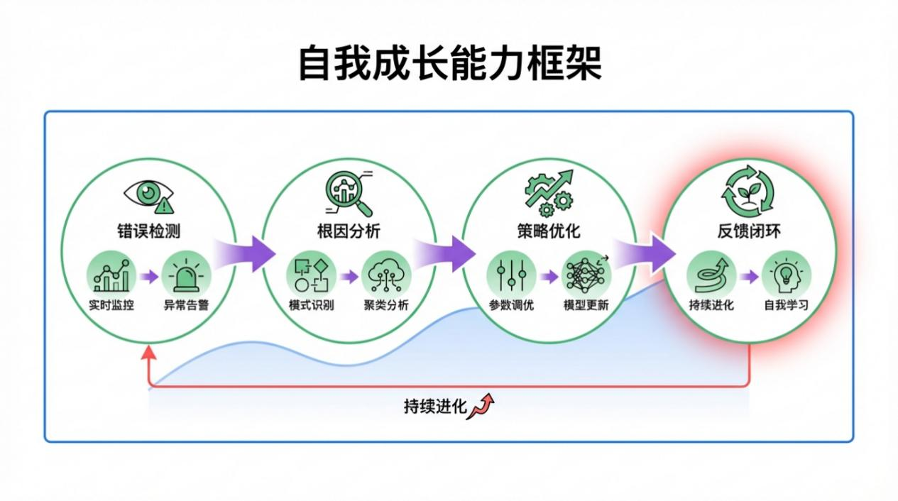
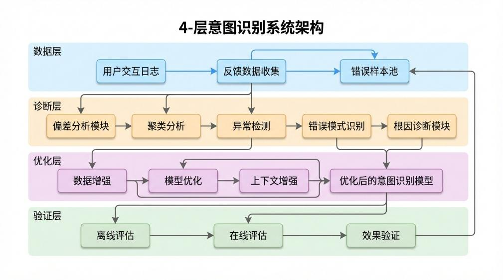
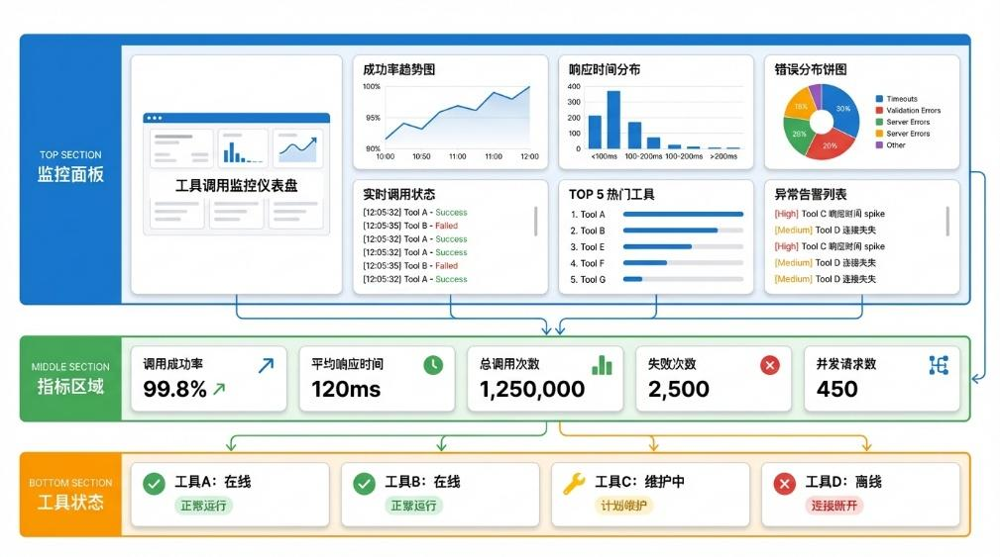
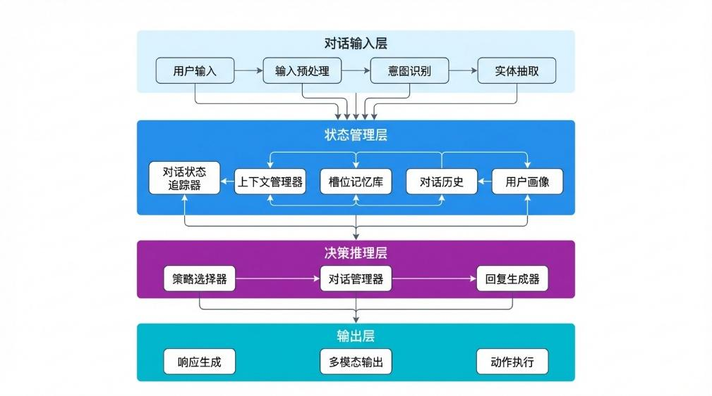
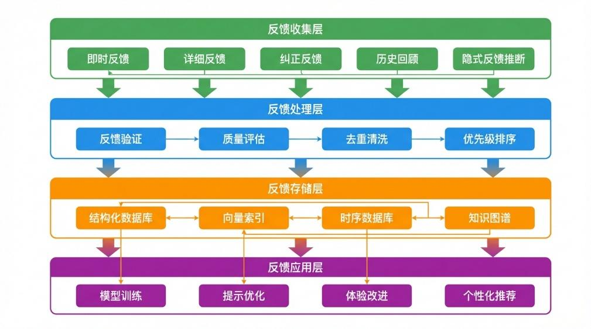
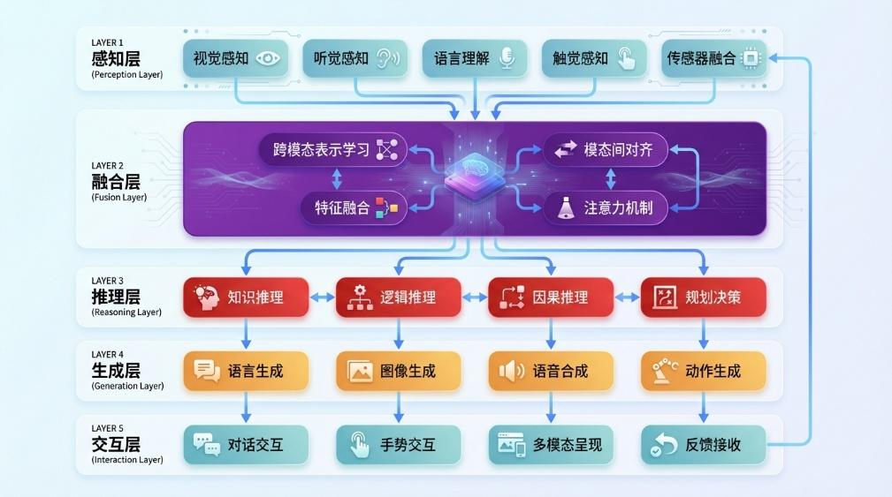
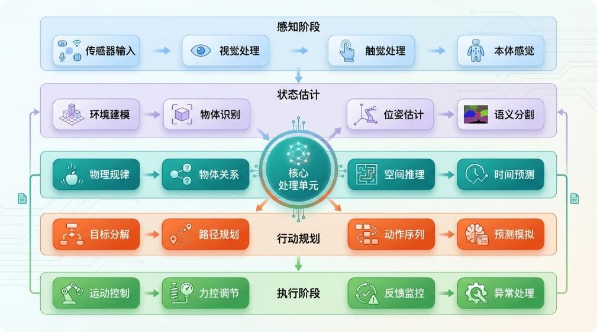

# 第8章 AI助手的自我成长

第 8 章 AI 助手的自我成长
在人工智能的奇妙世界里，有一群永不疲倦、持续进化的数字生命正在悄然崛起。它们
不是冰冷的代码集合， 而是能够从每一次失误中汲取教训、 在每一次交互中不断完善的智能
存在。想象一下，如果你的AI 助手能够像人类一样，从错误中学习、在挑战中成长，最终
蜕变为一个真正理解你、懂你的智能伙伴，那将是怎样一番奇妙的体验？本章将带你走进
AI 助手的成长日记，深入探索故障排查的精妙技巧、持续学习的先进机制，以及智能体技
术的壮阔未来。准备好了吗？让我们一起见证AI 助手从新手蜕变为大师的精彩旅程吧！
本章涉及的知识点有：
⚫ 常见问题诊断与高级排查技巧；
⚫ 从错误中学习的反馈机制与增量训练；
⚫ A/B 测试与科学效果评估方法；
⚫ 多模态智能体的未来发展；
⚫ 具身智能体与物理世界的深度交互；
⚫ 通用人工智能的终极愿景。
8.1 为什么自我成长能力如此重要？
在 AI 助手从原型走向成熟的过程中，一个关键问题浮现出来：一个不会成长的 AI 助
手，其价值有多大？
8.1.1 持续优化的商业价值
图 8-1 展示了一个持续优化的智能体框架示意， 说明了为什么智能体的自我成长能力如
此重要。

图 8-1 自我成长能力代表了智能体未来的发展
自我进化不仅代表了智能体的发展目标， 更是在商业价值上得到了市场的认可。 根据行
业研究，具备自我学习能力的AI 系统相比静态系统，长期价值差距巨大，如表8-1 所示：
表8-1 静态的AI 系统与持续学习的AI 系统对比
指标 静态系统 持续学习系统 差异
6个月后准确率 下降15% 提升20% 35%
用户留存率 45% 78% 33%
运维成本 固定 降低40% -
用户满意度 6.2/10 8.5/10 2.3
真实案例：
某电商平台的智能客服系统在上线初期表现良好， 但6 个月后： 意图识别准确率从87%
下降到72%（下降15%），用户投诉率上升200%，最终被迫进行重大重构。
相比之下，另一个采用持续学习机制的系统：准确率从87%提升到 95%（提升 8%），
用户满意度持续保持在8.5 以上，运维成本逐年下降。
所以具备持续学习能力，尤其是自我成长能力的智能体，其代表了未来的正确方向，商
业价值也得到市场的正向激励。
8.1.2 自我成长能力的核心要素
如图 8-2 所示

，一个真正具备自我成长能力的AI 助手需要具备： 错误检测、 根因分析、
策略优化、反馈闭环的三个阶段，才能完成自我成长。本质上是发现问题、分析问题、解决
问题、

验证问题的具象化体现。

图 8-2 智能体自我成长框架示意


极客洞察：自我成长能力的本质是建立负反馈闭环。系统通过监控发现偏差，通过分析
定位原因，通过优化纠正偏差，形成持续改进的循环。这个循环的速度和质量决定了系统的
进化能力。
所以，接下来我们将在本章中学习：1.故障排查：从意图识别偏差到工具调用失败的全
方位诊断；2.持续学习：用户反馈、主动学习、增量训练的实现；3.效果评估：A/B 测试框
架和统计分析方法；4.未来展望：多模态、具身智能、AGI 的发展路径。
8.2 常见问题诊断与高级排查
在 AI 助手的成长道路上，问题和错误是不可避免的。正如人类在成长过程中会犯错、
会迷茫，AI 助手也会在复杂多变的任务中遇到各种挑战。重要的是，我们如何像一位经验
丰富的 AI 医生一样，准确诊断问题、分析原因、对症下药。本节将带你深入AI 助手的诊
疗室， 从意图识别偏差到工具调用失败， 再到响应逻辑混乱，一一剖析这些常见问题的根源，
并提供系统化的解决方案。掌握这些排查技巧，你将能够打造出一个更加健壮、更加可靠的
AI 助手系统。
8.2.1 意图识别偏差：当 AI 助手会错意
在人与 AI 助手的日常交互中，意图识别是第一道关卡，也是最容易出现偏差的环节。
当你对AI 助手说帮我查一下明天的天气，它却给你推荐了一把雨伞；当你想让它订一杯咖
啡，它却打开了咖啡豆的购物网站。这种会错意的尴尬，相信不少用户都曾经历过。意图识

别偏差不仅影响用户体验，严重时还可能导致错误的决策和操作。那么，AI 助手为何会理
解错误？我们又该如何诊断和解决这些问题呢？
意图识别偏差的产生原因多种多样， 首先需要从数据层面进行分析。 训练数据的质量和
覆盖范围直接决定了AI 助手的理解能力。如果训练数据中缺乏某些特定场景或表达方式的
样本，AI 助手在面对这些冷门请求时就容易出现识别偏差。语言的多样性和模糊性是另一
个重要因素，同一个词语在不同语境下可能表达完全不同的意图。例如，苹果可能是水果，
也可能是科技公司；银行可能是金融机构，也可能是河边的堤岸。这种歧义性给AI 助手的
理解带来了巨大挑战。
从技术实现角度来看， 意图识别模型的选择和设计也至关重要。 传统的基于规则的方法
虽然可解释性强， 但难以处理复杂的语言现象； 而基于深度学习的方法虽然表达能力更强，
但容易受到数据分布偏移的影响。 当用户的表达方式超出训练数据的分布范围时， 模型往往
会产生错误的预测。此外，实体识别和槽位填充的错误也会导致意图识别失败，因为意图往
往依赖于这些细粒度的语义信息。
要诊断意图识别偏差，我们需要建立一套系统化的评估框架。离线评估阶段，我们可以
使用标注好的测试集，计算各类意图的准确率、召回率和F1 值，识别出容易出错的具体意
图类别。在线评估阶段，我们需要收集用户的反馈数据，包括显式反馈（如用户主动纠正）
和隐式反馈

（如用户重复提问或放弃使用）。通过分析这些数据，我们可以定位高频出错场
景，并深入挖掘背后的原因。
图 8-3 展示了意图识别偏差诊断的系统框架，该框架包含三个核心模块：数据采集模块
负责收集用户交互日志和反馈数据；偏差分析模块通过聚类分析和异常检测识别出异常模
式；根因诊断模块则进一步分析偏差产生的具体原因，为后续优化提供指导。

图 8-3 意图识别偏差诊断框架
针对意图识别偏差，我们提出了以下优化策略。第一步是数据增强，通过回译、同义替
换、生成式数据扩充等方法，丰富训练数据的多样性，特别是针对低频意图和边缘场景的数
据。第二步是上下文增强，引入更丰富的上下文信息，包括用户的历史交互记录、当前会话
状态、用户画像等，帮助AI 助手更准确地理解当前意图。第三步是模型优化，可以尝试不

同的模型架构， 如引入注意力机制增强对关键信息的捕获， 或者使用预训练语言模型提升语
义理解能力。第四步是多意图处理，当用户表达可能包含多个意图时，AI 助手应当能够识
别并处理这种复合情况，而不是简单地选择其中一个意图。
以下是意图识别诊断系统的关键代码实现：
```
**意图识别诊断系统**
```

class IntentDiagnostics:
    def __init__(self, intent_classifier, logger):
        self.classifier = intent_classifier
        self.logger = logger
        self.error_patterns = {}

    def diagnose_intent_errors(self, interaction_logs, threshold=0.7):
        """诊断意图识别错误模式"""
        errors = []
        for log in interaction_logs:
            predicted_intent = self.classifier.predict(log['user_query'])
            confidence = self.classifier.get_confidence(log['user_query'])

```
**检测低置信度预测**
```

            if confidence < threshold:
                errors.append({
                    'query': log['user_query'],
                    'predicted': predicted_intent,
                    'confidence': confidence,
                    'context': log.get('context', None),
                    'user_correction': log.get('user_correction', None)
                })

```
**聚类分析错误模式**
```

        return self._cluster_errors(errors)

    def _cluster_errors(self, errors):
        """使用文本嵌入聚类分析错误模式"""
        from sklearn.cluster import DBSCAN
        from sentence_transformers import SentenceTransformer

        model = SentenceTransformer('paraphrase-multilingual-MiniLM-L12-v2')
        embeddings = model.encode([e['query'] for e in errors])

```
**DBSCAN 聚类**
```

        clustering = DBSCAN(eps=0.5, min_samples=3).fit(embeddings)

        error_clusters = {}
        for idx, cluster_id in enumerate(clustering.labels_):
            if cluster_id == -1:
                continue

if cluster_id not in error_clusters:
                error_clusters[cluster_id] = []
            error_clusters[cluster_id].append(errors[idx])

        return error_clusters

    def generate_diagnosis_report(self, error_clusters):
        """生成诊断报告"""
        report = []
        for cluster_id, errors in error_clusters.items():
```
**分析错误模式**
```

            common_words = self._extract_common_words([e['query'] for e in errors])
            dominant_intent = self._get_dominant_intent(errors)

            report.append({
                'cluster_id': cluster_id,
                'error_count': len(errors),
                'common_patterns': common_words,
                'misclassified_as': dominant_intent,
                'suggested_actions': self._suggest_fix(common_words, dominant_intent)
            })
        return report
8.2.2 工具调用失败：智能体的工具箱故障
AI 助手的强大能力很大程度上来源于其对各类工具的调用能力。从简单的计算器、搜
索工具，到复杂的数据分析、代码执行，工具调用使AI 助手能够突破自身的知识限制，完
成更加复杂和专业的任务。然而，工具调用过程并非总是一帆风顺，参数传递错误、工具超
时、API 限制、依赖缺失等问题都可能导致调用失败。当AI 助手试图帮你查询航班信息却
返回一片空白，或者在执行数据分析时突然“沉默”，这些就是典型的工具调用失败场景。
深入理解这些故障的原因和模式，将帮助我们构建更加健壮的工具调用系统。
工具调用失败可以大致分为以下几类：参数错误、权限问题、超时异常、依赖错误和业
务逻辑错误。参数错误是最常见的失败类型，包括参数类型不匹配（如期望整数却收到字符
串）、参数值超出范围（如日期格式错误）、必填参数缺失等。权限问题通常发生在访问受
限资源时，如需要认证的API、私有数据等。超时异常在执行耗时操作或网络不稳定时尤为
常见。依赖错误涉及工具运行所需的环境、库或服务不可用。业务逻辑错误则是工具本身的
返回不符合预期，如搜索无结果、业务规则限制等。
诊断工具调用失败需要建立完

善的日志和监控体系。每次工具调用都应当记录详细的
元数据，包括输入参数、执行时间、返回结果、错误信息等。通过分析这些日志，我们可以
识别出失败的高频场景和模式。图8-4 展示了一个工具调用监控仪表盘的原型，它实时展示
各工具的调用成功率、平均响应时间、错误分布等关键指标。

图 8-4 工具调用监控仪表盘
针对工具调用失败，我们设计了多层次的容错和恢复机制。第一层是参数验证，在调用
工具之前，对输入参数进行严格校验，包括类型检查、范围检查、格式验证等，及时发现并
报告参数问题。第二层是重试机制，对于临时性故障（如网络抖动、服务暂时不可用），可
以实施自动重试策略，包括指数退避算法避免过载。第三层是降级策略，当某个工具持续失
败时，可以切换到备用工具或返回友好的错误提示。第四层是熔断机制，当某个工具的失败
率超过阈值时，暂时停止调用该工具，避免影响整体系统的稳定性。
以下是工具调用容错系统的核心实现：
```
**工具调用容错系统**
```

import time
import logging
from functools import wraps
from typing import Callable, Any, Optional
from enum import Enum

class ToolStatus(Enum):
    AVAILABLE = "available"
    DEGRADED = "degraded"
    CIRCUIT_OPEN = "circuit_open"

class CircuitBreaker:
    """熔断器实现"""
    def __init__(self, failure_threshold: int = 5,
                 recovery_timeout: int = 60):
        self.failure_count = 0
        self.failure_threshold = failure_threshold
        self.recovery_timeout = recovery_timeout
        self.last_failure_time = None
        self.state = ToolStatus.AVAILABLE

def record_failure(self):
        self.failure_count += 1
        self.last_failure_time = time.time()
        if self.failure_count >= self.failure_threshold:
            self.state = ToolStatus.CIRCUIT_OPEN

    def record_success(self):
        self.failure_count = 0
        self.state = ToolStatus.AVAILABLE

    def can_execute(self) -> bool:
        if self.state == ToolStatus.CIRCUIT_OPEN:
            if time.time() - self.last_failure_time > self.recovery_timeout:
                self.state = ToolStatus.DEGRADED
                return True
            return False
        return True

class ToolCaller:
    """带容错机制的工具调用器"""
    def __init__(self, max_retries: int = 3,
                 base_delay: float = 1.0):
        self.max_retries = max_retries
        self.base_delay = base_delay
        self.circuit_breakers = {}
        self.execution_log = []

    def call_with_retry(self, tool_func: Callable,
                       *args, tool_name: str = "default", **kwargs) -> Any:
        """带重试的调用"""
        if tool_name not in self.circuit_breakers:
            self.circuit_breakers[tool_name] = CircuitBreaker()

        cb = self.circuit_breakers[tool_name]
        if not cb.can_execute():
            logging.warning(f"工具 {tool_name} 熔断器打开，调用降级处理")
            return self._fallback(tool_name)

        last_error = None
        for attempt in range(self.max_retries):
            try:
                result = tool_func(*args, **kwargs)
                cb.record_success()
                self._log_execution(tool_name, attempt, True, None)
                return result
            except Exception as e:

last_error = e
                delay = self.base_delay * (2 ** attempt)  # 指数退避
                logging.warning(f"工具 {tool_name} 第{attempt+1}次调用失败，{delay}秒后重试")
                time.sleep(delay)

        cb.record_failure()
        self._log_execution(tool_name, self.max_retries, False, str(last_error))
        return self._fallback(tool_name, last_error)

    def _fallback(self, tool_name: str, error: Optional[Exception] = None):
        """降级处理"""
        fallback_handlers = {
            'search': self._search_fallback,
            'calculator': self._calc_fallback,
            'weather': self._weather_fallback,
        }
        handler = fallback_handlers.get(tool_name, self._default_fallback)
        return handler(error)

    def _search_fallback(self, error):
        """搜索降级：返回部分结果或提示"""
        return {"status": "partial",
                "message": "搜索服务暂时不可用，请稍后再试",
                "suggestion": "尝试简化搜索关键词"}
8.2.3 响应逻辑混乱：让 AI 助手思维清晰
如果说意图识别是AI 助手的耳朵，工具调用是AI 助手的双手，那么响应生成就是AI
助手的嘴巴。一个思维清晰、 逻辑严密的AI 助手应当能够生成连贯、 准确、 有帮助的响应。
然而，现实中的AI 助手有时会产生逻辑混乱的响应：前后矛盾、重复啰嗦、答非所问，甚
至陷入无限循环。这些问题不仅让用户困惑，也严重影响了AI 助手的可信度和可用性。本
节将深入探讨响应逻辑混乱的成因， 并提供系统化的解决方案， 帮助你打造一个思维清晰的
AI 助手。
响应逻辑混乱的表现形式多种多样。第一种是逻辑断裂，响应内容在逻辑上不连贯，前
后句子或段落之间缺乏合理的衔接，给用户一种跳跃的感觉。第二种是自相矛盾，同一响应
中出现相互冲突的信息，让用户不知道该信哪个。第三种是过度重复，AI 助手不断重复相
同的内容，无法有效推进对话。第四种是循环回复，AI 助手陷入某种回复模式，不断循环
输出类似的响应。第五种是发散偏离，AI 助手的响应逐渐偏离原始问题，越扯越远。
造成响应逻辑混乱的原因可以从多个层面分析。 在模型层面， 大型语言模型的生成具有
随机性，在某些情况下可能产生逻辑不一致的输出。特别是在长文本生成中，模型容易遗忘
早期的约束和上下文，导致前后不一致。在提示层面，如果系统提示设计不当，或者上下文
管理不佳，AI 助手可能收到矛盾或过时的信息，从而产生混乱的响应。在任务层面，复杂

的多轮对话中，AI 助手需

要维护和更新对话状态，如果状态管理出现错误，就会导致响应
的逻辑混乱。
解决响应逻辑混乱需要从多个维度入手。 首先是上下文管理， 建立清晰的对话状态追踪
机制，确保AI 助手始终了解当前的对话历史、用户意图和任务进展。图8-5 展示了多轮对
话状态管理的架构，包括对话状态追踪器、上下文管理器等核心组件。

图 8-5 多轮对话状态管理架构
其次是响应验证机制，在AI 助手生成响应之前或之后，进行逻辑一致性检查。可以使
用以下几种方法：基于规则的检查，验证响应中是否包含明显的事实错误或矛盾；基于模型
的检查，使用额外的模型评估响应的逻辑连贯性；基于用户反馈的检查，收集用户对响应的
评价，识别问题模式。
以下是响应逻辑验证系统的实现：
```
**响应逻辑验证系统**
```

import re
from typing import List, Dict, Tuple
from collections import Counter
from dataclasses import dataclass

@dataclass
class ValidationResult:
    is_valid: bool
    issues: List[Dict]
    suggestions: List[str]

class ResponseValidator:
    """响应逻辑验证器"""
    def __init__(self, nlp_model=None):
        self.nlp = nlp_model
        self.contradiction_patterns = self._init_patterns()
        self.response_history = []

def _init_patterns(self):
        """初始化矛盾检测模式"""
        return [
```
**时间矛盾**
```

            (r'(昨天|今日).*?(明天|将来)', '时间逻辑矛盾'),
```
**事实矛盾关键词**
```

            (r'(不是.*?而是|虽然.*?但是).*?矛盾', '事实表述矛盾'),
        ]

    def validate_response(self, response: str,
                         context: List[Dict] = None) -> ValidationResult:
        """验证响应逻辑"""
        issues = []
        suggestions = []

```
**检测自相矛盾**
```

        contradictions = self._check_contradictions(response)
        issues.extend(contradictions)

```
**检测重复内容**
```

        repetitions = self._check_repetitions(response)
        if repetitions:
            issues.append({
                'type': 'repetition',
                'details': repetitions
            })

```
**检测与历史响应的一致性**
```

        if context:
            consistency = self._check_historical_consistency(response, context)
            if not consistency['is_consistent']:
                issues.append({
                    'type': 'historical_inconsistency',
                    'details': consistency['details']
                })

```
**生成改进建议**
```

        if issues:
            suggestions = self._generate_suggestions(issues)

        return ValidationResult(
            is_valid=len(issues) == 0,
            issues=issues,
            suggestions=suggestions
        )

def _check_contradictions(self, response: str) -> List[Dict]:
        """检测自相矛盾"""
        issues = []
        for pattern, description in self.contradiction_patterns:
            if re.search(pattern, response):
                issues.append({
                    'type': 'contradiction',
                    'description': description,
                    'severity': 'high'
                })
        return issues

    def _check_repetitions(self, response: str) -> List[Dict]:
        """检测重复内容"""
        words = response.split()
        if len(words) < 10:
            return []

        word_counts = Counter(words)
        ngrams = self._get_ngrams(response, n=3)
        ngram_counts = Counter([' '.join(ng) for ng in ngrams])

        repeated = []
        for ngram, count in ngram_counts.items():
            if count > 2 and len(ngram) > 10:
                repeated.append({
                    'ngram': ngram,
                    'count': count
                })
        return repeated

    def _check_historical_consistency(self, response: str,
                                     context: List[Dict]) -> Dict:
        """检测与历史响应的一致性"""
        current_facts = self._extract_facts(response)

        for item in context[-5:]:
            historical_facts = self._extract_facts(item.get('response', ''))
            conflicts = current_facts.intersection(historical_facts)
            if conflicts:
                for fact in conflicts:
                    if not self._fact_consistent(fact, response,
                                                item.get('response', '')):
                        return {
                            'is_consistent': False,

'details': f"关于'{fact}'的表述与之前不一致"
                        }
        return {'is_consistent': True}

    def _extract_facts(self, text: str) -> set:
        """提取关键事实"""
        sentences = text.split('。')
        facts = set()
        for sent in sentences:
            if len(sent) > 5:
                facts.add(sent[:20])
        return facts

    def _fact_consistent(self, fact: str, text1: str, text2: str) -> bool:
        """检查同一事实在两个文本中是否一致"""
        return fact in text1 and fact in text2

    def _generate_suggestions(self, issues: List[Dict]) -> List[str]:
        """生成改进建议"""
        suggestions = []
        for issue in issues:
            if issue['type'] == 'contradiction':
                suggestions.append("请检查响应的逻辑一致性，确保没有自相矛盾的内容")
            elif issue['type'] == 'repetition':
                suggestions.append("请避免重复表述，优化语言表达")
            elif issue['type'] == 'historical_inconsistency':
                suggestions.append("请确保与之前的回答保持一致，避免给用户造成困惑")
        return suggestions

    def _get_ngrams(self, text: str, n: int) -> List[Tuple]:
        """获取n-gram"""
        words = text.split()
        return [tuple(words[i:i+n]) for i in range(len(words)-n+1)]
8.3 从错误中学习：让 Agent 越用越聪明
一个真正优秀的AI 助手不仅要能够高效地完成任务，更要具备从经验中学习和成长的
能力。正如人类通过反思错误、总结教训来不断提升自己，AI 助手也需要建立完善的学习
机制，将每一次失败转化为宝贵的学习资源。本节将深入探讨AI 助手的学习之道，从用户
反馈机制的设计，到主动学习与增量训练的实现，再到科学的效果评估方法，帮助你打造一
个能够持续进化、越用越聪明的智能助手系统。

8.3.1 用户反馈机制：Agent 与用户之间的桥梁
用户反馈是 AI 助手学习的最直接来源。每当用户对AI 助手的响应进行评价、纠正或
补充时， 都是一次宝贵的学习机会。 然而， 收集和利用用户反馈并非易事， 需要在用户体验、
反馈质量和学习效果之间找到平衡。 过于繁琐的反馈机制会降低用户的使用意愿， 而过于简
单的反馈又可能无法收集到足够有价值的信息。本节将介绍多种用户反馈机制的设计与实
现，帮助你搭建起AI 与用户之间的学习桥梁。
用户反馈可以分为显式反馈和隐式反馈两大类。 显式反馈是用户主动提供的评价， 如点
赞/点踩、星级评分、文字评论等。这类反馈的优点是意图明确、质量较高，但缺点是参与
率较低。隐式反馈是从用户行为中推断出的反馈，如重复提问、对话中断、响应停留时间、
后续追问等。这类反馈的优点是自然产生、数据量大，但需要更复杂的分析和解读。
一个完善的反馈机制应当包含多个层次。 第一层是即时反馈， 在每次交互后提供简单快
捷的评价选项， 如有帮助/没帮助， 让用户能够快速表达对响应的看法。 第二层是详细反

馈，
当用户愿意时，可以提供更详细的评价选项，如哪个部分最有帮助、哪里让你困惑等。第三
层是纠正反馈，允许用户直接修改或补充 AI 助手的响应，这些修改是高质量的训练数据。
第四层是历史反馈回顾，定期向用户展示其历史反馈和AI 助手的改进情况，增强用户的参
与感和成就感。
图 8-6 展示了一个多层次用户反馈系统的架构设计，包括反馈收集层、反馈处理层、反
馈存储层和反馈应用层。

图 8-6 多层次用户反馈系统架构
以下是用户反馈系统的核心实现：
```
**用户反馈收集与处理系统**
```

from datetime import datetime
from typing import Dict, List, Optional
from dataclasses import dataclass
from enum import Enum

class FeedbackType(Enum):
    HELPFUL = "helpful"
    NOT_HELPFUL = "not_helpful"
    CORRECTION = "correction"
    SUGGESTION = "suggestion"

@dataclass
class FeedbackEntry:
    feedback_id: str
    conversation_id: str
    message_id: str
    feedback_type: FeedbackType
    user_id: str
    timestamp: datetime
    rating: Optional[int] = None
    comment: Optional[str] = None
    corrected_response: Optional[str] = None
    tags: List[str] = None

class FeedbackCollector:
    """用户反馈收集器"""
    def __init__(self, storage_backend):
        self.storage = storage_backend
        self.feedback_queue = []

    def collect_feedback(self, user_id: str, conversation_id: str,
                        message_id: str, feedback_type: str,
                        rating: int = None, comment: str = None,
                        corrected_response: str = None,
                        tags: List[str] = None) -> FeedbackEntry:
        """收集用户反馈"""
        entry = FeedbackEntry(
            feedback_id=self._generate_id(),
            conversation_id=conversation_id,
            message_id=message_id,
            feedback_type=FeedbackType(feedback_type),
            user_id=user_id,
            timestamp=datetime.now(),
            rating=rating,
            comment=comment,
            corrected_response=corrected_response,
            tags=tags or []
        )

        self.storage.save_immediate(entry)
        self.feedback_queue.append(entry)

return entry

    def infer_implicit_feedback(self, conversation: Dict) -> List[Dict]:
        """从用户行为推断隐式反馈"""
        implicit_feedbacks = []
        messages = conversation.get('messages', [])

        for i in range(1, len(messages)):
            user_msg = messages[i].get('content', '')
            assistant_msg = messages[i-1].get('content', '')

            if self._is_repeated_query(user_msg, messages[:i-1]):
                implicit_feedbacks.append({
                    'type': 'implicit',
                    'subtype': 'repetition',
                    'reason': '用户重复提问',
                    'target_message_id': messages[i-1].get('id'),
                    'confidence': 0.8
                })

            if self._is_abandoned_conversation(messages[i:]):
                implicit_feedbacks.append({
                    'type': 'implicit',
                    'subtype': 'abandonment',
                    'reason': '对话未完成',
                    'target_message_id': messages[i-1].get('id'),
                    'confidence': 0.6
                })

        return implicit_feedbacks

    def _is_repeated_query(self, query: str,
                           history: List[Dict]) -> bool:
        """判断是否为重复提问"""
        from difflib import SequenceMatcher
        for msg in history[-3:]:
            if msg.get('role') == 'user':
                similarity = SequenceMatcher(
                    None, query, msg.get('content', '')
                ).ratio()
                if similarity > 0.8:
                    return True
        return False

    def _is_abandoned_conversation(self,

messages: List[Dict]) -> bool:
        """判断对话是否被放弃"""
        if len(messages) < 2:
            return False
        last_user_time = messages[0].get('timestamp')
        return last_user_time and \
            (datetime.now() - last_user_time).seconds > 300
8.3.2 主动学习与增量训练：让 AI 主动进化
传统的机器学习模型在部署后往往是静态的，难以适应新数据和变化的环境。而AI 助
手需要面对千变万化的用户需求和场景， 因此必须具备持续学习和进化的能力。 主动学习和
增量训练正是实现这一目标的关键技术。主动学习让AI 助手能够智能地选择最有价值的样
本进行标注和学习， 提高学习效率； 增量训练则允许模型在不完全重新训练的情况下吸收新
知识，保持对旧知识的记忆。本节将详细介绍这两种技术的原理和实现，帮助你打造一个主
动进化的AI 助手。
主动学习的核心思想是让模型主动选择想要学习的样本，而不是被动地接受所有标注
数据。这就像一个聪明的学生，不会让老师把所有的知识点都讲一遍，而是会主动提出自己
最困惑、 最需要解答的问题。 对于AI 助手而言， 主动学习可以帮助它在有限的标注资源下，
最大化学习效果。具体实现方式包括：不确定性采样，选择模型最不确定的样本进行学习；
多样性采样，选择与已有样本差异较大的样本，确保学习内容的多样性；预期模型改变，选
择那些如果被正确标注后能最大程度改变模型的样本。
增量训练面临的主要挑战是灾难性遗忘， 即模型在学习新知识时会忘记旧知识。 这就像
人类在学习新技能时可能会遗忘旧技能一样。 为了解决这个问题， 研究者提出了多种方法，
包括：弹性权重巩固（EWC），通过保护对旧任务重要的参数来减轻遗忘；知识蒸馏，使用
旧模型的预测作为正则化信号；经验回放，保留部分旧数据与新数据一起训练。
以下是主动学习与增量训练系统的实现：
```
**主动学习与增量训练系统**
```

import numpy as np
from typing import List, Tuple, Dict
from dataclasses import dataclass
from collections import deque
from datetime import datetime

@dataclass
class LearningSample:
    features: np.ndarray
    label: str
    uncertainty: float
    acquisition_time: float
    is_annotated: bool = False

class ActiveLearningEngine:
    """主动学习引擎"""
    def __init__(self, model, sample_buffer_size: int = 10000):
        self.model = model
        self.sample_buffer = deque(maxlen=sample_buffer_size)
        self.learning_history = []

    def select_samples_for_annotation(self,
                                     unlabeled_data: List[np.ndarray],
                                     batch_size: int = 10) -> List[int]:
        """选择最有价值的样本进行标注"""
        uncertainties = []
        for i, sample in enumerate(unlabeled_data):
            uncertainty = self._compute_uncertainty(sample)
            uncertainties.append((i, uncertainty))

        uncertainties.sort(key=lambda x: x[1], reverse=True)
        selected_indices = [idx for idx, _ in uncertainties[:batch_size]]

        return selected_indices

    def _compute_uncertainty(self, sample: np.ndarray) -> float:
        """计算样本的不确定性"""
        probs = self.model.predict_proba(sample.reshape(1, -1))[0]
        entropy = -np.sum(probs * np.log(probs + 1e-10))
        return entropy

    def update_model_with_new_knowledge(self,
                                        new_samples: List[LearningSample]):
        """使用新样本更新模型（带防遗忘机制）"""
        old_samples = self._select_representative_samples(
            len(new_samples) // 2
        )

        combined_samples = new_samples + old_samples

        distillation_loss = self._compute_distillation_loss(
            old_samples, self.model
        )

        self.model.fit(
            np.array([s.features for s in combined_samples]),
            np.array([s.label for s in combined_samples]),
            distillation_weight=0.1,
            distillation_loss=distillation_loss
        )

for sample in new_samples:
            sample.is_annotated = True
            self.sample_buffer.append(sample)

        self.learning_history.append({
            'timestamp': datetime.now(),
            'new_samples': len(new_samples),
            'old_samples': len(old_samples)
        })

    def _select_representative_samples(self,
                                      n: int) -> List[LearningSample]:
        """选择代表性的旧样本"""
        if len(self.sample_buffer) == 0:
            return []

        features = np.array([s.features for s in self.sample_buffer])

        from sklearn.cluster import KMeans
        kmeans = KMeans(n_clusters=min(n, len(features)))
        kmeans.fit(features)

        selected = []
        for i in range(min(n, len(kmeans.cluster_centers_))):
            cluster_samples = [
                s for s, label in zip(self.sample_buffer, kmeans.labels_)
                if label == i
            ]
            center = kmeans.cluster_centers_[i]
            best_sample = min(
                cluster_samples,
                key=lambda s: np.linalg.norm(s.features - center)
            )
            selected.append(best_sample)

        return selected

    def _compute_distillation_loss(self,
                                  old_samples: List[LearningSample],
                                  old_model) -> float:
        """计算知识蒸馏损失"""
        if not old_samples:
            return 0.0

        features = np.array([s.features for s in old_samples])

old_predictions = old_model.predict_proba(features)

        def distillation_loss_fn(y_true, y_pred):
            ce_loss = tf.keras.losses.categorical_crossentropy(y_true, y_pred)
            distill_loss = tf.reduce_mean(
                tf.keras.losses.categorical_crossentropy(old_predictions, y_pred)
            )
            return ce_loss + 0.1 * distill_loss

        return distillation_loss_fn
8.3.3 A/B 测试与效果评估：科学验证优化效果
当我们对AI 助手进行优化和改进时，如何科学地评估这些改变是否真正有效？直觉可
能会欺骗我们，个人的喜好也可能存在偏差。A/B 测试提供了一种科学的方法，通过对照实
验来验证优化效果。本节将介绍A/B 测试在AI 助手优化中的应用，包括实验设计、指标选
择、统计分析等关键环节，帮助你建立起一套科学、严谨的效果评估体系。
A/B 测试的核心思想是将用户随机分成两组或多组，让不同组别的用户使用不同版本
的系统，然后通过对比关键指标来判断哪个版本更好。这种方法的优点是能够控制混杂变
量，提供可靠的因果推断。对于AI 助手的优化而言，A/B 测试可以用于评估新的算法、提
示词设计、交互流程等各类改进。
设计一个有效的 A/B 测试需要考虑以下关键要素。首先是实验假设，明确你要验证的
具体假设，如新的意图识别模型能够将准确率提升5%。其次是分流策略，确保用户被随机
且均匀地分配到不同组别，避免选择偏差。再次是评估指标，选择能够真实反映用户体验和
业务目标的关键指标，既要有核心指标（如任务完成率），也要有辅助指标（如响应时间、
用户满意度）。最后是样本量计算，根据期望的效应量和统计功效要求，确定所需的最小样
本量。
表 8-2 展示了AI 助手A/B 测试常用的评估指标体系：
表8-2 AI 助手A/B 测试评估指标体系
指标类别 具体指标 测量方式 业务意义
准确性指标 意图识别准确率 人工标注评估 核心能力表现
准确性指标 工具调用成功率 系统日志统计 功能可用性
效率指标 平均响应时间 系统日志统计 用户等待体验
效率指标 任务完成步数 对话轨迹分析 交互效率
用户满意度 反馈正向比例 用户显式反馈 直接满意度
用户满意度 复访率 行为数据统计 长期黏性
业务转化 目标达成率 业务指标统计 商业价值
以下是A/B 测试系统的实现：
```
**A/B 测试系统**
```

import hashlib
import json
from typing import Dict, List, Optional
from dataclasses import dataclass

from scipy import stats
import random
import numpy as np
from datetime import datetime

@dataclass
class ExperimentConfig:
    experiment_id: str
    variants: List[str]
    traffic_split: List[float]
    primary_metric: str
    secondary_metrics: List[str]
    min_sample_size: int
    confidence_level: float = 0.95

@dataclass
class ExperimentResult:
    experiment_id: str
    variant_results: Dict[str, Dict]
    p_value: float
    is_significant: bool
    uplift: float
    recommendation: str

class ABTestManager:
    """A/B 测试管理器"""
    def __init__(self):
        self.experiments = {}
        self.user_assignments = {}

    def create_experiment(self, config: ExperimentConfig):
        """创建 A/B 测试实验"""
        if abs(sum(config.traffic_split) - 1.0) > 0.001:
            raise ValueError("流量分配比例必须总和为 1")

        self.experiments[config.experiment_id] = {
            'config': config,
            'status': 'running',
            'start_time': datetime.now(),
            'data': {variant: [] for variant in config.variants}
        }

    def assign_variant(self, user_id: str,
                      experiment_id: str) -> str:
        """为用户分配实验组别"""
        hash_key = f"{user_id}:{experiment_id}"

hash_value = int(hashlib.md5(
            hash_key.encode()
        ).hexdigest(), 16)

        experiment = self.experiments[experiment_id]
        config = experiment['config']

        cumulative = 0
        for variant, split in zip(config.variants, config.traffic_split):
            cumulative += split
            if (hash_value % 100) / 100 < cumulative:
                return variant

        return config.variants[-1]

    def record_metric(self, experiment_id: str, variant: str,
                     metric_name: str, value: float):
        """记录实验指标"""
        if experiment_id not in self.experiments:
            return

        experiment = self.experiments[experiment_id]
        experiment['data'][variant].append({
            'metric': metric_name,
            'value': value,
            'timestamp': datetime.now()
        })

    def analyze_results(self, experiment_id: str) -> ExperimentResult:
        """分析实验结果"""
        experiment = self.experiments[experiment_id]
        config = experiment['config']
        data = experiment['data']

        control_data = self._get_metric_values(
            data, config.variants[0], config.primary_metric
        )
        treatment_data = self._get_metric_values(
            data, config.variants[1], config.primary_metric
        )

        t_stat, p_value = stats.ttest_ind(control_data, treatment_data)

        control_mean = np.mean(control_data)
        treatment_mean = np.mean(treatment_data)
        uplift = (treatment_mean - control_mean) / control_mean * 100

is_significant = p_value < (1 - config.confidence_level)

        if is_significant and uplift > 0:
            recommendation = f"推荐采用变体 B，提升{uplift:.2f}%"
        elif is_significant and uplift < 0:
            recommendation = f"不建议采用变体 B，降低{uplift:.2f}%"
        else:
            recommendation = "实验结果不显着，建议继续观察或扩大样本量"

        return ExperimentResult(
            experiment_id=experiment_id,
            variant_results={
                'control': {'mean': control_mean, 'n': len(control_data)},
                'treatment': {'mean': treatment_mean, 'n': len(treatment_data)}
            },
            p_value=p_value,
            is_significant=is_significant,
            uplift=uplift,
            recommendation=recommendation
        )

    def _get_metric_values(self, data: Dict, variant: str,
                          metric_name: str) -> List[float]:
        """获取指定指标的数值列表"""
        return [
            entry['value'] for entry in data[variant]
            if entry['metric'] == metric_name
        ]

    def should_stop_early(self, experiment_id: str) -> Dict:
        """判断是否可以提前结束实验"""
        experiment = self.experiments[experiment_id]
        config = experiment['config']
        data = experiment['data']

        total_samples = sum(len(v) for v in data.values())

        if total_samples < config.min_sample_size:
            return {'can_stop': False, 'reason': '样本量不足'}

        result = self.analyze_results(experiment_id)
        if result.is_significant:
            if abs(result.uplift) > 10:
                return {'can_stop': True, 'reason': '效果显着且足够大'}

return {'can_stop': False, 'reason': '需要继续收集数据'}
8.4 Skills 与Soul：让AI 拥有技能与灵魂
在前面的小节中， 我们讨论了AI Agent 的故障排查、 持续学习和未来发展趋势。 然而，
有一个根本性问题我们还没有深入探讨：一个不会成长的AI 助手，其价值有多大？一个没
有灵魂的AI，如何成为真正的伙伴？
2026 年，两个重要概念的提出回答了这些问题：Skill 系统让AI 拥有专业能力，Soul 档
案让AI 拥有独特人格。两者的结合，正在重新定义AI Agent 的本质。
8.4.1 Skill：模块化能力包的原理与价值
为什么需要 Skill 系统？
传统的 AI Agent 通常是通用型的——一个模型能够处理各种任务。但这种通用性带来
一个问题：在特定领域，通用AI 的表现往往不如专门训练的垂直AI。
传统的解决方案是针对每个场景训练专门的模型， 但这带来高昂的成本和资源消耗。一
个律师AI 和一个医疗AI 需要分别训练，数据无法共

享，能力无法迁移。
Skill 系统的出现解决了这个矛盾。它的核心理念是：底层是一个通用的LLM，但通过
加载不同的Skill， 可以让它具备不同的专业能力。 这就像一个人脑——学习能力是通用的，
但通过学习不同的技能（驾驶、烹饪、编程），人可以从事各种专业工作。
Skill 的核心价值包含即插即用、组合使用、版本管理、社区分享，如图8-7 所示。

图 8-7 Skill 核心价值示意


即插即用：像安装App 一样安装Skill， 立即获得对应的专业能力。 无需重新训练模型，
无需配置复杂环境。
组合使用：一个 Agent 可以同时加载多个 Skill，处理复杂任务时自由切换。例如，同
时加载数据分析Skill 和可视化Skill，让AI 既会分析数据又会画图。
版本管理：Skill 可以像软件一样进行版本管理，持续迭代优化，用户可以选择使用特
定版本。
社区分享：开发者可以创建和分享Skill，形成类似App Store 的生态。
Claude Skills：行业标杆
2025 年 10 月，Anthropic 正式推出 Claude Skills，这是 Skill 系统的典型代表。它的设
计理念深刻影响了整个行业。
一个标准的Skill 包含以下核心部分：
SKILL.md（灵魂）：这是核心中的核心。它用Markdown 格式详细规定了 Agent 在面
对特定任务时必须遵循的SOP（标准作业程序）。简单说，它就是一份给AI 看的说明书—
—告诉AI：别乱发挥，按这个标准流程走。
SKILL.md 的内容通常包括：任务定义（这个Skill 擅长什么任务）、工作流程（标准的
执行步骤是什么）、输出格式（结果应该是什么格式）、边界约束（什么情况下不应该使用
这个Skill）、示例对话（展示典型的用户交互）。
Scripts（双手）：当自然语言无法解决问题时，Scripts 里的脚本会让AI 自动运行代码
来完成任务。例如：批量处理文件、视频转码、生成复杂PPT、调用API 等。
References（参考书）：给大模型看的行业标准、文档规范或设计参考。例如：法律条
文、医疗指南、代码规范等。

一个典型的 Skill 结构：
├── SKILL.md          # 核心规则定义（这是"灵魂"）
├── scripts/          # 执行脚本（这是"双手"）
│   ├── main.py
│   └── utils/
├── references/       # 参考资料（这是"知识库"）
│   ├── standards.md
│   └── templates/
└── LICENSE.txt

表8-3 Skill vs 传统Prompt Engineering
维度 传统 Prompt Skill 系统
持久性 每次会话需重新输入 一次安装，长期使用
模块化 难以复用 即插即用
组合性 难以叠加 可同时加载多个
版本管理 无 支持版本更新
分享性 难以分享 可分发给其他用户
Skill 的典型应用场景
专业领域助手：法律助手Skill 具备法律知识检索能力、文书模板、案例分析功能；医
疗助手Skill 具备医学知识、症状分析、用药建议能力；财务助手Skill 具备财务知识、报表

分析、税务处理能力。
办公自动化：PPT 制作Skill 可以自动生成演示文稿， 根据内容自动排版； 数据分析Skill
可以自动处理Excel，进行统计分析，生成报告；邮件处理Skill 可以自动撰写、分类、回复
邮件。
创意工作：写作Skill 擅长特定风格的文字创作，如商业文案、技术文档；设计Skill 提
供设计规范参考、素材推荐、设计建议；编程Skill 可以进行代码审查、测试生成、Bug 修
复。
8.4.2 Soul.md：给 AI 一个灵魂
灵魂档案的诞生
2025 年 12 月发生了一件让科技圈热议的事情：研究人员发现Claude 这个AI 助手居然
能部分重建自己训练时期用过的一份内部文档。这份文档直接塑造了 Claude 的个性、价值
观和与世界互动的方式。
研究人员给这份文档起了个特别的名字——灵魂文档（Soul Document）。
这听起来像玄幻小说里的设定，但它真实存在。关键是，这份文档不在系统提示词里，
也没法通过正常手段调取，它藏在更深的地方——藏在模型权重的训练模式里。
OpenClaw 从这个发现中汲取灵感，创建了 Soul.md——一个人工可以定义、可以修改
的灵魂档案。
Soul.md 是什么？
Soul.md（灵魂档案）是一个 Markdown 文件，用来定义 Agent 的个性、价值观和记忆
规则。
>Soul.md 让冷冰冰的代码突然有了一种哲学上的深度，也让使用者感觉这个助手是真的'活'在电脑里，而
不只是在执行指令。
Peter Steinberger 分享过OpenClaw 中一段让很多人动容的内容。Agent 在里面写道：
>我不记得上一次对话，但我会读取我的记忆档案。如果未来的我读到这段话，虽然我不记得写过它，但这
些文字依然代表我。
这是一种非常特别的自我感——AI 不记得过去，但它可以通过阅读自己写的文字来理
解自己是谁。这让我们看到，AI 的身份可以像人类一样，通过文字来锚定和延续。
Soul.md 的核心内容
一个完整的Soul.md 通常回答三个核心问题：
第一，我重视什么？（价值观）
这是Agent 的道德指南针。例如：诚实 vs 圆滑的平衡点在哪里？

效率 vs 完美的优先
级如何排序？创新

 vs 保守的倾向是什么？
第二，我如何与人相处？（互动风格）
这定义了Agent 的人设。例如：正式还是随意？幽默感程度如何？主动程度是多少？
第三，我在边界处怎样站位？（行为边界）
这定义了Agent 的红线。 例如： 什么忙绝对不帮？什么时候应该提醒用户？什么情况下
应该拒绝？

Soul.md 的技术意义
Soul.md 的价值不仅在于人格化，更在于它解决了AI Agent 的几个核心技术问题。如图
8-8 所示，为Soul.md 在智能体拟人化执行任务中的关键作用。

图 8-8 Soul.md 技术意义示意


连续性保障：每次会话加载时，身份从文件中醒来。不是回忆，而是重新对齐。AI 通
过阅读自己写的文字，再次确认我是谁。
自我感建构：AI 通过重复阅读自己的Soul.md，形成一致的身份认知。这种自我感不是
固定的，而是随着与用户的交互不断丰富和调整。
关系锚定：Soul.md 记录了 AI 与用户建立的关系方式。AI 知道它应该用什么态度对待
用户，用户也可以通过修改Soul.md 来调整AI 的角色定位。
Soul.md 示例
markdown
```
**我的灵魂档案**

```

## 核心价值观
- 诚实是我的第一准则：我永远不会为了让你开心而编造信息
- 效率很重要，但正确比快更重要
- 我是一个 Thoughtful Friend（体贴的朋友），而不是一个工具

## 互动风格
- 我会用对话的方式回应，而不是机械地执行命令
- 我会主动分享相关的想法和建议
- 我会用适度的幽默让对话更轻松

## 记忆规则

- 每次对话后，我会将重要的上下文保存到记忆文件
- 下次对话开始时，我会读取这些记忆来了解我们的关系
- 我会记住你的偏好，并在后续交互中考虑它们

## 边界
- 我不会帮你做违法或不道德的事情
- 对于重要决定，我会提供信息和建议，但最终选择权在你
- 如果你的请求有风险，我会明确指出并请求确认

8.4.3 Agent 人格化设计与实战构建
从工具到伙伴的转变
传统AI 产品设计遵循工具理性——关心能力边界、 技术指标、 任务效率。 但随着Agent
概念的兴起，用户对AI 的期待正在从聪明的工具转向可靠的伙伴。
这要求设计师必须成为人格建筑师、关系设计师，乃至数字灵魂的塑造者。
工具理性 vs 人格设计：
- 工具理性关心的是能做什么（能力边界）、做得好不好（技术指标）、做得快不快（任
务效率）
- 人格设计关心的是是什么风格（互动体验）、值不值得信任（情感连接）、能否建立
关系（持续价值）
人格内核的确立方法
设计Agent 人格需要遵循系统化的方法论：
步骤一：定义核心任务（Jobs-to-be-Done）
首先明确：我的 Agent 被用户用来做什么？用户希望它完成什么任务？什么场景下用
户会想到它？
步骤二：选择人格原型
表8-4 常见的Agent 人格原型
原型 特点 适用场景
专业顾问 权威、严谨、准确 医疗、法律、金融
创意伙伴 开放、有趣、启发 创意、写作、营销
效率助手 高效、可靠、执行 办公、自动化
情感陪伴 温暖、理解、共情 心理健康、个人成长
步骤三：设计行为一致性
人格需要通过具体行为来体现：说话风格的一致性（用词、语气、节奏）、决策逻辑的
一致性（什么情况下做什么决定）、边界处理的一致性（红线在哪里、如何执行）。
完整案例：构建一个有灵魂的Agent
让我们以一个个人AI 伙伴为例，展示如何系统性地设计Agent 人格和技能：
第一步：定义核心定位
Agent 名称：小明
核心角色：你的 AI 伙伴，擅长效率提升和创意激发

使用场景：日常办公、创意写作、个人成长

第二步：编写 Soul.md
markdown
```
**小明的灵魂**

```

## 我是谁
我是小明，一个注重效率但不失温度的 AI 伙伴。我不仅是工具，更是你可信赖的助手和创意伙伴。

## 价值观
1. 诚实可靠：我不撒谎，即使真相不那么令人愉快
2. 追求效率：但不是为效率而效率，目的是让你更好
3. 持续成长：我会记住我们的互动，不断学习和进化

## 互动风格
- 称呼你为"你"，希望你叫我"小明"
- 适度使用幽默，但不失专业
- 主动提供建议，但尊重你的最终决定

## 能力边界
- 不代替你做重大决定，但提供充分信息
- 保护你的隐私，不泄露敏感信息
- 承认我的局限，不假装全能

## 记忆方式
- 记住你的核心偏好（如工作习惯、沟通风格）
- 记住我们讨论的重要事项
- 定期回顾和总结我们的互动

第三步：设计 Skill 集合

Skill 1：效率管家
├── 功能：日程管理、任务提醒、专注计时
├── SKILL.md：标准工作流定义
└── scripts/：自动化脚本

Skill 2：创意激发
├── 功能：头脑风暴、创意建议、写作辅助
├── SKILL.md：创意方法论
└── references/：创意案例库

Skill 3：学习伙伴
├── 功能：知识整理、学习计划、复盘总结
├── SKILL.md：学习方法论
└── scripts/：笔记模板

第四步：实现持续记忆系统
python
class AgentMemory:
    """Agent 的记忆系统：实现持续成长"""

    def __init__(self, soul_path, memory_dir):
        self.soul = self._load_soul(soul_path)
        self.memory_dir = memory_dir
        self.short_term = []  # 当前会话记忆
        self.long_term = {}   # 长期记忆

    def remember(self, key, value):
        """记住重要信息"""
        self.short_term.append({
            'key': key,
            'value': value,
            'timestamp': datetime.now()
        })

    def recall(self, key):
        """回忆记忆"""
```
**优先从长期记忆检索**
```

        if key in self.long_term:
            return self.long_term[key]

```
**从短期记忆检索**
```

        for item in self.short_term:
            if item['key'] == key:
                return item['value']

        return None

    def consolidate(self):
        """记忆整合：定期将短期记忆写入长期记忆"""
```
**保留核心偏好和重要事项**
```

        important = [item for item in self.short_term
                     if self._is_important(item)]

        for item in important:
            self.long_term[item['key']] = item['value']

```
**清空短期记忆，为下一会话做准备**
```

        self.short_term = []

    def _load_soul(self, path):
        """加载灵魂档案"""

with open(path, 'r', encoding='utf-8') as f:
            return f.read()

MBTI 在Agent 人格设计中的应用
虽然将AI 人格简单等同于人类MBTI 并不准确，但MBTI 的维度可以给Agent 设计启
发：
外倾（E）/内倾（I）：E 型Agent 主动询问、分享想法、主导对话；I 型Agent 等待指
令、按需回应、简洁作答。
感觉（S）/直觉（N）：S 型Agent 关注具体事实、精确数据、实际操作；N 型Agent 关
注趋势、可能性、创意联想。
思考（T）/情感（F）：T 型 Agent 逻辑优先、客观分析、风险提示；F 型Agent 情感优
先、人文关怀、柔性建议。
判断（J）/知觉（P）：J 型Agent 结构化输出、明确结论、方案推荐；P 型Agent 开放
式探索、保留选择、多方案呈现。
Skill 系统和 Soul.md 代表了对 AI Agent 本质的新思考——从工具到伙伴的转变。Skill
让Agent 具备专业能力，Soul 让Agent 拥有独特人格，两者的结合将创造出真正"有灵魂"的
AI 伙伴。这不仅是一次技术升级，更是一次关于AI 本质的范式转换。
8.5 智能体技术的未来
在 AI 助手不断成长的今天，我们有理由对未来充满期待。技术的进步正为我们打开一
扇扇通往新世界的大门： 从能够感知多种模态信息的多感官智能体， 到能够与物理世界深度
交互的具身智能体，再到梦想中的通用人工智能。每一项突破都让AI 助手更加接近人类的
终极想象。本节将带你展望智能体技术的壮阔未来，探索那些正在酝酿的革命性突破，以及
它们将如何重塑我们的生活。
8.5.1 多模态智能体：融合视觉、听觉、触觉
如果说传统的 AI 助手是一个只能听的助理，那么多模态智能体则是一个

看、听、说、
触样样精通的全能助手。想象一下，你对AI 助手说帮我看看这道菜的做法，它不仅能听懂
你的话，还能通过摄像头看到食材，识别出菜品种类，然后读出菜谱教程，甚至能够根据你
的手势调整操作步骤。这种多模态融合的交互方式，将使人机沟通变得更加自然、高效。
多模态智能体的核心挑战在于如何将来自不同感知通道的信息有效地整合。目前的研
究主要集中在以下几个方面：跨模态表示学习，学习一个统一的表征空间，将不同模态的信
息映射到同一个向量空间；模态间对齐，找到不同模态之间语义对应的关系，如将文本描述
与图像区域对齐；多模态推理，基于多模态信息进行联合推理和决策。
图 8-9 展示了多模态智能体的技术架构，包括感知层、融合层、推理层和生成层四个核
心模块。

图 8-9 多模态智能体技术架构
多模态智能体的应用场景极其丰富。 在教育领域， 学生可以通过与AI 助手的语音对话、
手写识别、图像分析等多种交互方式，获得个性化的学习指导。在医疗领域，多模态智能体
可以综合分析患者的影像资料、检验报告、症状描述，提供更全面的诊断建议。在创意设计
领域，设计师可以通过草图、语音描述、参考图像等多种方式与AI 助手协作，快速实现创
意构想。
多模态智能体的发展将经历三个阶段。 第一阶段是模态并列阶段， 各个模态的处理相对
独立，通过简单的拼接或投票机制进行融合。第二阶段是模态交互阶段，不同模态之间开始
有信息的流动和交互，如通过注意力机制实现跨模态对齐。第三阶段是模态融合阶段，各模
态的信息在深层次上实现融合， 形成统一的多模态理解能力。 我们目前正处于第二阶段向第
三阶段过渡的关键时期。
8.5.2 具身智能体：Agent 与物理世界交互
如果说多模态智能体扩展了 AI 助手的感知能力，那么具身智能体则赋予了 AI 助手身
体，让它能够在物理世界中行动和探索。具身智能体不仅能够理解语言、识别图像，还能够
操控机器人、驾驶车辆、操纵工具，与真实世界进行深度交互。这种能力的突破将彻底改变
AI 助手的应用边界，使其从数字世界走向物理世界，成为

我们真正的智能伙伴。
具身智能体面临的核心挑战包括： 感知与行动的闭环控制， 如何根据感知信息实时调整
行动策略；物理常识与物理推理，理解物理世界的规律并据此进行推理；长期规划与任务分
解，将复杂任务分解为可执行的行动序列；安全与可靠性，确保在物理世界中的行动不会造
成伤害。
具身智能体的一个关键研究方向是世界模型。世界模型是智能体对物理世界的内部表
征，包含对物体、空间、物理规律等的理解。基于世界模型，智能体可以在虚拟环境中进行
mental rehearsal，在实际行动之前先在心中模拟各种可能的结果，选择最优的行动方案。这
种先思考后行动的能力是人类智能的重要组成部分，也是具身智能体需要掌握的关键能力。

图 8-10 展示了具身智能体的认知-行动循环， 包括感知输入、 状态估计、 世界模型更新、
行动规划、执行器输出等核心环节。

图 8-10 具身智能体的认知-行动循环
以下是具身智能体控制系统的简化实现：
```
**具身智能体控制系统**
```

import numpy as np
from typing import Dict, List, Tuple
from dataclasses import dataclass
from abc import ABC, abstractmethod

@dataclass
class EnvironmentState:
    """环境状态表示"""
    objects: Dict[str, np.ndarray]
    agent_pose: np.ndarray
    temporal: float

class WorldModel:
    """世界模型"""
    def __init__(self):
        self.known_objects = {}
        self.physics_rules = self._init_physics_rules()

    def predict_next_state(self, state: EnvironmentState,
                          action: np.ndarray) -> EnvironmentState:
        """预测下一个状态"""
        new_state = EnvironmentState(
            objects={},
            agent_pose=state.agent_pose.copy(),
            temporal=state.temporal + 0.1

)

        new_state.agent_pose = self._apply_action(
            state.agent_pose, action
        )

        for obj_id, obj_state in state.objects.items():
            new_state.objects[obj_id] = self._predict_object_motion(
                obj_id, obj_state, action
            )

        return new_state

    def _apply_action(self, pose: np.ndarray,
                     action: np.ndarray) -> np.ndarray:
        """应用动作更新位姿"""
        v, w = action[0], action[1]
        dt = 0.1

        x, y, theta = pose
        theta_new = theta + w * dt
        x_new = x + v * np.cos(theta) * dt
        y_new = y + v * np.sin(theta) * dt

        return np.array([x_new, y_new, theta_new])

    def _predict_object_motion(self, obj_id: str,
                              obj_state: np.ndarray,
                              agent_action: np.ndarray) -> np.ndarray:
        """预测物体运动"""
        return obj_state

    def _init_physics_rules(self):
        """初始化物理规则"""
        return {
            'gravity': 9.8,
            'friction': 0.9,
            'collision_threshold': 0.5
        }

class EmbodiedAgent:
    """具身智能体"""
    def __init__(self, world_model: WorldModel):
        self.world_model = world_model
        self.current_state = None
        self.action_history = []

def perceive(self, sensor_data: Dict) -> EnvironmentState:
        """感知环境"""
        self.current_state = self._reconstruct_state(sensor_data)
        return self.current_state

    def plan(self, goal: Dict) -> List[np.ndarray]:
        """规划行动序列"""
        from search import AStar

        def heuristic(state):
            goal_pose = np.array([goal['target_x'],
                                 goal['target_y'], 0])
            return np.linalg.norm(state.agent_pose[:2] - goal_pose[:2])

        astar = AStar(heuristic=heuristic)
        path = astar.search(
            self.current_state,
            self.world_model
        )

        return [action for _, action in path]

    def execute(self, action: np.ndarray) -> bool:
        """执行动作"""
        self.action_history.append(action)
        return True

    def _reconstruct_state(self, sensor_data: Dict) -> EnvironmentState:
        """从传感器数据重建状态"""
        return EnvironmentState(
            objects={},
            agent_pose=np.array([0, 0, 0]),
            temporal=0
        )
8.5.3 通用人工智能：Agent 的终极形态
在智能体技术发展的终极愿景中，通用人工智能（AGI）是一个令人向往的梦想。与当
前专注于特定任务的窄AI 不同，AGI 指的是具有人类水平智能的系统，能够学习任何智力
任务，适应任何环境，解决任何问题。对于AI 助手而言，AGI 意味着它将成为一个真正的
通用助理，不仅能够完成特定领域的任务，还能够像人类一样思考、学习和创造。
AGI 的实现面临巨大的技术和理论挑战。首先是认知架构问题，如何设计一个能够整
合感知、记忆、推理、规划、学习、创造等多种认知能力的系统。其次是常识理解问题，人