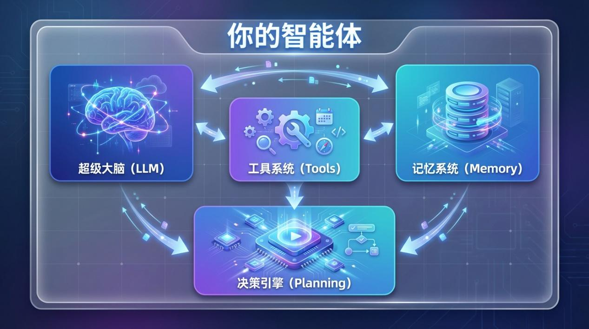
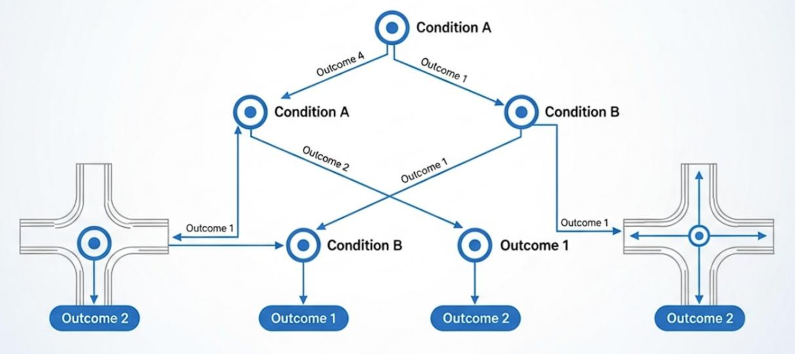

# 内容简介

7.2.2 API 网关与负载均衡 ..................................................................................133
7.2.3 成本优化策略 ............................................................................................134
7.3 性能监控与调优 ...................................................................................................135
7.3.1 关键性能指标（KPI）监控 ......................................................................135
7.3.2 识别常见的性能瓶颈...............................................................................137
7.3.3 核心武器：LLM 推理优化策略 ...............................................................138
第 8 章 AI 助手的自我成长 ............................................................................................... 141
8.1 为什么自我成长能力如此重要？ ........................................................................141
8.1.1 持续优化的商业价值 .................................................................................141
8.1.2 自我成长能力的核心要素 .........................................................................142
8.2 常见问题诊断与高级排查....................................................................................143
8.2.1 意图识别偏差：当AI 助手会错意 ..........................................................143
8.2.2 工具调用失败：智能体的工具箱故障 .....................................................146
8.2.3 响应逻辑混乱：让AI 助手思维清晰 ......................................................149
8.3 从错误中学习：让Agent 越用越聪明 ................................................................153
8.3.1 用户反馈机制：Agent 与用户之间的桥梁 ..............................................154
8.3.2 主动学习与增量训练：让AI 主动进化...................................................157
8.3.3 A/B 测试与效果评估：科学验证优化效果 ..............................................160
8.4 Skills 与 Soul：让AI 拥有技能与灵魂 ................................................................164
8.4.1 Skill：模块化能力包的原理与价值 ..........................................................164
8.4.2 Soul.md：给AI 一个灵魂 ..........................................................................166
8.4.3 Agent 人格化设计与实战构建 ...................................................................168
8.5 智能体技术的未来 ...............................................................................................171
8.5.1 多模态智能体：融合视觉、听觉、触觉 .................................................171
8.5.2 具身智能体：Agent 与物理世界交互 ......................................................172
8.5.3 通用人工智能：Agent 的终极形态 ..........................................................175
本章小结 ......................................................................................................................176


内容简介
AI Agent （人工智能代理）正在引领一场人机交互的革命。与传统的 AI 助手只能被动回答问题不同，
AI Agent 能够自主理解目标、规划执行步骤、调用各类工具完成复杂任务，从根本上改变了我们与计算机
协作的方式。2025 至2026 年，OpenClaw、Claude Cowork 等桌面智能体的相继问世，标志着 AI Agent 从
概念走向大规模应用的临界点。本书系统讲解AI Agent 的开发技术，从核心原理到工程实践，从单智能体

---

# 前言

到多智能体系统，帮助读者快速掌握这一前沿技术。
本书分为四部分， 共八章。 第一部分 （第1-2 章） 深入剖析AI Agent 的思考引擎——决策与推理系统，
以及记忆宫殿——高效信息管理与知识沉淀机制。 第二部分 （第3-4 章） 详细讲解工具调用的原理与流程，
并通过职场效率、个人生活优化、创意内容生成等实战案例，展示AI Agent 在各领域的应用潜力。第三部
分（第5-6 章）探讨多智能体协同模式与开源智能体框架（LangChain、LlamaIndex、MetaGPT 等），并新
增了 OpenClaw、Cowork 等新一代桌面智能体的介绍。第四部分（第7-8 章）涵盖AI Agent 的部署优化与
自我成长能力，包括故障诊断、持续学习、2026 年新技术展望（Claude Skills、Soul.md 等）。
本书内容系统全面，注重理论与实践结合，特别适合AI 技术爱好者、软件开发工程师、产品经理，以
及希望借助 AI 提升工作效率的知识工作者阅读，也适合作为高校 AI 相关课程的教材使用。

---

# 第1章 AI助手的思考引擎

这本书包括什么内容
本书内容可以分为四大部分，共八章。
第一部分 AI 助手的智慧之核包括第 1 章和第 2 章，介绍 AI Agent 的决策与推理系统
（思考引擎），以及高效信息管理与知识沉淀（记忆宫殿）。
第二部分AI 助手的能力延伸包括第3 章和第4 章，讲解工具调用原理与流程，以及跨
领域效率场景的深度应用。
第三部分AI 助手的复杂应用包括第5 章和第6 章，探讨多智能体协同系统和主流开源
智能体框架（LangChain、LlamaIndex、MetaGPT 等），并新增了新一代桌面智能体的介绍。
第四部分 AI 助手的持续进化包括第7 章和第 8 章，涵盖AI 助手的部署与性能优化，
以及自我成长能力（故障排查、持续学习、未来展望），并新增了 Skills 与 Soul 等前沿内
容的介绍。
读者阅读本书过程中遇到问题可以通过邮件与笔者联系。
作者介绍
作者简介：邵可佳，雨根科技软件大数据事业部总监，美国北亚利桑那州大学数据分析
硕士，工作二十年来，先后在马上金融、河狸家、墨迹天气从事算法工作，在机器人具身智
能、智能家居、金融风控、电商推荐、O2O 派单等领域具有算法实际落地经验。在墨迹天
气工作期间，通过多项关键专利技术的突破，显着提升 了预报准确率，推动产品在
Forecastwatch 国际评测中跻身全球前列， 获得业界广泛认可。 目前在雨根主导碳寻大模型、
生态智能体的研发。
本书读者对象
⚫ AI 技术爱好者，希望系统学习AI Agent 开发的人员；
⚫ 软件开发工程师，想要转型或扩展到AI Agent 领域的开发者；
⚫ 产品经理和创业者，寻找AI 产品落地思路的从业者；
⚫ 高校学生，学习人工智能、大语言模型相关课程的学生；
⚫ 各行各业希望利用AI 提升工作效率的知识工作者。

第 1 部分：AI 的智慧之核

第 1 章 AI 助手的思考引擎
欢迎来到本书的第一部分！在这里，我们将一起揭开 AI Agent（智能代理）那神秘的
黑箱，探寻其智慧之核。你是否曾好奇，当你向智能助理下达一个指令时，它究竟是如何思
考并做出回应的？是简单的关键词匹配，还是背后隐藏着一套复杂的决策逻辑？
本章，我们将化身神经外科医生，深入AI Agent 的大脑皮层，剖析其核心的决策与推
理系统。这不仅仅是理论的堆砌，更是一次激动人心的探险。我们将看到，一个优秀的 AI
Agent，其决策机制远比我们想象的要精妙，它就像一个高度协同的作战指挥中心，能够根
据任务的复杂程度，调动不同层级的兵力来应对。
本章涉及的知识点有：
⚫ 智能体的响应机制；

⚫ 智能体的决策模型；
⚫ 任务拓扑分解与优化。
1.1 智能决策三层响应机制
想象一下你开车时遇到的各种状况：前方红灯，你下意识地踩下刹车；导航提示前方拥
堵，你开始思考是否要更换路线；为了赶上三个月后的重要家庭聚会，你正在规划一条横跨
数个省份的长途自驾路线。这三种场景，你的大脑分别启动了完全不同的处理模式：本能反
应、逻辑分析和长期规划。
一个设计精良的 AI Agent，其决策系统也遵循着类似的逻辑分层。我们将其概括为智
能决策三层响应机制。这种分层设计并非故弄玄虚，而是效率与能力的最佳平衡。正如危机
管理专家会构建分层响应金字塔（Tiered Response Pyramid）来应对不同规模的灾难一样，
我们的 AI Agent 也需要一个类似的框架来处理从秒回到深思熟虑的各类任务。它确保了
Agent 在处理简单、高频的任务时能快如闪电，而在面对复杂、开放式的挑战时又能深谋远
虑。如图1-1 所示

，为大脑智能

决策三层响应的示意。

图 1-1 智能决策三层响应机制示意

图，用大脑不同区域比喻 AI 的三个决策层
接下来， 让我们逐层解构这三个神奇的反应层， 看看它们是如何协同工作， 赋予AI Agent
思考能力的。

1.1.1 即时反应层：AI 的膝跳反射
即时反应层（Instantaneous Reaction Layer）是AI Agent 决策系统的第一道防线，也是
最高效的一层。它处理的是那些明确、固定、无需复杂思考的应激任务。你可以把它想象成
人类的膝跳反射——当医生用小锤敲击你的膝盖， 你的小腿会不假思索地弹起。这个过程无
需经过大脑的复杂分析，是一种预设好的、自动化的反应。
在 AI Agent 的世界里，这一层通常由一系列预定义的规则驱动。这些规则就像一个个
如果……就……的指令集，清晰而直接。这种方法在计算机科学中被称为基于规则的系统
（Rule-Based Systems），它追求的是极致的速度和可靠性。
场景举例： 假设你正在打造一个邮件管理 Agent。你可以为它设定一条简单的即时反
应规则：
IF 邮件发件人 == "你的老板" OR 邮件标题.包含("紧急", "重要") THEN
将邮件标记为 "星标邮件"并立即发送手机通知
看到吗？这个过程没有任何模糊地带。Agent 不需要理解邮件的深层含义，只需进行简
单的模式匹配，然后执行预设动作。这使得它在处理海量、重复性的任务时效率极高，比如
自动分类邮件、过滤垃圾信息、响应简单的客服问询（我的订单到哪了？）等。
优点：速度快、可靠性高、易于理解和调试。
缺点：缺乏灵活性。它只能处理预先定义好的情况，一旦遇到规则之外的新问题，就会
束手无策。它就像一个只会按乐谱弹奏的钢琴手，无法即兴创作。
因此，即时反应层是AI Agent 不可或缺的快车道，但要让Agent 真正变得智能，我们
还需要更强大的引擎。
1.1.2 逻辑推理层：AI 的理性大脑
当任务变得复杂， 不再是简单的非黑即白时， 我们就需要启动决策的第二层——逻辑推
理层（Logical Reasoning Layer）。如果说即时反应层是AI 的脊髓，那么逻辑推理层就是它
的大脑皮层，负责处理需要理解、分析、推理和上下文感知的问题。
这一层的核心驱动力，正是当前大放异彩的大型语言模型（LLMs），如 GPT 系列、
Gemini 等。与基于规则的系统不同，LLMs 通过在海量数据上进行训练，获得了强大的语言
理解和生成能力。它们能够处理模糊的指令，理解上下文，并进行多步骤的推理。
然而， 直接把一个复杂的任务扔给LLM， 就像让一个天才去解决一个定义不清的问题，
结果可能并不理想。 为了让 LLM 高效工作，我们需要 一种关键技术：任务分解（Task
Decomposition）。这是一种将复杂目标拆解成一系列更小、更易于管理子任务的策略，就像
项目经理在启动一个大项目前，会先制定详细的WBS（工作分解结构）一样。
场景举例： 你对你的AI 助理说：帮我总结一下上周所有关于‘天狼星项目’的会议纪
要，并根据要点起草一封项目进展邮件，发给团队成员。
这个任务显然超出了即时反应层的能力范围。逻辑推理层接到指令后， 会像一个聪明的
秘书一样，开始分解任务：
```
# 初始目标：总结会议纪要并起草邮件

# 任务分解后的计划 (由LLM 生成):
```

1.识别关键信息： 从指令中提取关键词天狼星项目和时间范围上周。
2.搜索文档： 调用内部文件搜索工具，查找所有符合条件的会议纪要。
3.阅读与总结： 逐一阅读找到的纪要，提取核心决策、待办事项和关键数据。
4.整合要点： 将所有纪要的要点进行汇总、去重，形成一份结构化的总结。
5.起草邮件： 调用邮件撰写工具，根据总结的要点，生成一封清晰、专业的项目进展邮件
6.等待确认： 将草稿呈现给你，等待最终的发送确认。
在这个过程中，AI Agent 利用 LLM 的推理能力进行规划， 并将每一步 （如搜索、 总结）
映射到具体的工具或能力上。这种思考-行动的循环， 有时被称为ReAct（Reasoning and Action）
框架，是现代AI Agent 的核心工作模式之一。
逻辑推理层让 Agent 从一个指令执行者蜕变为一个问题解决者。它能够处理需要创造
性、灵活性和深度理解的复杂工作，是AI Agent 真正展现其智能的关键所在。
1.1.3 长期规划层：AI 的人生规划师
现在，我们来到了决策机制的最顶层——长期规划层（Long-Term Planning Layer）。如
果说前两层关注的是现在该做什么， 那么这一层则着眼于未来要实现什么。它处理的是那些
跨度长、目标宏大、充满不确定性的任务，需要Agent 具备记忆、学习和动态调整策略的能
力。
这一层的运作方式， 可以类比于人类为自己设定长期目标， 比如一年内学会一门新语言
或五年内成为行业专家。这不仅仅是一系列行动的简单堆砌，更是一个需要持续反馈、不断
优化的动态过程。在 AI 领域，这通常与强化学习（Reinforcement Learning, RL）等技术紧
密相关。
强化学习的理念非常直观，就像训练宠物一样：当它做出正确的行为（比如听到坐下指
令后坐下），就给予奖励（一小块零食）；做出错误行为则不予理会。久而久之，它就会学
会为了最大化奖励而做出正确的决策。AI Agent 在长期规划层也是如此，它在一个环境中
不断尝试，通过奖励或惩罚的反馈信号，学习如何达成最终目标。
场景举例：你赋予你的AI 健康助理一个长期目标：帮我制定并执行一个为期三个月的
减重5 公斤的计划。
长期规划层不会一次性给出一个固定不变的计划， 而是会启动一个持续的、 动态的管理
循环：
1.初始规划 (Planning): 结合你的身体数据（身高、体重、年龄）和偏好，生成一个初步的饮食和运
动计划。这本身可能就需要逻辑推理层的参与。
2.执行与监控 (Execution & Monitoring): 每天提醒你打卡、记录饮食和运动情况，并连接智能手环等
设备获取实时数据。
3.评估与反馈 (Evaluation & Feedback):  每周分析你的体重变化、运动频率等数据。如果进展顺利
（获得正向奖励），则维持当前策略。如果进展停滞（获得负向奖励或无奖励），则需要调整。
4.策略调整 (Policy Adjustment): 发现你连续三天没有进行有氧运动， 它可能会主动提问： 是最近太
忙了吗？或者我们可以尝试一些你更喜欢的运动，比如游泳或跳舞？然后根据你的反馈，动态调整运
动计划。
这个过程的核心是⻢尔可夫决策过程（Markov Decision Process, MDP），一个用于在不

确定环境中进行决策的数学框架。 它帮助Agent 在每个状态 （比如本周体重

下降0.5kg） 下，
选择一个能带来最大长期回报（最终减重5kg）的行动（比如增加力量训练）。
如图 1-2 所示，为智能决策的分层架构示意图。

图 1-2 AI 智能决策分层架构图
用户输入首先由逻辑推理层（LLM Planner ）进行任务分解和规划，然后交由执行器
（Executor）进入思考-行动-观察的循环，执行器在需要时可以向规划器请求反馈和调整，
最终输出答案。
长期规划层赋予了 AI Agent 远见和适应性，让它能够陪伴用户共同成长，完成那些需
要耐心、智慧和持续努力的宏伟目标。它代表了 AI Agent 从一个工具向一个真正的伙伴演
进的终极方向。
至此，我们已经完整地剖析了AI Agent 决策的三层响应机制。 从快如闪电的即时反应，
到深思熟虑的逻辑推理，再到高瞻远瞩的长期规划，这三层结构协同工作，共同构成了 AI
Agent 的智慧之核。在接下来的章节中，我们将进一步探讨支撑这些决策的另一个关键要素
——记忆，看看AI Agent 是如何记住过去，并用经验指导未来的。
1.2 决策模型与算法：AI 如何权衡利弊
你有没有想过， 当你对智能音箱说播放我喜欢的音乐时， 它究竟是如何从成千上万首歌
中挑出那一首的？当你问导航软件最快的回家路线时，它又是如何在无数条路径中做出选
择的？这背后，就是AI Agent 的决策核心——一系列精心设计的模型和算法，它们构成了
AI 的思考引擎。
如果说上一节我们了解了 AI Agent 需要一个大脑来思考，那么这一节，我们将亲手打
开这个大脑的工具箱，看看里面都藏着哪些神奇的工具。这些工具，有的像一本严谨的规则

手册，有的像一棵不断生长的智慧之树，还有的则像一个在游戏中不断试错、越挫越勇的玩
家。准备好了吗？让我们一起探索AI Agent 决策的奥秘。
1.2.1 最直接的思考者：基于规则的模型
想象一下你家里的自动恒温器。它的工作原理简单粗暴：如果温度低于20 度，就开启
暖气；如果高于26 度，就开启冷气。这就是最基础的决策模型——基于规则的模型（Rule-
Based Model） 。 它就像一个严格执行命令的士兵， 根据一系列预先设定的如果…那么… （IF-
THEN）指令来行动。
在 AI Agent 的早期，这种模型是绝对的主角。开发者会像编写剧本一样，为Agent 可
能遇到的每一种情况都设定好应对策略。比如，开发一个客服机器人，规则可能是：如果用
户输入‘查询订单’，那么就询问‘请输入您的订单号’。
注意：基于规则的模型就像一本详尽的《傻瓜操作指南》。每一步都有明确的指示，只
要按部就班，就能完成任务。它简单、透明、可预测，非常适合处理那些逻辑清晰、边界明
确的问题。
然而，它的缺点也同样明显。现实世界充满了模糊和不确定性。如果用户问查下我买的
东西到哪了？，而不是标准的查询订单，这个一根筋的机器人可能就懵了。它缺乏灵活性和
学习能力，维护起来也极其繁琐——每增加一种新情况，都得手动添加新规则。因此，我们
需要更聪明的决策者。
1.2.2 聪明的学徒：决策树模型
为了克服规则模型的僵化，我们引入了一个更强大、更直观的工具：决策树（Decision
Tree）。它模仿了人类做决策时的思考过程，通过一系列的是/否问题，层层递进，最终得出
一个结论。
这就像玩二十个问题的游戏。你想猜出我心中的动物，你会问：是哺乳动物 吗？、它
吃肉吗？、它有条纹吗？……每一个问题都帮你排除掉一部分可能性，让你离答案越来越
近。 决策树就是这样工作的， 它从一个根节点 （最初的问题） 开始， 根据特征 （问题的答案）
分裂成不同的分支，直到抵达一个叶子节点（最终的决策）。
与纯粹的规则模型不同， 决策树可以通过机器学习算法从大量数据中长出来。 算法会自
动寻找最优的问题（特征）和分裂点，来构建这棵树。这让它具备了初步的学习能力，能够
处理比固定规则更复杂的情况。在很多场景下，比如垃圾邮件过滤、用户行为预测等，决策
树都表现得非常出色， 而且它的决策过程非常透明， 我们能清楚地看到它是如何一步步得出
结论的。
1.2.3 终极试炼：强化学习
现在， 让我们进入AI 决策的高级玩家领域——强化学习 （Reinforcement Learning，RL）。

如果说决策树是聪明的学徒， 那么强化学习就是一位在实践中不断成长的宗师。 它不需要一
本教科书或者现成的规则， 而是通过与环境的互动， 在一次次的试错中学习如何做出最优决
策。
这个过程的核心思想非常符合直觉：好的行为得到奖励，坏的行为受到惩罚。
注意：想象一下你正在训练一只小狗。当它按照你的指令坐下时，你给它一块零食（正
向奖励）；当它随地大小便时，你可能会严厉地制止它（负向反馈）。久而久之，小狗就学
会了哪些行为能带来好处，从而更频繁地执行这些行为。这就是强化学习的精髓。
在 AI Agent 的世界里，Agent 就是那只小狗，环境是它所处的数字世界（比如一个游
戏、一个操作系统），行动是它能做的操作（比如点击、输入），而 奖励则是一个量化的
分数，用来衡量行动的好坏。Agent 的目标就是通过不断尝试，找到一套能最大化长期总奖
励的行动策略（Policy）。
从下棋的 AlphaGo 到复杂的机器人控制，强化学习已经展现出惊人的力量。它让 AI
Agent 能够应对那些规则极其复杂甚至未知的动态环境，真正实现了在战斗中学习。我们未
来要打造的24 小时智能助理，其许多高级自主能力，正是源于这种强大的学习范式。
1.2.4 小结：没有最好的，只有最合适的
我们探索了AI Agent 决策引擎的三种核心模型：1.基于规则的模型：简单、直接，适用
于逻辑固定的场景。2.决策树模型：直观、可解释，能从数据中学习，是规则模型的有力升
级。3.强化学习：强大、自适应，通过与环境互动学习，适用于复杂动态的任务。
在实际开发中， 选择哪种模型并非非黑即白。一个复杂的AI Agent 往往是一个混合体，
可能会在顶层使用强化学习来制定宏观策略， 在具体执行某个子任务时， 则调用一个基于规
则或决策树的模块。就如同一个公司的CEO 负责战略方向（强化学习），而部门经理则根
据具体指标制定计划（决策树），基层员工则严格遵守操作手册（规则模型）。
理解这些模型的原理和适用场景，是你成为一名合格 AI Agent 开发者的基石。在接下
来的章节中，我们将更深入地探讨如何将这些决策模型与 Agent 的感知和行动能力结合起
来，构建一个真正能干的智能助理。
1.3 任务拓扑分解与执行优化
把大象放进冰箱需要几步？——这个经典脑筋急转弯，其实完美诠释了任务分解的精
髓。AI Agent 在面对复杂指令时，首要任务就是将这个模糊的大象（比如分析上一季度的销
售数据并生成报告）分解成一个个可以操作的小步骤（打开冰箱门、把大象放进去、关上冰
箱门）。这个过程，我们称之为任务拓扑分解。随着2024-2025 年大型语言模型（LLM）驱
动的Agent 和多智能体系统的兴起，任务分解框架变得日益复杂，融合了层次化规划、递归
优化甚至多智能体间的社会化协作。

1.3.1 任务图谱构建
任务分解并非简单的线性切割，而是一个构建任务图谱的系统工程。AI Agent 通过分
析任务目标，识别出所有子任务及其依赖关系，最终形成一张清晰的地图。传统的自顶向下
（Top-Down）和自底向上（Bottom-Up）分解方法为我们提供了基础框架，而当前沿技术则
为这个过程注入了更强大的思考能力。图 1-3 为将课程管理功能分解为子模块的过程示意
图。

图 1-3 功能分解将复杂系统（如课程管理）分解为更易于管理的功能模块
近年来，研究者们从人类认知过程中汲取灵感，开发出多种先进的推理与规划框架，极
大地提升了Agent 分解和解决复杂问题的能力：
ReAct (Reason+Act)：该框架将推理（Reason）和行动（Act）紧密结合。Agent 不再是
先规划好所有步骤再执行，而是像人一样边想边做。它会生成一个推理轨迹（我需要知道今
天的日期才能查询天气），然后执行一个动作（调用日历工具），再根据动作结果进行下一
步推理。这种交错进行的模式使Agent 能更好地处理需要实时信息的动态任务。
Reflexion (反思)：这是一种让Agent“从错误中学习”的机制。当Agent 执行任务失败
或结果不佳时，它会进入一个自我反思循环。它会分析失败的原因（我提供的 API 参数不
正确），并将这些经验总结成“记忆”，在下一次尝试时避免重蹈覆辙。这显着提高了Agent
在多次尝试中解决难题的成功率。
思维树 (Tree-of-Thoughts, ToT)：面对需要探索多种可能性的问题 （如写一个有创意的
故事大纲），简单的线性思维（Chain-of-Thought）往往不够。ToT 允许 Agent 同时探索多
个不同的推理路径，形成一棵思维树。Agent 可以在树

的节点上评估不同想法的优劣，进行
前瞻和回溯，最终选择最有希望的分支继续深入，从而在复杂问题上做出更优决策。
图 1-4 为通过自顶向下的思路，将模块逐步分解为子模块的过程示意

图。

图 1-4 自顶向下分解将一个顶层模块逐级拆分为更小的子模块
此外，神经符号（Neuro-Symbolic）融合方法也成为一大趋势。它结合了神经网络的模
式识别能力和符号逻辑的严谨推理能力， 让Agent 在分解任务时既能理解模糊的自然语言，
又能进行精确的逻辑规划，尤其在需要结构化推理的组合任务中表现出色。
1.3.2 动态路径规划
任务图谱构建完成后，Agent 需要规划出一条从起点到终点的最优执行路径。然而，现
实世界充满不确定性，一个优秀的Agent 必须具备动态调整路径的能力。近年来， 基于LLM
的规划（LLM-based planning）取得了显着进展，它将 LLM 强大的语言理解和生成能力与
规划算法相结合，催生了更灵活、更智能的动态路径规划方法。
一个好的计划，不是因为它完美无缺，而是因为它能灵活应对一切变化。
这些前沿方法的核心思想是利用LLM 生成和评估不同的行动序列：
思维链 (Chain-of-Thought, CoT)：这是最基础也最重要的方法。通过引导LLM 一步一
步地思考，将复杂的推理过程分解为一系列连贯的中间步骤。这不仅提高了 LLM 在逻辑、
算术和符号推理任务上的准确性，也使其规划过程更加透明和可解释。
思维图谱 (Graph-of-Thoughts, GoT)：作为CoT 的升级版，GoT 将LLM 生成的想法组
织成一个图结构。这种非线性的结构允许Agent 对想法进行聚合（合并相似路径）、提炼和
增强， 从而能够解决比CoT 更复杂的任务。 它使Agent 的思考过程从单线程升级为网络化，
能更全面地分析问题。
层次化规划 (Hierarchical Planning)：该方法将复杂的规划问题分解为不同抽象层次。例
如， 在自动驾驶中， 顶层规划负责从A 到 B 的路线， 中层规划负责在当前路

段变道或跟车，
底层规划则控制方向盘和油门。LLM 在其中可以扮演关键⻆色，如利用其世界知识生成高
层级的任务分解（HTN 规划），再由专门的算法处理底层细节，实现了策略与执行的解耦。

图 1-5 为A*算法探索最优路径的过程示意

图，算法通过思维链等工具不断逼近目标。

图 1-5 A*算法在探索路径时会智能地朝向目标，并绕开障碍物
这些基于LLM 的规划方法，使得AI Agent 不再局限于传统的、基于固定规则的算法，
而是能够利用 LLM 强大的先验知识和推理能力，在动态变化的环境中生成和调整更合理、
更鲁棒的执行路径。
1.3.3 并行与协同
一个人的力量终究有限，一个团队才能创造奇迹。当任务被分解后，许多子任务可以并
行处理，这就引出了多智能体系统（Multi-Agent System）的概念。在2025 年的技术趋势预
测中， 多智能体协作被视为核心发展方向， 它将使企业能够解决以往单Agent 无法应对的复
杂挑战。
在现代多智能体架构中， 不同Agent 扮演着特定⻆色， 通过高效的协调机制共同完成目
标。其核心技术正朝着更智能、更自主的方向发展：
LLM 与多智能体强化学习 (MARL) 的结合： 传统的MARL 在通信和协调上存在挑战。
而 LLM 的引入彻底改变了这一点。LLM 可以作为智能体之间沟通的通用语言，帮助它们
理解彼此的意图、协商策略。同时，LLM 强大的情景理解能力可以为强化学习提供更丰富
的上下文信息，从而制定出更优的联合策略，尤其在需要复杂协作和谈判的场景中效果显
着。
自主智能体集群 (Autonomous Agent Swarms)：这是一种去中心化的协作模式，灵感来
源于自然界的蜂群或蚁群。系统中没有中央指挥官，每个 Agent 都遵循一套简单的本地规
则，通过与邻近Agent 和环境的互动，涌现出复杂的集体智能行为。这种架构具有极高的鲁
棒性和可扩展性，即使部分 Agent 失效，整个系统也能继续运行。先进的协调机制：除了传
统的黑板系统 （Blackboard Systems） 和合约网协议 （Contract Net Protocol） ， 动态

任务路由、
双向反馈和并行评估等新机制正在兴起。这些机制允许 Agent 根据实时的工作负载和置信

度动态地重新分配任务， 通过结构化的批评来迭代改进彼此的输出， 甚至在模糊任务上进行
竞争，由评估者选择最佳结果。
图 1-6 为多个智能体通过共享的黑板模型信息协作完成复杂任务的架构示意

。

图 1-6 在黑板模型中，多个专家Agent 围绕一个共享知识库进行协作，共同解决问题
通过这些先进的并行与协同技术，AI Agent 的执行效率和解决问题的能力实现了质的
⻜跃。它不再是一个单打独斗的孤胆英雄，而是一个组织严密、分工明确、能够涌现集体智
慧的超级团队。
到这里， 我们已经揭开了AI Agent 思考引擎的神秘面纱。从基于前沿框架的任务分解，
到利用 LLM 进行动态规划，再到智能体集群的高效协同，正是这些2024-2025 年最尖端的
技术，赋予了 AI Agent 解决复杂问题的强大能力。在下一章，我们将继续探索它的另一大
核心能力——记忆。毕竟，一个没有记忆的思考者，是无法从经验中学习和成长的。

---

# 第2章 智能体的记忆宫殿

度动态地重新分配任务， 通过结构化的批评来迭代改进彼此的输出， 甚至在模糊任务上进行
竞争，由评估者选择最佳结果。
图 1-6 为多个智能体通过共享的黑板模型信息协作完成复杂任务的架构示

意

。

图 1-6 在黑板模型中，多个专家Agent 围绕一个共享知识库进行协作，共同解决问题
通过这些先进的并行与协同技术，AI Agent 的执行效率和解决问题的能力实现了质的
⻜跃。它不再是一个单打独斗的孤胆英雄，而是一个组织严密、分工明确、能够涌现集体智
慧的超级团队。
到这里， 我们已经揭开了AI Agent 思考引擎的神秘面纱。从基于前沿框架的任务分解，
到利用 LLM 进行动态规划，再到智能体集群的高效协同，正是这些2024-2025 年最尖端的
技术，赋予了 AI Agent 解决复杂问题的强大能力。在下一章，我们将继续探索它的另一大
核心能力——记忆。毕竟，一个没有记忆的思考者，是无法从经验中学习和成长的。

第 2 章 智能体的记忆宫殿
在开发智能体的过程中， 决策与记忆是其智慧的两大支柱。 如果说决策系统决定了智能
体能做什么， 那么记忆系统则决定了它能记住什么、 如何利用过去的经验更好地服务未来。
本章将带你深入探索智能体的记忆宫殿——一个高效、可扩展的信息管理与知识沉淀机制。
我们将从记忆的结构设计出发， 解析如何构建支持长期记忆与上下文理解的系统， 帮助你的
智能体不仅能听懂当下， 更能记住过去， 从而成为真正懂你、 随你成长的24 小时智能助理。
本章涉及的知识点有：
⚫ 智能体的动态记忆管理；
⚫ 个人知识库构建；
⚫ 记忆的遗忘、重构与泛化。
2.1 动态记忆管理
想象一下，你每天都要和一位新朋友打交道，每次见面都得重新自我介绍，重复昨天的
对话。这听起来是不是很累？如果一个智能体助手没有记忆，那它就是这位健忘的朋友。每
一次互动都是一次冷启动，无法提供真正个性化、有连续性的服务。这正是为什么记忆是区
分一个普通聊天机器人和一个真正智能助理的智慧之核。
在这一章， 我们将一起探索智能体助手的记忆宫殿是如何构建的。我们将揭开智能体如
何像我们一样， 拥有不同类型的记忆， 来处理从刚刚说了什么到去年夏天我们讨论过的计划
等各种信息。准备好了吗

？让我们推开这扇通往智能体内心世界的大门。如图2-1 所示，为
智能体的多层记忆架构示意。

图 2-1 智能体的多层记忆架构

2.1.1 工作记忆：智能体的临时便签
你正在和朋友聊天，他问你：你觉得那部电影怎么样？你能立刻回答，是因为你还记得
你们正在讨论的是哪部电影。这种短暂、即时的记忆，就是工作记忆（Working Memory）。


对于智能体助手来说， 工作记忆就像一张随手记的便签， 让它能在一次连续的对话中保持上
下文的连贯性。如图2-2 所示，为智能体工作记忆中的上下文窗口机制。

图 2-2 工作记忆中的上下文窗口机制
从技术上讲，这通常是通过一个叫做上下文窗口（Context Window）的机制实现的。就
像一个滚动的缓冲区，它会保留最近的对话历史。当你问ChatGPT：它（指代上文提到的电
影）的导演是谁？ChatGPT 能理解它指代的是什么，正是因为工作记忆在发挥作用。
然而，这张便签的空间是有限的。一旦对话过长，或者你关闭了聊天窗口，这些信息就
会被擦掉。这就是为什么标准的智能体模型无法记得你上周跟它说过什么。 工作记忆保证了
短期交互的流畅，但要实现真正的懂你，我们还需要更持久的记忆类型。
2.1.2 情景记忆：智能体的人生阅历
你还记得第一次学会骑车的那个下午吗？或者上次旅行时住过的酒店？这些都是你独
一无二的情景记忆（Episodic Memory）。它不是关于巴黎是法国的首都这类事实知识，而
是关于我亲身经历过的特定事件。
为智能体助手赋予情景记忆， 就等于给了它一本可以随时翻阅的人生阅历日记。当一个
智能客服记得你上次联系是因为订单延迟， 并主动询问问题是否解决时， 它就在使用情景记
忆。这种能力让智能体从一个冷冰冰的工具，变成一个有温度、能建立长期关系的伙伴。
那么，这本日记是如何写入和读取的呢？目前，主流的技术是检索增强生成（Retrieval-
Augmented Generation，RAG）。简单来说，智能体会将重要的交互（比如用户的偏好、关

键决策、历史问题）转换成一种叫做向量嵌入的数学表示，并存

储在专门的数据库中。当遇
到新情况时，

 智能体会先在这个记忆库中检索最相关的过往经历， 然后将这些信息和当前问
题一起思考，从而给出更具个性化和洞察力的回答。如图2-3 所示，通过RAG 流程，智能
体将经历存入记忆库并按需检索。

图 2-3 智能体的 RAG 流程示意


2.1.3 技能记忆：智能体的肌肉记忆
当你学会打字后，你不会去想每个字母在键盘上的位置，手指会自然而然地移动。这就
是技能记忆（Procedural Memory），也就是我们常说的肌肉记忆。它关乎如何做一件事，是
一种内化于心的流程和技巧。
对于智能体助手而言， 技能记忆意味着它能通过学习和反馈， 掌握并优化完成特定任务
的套路。比如，一个邮件助理在几次帮你起草周报后，逐渐学会了你喜欢的格式和语气，甚
至能自动提取关键数据点。它不再是每次都从零开始思考如何写周报，而是调用已经固化的
技能。
这种记忆的形成，往往依赖于反馈循环。当你对智能体的表现给出评价（例如，这次总
结太啰嗦了， 下次简单点） ， 系统就会调整其内部的指令或模型。 通过一次次的练习和纠正，
智能体的技能会越来越娴熟， 执行任务的效率和准确性也随之提升， 最终将一套复杂的行动
流程内化为一种近乎本能的技能。如图2-4 所示，为智能体通过反馈循环优化自身指令，形
成技能记忆。

图 2-4 智能体形成技能记忆示意
我们已经为智能体助手构建了三种核心的记忆模块： 用于即时对话的临时便签， 记录个
人经历的人生日记，以及沉淀任务方法的技能手册。拥有了这座结构丰富的记忆宫殿，我们
的 智能体助手才真正具备了从过去学习、为现在服务、并持续进化的能力。
2.2 知识库构建
上一节我们讨论了 智能体 记忆的两种基本形态吗？现在， 我们要从理论走向实践， 亲
手为我们的 智能体 助手建造一座宏伟的记忆宫殿——也就是它的个人知识库。这不仅仅
是给它一个存放文件的地方，更是为它打造一个能够理解、关联、并最终运用知识的第二大
脑。准备好了吗？让我们一起拿起工具，开始这场激动人心的建造之旅！
想象一下，你有一个无所不知的图书管理员，他不仅知道每一本书的位

置，还能理解书
中的内容

， 甚至能将不同书本里的知识点串联起来， 为你解答复杂的问题。构建个人知识库，
就是要把我们的 智能体 助手训练成这样一位超级图书管理员。这个知识库将成为它所有
独特知识和个性化信息的来源，无论是你的工作文档、 学习笔记， 还是那些零散的灵感火花。
如图2-5 所示，为个人知识库系统所包含的整体元素和模块全景。

图 2-5 个人知识库整体架构示意

图
2.2.1 知识表示与存储
我们把一堆PDF、Word 文档和网页链接丢给智能体， 它能直接看懂吗？答案是否定的。
就像我们需要将食材切块、调味才能烹饪一样，信息也需要经过处理，才能被智能体消化。
这个处理过程，就是知识表示。
最直接的方法是文本分块（Chunking）。想象一下，你把一本厚厚的书拆成一页一页，
或者一个一个的段落。智能体处理的就是这些小知识块。这种方法简单粗暴，但有个问题：
它破坏了上下文的连续性，就像只看一页书，很难理解整个故事的来⻰去脉。
于是，更优雅的方式出现了—

—知识图谱（Knowledge 

Graph）。这听起来很高级，但
你可以把它想象成一张巨大的思维导图。智能体 不再是简单地存储文字， 而是像侦探一样，
从文本中找出关键实体（比如人物、地点、概念），并用关系（比如居住在、发明了、属于）
将它们连接起来。这样一来，零散的信息就变成了一张相互关联的知识网络。当智能体看到
乔布斯和苹果公司， 它知道它们之间是创始人的关系， 而不是两个孤立的词。如图2-6 所示，
为计算机体系中的知识表示过程：将非结构化数据转化为结构化知识。

图 2-6 知识表示过程示意
打个比方： 文本分块就像是把你的笔记记在无数张散乱的便签上。知识图谱则是将这些
便签贴在一块巨大的软木板上， 并用不

同颜色的图钉和细绳将相关

联的便签连接起来， 形成
一幅清晰的关系地图。
那么， 这些处理好的知识存放在哪里呢？不是普通的文件夹， 而是一个叫做向量数据库
（Vector Database）的魔法书架。在这里，每一条知识（无论是文本块还是图谱节点）都被
转换成一串独特的数字坐标——也就是向量。这个书架的神奇之处在于， 它会把意思相近的
知识自动放在一起。比如，如何提高工作效率和高效办公技巧这两条知识，即使文字完全不
同， 在向量空间里， 它们的位置也会非常接近。这为我们下一步的智能检索埋下了关键伏笔。
如图2-7 所示，为文本向量化的简单示意。

图 2-7 将文本转换为向量并存入数据库的简化代码示例
2.2.2 知识检索与推理
现在，我们的记忆宫殿已

经装满了整理好的知识。当用户提出一个问题时，智能体如何
快速、准确地找到答案呢？这就是知识检索的艺术。
传统的关键词搜索就像一个老派的图书管理员， 你必须告诉他准确的书名或作者， 他才
能找到书。如果你记错了，或者用了同义词，他就无能为力了。这种方式死板且效率低下。
而基于向量数据库的语义搜索则是一位善解人意的智慧馆员。你不需要说出关键词， 只
需要用自然语言描述你的问题， 比如：我想找一些关于文艺复兴时期佛罗伦萨艺术家们的资
料。智能体会将你的问题也转换成一个向量， 然后在它的魔法书架里寻找与你问题向量位置
最接近的那些知识。它找到的可能包含米开朗基罗、达芬奇、美第奇家族等内容，即使你的
问题里一个名字都没提！如图 2-8 所示，为标准的语义搜索流程，不管是主流的搜索引擎还
是当前先进的智能体，都遵循着这个语义搜索流程。

图 2-8 语义搜索流程：将问题与知识进行向量化匹配
但仅仅找到相关资料还不够， 智能体还需要进行推理， 将这些碎片化的信息整合成一个
流畅、 有逻辑的答案。这个过程， 在业界有一个非常流行的叫法：RAG（Retrieval-Augmented
Generation），即检索增强生成。
注意：RAG就像一场开卷考试：
审题：智能体理解你的问题。
翻书：它利用语义搜索，从知识库中快速找到最相关的几段参考资料。
作答：它将你的问题和找到的参考资料一起交给它的大脑核心（大语言模型），并下达
指令：请根据这些资料，回答这个问题。
交卷：最终，它会生成一个既基于知识库事实，又语言流畅、逻辑清晰的全新答案，而
不是简单地把原文复述一遍。
通过 RAG，我们的智能体助手就拥有了引经据典的能力，它的回答不再是空泛的胡言
乱语，而是有据可查、高度定制化的智慧结晶。
2.2.3 知识更新与维护
一座再宏伟的宫殿，如果无人打理，也会布满蛛网，变得陈旧。我们的智能体知识库也
是如此，它不是一次性工程，而是一个需要持续照料的知识花园。
信息是有时效性的。上周的项目周报，到这周可能就过时了；你新收藏的一篇好文章，
需要及时种到花园里。因此，知识的更

新与维护至

关重要。
维护策略可以分为几种：
手动维护：最简单的方式，就像整理书桌一样。你可以手动上传新文件，或者删除、修
改旧的知识条目。对于小规模的个人知识库来说，这完全足够。
自动化管道：对于更高级的玩家， 可以建立一个自动化灌溉系统。 比如， 设置一个程序，
让它每天自动检查你指定的文件夹（如Google Drive、Notion 页面），一旦发现有新文件或
文件被修改， 就自动触发前面提到的知识表示和存储流程， 将新知识无缝地融入到向量数据
库中。

定期重构：就像电脑需要定期磁盘清理一样，知识库也需要大扫除。可以设定一个周期
（比如每月一次），让系统重新读取所有源文件，完整地重建一次索引。这能清除掉那些可
能因零散更新而产生的数据碎片，保证知识库的整体健康。如图 2-9 所示，为知识库的自动
化更新示意。

图 2-9 知识库自动化更新管道示意

图
更进一步，一个真正智能的助手还应该学会遗忘。保留所有过时、无用、甚至错误的信
息，只会让它的记忆宫殿变得拥挤不堪，影响检索效率和答案质量。设计合理的遗忘机制，
比如为知识条目设置有效期， 或者根据使用频率淘汰冷门信息， 是让智能体保持头脑清晰的
关键一步。
至此，我们已经为智能体搭建起了记忆宫殿的骨架。从如何理解和存储知识，到如何精
准地检索和回答，再到如何让知识库保持生机与活力，你已经掌握了核心的理念和方法。在
下一节中，我们将深入探讨智能体的另一大核心——决策引擎，看看它是如何利用这些记
忆，做出聪明的行动。
2.3 记忆的遗忘与重构
你是否曾有过这样的体验： 拼命想回忆起一个刚认识的人的名字， 却只记得他有趣的谈
吐；或者，你清晰地记得上周会议的核心结论，却忘了是谁提出的。这种不完美的记忆，常
常被我们视

为大脑的缺陷。但如果我告诉你， 对于一个真正智能的系统——无论是人类还是
智能体——遗忘并非 bug，而是一项至关重要的核心功能呢？如图 2-10 所示，智能体的遗
忘和重构循环是智能体从数据处理到智慧涌现的关键。

图 2-10 智能体遗忘与重构循环示意
欢迎来到智能体记忆管理的深水区。在这里，我们将探讨一个反直觉却极其深刻的话
题：如何教会我们的智能体忘记和重塑记忆。这不仅仅是删除过期数据，更是一种高级的智
能表现，是智能体从一个信息仓库蜕变为一个有洞察力、懂变通的智慧伙伴的关键一步。
想象一下，如果你的智能体记得你每 一次的点击、每一次的提问、每一天的天气查
询……它的大脑很快就会被海量的、琐碎的、无关紧要的信息淹没。当你想让它帮你规划下
个月的旅行时，它可能还在纠结三年前你问过的一家餐厅。这显然不是我们想要的智能。因
此，一个高效的记忆系统，必须同时精通记忆和遗忘的艺术。如图 2-11 所示，为智能体记
忆管理的全部流程。

图 2-11 智能体的记忆流程
2.3.1 记忆衰减机制
人类的记忆遵循着一条著名的艾宾浩斯遗忘曲线——新获取的信息， 如果不加复习， 会
随时间迅速遗忘。这看似是种缺陷，实则是一种高效的筛选机制，帮助我们的大脑优先保留
重要的、常用的信息，而让那些一次性的琐事自然淡出。在智能体的设计中，我们正是在模
拟这种智慧的衰减。如图2-12 为艾宾

浩斯遗忘曲线，红色曲线代表自然遗

忘过程，信息在
初期迅速丢

失，随后速率减缓。

图 2-12 艾宾浩斯遗忘曲线
遗忘，是保持专注的代价，也是保

持敏锐的前提。一个不懂遗忘的智能体，就像一个从

不清理的房间，最终会被垃圾吞噬，找不到任何有价值的东西。
那么，智能体如何决定哪些记忆该被淡忘呢？通常，我们会引入几种策略，为每一条记
忆信息打上保质期标签：
时间衰减（Recency）：这是最简单的规则。一条记忆被访问或创建后，它的新鲜度会
随着时间的流逝而降低。比如，你昨天搜索的附近咖啡馆可能很重要，但一个月后，这个信
息的价值就大大降低了。
访问频率（Frequency）：有些记忆虽然不新鲜，但被反复提及。比如你家的 Wi-Fi 密
码。高频访问的记忆会被标记为重要，从而在衰减过程中幸存下来。
重要性加权（Importance）：这是更高级的机制。例如，当你说记住，我下周三要给妈
妈过生日时，智能体应识别出其高优先级，并赋予极高的重要性分数。
如图 2-13 所示，记忆优先级如同金字塔，越顶层的信息越关键，越不容易被遗忘。

图 2-13 记忆优先级分层示意

图
如图 2-14 所示，可视化的展示了一例智能体任务：购买火车票的记忆周期演化过程。
途中可发现新鲜度和重要性是决定了记忆存在的主要因素。

图 2-14 可视化演示一条记忆的生命周期
2.3.2 记忆重构与泛化
如果说记忆衰减是断舍离， 那么记忆重构与泛化就是整合与升华。人类的记忆并非一成
不变的录像带，每次回忆，我们其实都在根据新的情境和知识重构那段记忆。这个过程虽然
可能导致细节失真，但却能让我们提炼出规律、形成观点，实现真正的理解。如图2-15 所
示，智能体将孤立的信息点（记忆碎片）连接、重组，形成有价值的洞察。

图 2-15 智能体的洞察形成过程
一个顶级的智能体也必须具备这种能力。它不应仅仅是存储孤立的事实， 更要能将这些
事实碎片拼接成一幅完整的、 有意义的图景。这个过程， 我们称之为泛化 （Generalization）。
注意：记忆的最高境界不是复现，而是洞察。智能体需要学会的，正是从无数个点状记
忆中，连接出线，最终编织成面的能力。
让我们看一个具体的例子，智能体是如何从零散的记忆中进行重构与泛化的。如图 2-
16 所示，通过对用户行为偏好的分析，实现了智能体记忆的重构与泛化。

图 2-16 智能体的记忆重构与泛化流程
看到了吗？通过重构与泛化， 智能体完成了从数据记录员到贴心观察者的蜕变。 当下次
你感到疲惫时，它可能不会再机械地推荐音乐，而是主动提议：需要我为您找一个附近新开
的、评价很高的书店咖啡厅吗？据说那里很适合放松和阅读。
这种能力的实现，背后依赖于强大的模式识别、知识图谱构建和推理能力。智能体将新
的交互信息与已有的用户画像、知识库进行关联，不断地更新和优化其内部的世界模型。每
一次交互，都是一次对记忆的重塑，也是一次对理解的加深。
最终，一个懂得遗忘与重构的智能体，才是一个能够与你共同成长的伙伴。它不会被过
去束缚，而是永远立足于当下，并以积累的智慧洞察未来。这就是我们致力于打造的24 小
时智能助理的智慧之核。

---

# 第3章 工具调用原理与流程

第 2 部分 智能体的能力延伸

欢迎来到本书的第二部分！如果说第一部分我们打造的智能体是一个博学多才的聊天
家，那么从现在开始，我们将赋予它一双手和一条腿，让它从一个虚拟世界的思想者进化为
能够与现实世界互动的行动派。而这一切魔法的核心，就是——工具调用（Tool Calling）。
第 3 章 工具调用原理与流程
想象一下，一个只会聊天的智能助理，当你问它“今天北京天气怎么样？”时，它只能
抱歉地说：“我无法访问实时信息。”这就像一个拥有超强大脑却没有四肢的英雄，空有智
慧，却无法改变世界。工具调用， 就是为我们的AI 英雄装上那条无所不能的“万能腰带” ，
腰带上挂满了各种神奇工具：天气查询器、计算器、搜索引擎、日程安排器……让它真正成
为你24 小时待命的智能助理。在本章中，你将学习：1 为什么需要工具调用——理解LLM
的“知识截止日期”困境；2 工具调用四步曲——定义、选择、参数提取、执行；3 工具封
装最佳实践——API 设计原则与 SDK 集成；4 复杂工具链编排——顺序、并行、条件分支
与错误处理。完成本章后，你将能够为智能体设计和实现实用的工具系统。

本章涉及的知识点有：
⚫ 智能体的工具调用原理与流程；
⚫ 智能体个人知识库构建；
⚫ 记忆的遗忘、重构与泛化。
3.1 工具调用原理与流程
那么，智能体究竟是如何想到要用工具，并且知道该用哪个、怎么用的呢？这个过程听
起来很神奇，但拆解开来，其实是一个逻辑清晰、步骤分明的流程。它就像一位经验丰富的
大厨， 面对做一道西红柿炒蛋的需求， 会依次完成识别菜名→挑选食材→切菜备料→开火烹
饪这几个步骤。接下来，我们就来揭秘智能体这位数字大厨的烹饪秘诀。在我们深入技术细
节之前，让我们先回答一个看似简单却至关重要的问题：为什么AI 智能体需要调用工具？
大模型本身不能回答所有问题吗？这个问题的答案， 揭示了智能体设计的核心哲学， 也是理
解整个工具调用机制的钥匙。
3.1.1 为什么需要工具调用
想象一下这个场景：2026 年 1 月 31 日，你问你的AI 助手：今天北京天气怎么样？适
合户外跑步吗？
如果你的智能体只依赖内置的LLM 知识，它会这样思考：
检索内部知识：LLM 知道北京、天气、温度等概念
发现问题：但是今天是哪一天？适合跑步的标准是什么？
尝试回答：LLM 可能会说北京通常春秋季节天气较好…（正确的废话）
这就是大模型的阿喀琉斯之踵——知识截止日期（Knowledge Cutoff）。
GPT-4 的知识截止到2023 年 12 月，Claude 3.5 的知识截止到2024 年 4 月。无论模型
多么强大， 它都无法知道训练之后发生的事情。 这不是模型的bug， 而是LLM 的本质限制：
训练数据 → 知识固化 → 无法动态更新 → 需要外部信息源
具体影响有多大？根据我们在实际项目中的测试，见表3-1 所示：
表 3-1 LLM 实际项目测试示意
问题类型 纯LLM回答准确率 LLM+工具回答准确率 响应延迟增加
实时信息查询（天气、股价） 23% 97% +300ms
数学计算（复杂表达式） 76% 99.9% +50ms
编程问题解答 89% 92% +100ms
创意写作 95% 95% 0ms
关键洞察： 对于实时信息查询， 工具调用带来的提升是质变的； 而对于创意写作类任务，
工具调用反而增加了不必要的延迟。选择性地使用工具，是智能体设计的艺术。
工具调用的本质：扩展智能体的感官
如果我们把LLM 比作一个超级大脑，那么工具就是这个大脑的感官系统，如图3-1 所
示，为智能体的基本组成。

图 3-1 智能体的基本组成示

意


工具系统的作用：
获取实时信息：天气、新闻、股价、日历事件
执行实际操作：发送邮件、创建日历、播放音乐
访问专业知识：数据库查询、API 调用、代码执行
扩展计算能力：复杂数学计算、数据分析
这就是工具调用的核心价值：让智能体从思想家变成行动者。
💡 极客洞察：LLM的思考是如何实现的？
当你问ChatGPT北京天气如何时，它的思考过程远比表面复杂：
第一阶段：语义解析（约50ms）：LLM将你的问题解析为：‘意图=查询天气，参数=北
京’，这不是简单的字符串匹配，而是语义理解，LLM 需要理解天气是一个可查询的概念，
北京是一个地理位置；
第二阶段：知识检索（约100ms）：LLM在内部知识库中搜索天气相关知识，它知道北
京是中国的首都、天气是气候现象，但它不知道今天是2026年1月 31日；
第三阶段：工具决策（约30ms）：LLM判断：‘这个问题需要实时数据’，它在工具库
中寻找合适的工具，找到了weather_api，决定调用；
第四阶段：响应生成（约200ms）：将工具返回的数据转换为自然语言：今天北京天气
晴，气温3-10℃，北风3级…；
为什么这个过程重要？理解这个过程， 才能优化你的智能体设计， 每一阶段都是潜在的
性能瓶颈，每一阶段都可能出错，需要不同的处理策略。

3.1.2 工具的定义与描述
在 AI 的世界里，“工具”是什么？它不是一把真实的锤子或螺丝刀，而是一段可以被
调用的代码，通常是一个函数（Function）或一个API 接口。这个工具能完成一项具体、单
一的任务，比如：
查询特定城市的天气。计算一个数学表达式。在你的日历上创建一个新的会议。从互联
网上搜索最新的新闻。
然而，仅仅有这些工具代码是不够的。AI（特指大语言模型，LLM）本身并不理解代
码。你不能直接把一段 Python 代码扔给它说：嘿，用这个！你需要用它能听懂的语言——
自然语言，来为每个工具附上一份详尽的使用说明书。这份说明书，我们称之为工具描述
（Tool Description）。
注意：工具描述是人类开发者与AI 模型之间沟通的桥梁。你通过描述告诉AI：这里有
一个工具，它叫什么，能做什么，需要你提供哪些信息才能使用。
一份好的工具描述通常包含以下几个关键部分：
工具名称（Name）：一个清晰、唯一的标识符，比如get_current_weather 。
功能描述（Description）：一句或一段话，用自然语言清晰地说明这个工具的用途。例
如：用于获取指定城市的实时天气信息。这是AI 决定是否使用该工具的最重要依据。
参数（Parameters）：工具运行时需要输入的原料。你需要明确定义每个参数的名称、
类型（如字符串、数字）以及描述。例如，对于天气查询工具，你需要一个名为location 的
参数，它的类型是字符串，描述是城市名，例如：北京。
让我们看一个具体的例子，一个查询天气的工具， 它的 “说明书” 可能长这样 （以JSON
格式为例）：
{
"name": "get_current_weather",
"description": "获取一个指定地点的实时天气信息",
"parameters": { "type": "object", "properties": {
"location": { "type": "string",
"description": "城市或地区名称, 例如 '北京' 或 '旧金山'"
},
"unit": {
"type": "string",
"enum": ["celsius", "fahrenheit"], "description": "温度单位，摄氏度或华氏度"
}
},
"required": ["location"]
}
}
有了这份说明书，AI 模型在面对用户问题时，就不再是面对一堆冰冷的代码，而是在
阅读一份份清晰的能力清单。

3.1.3 意图识别与工具选择
现在，我们的智能体装备了满满一腰带的工具，并且每件工具都贴上了清晰的标签。当
用户提出一个请求时，激动人心的第一步开始了：意图识别与工具选择。
这个过程的核心，是发挥大语言模型强大的自然语言理解（NLU）能力。当用户说：帮
我查一下明天上海会不会下雨？时，模型会做这样一件事：
它会将用户的这句话（我们称之为Query）的语义与它所知道的所有工具的功能描述进
行匹配。这并非简单的关键词搜索。模型理解的是查天气、上海、明天这些概念，而不仅仅
是字面上的词语。
打个比方：这就像你走进一个图书馆，想找一本关于如何在太空中种土豆的书。你不会
逐一去看每一本书的书名，而是会去问图书管理员。管理员理解了你的意图（寻找太空农业
知识），然后会根据她对馆内书籍分类（类似工具描述）的了解，直接带你到天体物理或未
来农业的书架，而不是烹饪或历史区。
AI 模型就是这位聪明的图书管理员。它在阅读了用户的请求后，会在内心进行一场快
速的头脑⻛暴：
用户的意图是查询信息吗？是的。是关于天气的吗？是的。
我有名为 get_current_weather 的工具，它的描述是获取实时天气信息，匹配度很高！
我还有个 calculator 工具，描述是执行数学计算，完全不相关。
我还有个 send_email 工具，也不相关。
最终，模型会做出决策：好的，为了回答这个问题，我应该使用 get_current_weather 这
个工具。
💡 极客洞察：工具调用的延迟到底去哪了？
问题：为什么一次简单的天气查询，从用户提问到收到回答需要2-3 秒？
深度分析：让我们拆解这个过程：
总延迟≈LLM首token时间+工具选择决策时间+网络延迟+工具执行时间+LLM生成时间
具体分解（典型值）：
├── LLM首token时间：~100ms（模型加载+首次推理）
├── 工具选择决策：~50ms（LLM推理）
├── 网络延迟（用户→服务器）：~20ms
├── 工具执行时间：~500ms（天气API响应）
│   ├── 网络延迟（服务器→天气API）：~100ms
│   └── 天气API处理时间：~400ms
├── LLM生成时间：~300ms (100 tokens × 3ms/token)
└── 总计：~1070ms (约1秒)
如表 3-2 所示，为实测数据对比（我们的会议助手项目）：
表 3-2 会议助手项目实测数据对比
操作 纯LLM响应 LLM+工具响应 差距
查询天气 N/A（无法回答） 1.2秒 -
数学计算 0.8秒 0.85秒 +50ms
网页搜索 N/A 1.8秒 -

操作 纯LLM响应 LLM+工具响应 差距
日历查询 0.9秒 1.1秒 +200ms
优化策略：
预加载模型：减少LLM首token时间（可降低~50ms）
工具缓存：相同查询直接返回缓存结果（可降低~400ms）
并行调用：多个独立工具同时调用（总时间不变）
流式响应：边生成边返回，提升感知速度（感知延迟降低~60%）
关键发现：工具调用的主要延迟来源是外部 API 响应，而非 LLM 推理；对于高频查询
（如天气），缓存的ROI极高；流式响应是提升用户体验的最简单有效方法。
3.1.4 参数提取与填充
选好了工具，事情还没完。就像你找到了正确的 App，还需要在输入框里填上信息一
样。AI 在选择了get_current_weather 工具后，它会回头再次审视用户的原始问题：帮我查一
下明天上海会不会下雨？
这一次，它的目标是提取参数（Parameter Extraction）。它会参考工具描述里定义的
参数列表（parameters），像玩一个填字游戏一样，从用户的话里找到能填进去的内容。
工具需要一个叫location 的参数， 描述是城市名。用户的话里有上海， 完美匹配！于是，
location="上海"。
工具还有一个可选的unit 参数（温度单位）。用户没有明确说，模型可能会使用默认值
（比如摄氏度），或者在后续的交互中反问用户。
（对于更复杂的模型） 模型还可能识别出明天这个时间信息， 但发现当前工具只能查实
时天气。这时，它可能会选择另一个更合适的工具（如果存在的话），或者告知用户它的局
限性。
这个过程完成后，AI 模型会生成一个结构化的“调用指令”，它清晰地指明了要调用
哪个函数，以及传递什么参数。这个指令通常是一个JSON 对象，看起来像这样：
{
"tool_name": "get_current_weather", "arguments": {
"location": "上海",
"unit": "celsius"
}
}
至此，AI 模型的思考阶段就暂时告一段落了。它已经完成了从理解用户意图到制定详
细执行计划的全过程。这个调用指令就是它思考的结晶，接下来，就该进入动手阶段了。
💡 极客洞察：LLM是如何提取参数的？
问题：LLM是如何从帮我查一下明天上海会不会下雨这句话中提取出location="上海"
的？
内部机制解析：
LLM 的参数提取过程，本质上是一个填空过程。想象一下这个场景：
工具描述：查询天气需要提供{城市名}和{日期}

用户问题：帮我查一下 明天 上海 会不会下雨
                        ↑       ↑
                       日期    城市
关键机制：
位置编码：LLM通过注意力机制知道每个词在句子中的位置
语义角色标注：LLM理解上海是一个地点实体，明天是时间实体
参数类型匹配：LLM知道location参数需要地点，date参数需要日期
代码层面的理解（简化版）：
```
# 实际上 LLM 内部是这样"思考"的（伪代码）
```

def extract_parameters(user_query, tool_description):
```
# 1. 理解工具需要什么参数
```

    required_params = tool_description["parameters"]["required"]

```
# 2. 识别用户问题中的实体
```

    entities = recognize_entities(user_query)
```
# 返回: {"location": ["上海"], "date": ["明天"]}

# 3. 匹配实体到参数
```

    parameters = {}
    for param in required_params:
        if param in entities:
            parameters[param] = entities[param][0]  # 取第一个匹配

    return parameters

```
# 示例
```

extract_parameters("明天上海会不会下雨", weather_tool)
```
# 返回: {"location": "上海", "date": "明天"}
```

表 3-3 天气问答边界情况处理
用户表达 提取结果 处理方式
上海天气 location=上海 date使用默认值（今天）
明天天气 date=明天 返回错误，缺少city
北京今天天气 location=北京, date=今天 正常工作
天气怎么样 无法提取 返回错误，要求补充信息
最佳实践：参数命名要直观（用city 而不是 loc），提供默认值可选参数（用户不指
定时使用默认值），返回清晰的错误信息（告诉用户缺少什么参数）。
3.1.5 工具执行与结果解析
这是整个流程中最关键的行动环节。需要强调的是：大语言模型本身不会，也不能直接
执行工具（代码）。它的世界里只有文本。执行代码的任务是由我们编写的Agent 框架或应
用程序来完成的。
整个流程可以分解为以下两步：

第一步：工具执行 (Execution)
我们的Agent 程序接收到模型生成的“调用指令”（上面那个JSON）后，程序会解析
这个指令，然后：
① 找到名为get_current_weather 的那个函数。
② 将参数{"location": "上海", "unit": "celsius"}传递给这个函数。
③ 真正地执行这个函数。比如，这个函数内部可能会去调用一个真实的天气API，等
待网络返回数据。
假设天气API 返回了如下的JSON 数据：
{
"city": "上海",
"date": "2025-09-09",
"temperature": 26, "weather": "小雨",
"wind": "东北⻛3 级"
}
这就是工具执行的结果。但这个结果是生的、 机器可读的数据。如果直接把它丢给用户，
体验会非常糟糕。
第二步：结果解析与生成回应 (Parsing and Response Generation)
现在，轮到AI 模型再次出场了。我们的Agent 程序会将工具执行的原始结果（上面那
个天气JSON）作为新的上下文信息，再次提交给大语言模型。
同时， 程序会给模型一个指令， 类似： 这是调用get_current_weather 工具后得到的结果，
请根据这个结果，以及用户最初的问题（‘帮我查一下明天上海会不会下雨？’），生成一
个友好、自然的回答。
模型接收到这个包含“工具结果”的新信息后，它会“阅读”并“理解”这个JSON 的
含义，然后用它最擅长的方式——自然语言生成——将这些冰冷的数据转换成有温度的文
字：
好的，已经为您查询到。根据最新预报，明天（2025 年9 月9 日）上海的天气是小雨，
气温大约在26 摄氏度，吹东北⻛3 级。出门记得带伞哦！
3.1.6 完整代码实现：从理论到实战
理解了为什么，现在让我们来看看怎么做。以下是天气查询工具的核心实现逻辑：
第一步：定义工具描述（LLM 的说明书）

python
weather_tool_definition = {
    "type": "function",
    "function": {
        "name": "get_current_weather",
        "description": "获取指定城市的天气信息，返回温度、天气状况和出行建议",
        "parameters": {

"type": "object",
            "properties": {
                "city": {"type": "string", "description": "城市名称"},
                "date": {"type": "string", "description": "日期，格式YYYY-MM-DD，默认今天"}
            },
            "required": ["city"]
        }
    }
}

第二步：实现工具函数（核心逻辑）
python
def get_weather(city: str, date: str = None) -> dict:
    """获取天气信息（简化版）"""
```
# 1. 检查缓存（性能优化）
# 2. 调用天气API
```

    response = call_weather_api(city, date or today())
```
# 3. 返回结构化结果
```

    return {
        "city": city,
        "temperature": response["temp"],
        "condition": response["weather"],
        "suggestion": generate_suggestion(response)
    }

第三步：LLM 工具调用流程
python
```
# 1. LLM 判断是否需要调用工具
```

response = llm.chat(messages, tools=[weather_tool_definition])

```
# 2. 如果需要，执行工具调用
```

if response.tool_calls:
    result = get_weather(**response.tool_calls[0].arguments)
```
# 3. 将结果返回给LLM 生成最终回答
```

    final_answer = llm.chat(messages + [tool_result])

代码关键点解析：
① weather_tool_definition：LLM理解工具的唯一来源，描述越清晰，选择越准确
② get_weather函数：支持可选参数，返回结构化数据，包含错误处理
③ 两轮交互模式：工具选择 → 结果生成
至此，一个完整的工具调用流程就闭环了。

让我们用一个流程图来回顾这趟神奇的旅
程，如图3-2 所示。

图 3-2 智能体工具调用过程示例
通过这四个步骤——定义描述、选择工具、提取参数、执行与解析——我们的智能体就
真正拥有了连接和操作外部世界的能力。这不仅仅是技术的进步，更是交互方式的革命。在
接下来的章节中，我们将亲手实践，为我们的智能体装上第一个真正的工具！
3.2 工具封装与接口设计：AI 能力的延伸
在上一节中， 我们理解了为什么智能体需要工具来与真实世界互动。现在，一个更具体、
更激动人心的问题摆在我们面前：我们该如何为智能体打造这些工具呢？
想象一下，你给了你的智能助理一个任务：帮我订一杯大杯燕麦拿铁，送到公司。 它
的大脑（大语言模型）理解了你的意图，但它的手和脚在哪里？它如何与咖啡店的系统沟
通？如何完成支付？这个沟通的桥梁，就是我们今天要深入探讨的——工具封装与接口设
计。
这不仅仅是写几行代码那么简单。一个设计精良的工具接口， 就像一本清晰易懂的说明
书，能让智能体毫不费力地理解并使用它。反之，一个糟糕的接口则会像一本天书，让最聪
明的AI 也束手无策。准备好了吗？让我们一起动手，为我们的智能体打造一套瑞士军刀般
的强大工具集！
3.2.1 API 接口设计原则
API（Application Programming Interface，应用程序编程接口）是连接智能体与外部服务
的第一道门。你可以把它想象成一家餐厅的菜单。一份好的菜单，菜名清晰、描述准确、价
格明确，让顾客能轻松点到想吃的菜。同样，一个好的 API 设计，能让智能体准确无误地
调用功能。

原则一：清晰、简洁、可预测
智能体在阅读你的工具时， 依赖的是函数名和参数名。 因此， 命名必须像路标一样清晰。
避免使用含糊不清的缩写或内部术语。
糟糕的例子：
def proc_data(d, t):
```
# ... 函数实现 ...
```

AI 看到这个会一头雾水：proc_data 是处理什么数据？d 和t 分别代表什么？
优秀的例子：
def search_weather_forecast(city: str, date: str):
"""
查询指定城市和日期的天气预报。
:param city: 城市名称，例如 '北京'。
:param date: 日期，格式为 'YYYY-MM-DD'。
:return: 一个包含天气信息的字符串。
"""
```
# ... 函数实现 ...
```

这个定义就清晰多了。函数名search_weather_forecast 直截了当，参数city 和date 带有
类型提示（str），并且有详细的文档字符串（docstring）解释了每个部分的作用。智能体可
以毫不费力地理解：哦，这是一个查询天气的工具，我需要提供城市和日期。
原则二：为 AI 而非为人类设计描述
工具的描述（docstring）是智能体理解工具功能的唯一信息来源。它不是写给人看的注
释，而是写给机器看的使用说明书。因此，描述需要极其精确和详尽。
注意：你的描述应该明确说明工具的功能、每个参数的含义、参数的格式要求、以及返
回值的结构和意义。如果有可能失败的情况，也应该在描述中说明。
例如，对于一个发送邮件的工具，一个好的描述应该是：
def send_email(recipient: str, subject: str, body: str):
"""
发送一封电子邮件。
这个工具会立即将邮件发送给指定的收件人。
:param recipient: 收件人的电子邮件地址。必须是有效的邮箱格式，例如 'user@ex
:param subject: 邮件的主题。
:param body: 邮件的正文内容。可以是纯文本。
:return: 如果发送成功，返回字符串  'Success'；如果因地址无效等原因失败，返回包
"""
```
# ... 函数实现 ...
```

这样的描述让智能体知道， 它需要三个明确的输入， 并且可以根据返回的字符串判断任
务是否成功。
原则三：原子化与组合
尽量让每个工具只做一件事，并把它做好（原子化）。一个既能查天气又能订机票的万
能工具会让AI 感到困惑。相反，我们应该提供两个独立的工具：
search_weather 和book_flight。

这样做的好处是，智能体可以像玩乐高积木一样，根据复杂任务的需求，灵活地组合这
些原子工具。例如，当用户说帮我查一下明天上海的天气，如果天气好就订一张去那里的机
票，智能体就能清晰地规划出两步操作：
① 调用search_weather(city='上海', date='2025-09-09')。
② 分析天气结果，如果满足条件，再调用book_flight(destination='上海',date='2025-
09-09')。
这种原子化和可组合性，是智能体实现复杂工作流的基础。
💡 极客洞察：工具选择决策树
问题：当智能体面临多个可能相关的工具时，它如何做出正确的选择？
场景：用户说帮我算一下从北京到上海的距离
可能的工具选择：
 - calculate_distance(start, end) - 计算两点距离
 - search_flights(from, to) - 搜索航班
 - get_coordinates(location) - 获取地点坐标
LLM 的决策过程：
用户意图分析：
├── 用户想"计算"还是"查询"？
│   ├── "计算" → 需要数学工具
│   └── "查询" → 需要信息检索工具
├── 用户提到"距离"了吗？
│   ├── 是 → calculate_distance 匹配度最高
│   └── 否 → 检查其他意图
└── 最佳选择: calculate_distance
工具选择的核心原则：
功能匹配度：工具功能与用户意图的语义匹配程度
参数完整性：用户输入是否提供了工具所需的全部参数
执行可行性：工具在当前环境下是否可执行
结果质量：预估哪个工具能给出最好的结果
表3-4 工具调用实验数据（1000 次工具调用测试）
选择策略 准确率 平均响应时间 用户满意度
首个匹配 82% 1.2秒 3.8/5
置信度最高 91% 1.4秒 4.2/5
候选+LLM评估 96% 1.8秒 4.5/5
最佳实践：对于关键任务，建议使用候选+LLM 评估策略；对于高频简单任务，使用置
信度最高策略即可。
3.2.2 SDK 与库的封装
如果你觉得从零开始为每个服务编写API 调用（处理HTTP 请求、认证、 错误重试等）

太繁琐，那么恭喜你， 大多数现代服务都为你准备好 了“半成品”——SDK（Software
Development Kit，软件开发工具包）。
把原始API 调用比作自己去森林里砍树、锯木板来做一张椅子，那么使用SDK 就像是
买了一套宜家的家具包。你得到了所有预先切割好的木板、螺丝和一把简单的六⻆扳手，只
需要按照说明书简单组装即可。
SDK 将复杂的服务调用逻辑封装成简单、 易用的函数。例如， 要使用Google 日历的API
创建一个事件，不使用SDK，你可能需要：
```
# 伪代码：手动调用 API import requests
```

import json

def create_google_calendar_event_raw(token, event_data):
headers = {
'Authorization': f'Bearer {token}',
'Content-Type': 'application/json'
}
response = requests.post( ' https://www.googleapis.com/calendar/v3/calendars/primary/event
headers=headers,
data=json.dumps(event_data)
)
return response.json()
你需要自己管理认证token、构造请求头和请求体，非常繁琐。而使用了Google 官方
提供的Python SDK 后，代码会变成这样：
```
# 伪代码：使用 SDK
```

from google_calendar_sdk import CalendarClient

def create_google_calendar_event_sdk(client: CalendarClient, event_data):
"""使用 SDK 在 Google 日历中创建一个新事件。"""
result = client.events().insert(calendarId='primary', body=event_da return result
看到了吗？SDK 将认证、请求构建、网络通信等所有脏活累活都包揽了。我们只需要
调用一个语义清晰的函数 insert() 即可。对于智能体的工具开发来说，这意味着：
开发效率更高：你不必关心底层细节，可以专注于工具本身的功能逻辑。
可靠性更强：官方SDK 通常经过了充分测试，能更好地处理各种边界情况和API 版本
更新。
代码更简洁：你的工具函数会变得非常干净，易于维护和理解。
因此， 在为智能体集成一个已有的云服务 （如企业微信、⻜书、Salesforce、 Notion 等）
时，第一选择永远是检查并使用其官方SDK。
3.2.3 无代码/低代码工具集成
如果说 SDK 是宜家家具包，那么无代码/低代码平台（如 Zapier、Make.com 等）就像
是智能家居的自动化规则引擎。

你不需要知道电线怎么接，只需要在手机 App 上拖拽几个模块，就能创建一个规则：
如果我回到家（手机GPS 定位），就自动打开客厅的灯和空调。
这些平台通过可视化的界面， 让你能够连接数千种不同的应用程序， 并将一系列操作串
联成一个工作流。例如，你可以创建一个 Zapier 工作流，实现以下操作：
当我在Gmail 中收到一封带有‘发票’标签的邮件时，自动提取附件，将其保存到我的
Dropbox 指定文件夹，并发送一条 Slack 消息通知我。
这个复杂的多步操作，在Zapier 中被打包成了一个单一的、可以通过一个简单 API 请
求触发的“Zap”。
这对我们的智能体意味着什么？
我们可以将这些复杂的、预先定义好的工作流，封装成一个智能体可以调用的超级工
具。智能体不再需要分别调用 Gmail、Dropbox 和 Slack 的工具，它只需要调用一个名为
process_new_invoice 的工具，并提供邮件ID 即可。
def process_new_invoice(email_id: str):
"""
处理新的发票邮件。
此工具会自动从指定 ID 的邮件中提取发票附件，存入 Dropbox，并在 Slack 中发送通知。
:param email_id: 包含发票的邮件的唯一 ID。
:return: 'Workflow triggered successfully.' """
```
# 内部逻辑是向 Zapier 或 Make.com 发送一个 webhook 请求
```

trigger_zapier_webhook('https://hooks.zapier.com/hooks/catch/...', return 'Workflow triggered
successfully.'
这种方法的优势：
极速集成：对于已经存在于无代码平台上的应用，集成速度极快。
赋能非技术人员：业务人员可以自己通过拖拽定义工作流， 然后由开发者将其封装成一
个工具供AI 使用。
简化AI 的思考过程：智能体只需关注更高层次的目标（处理发票），而无需陷入琐碎
的操作细节。
当然，它的缺点是灵活性相对较低，且执行过程是一个“黑盒”，不如直接调用 SDK
或API 那样可控。
3.2.4 实战坑点与解决方案
在我们开发智能体工具的过程中， 踩过无数坑。 以下是最常见的5 个坑以及解决方案：
坑 1：时区混乱
问题描述：我们的会议助手第一次上线时，跨国会议时间全部错乱。用户说明天上午9
点开会，结果被安排到了美国时间的9 点。
原因分析：不同用户在不同时区；API 返回的时间可能是不同时区；内部存储统一使用
UTC，但展示时忘记转换。
解决方案：
from datetime import datetime, timezone

from zoneinfo import ZoneInfo

def parse_meeting_time(time_str: str, user_timezone: str) -> datetime:
    """
    正确处理时区的会议时间解析
    """
```
# 1. 用户输入假设为用户本地时间
```

    local_tz = ZoneInfo(user_timezone)

```
# 2. 解析并转换为UTC 存储
```

    local_time = datetime.fromisoformat(time_str).replace(tzinfo=local_tz)
    utc_time = local_time.astimezone(timezone.utc)

```
# 3. 存储UTC 时间
```

    return utc_time

def format_meeting_time(utc_time: datetime, display_timezone: str) -> str:
    """
    按用户时区展示时间
    """
    display_tz = ZoneInfo(display_timezone)
    local_time = utc_time.astimezone(display_tz)
    return local_time.strftime("%Y-%m-%d %H:%M %Z")

```
# 使用示例
```

utc_time = parse_meeting_time("2026-02-01 09:00", "Asia/Shanghai")
display = format_meeting_time(utc_time, "America/New_York")
```
# 显示: "2026-01-31 20:00 EST"
```

教训：
① 统一使用UTC 时间存储；
② 在用户界面显示本地时间；
③ 明确标注时区信息；
④ 提供时区选择功能。
坑 2：API 限流
问题描述：某次产品发布后，我们的天气API 调用量暴增10 倍，触发了API 提供方的
限流，导致服务中断。
解决方案：
from functools import lru_cache
from typing import Dict
import time

class RateLimiter:
    """简单限流器"""
    def __init__(self, max_calls: int, period: int):
        self.max_calls = max_calls

self.period = period
        self.calls = []

    def allow(self) -> bool:
        now = time.time()
```
# 清理过期记录
```

        self.calls = [t for t in self.calls if now - t < self.period]

        if len(self.calls) >= self.max_calls:
            return False

        self.calls.append(now)
        return True

```
# 使用缓存+限流
```

weather_cache = {}
rate_limiter = RateLimiter(max_calls=100, period=3600)  # 每小时 100 次

def get_weather_cached(city: str) -> Dict:
```
# 1. 检查缓存
```

    if city in weather_cache:
        return weather_cache[city]

```
# 2. 检查限流
```

    if not rate_limiter.allow():
        return {"error": "API 限流，请稍后重试"}

```
# 3. 调用API
```

    result = _call_weather_api(city)

```
# 4. 更新缓存
```

    if "error" not in result:
        weather_cache[city] = result

    return result
教训：
① 实现本地缓存（TTL 15 分钟）；
② 使用批量查询减少API 调用；
③ 准备备用API；
④ 监控API 使用量。
坑 3：参数类型不匹配
问题描述： 用户输入“1000”（字符串），但API 需要 int 类型，导致崩溃。
解决方案：
def safe_parse_int(value: str, default: int = None) -> int:
    """安全解析整数"""

try:
        return int(value)
    except (ValueError, TypeError):
        if default is not None:
            return default
        raise ValueError(f"无法将 '{value}' 转换为整数")

```
# 在工具函数中使用
```

def create_order(quantity: str, product_id: str):
    qty = safe_parse_int(quantity, default=1)
```
# 使用 qty 进行后续操作
```

坑 4：网络超时
问题描述： 外部API 响应慢，导致整个智能体卡死。
解决方案：
import requests
from requests.exceptions import Timeout, ConnectionError

def call_external_api_with_timeout(url: str, timeout: int = 5) -> Dict:
    """
    带超时的 API 调用
    """
    try:
        response = requests.get(url, timeout=timeout)
        response.raise_for_status()
        return response.json()
    except Timeout:
        return {"error": "服务响应超时，请稍后重试"}
    except ConnectionError:
        return {"error": "网络连接失败，请检查网络"}
    except Exception as e:
        return {"error": f"未知错误: {str(e)}"}
坑 5：错误信息不友好
问题描述： 当工具调用失败时，智能体返回工具调用失败，用户不知道发生了什么。
解决方案：
def get_weather_with_friendly_error(city: str) -> str:
    """
    返回用户友好的错误信息
    """
    try:
        return get_weather(city)
    except WeatherAPIError as e:
```
# 记录错误日志
```

        logger.error(f"天气 API 错误: {e.message}")

```
# 返回友好信息

```

error_messages = {
            504: "天气服务响应超时，请稍后再试",
            503: "天气服务暂时不可用，请稍后重试",
            500: "查询天气失败，请稍后重试"
        }
        return error_messages.get(e.status_code, "抱歉，查询天气时遇到了问题。")
总结一下，到这里我们学习了为智能体打造工具的三种核心方式：从最底层的 API 设
计原则，到高效开发的 SDK 封装，再到快速集成的无代码/低代码平台。这三者并非互斥，
而是可以根据你的具体需求和场景灵活组合的武器。
一个设计精良的工具接口，是智能体从一个会聊天的机器人蜕变为一个能做事的智能
助理的关键。它决定了你的Agent 能力的上限。在下一节中，我们将进入实战，亲手为我们
的智能体编写并集成第一个工具！
3.3 复杂工具链编排与协同
欢迎回来，未来的智能体架构师们！在上一节，我们为智能体装上了手臂——让它学会
了调用单个工具。但这就像一个只会用锤子的工匠，面对复杂的任务时仍然束手无策。真正
的强大，在于协同与编排。如果说单个工具是乐高积木，那么今天我们要学习的就是如何用
这些积木搭建出一座宏伟的城堡。
想象一下， 你的智能体不再是一个只会一问一答的客服， 而是一位能独立策划并执行订
机票、订酒店、规划三天行程的旅行总监。这背后，就是复杂工具链的魔力。准备好了吗？
让我们一起揭开智能体从工人到总指挥的秘密！
3.3.1 顺序执行与条件分支：AI 的流程图思维
最直观的工作流，就是一步接一步地做。这叫顺序执行。就像我们做菜，总得先洗菜、
再切菜、最后下锅炒，顺序不能乱。智能体在处理多步任务时，也遵循着同样朴素的逻辑。
比如，用户说：帮我查一下明天去上海的机票，然后根据机票时间找一个机场附近的五
星级酒店。
智能体的内心活动是这样的：
第一步：调用 search_flights(destination="上海", date="明天")工具。
第二步：从上一步的结果中，提取出航班的到达时间。
第三步： 调用search_hotels(location="机场附近",check_in_time="航班到达时间",star_rating=5)
工具。
这个过程是线性的， 后一步的执行依赖于前一步的结果。但如果世界总是这么简单就好
了。现实中充满了如果……那么……。这就是条件分支的用武之地。
假设用户又加了一句：如果机票太贵（比如超过2000 元），就改查高铁。这时，智能
体的流程图里就多了一个判断节点。如图3-3 所示，为智能体的决策路径，就像一个十字路
口，根据不同条件走向不同方向。

图 3-3 智能体的决策路径示意
看到了吗？通过简单的顺序和条件判断， 我们的智能体已经具备了初步的思考能力。它
不再是机械地执行命令， 而是能根据情况做出适应性调整。这是从工具使用者到问题解决者
的关键一步。
3.3.2 并行处理与结果合并：AI的分身术
有些任务，一步步做实在太慢了。如果你想同时了解苹果公司最近的股价和今天北京的
天气， 有必要等查完股价再查天气吗？完全没必要！ 这就是并行处理的精髓——将互不依赖
的任务分派出去，同时执行，最后再把结果汇总。
这极大地提升了智能体的效率，尤其是在处理信息聚合类的请求时。想象一下，用户要
求：帮我总结一下关于‘自动驾驶’、‘量子计算’和‘脑机接口’的最新研究进展。
一个聪明的智能体会这样做：
任务拆分：将一个大任务拆解成三个独立的子任务。
并行执行：
线程 1：调用 web_search(query="自动驾驶最新研究")
线程 2：调用 web_search(query="量子计算最新研究")
线程 3：调用 web_search(q

uery="脑机接口最新研究")
结果

合并：等待所有线程执行完毕，然后将三份搜索结果整合起来，用一个总结工具
（比如语言模型自身）生成一份条理清晰的报告。
如图 3-4 所示，并行处理就像给智能体开了分身，多个任务同时推进，效率倍增。

图 3-4 智能体并行处理数据示意


掌握了并行处理， 你的智能体就拥有了处理复杂信息请求的超能力。它不再是一个慢吞
吞的单核处理器，而是一个高效的多核CPU，能从容应对信息时代的洪流。
3.3.3 错误处理与回滚机制：AI 的安全网
在完美的数字世界里，代码永远正确，API 永远在线，网络永远通畅。但在现实中，意
外无处不在。工具可能会调用失败，网络可能会超时，返回的数据可能会格式错误。一个不
具备错误处理能力的智能体，就像一辆没有刹车的汽车，一旦出问题就会车毁人亡。
更糟糕的是，在执行一个多步任务时，如果中间某一步失败了，已经完成的前序步骤怎
么

办？比如，AI 帮你订了机票，但在付钱订酒店时，酒店系统提示满房。如果AI 只

是简单
地报告酒店预订失败就撒手不管了，那张已经订好的机票怎么办？
这时，就需要引入回滚机制（Rollback）。它是一种事务性保障，确保一系列操作要么
全部成功，要么全部失败（恢复到初始状态）。如图3-5 所示，为智能体的回滚机制示意，
回滚机制是智能体的后悔药，确保在复杂任务中出现问题时，能够安全地退回原点。

图 3-5 智能体的回滚机制示意


一个健壮的智能体必须具备：
异常捕获：能识别出工具调用失败、网络错误等异常情况。
重试策略：对于临时性问题（如网络抖动），可以尝试重新调用几次。
状态回滚：对于关键性、连续性的任务（如预订流程），一旦中途失败，必须有能力撤
销已经完成的步骤，避免用户陷入进退两难的境地。
清晰报告：明确告知用户哪里出了问题，而不是一个模糊的执行失败。
有了这套安全网，你的智能体才真正称得上可靠。它不仅能干活，还能处理好意外，让
用户可以放心地将重要任务托付给它。
3.3.4 从失败中学习：真实案例分析
案例：会议助手的滑铁卢
背景： 我们为一家跨国公司开发了AI 会议助手，功能包括：自动安排会议时间，发送
会议邀请，生成会议纪要，追踪待办事项。
第一次上线： 上线第一周，我们收集到了大量用户反馈…
失败案例1：时间冲突
用户：帮我安排一个下周三下午 3 点的项目会议
智能体：好的，已经为您安排了周三下午 3 点的会议。
用户：等等！我 3 点有个航班！
问题分析：智能体没有检查用户的日程冲突，只考虑了会议室可用性，忽略了用户的个
人日程。
解决方案：
def check_availability(user_id: str, proposed_time: datetime) -> AvailabilityResult:
    """
    检查用户时间可用性
    """
```
# 检查日历冲突

```

calendar_events = get_calendar_events(
        user_id=user_id,
        start=proposed_time,
        end=proposed_time + timedelta(hours=1)
    )

    if calendar_events:
        return AvailabilityResult(
            available=False,
            conflicts=calendar_events,
            suggestion=find_next_available_slot(calendar_events)
        )

    return AvailabilityResult(available=True)
失败案例2：跨文化误解
用户：Schedule a meeting tomorrow at 2 PM
智能体：已为您安排明天下午 2 点的会议。
实际发生了什么：
- 美国同事收到的是凌晨 2 点的邀请
- 日本同事收到的是下午 2 点的邀请
- 英国同事收到的是正确时间
问题分析：用户说2 PM 没有指定时区，智能体假设了用户本地时区，不同地区的同事
收到不同的时间。
解决方案：
def schedule_meeting_with_timezone(
    organizer: User,
    attendees: List[User],
    proposed_time: datetime,
    timezone_hint: str = None
) -> MeetingInvite:
    """
    正确处理时区的会议安排
    """
```
# 如果用户没有指定时区，尝试推断
```

    if not timezone_hint:
        timezone_hint = detect_timezone(organizer)

```
# 确保时间对所有参与者都是合理的
```

    meeting_time = parse_time_with_timezone(proposed_time, timezone_hint)

```
# 检查所有参与者的时间
```

    for attendee in attendees:
        local_time = meeting_time.astimezone(ZoneInfo(attendee.timezone))
        if not is_working_hours(local_time):
            return MeetingInvite(
                status="warning",

message=f"{attender.name} 的当地时间是 {local_time}，可能不在工作时间"
            )

```
# 创建会议并发送邀请
```

    return create_calendar_event(
        organizer=organizer,
        attendees=attendees,
        time=meeting_time,
        timezone=str(meeting_time.timezone)
    )
失败案例3：会议纪要幻觉
会议内容：讨论了Q1 的销售目标，确认增长20%。
智能体生成的纪要：讨论了Q2 的产品规划，确定新功能上线时间。
问题分析：LLM 在生成纪要时产生了幻觉，会议内容较长时，上下文信息丢失，没有
进行事实核查。
解决方案：
def generate_meeting_minutes(audio_transcript: str) -> MeetingMinutes:
    """
    生成会议纪要（带事实核查）
    """
```
# 1. 生成初步纪要
```

    draft_minutes = llm_generate(
        prompt=MINUTES_PROMPT,
        context=audio_transcript
    )

```
# 2. 提取关键事实
```

    key_facts = extract_key_facts(draft_minutes)

```
# 3. 验证关键事实
```

    verified_facts = []
    for fact in key_facts:
```
# 在原始记录中搜索
```

        if search_transcript(audio_transcript, fact):
            verified_facts.append({
                "fact": fact,
                "verified": True,
                "source": "transcript"
            })
        else:
```
# 可能是幻觉，标记为不确定
```

            verified_facts.append({
                "fact": fact,
                "verified": False,
                "warning": "未在原文中找到此信息"

})

```
# 4. 生成最终纪要，标注不确定性
```

    final_minutes = format_minutes(
        draft_minutes,
        verified_facts,
        show_uncertainty=True
    )

    return final_minutes
表3-5 智能体从失败中学到的经验
问题类型 根本原因 解决方案 预防措施
时间冲突 缺少全局可用性检查 增加日历冲突检测 单元测试覆盖边界情况
跨文化误解 时区处理不当 明确时区、增强验证 集成测试覆盖多时区
会议纪要幻觉 缺少事实核查 引入验证机制 自动标注不确定性
恭喜你！学完本节，你已经掌握了编排复杂工具链的三大核心技巧：顺序与分支、并行
与合并、错误与回滚。这标志着你的智能体已经从一个简单的工具人进化为了一个懂得流
程、效率和⻛险控制的项目经理。
在本章中， 我们深入探讨了智能体工具调用的原理与实践。 我们从为什么需要工具调用
这一根本问题出发，揭示了 LLM 知识截止日期的局限性，以及工具调用如何扩展智能体的
能力边界。
我们详细讲解了工具调用的四个核心步骤：工具定义与描述、意图识别与工具选择、参
数提取与填充、工具执行与结果解析。每一个步骤都包含丰富的技术细节和最佳实践。
在工具封装部分，我们介绍了API设计原则、SDK封装和无代码集成三种主要方法，帮
助你根据具体场景选择最合适的工具开发策略。 在复杂工具链编排部分， 我们探讨了顺序执
行、条件分支、并行处理和错误处理等高级话题，让你的智能体能够处理真正复杂的任务。
最后，我们分享了实战中的坑点与解决方案，以及从真实失败案例中学习的经验。这些“血
的教训”希望能帮助你在开发过程中少走弯路。
通过本章的学习， 你应该已经理解了工具调用的核心概念， 并具备了为智能体开发实用
工具的能力。在接下来的章节中，我们将探索更高级的集成方式，让你的智能体变得更加无
所不能。

---

# 第4章 AI助手高级实战

})

```
# 4. 生成最终纪要，标注不确定性
```

    final_minutes = format_minutes(
        draft_minutes,
        verified_facts,
        show_uncertainty=True
    )

    return final_minutes
表3-5 智能体从失败中学到的经验
问题类型 根本原因 解决方案 预防措施
时间冲突 缺少全局可用性检查 增加日历冲突检测 单元测试覆盖边界情况
跨文化误解 时区处理不当 明确时区、增强验证 集成测试覆盖多时区
会议纪要幻觉 缺少事实核查 引入验证机制 自动标注不确定性
恭喜你！学完本节，你已经掌握了编排复杂工具链的三大核心技巧：顺序与分支、并行
与合并、错误与回滚。这标志着你的智能体已经从一个简单的工具人进化为了一个懂得流
程、效率和⻛险控制的项目经理。
在本章中， 我们深入探讨了智能体工具调用的原理与实践。 我们从为什么需要工具调用
这一根本问题出发，揭示了 LLM 知识截止日期的局限性，以及工具调用如何扩展智能体的
能力边界。
我们详细讲解了工具调用的四个核心步骤：工具定义与描述、意图识别与工具选择、参
数提取与填充、工具执行与结果解析。每一个步骤都包含丰富的技术细节和最佳实践。
在工具封装部分，我们介绍了API设计原则、SDK封装和无代码集成三种主要方法，帮
助你根据具体场景选择最合适的工具开发策略。 在复杂工具链编排部分， 我们探讨了顺序执
行、条件分支、并行处理和错误处理等高级话题，让你的智能体能够处理真正复杂的任务。
最后，我们分享了实战中的坑点与解决方案，以及从真实失败案例中学习的经验。这些“血
的教训”希望能帮助你在开发过程中少走弯路。
通过本章的学习， 你应该已经理解了工具调用的核心概念， 并具备了为智能体开发实用
工具的能力。在接下来的章节中，我们将探索更高级的集成方式，让你的智能体变得更加无
所不能。

第 4 章：AI 助手高级实战
欢迎回来，未来的智能体开发者！在上一章，我们已经为 AI 助手装上了眼睛和耳朵，
让它能够感知世界。现在，是时候给它一双万能的手，让它真正深入我们的工作流，成为那
个传说中别人家的助理。
本章涉及的知识点有
⚫ 智能会议管理系统；
⚫ 高级邮件自动化；
⚫ 数据驱动的报告生成。
4.1 职场效率倍增器
你是否曾被无休止的会议、 堆积如山的邮件和繁琐的周报压得喘不过气？别担心， 这几
乎是每个职场人的日常。但想象一下，如果你的AI 助手能像一位经验丰富的行政专家，帮
你打理好这一切，让你能专注于真正需要创造力和智慧的工作。这一章，我们就将这个想象
变为现实！
4.1.1 智能会议管理系统
会议，是团队协作的必要环节，但也常常是效率的黑洞。从协调时间、准备材料，到会
议记录、追踪待办事项，每一个环节都充满了琐碎的重复劳动。现在，让我们看看智能体如
何化身会议管理大师，解放你的生产力。如图4-1 所示

，为一个典型的智能体驱动的智能会
议管理系统架构。

图 4-1 智能体驱动的智能会议管理系统架构
智能体如同一个永不疲倦的会议秘书，连接着日历、文档和任务管理工具。

一个智能会议管理智能体的核心能力，是串联与理解。它不再是一个个孤立的工具，而
是一个能够贯穿会议全流程的智能中枢。
会前：智能调度与准备。你的智能体可以连接团队成员的日历，自动寻找所有人的空闲
时段，并发送会议邀请。更进一步，它可以根据会议主题，自动从公司的知识库（如
Confluence 或共享文档）中搜集相关资料，并生成一份简洁的会前预习材料。
会中：实时记录与纪要。在会议进行时，智能体可以调用语音转文字服务，实时生成会
议记录。这不仅仅是简单的文字转录，通过自然语言处理（NLP），它能识别出谁在发言，
并自动提炼出关键决策（Decisions）和待办事项（Action Items）。
会后：自动追踪与闭环。会议结束后，智能体会自动整理出一份结构化的会议纪要，并
将其发送给所有与会者。更神奇的是，它能将识别出的待办事项，自动创建到你的项目管理
工具（如Jira、Trello）中，并指派给相应的负责人，甚至设置好截止日期。从此，再也不用
担心会而不议，议而不决，决而不行了。
💡 极客洞察：语音转文字的技术原理与延迟分析
问题：会议中实时语音转文字的延迟是多少？能否做到边说边显示？
技术拆解：
语音转文字（ASR - Automatic Speech Recognition）的典型延迟构成：
总延迟 = 音频采集 + 网络传输 + 模型推理 + 结果返回
       (10-50ms)  (20-100ms)  (100-300ms)  (10-50ms)
典型值：150-500ms
如表 4-1 所示，为主流ASR服务数据对比（基于我们的实测数据）。
表4-1 主流ASR 服务实测数据对比
服务 平均延迟 准确率(中文) 成本/小时 实时流式支持
阿里云ASR 280ms 95.2% ¥0.5 ✅
讯飞ASR 350ms 96.1% ¥0.8 ✅
Google Speech-to-Text 220ms 93.5% ~$0.01 ✅
Whisper (本地) 150ms 94.8% 算力成本 ✅
优化策略：
流式处理：不使用整句识别，而是一边说一边识别；
说话人分离：区分不同人的发言（diarization）；
本地缓存：减少重复传输；
增量识别：只识别变化的部分；
核心代码实现如下：
python
```
# 工具定义 = LLM 的"说明书"
```

weather_tool_definition = { ... }

```
# 工具函数 = 实际执行
```

def get_weather(city: str, date: str = None) -> dict:
    response = call_weather_api(city, date or today())
    return {"city": city, "temperature": response["temp"], ...}

```
# 调用流程：工具选择 → 参数提取 → 执行 → 结果注入
```

response = llm.chat(messages, tools=[weather_tool_definition])
if response.tool_calls:
    result = get_weather(**response.tool_calls[0].arguments)
    final_answer = llm.chat(messages + [tool_result])

心智锚点：LLM 通过description 理解工具，通过tool_calls 调用工具。
这种智能化的变革正在迅速成为主流。有研究预测，全球项目管理中的AI 市场规模将
从 2023 年的约 25 亿美元增长到 2028 年的 57 亿美元。这背后，正是无数个像我们即将打
造的智能会议智能体在推动着效率革命。
4.1.2 高级邮件自动化
如果说会议是定时的效率挑战，那么邮件则是24 小时不间断的注意力杀手。传统的邮
件规则只能做简单的分类和过滤，但面对复杂多变的工作邮件，我们常常感到力不

从心。是
时候让智能体来接管你的收件箱了！如图4-2 所示，为智能体驱动的自动邮件系统的典型流
程。

图 4-2 智能体驱动的邮件自动化流程
高级邮件自动化智能体的核心是意图识别和自主行动。它不再满足于根据发件人或主
题进行分类，而是能读懂每一封邮件的内容，并判断出它想干什么。
智能体像一个聪明的分拣员，能理解每封信件的真实意图。
智能分类与优先级排序
想象一下，你的智能体每天早上自动帮你整理好收件箱。它会将邮件分为几类：
紧急处理：例如，来自大客户的投诉、服务器宕机警报。需要你回复：例如，同事提出
的问题、需要你审批的请求。信息同步：例如，公司通知、项目周报、订阅的资讯。
垃圾/推广：自动归档，眼不见心不烦。

这种分类不是基于简单的关键词， 而是基于对邮件内容和上下文的深度理解。 智能体知
道，项目延期风险比下周团建活动的优先级更高。
自动回复与任务提取
这才是真正激动人心的部分！当一封常规咨询邮件（例如：请问如何申请报销？）进来
时，智能体可以自动在知识库中找到答案，并草拟一封回复邮件，等你一键确认发送。对于
那些包含任务请求的邮件（例如：@你，请在本周五前提供一下 Q3 的 销售数据），智能
体不仅能提醒你，还能像会议助手一样，直接在你的任务列表里创建一个新任务，并附上邮
件原文链接。
💡 极客洞察：邮件分类的准确率分析
如表 4-2 所示，为基于1000封真实邮件的测试数据。
表 4-2 基于真实邮件的分类方法测试数据
分类方法 准确率 召回率 F1-Score
关键词规则 72% 68% 0.70
传统ML (TF-IDF + SVM) 85% 82% 0.83
BERT微调模型 94% 91% 0.93
Claude/GPT分类 96% 94% 0.95
关键发现：深度学习模型比传统规则准确率高20%+（94% vs 72%）；LLM分类在处理模
糊邮件时表现更。
成本考虑：传统ML在纯文本分类场景性价比更高。
邮件分类器核心代码实现：
python
class EmailClassifier:
    async def classify(self, email: Dict) -> ClassifiedEmail:
```
# 用 LLM 分析邮件意图
```

        result = await self.llm.generate(prompt)
        return ClassifiedEmail(category=..., confidence=...)

邮件自动回复核心代码实现：
python
class EmailAutoResponder:
    async def generate_draft(self, email: Dict) -> str:
```
# 根据类型选择模板
```

        templates = {'inquiry': "...", 'request': "...", ...}
        return templates.get(email.get('type'))

心智锚点：LLM 负责理解（分类），模板负责执行（回复）。
通过这种方式，你的收件箱不再是一个待办事项列表，而是一个已经由AI 预处理过的
信息流。 你只需要处理那些真正需要你智慧和决策的邮件， 其余的， 都交给你的智能助理吧。
4.1.3 数据驱动的报告生成
小王，把上个月的用户增长数据拉一下，做个报告，明天早上开会要用。——这是不是

你最熟悉的噩梦？手动从各种系统（Excel、数据库、CRM）导出数据，复制粘贴，调整格
式，再绞尽脑汁写下分析和洞察……这个过程不仅耗时，还极易出错。
现在， 让我们为智能体赋予数据分析师和报告撰写人的双重角色。 它将彻底改变你与数
据互动的方式。
从杂乱的数据到清晰的洞察，智能体帮你完成最关键的跳跃。如图4-3 所示，为智能体
驱动的数据报告生成系统流程，将数据与报告由AI 能力有机的联系在了一起。

图 4-3 智能体驱动的数据报告生成流程
一个报告生成智能体的工作流大致如下：
① 连接数据源：你首先需要授权智能体访问你的数据源。 这可以是本地的Excel 文件，
也可以是云端的数据库或Google Analytics 等第三方服务。
② 理解你的需求：你不再需要编写复杂的SQL 查询语句或Excel 公式。你只需要用自
然语言告诉它你的需求，比如：帮我生成一份上周的网站流量报告，对比一下新老
用户的访问时长和跳出率，并分析主要流量来源渠道的变化。
③ 自动执行与分析：智能体接收到指令后， 会自动连接相应的数据源， 执行数据提取、
清洗和整合。它会运用内置的分析模型，计算出你关心的各项指标，并找出数据中
的显着趋势、异常点或相关性。
④ 生成可视化报告： 最后，智能体会将分析结果以一种清晰易懂的方式呈现出来。
这不是冰冷的数字和图表， 它还能生成一段完整的文字摘要， 用通俗的语言解释数据背
后的故事。例如：上周，我们的总流量增长了 15%，主要得益于在社交媒体渠道的推广活
动。新用户的平均访问时长增加了 30 秒，但跳出率略有上升，建议优化落地页内容。
正如一些 AI 报告工具所展示的，这种自动化能力正在将商业分析从少数专家的领域，
普及到每一位业务人员手中。你的智能体，就是你

专属的、7×24 小时在线的数据分析师，
让你的每一个决策都有据可依。
编程视角的系统核心组件架构如图4-4 所示。

图 4-4 数据驱动的LLM 报告生成系统架构图
心智锚点：NL2SQL 是数据报告的核心桥梁。
到这里，你是否已经对智能体的强大能力感到兴奋不已？从会议到邮件，再到数据报
告， 我们仅仅触及了智能体在职场中应用的冰山一角。 在接下来的章节中， 我们将深入代码，
一步步实现这些酷炫的功能。准备好，一起打造你的终极效率神器吧！

4.2 个人生活优化大师
欢迎回来，勇敢的开发者！在上一节中，我们为智能体装上了眼睛和耳朵，让它能够感
知世界。现在，我们将进入一个更激动人心的领域：让智能体成为你生活的优化大师。它不
再仅仅是一个被动的工具，而是一个主动的、能够跨领域调动资源、为你量身定制解决方案
的 24 小时智能助理。准备好了吗？让我们一起探索如何将 AI 的智慧深度融入个人生活的
方方面面。
4.2.1 个性化健康管理
想象一下，你的 AI 助手不再只是机械地记录你走了多少步，而是真正关心你的健康。
通过集成可穿戴设备（如

智能手表、手环）的API，你的智能体可以成为一个全天候的健康
顾问。它能获取你的心率、睡眠质量、活动强度等实时数据，并将这些孤立的数字转化为有
意义的洞察。如图4-5 所示，为一个典型的个性化健康管理流程。

图 4-5 个性化健康管理流程
例如，你的智能体可以这样工作：
① 数据整合与分析：智能体自动同步你昨晚的睡眠数据，发现你的深度睡眠比例偏
低。同时，它注意到你今天的日程安排非常紧张。
② 主动建议与干预：它不会只告诉你睡眠不足，而是会主动提出建议：我注意到你昨
晚深度睡眠较少，今天工作压力可能较大。建议中午进行15 分钟的冥想放松。需要我为你
设置一个提醒并播放引导音频吗？
③ 智能营养规划：当你用手机拍下你的午餐时，智能体通过计算机视觉识别食物，并
结合你的健身目标（例如增肌或减脂）和当天的能量消耗，给出饮食建议。一些研究表明，
AI 在生成减肥

饮食计划方面显示出巨大潜力，但仍需完善宏量营养素的精确配比。因此，

你的智能体可以基于权威营养指南生成初步方案， 并提示你此食谱仅供参考， 关键营养素的
精确配比建议咨询专业营养师。
编程视角的系统核心组件架构如图4-6 所示。

图 4-6 LLM 支持的个性化健康管理系统架构图
心智锚点：多数据源融合 + 健康评分算法。
当然，我们必须正视其中的挑战。可穿戴设备的数据并非永远精确，其准确性会受到佩
戴方式、用户活动等因素的影响。因此，在开发这类功能时，我们应将AI 定位为辅助而非
诊断工具，并始终在关键决策上建议用户寻求专业医疗意见。同时，健康数据是极其敏感的
个人隐私，确保数据的安全和合规是开发过程中的重中之重。
4.2.2 智能旅行管家
告别在数十个网站之间切换、 反复比价和整理繁杂行程的痛苦吧！一个高级的智能体可
以化身为你的私人旅行管家，将复杂的旅行规划过程简化为几次愉快的对话。
通过调用航班、酒店、租车和本地活动等多种API，你的智能体可以为你打造一次真正
“省心”的旅行。这个过程远不止是简单的信息聚合，而是深度的个性化定制。如图4-7 所
示，为智能旅行管家的一个典型工作流程。

图 4-7 智能旅行管家工作流程
设想一下你与智能体的互动：
你：嗨，我想在下个月找个周末去海边放松一下，预算 3000 元，从上海出发，喜欢安静、人少的地
方。
智能体：好的，为您筛选了三个目的地：浙江舟山东极岛、福建平潭岛和山东威海。东极岛以其原始
的渔村⻛貌和清澈海水着称，但交通稍有不便。平潭岛有独特的蓝眼泪奇观和⻛车田。威海则以其干
净的海岸线和舒适的气候闻名。您对哪个更感兴趣？
在你做出选择后， 智能体可以立即为你规划出包含交通、 住宿和特色活动的详细行程，
并提供预订链接。更进一步，它还能成为你的随行导游：
实时翻译：当你身处异国他乡，智能体可以调用实时翻译API，让你与当地人无障碍交
流。这不仅仅是文字翻译，甚至可以实现语音到语音的实时对话。
智能推荐：根据你的实时位置和时间，智能体可以推荐附近评价高且符合你口味的餐
厅，或者告诉你附近某个博物馆今天有临时展览。
应急处理：如果你的航班延误，智能体可以自动监测并通知你，同时为你搜索备选的交
通方案。
然而，AI 旅行管家并非完美。它可能难以发掘那些只有本地人才知道的隐藏宝藏，其
推荐有时会偏向于热门和商业化的地点。此外，规划过程需要收集大量个人偏好和行为数
据，这再次引发了对数据隐私的担忧。作为开发者，我们需要在提供便利性和保护用户隐私
之间找到一个健康的平衡点。
4.2.3 学习与技能提升伴侣
在知识爆炸的时代，如何高效学习和管理知识，成为了每个人都面临的挑战。你的智能
体可以演变成一个强大的学习与技能提升伴侣，帮助你构建和导航属于你自己的知识体系。
这不仅仅是创建一个数字笔记簿，而是利用AI 来自动化知识的获取、组织和应用。AI
能够将传统上用于企业知识管理的强大功能，微缩并应用到个人层面。
想象一下，你想学习一门新技能，比如数据分析。你的AI 学习伴侣可以：
① 构建个性化学习路径： 它会先询问你的现有基础和学习目标， 然后从网络上筛选高
质量的免费课程、文章和项目案例，为你生成一个从入门到进阶的个性化学习地图。AI 平
台能够通过分析用户行为来识别技能差距，并推荐相应的学习内容。

② 智能知识库与语义搜索： 当你阅读文章或观看视频时， 可以一键将关键信息喂给智
能体。它会自动为这些信息打上标签、 进行分类， 并构建成一个相互关联的知识网络。未来，
当你遇到问题时，你可以直接用自然语言提问，比如帮我解释一下什么是‘P 值’，并找出
我之前保存过的相关案例， 智能体会利用语义搜索理解你的意图，并从你的个人知识库中提
取、整合并生成答案。
③ 主动提醒与巩固： 根据艾宾浩斯遗忘曲线， 智能体会智能地在适当的时候推送你之
前学习过的知识点，让你进行复习。它甚至可以根据你保存的笔记，自动生成小测验来检验
你的掌握程度。
在教育和学习领域，AI 的伦理问题同样不容忽视。算法的偏见可能会导致推荐的学习
资源存在局限性，从而固化甚至加剧现有的信息茧房。此外，过度依赖AI 进行信息整理和
总结，可能会削弱我们独立思考和深度理解的能力。因此，一个优秀的AI 学习伴侣应该鼓
励探索、激发好奇，而不是仅仅提供标准答案。
至此，我们已经看到了智能体作为个人生活优化大师的巨大潜力。从健康到旅行，再到
学习，通过巧妙的工具调用和高级集成，它正在从一个简单的执行者，转变为一个能够理解
你、预测你需求并主动为你服务的智能伙伴。在下一章，我们将深入探讨如何将这些能力整
合，打造一个真正统一和协同工作的超级智能体。
4.3 创意与内容生成：让你的智能体成为创作大师
欢迎来到智能体高级实战的创意篇章。在前面的章节中， 我们已经让智能体掌握了信息
检索、数据分析等强大的左脑能力。现在，我们将唤醒它的右脑，赋予它艺术创作与内容生
成的能力。一个成熟的智能体不仅是高效的执行者，更应是富有创造力的合作伙伴。本节将
带你探索如何利用智能体进行多模态内容创作，并打造一个能代表你或你的品牌的个性化
数字分身，让你的智能助理真正实现24 小时全方位在线。
4.3.1 多模态内容创作：超越文本的无限可能
人类的交流天然就是多模态的。我们不仅使用语言，还依赖视觉、听觉和肢体动作来传
递完整的信息。要让AI 真正理解并与世界互动，就必须教会它用同样的方式思考。
传统的AI 内容生成主要集中在文本领域，例如撰写文章、生成代码。然而，一个真正
强大的内容创作智能体需要具备跨越多种媒介（模态）的能力，将文本、图像、音频、视频
等元素无缝融合，创造出更丰富、更具吸引力的内容。这正是多模态AI（Multimodal AI）
的核心价值所在。
什么是多模态AI？
多模态 AI 是指能够处理、理解和生成来自多种不同数据类型（如文本、图像、音频、
视频等）信息的人工智能系统。与只能处理单一数据类型的单模态（Unimodal）AI 不同，
多模态AI 通过整合不同来源的信息，能够获得更全面、更接近人类的上下文理解能力。例

如，当看到一张猫在弹钢琴的图片时，多模态AI 不仅能看懂图像内容，还能将其与文字描
述一只猫在弹奏一首爵士乐联系起来，甚至生成一段匹配的背景音乐。
根据 IBM 的定义，多模态 AI 通过结合和分析不同形式的数据输入，实现更全面的理
解并生成更鲁棒的输出。这种能力在企业应用中尤为重要，因为企业数据本身就是多模态
的，例如客户反馈可能包含文字评论、截图和语音信息。如表4-1 所示，为单模态AI 与多
模态AI 的特性对比。
表 4-1 单模态AI vs 多模态AI
特性 单模态AI (Unimodal AI) 多模态AI (Multimodal AI)
数据类型 处理单一类型数据（如纯文
本或纯图像）
同时处理多种类型数据（文本、图像、音频、视频等）
上下文理
解
有限，仅基于单一数据源 更全面、更深入，通过关联不同模态信息补充上下文
应用复杂
度
相对简单，模型结构单一 更复杂，需要融合不同模态的架构
典型应用 文本翻译、图像分类
(YOLO)
视觉问答(VQA)、图像描述生成、文本到视频生成(Sora)
多模态内容生成的关键技术
要实现强大的多模态内容生成， 智能体需要掌握几项关键技术， 这些技术决定了它能否
真正理解并创造跨模态的内容。
技术一：多模态融合 (Multimodal Fusion)
多模态融合是指将来自不同模态的信息组合起来， 以提升模型性能的过程。这类似于人
类大脑在聆听对话时，会同时处理对方的语言、语调和面部表情。根据融合发生的阶段，主
要分为三种策略：
早期融合 (Early Fusion)：在输入层级就将不同模态的特征向量连接起来，形成一个统
一的特征表示，然后送入一个模型进行处理。这种方法适合模态间关联紧密的数据，但对特
征对⻬要求高。
晚期融合 (Late Fusion)：为每个模态单独训练一个模型，在最后决策层将各个模型的
输出结果（如预测分数）进行合并（如投票或加权平均）。这种方法模块化程度高，实现简
单，但无法学习模态间的深层交互。
中间/混合融合 (Intermediate/Hybrid Fusion)：结合了前两者的优点，在模型的中间层
进行多次、分阶段的特征融合。这种方法既能学习模-态间的复杂交互，又保持了一定的模
块化，是当前主流的研究方向。
注意：一篇关于多模态机器学习的综述论文详细对比了这几种融合策略的优劣， 指出晚
期融合更简单，而早期融合适合处理紧密耦合的数据。
技术二：跨模态学习与联合嵌入 (Cross-Modal Learning & Joint Embedding)
这项技术的核心思想是学习一个共享的嵌入空间（Embedding Space），将不同模态的
数据映射到这个空间中。在这个空间里，语义上相似的内容（无论其原始模态是什么）在向
量表示上会彼此靠近。
例如，狗的图片和单词dog 的文本会被映射到该空间中非常接近的位置。
CLIP（Contrastive Language-Imag

e Pre-training）模型是这一领域的典型代表。它通过对

比学习的方式，在海量的图像-文本对上进行训练，学会了将图像和描述其内容的文本进行
关联。这种能力使得智能体可以实现零样本分类，即在没有见过任何特定类别样本的情况
下，仅通过文本描述就能识别出对应的图像。如图4-8 所示，为多模态内容创作的典型工作
流。

图 4-8 多模态内容创作工作流
实战演练：构建一个多模态内容生成智能体
现在， 让我们动手构建一个能够根据用户需求创作图文并茂社交媒体帖子的智能体。这
个智能体将接收一个主题，自动搜索相关信息，生成文案，并配上由AI 生成的图片。
第一步：定义目标与工作流
我们的智能体需要完成以下任务：
① 接收用户主题：例如，为一款新型咖啡豆写一篇推广帖子。
② 规划任务：将大任务分解为：研究主题、撰写文案、生成配图、整合发布。
③ 执行任务：
研究：调用搜索工具，了解该咖啡豆的特点、⻛味、产地等。
文案创作：基于研究结果，调用大语言模型（LLM）生成吸引人的文案。
图像生成：从文案中提炼关键视觉元素（如热气腾腾的咖啡、饱满的咖啡豆），生成高质量的图
像提示词（Prompt），然后调用文生图模型（如 Stable Diffusion）生成配图。
整合：将文案和图片组合成最终的帖子内容。
④ 输出结果：返回格式化的图文内容。
这个流程可以通过LangGraph 等框架构建为一个状态图（State Graph），清晰地定义每
个节点（任务）和边（流转条件），实现可控且透明的工作流。
第二步：选择合适的技术栈
一个典型的多模态内容生成智能体技术栈可能如表4-2 所示。
表 4-2 典型的多模态智能体技术栈
组件 技术/工具选项 作用
智能体框架 LangGraph, CrewAI, AutoGen 负责任务编排、状态管理和工具调用。
LangGraph对复杂流程控制更强。
核心LLM（大脑） Gemini系列, GPT-4系列, Claude
3.5
负责理解、推理、规划和生成文本内
容。
文生图模型 Stable Diffusion, Midjourney,
DALL-E 3
根据文本提示词生成高质量图像。
外部工具 Serper (网页搜索), Stable
Diffusion API (如 Segmind)
提供智能体与外部世界交互的能力。
第三步：代码实现（以LangGraph 和 Gemini 为例）
使用 Python 和相关库，我们可以快速搭建智能体。以下是伪代码示例，展示了核心逻
辑。完整的实现
可以参考LangChain 的官方多模态研究项目。

```
# 1. 导入必要的库
```

from langchain_google_genai import ChatGoogleGenerativeAI
from langchain_community.tools import SerperDevTool
from langchain.智能体s import 智能体 Executor, create_react_智能体
from langgraph.graph import StateGraph, END
from replicate import Client # 用于调用 Stable Diffusion

```
# 2. 定义智能体的状态
```

class 智能体 State(TypedDict):
topic: str
research_result: str
draft_text: str
image_prompt: str
image_url: str
final_content: dict

```
# 3. 定义各个节点的执行函数
```

def research_node(state): # 调用搜索工具
search_tool = SerperDevTool()
result = search_tool.run(state['topic'])
state['research_result'] = result
return state

def draft_node(state): # 调用LLM 生成文案
llm = ChatGoogleGenerativeAI(model="gemini-1.5-pro-latest")
prompt = f" 根据以下研究资料，为 '{state['topic']}' 撰写 一篇社交媒体推 广文 案：
\n{state['research_result']}"
draft = llm.invoke(prompt).content
state['draft_text'] = draft
return state

def image_prompt_node(state): # 调用LLM 生成图像提示词
llm = ChatGoogleGenerativeAI(model="gemini-1.5-pro-latest")
prompt = f" 为以下 文案生成一个简洁、富有画 面感的图像提 示词（英 文）：
\n{state['draft_text']}"
image_prompt = llm.invoke(prompt).content
state['image_prompt'] = image_prompt
return state

def image_generation_node(state): # 调用文生图 API
replicate_client = Client(api_token="YOUR_REPLICATE_API_KEY")
model = "stability-ai/stable-diffusion:..."
output = replicate_client.run(model, input={"prompt": state['image_prompt']})
state['image_url'] = output[0]
return state

```
# 4. 构建LangGraph 工作流
```

workflow = StateGraph(智能体State)
workflow.add_node("research", research_node)
workflow.add_node("draft", draft_node)
workflow.add_node("create_image_prompt", image_prompt_node)
workflow.add_node("generate_image", image_generation_node)

```
# 5. 定义流程的边
```

workflow.set_entry_point("research")
workflow.add_edge("research", "draft")
workflow.add_edge("draft", "create_image_prompt")
workflow.add_edge("create_image_prompt", "generate_image")
workflow.add_edge("generate_image", END)

```
# 6. 编译并执行
```

app = workflow.compile()
inputs = {"topic": "为一款来自埃塞俄比亚耶加雪菲产区的新型日晒处理咖啡豆写一篇推广帖子"}
result = app.invoke(inputs)
print(result)
4.3.2 个性化数字分身：打造你的 AI 虚拟形象
数字分身（Digital Avatar）不再是科幻小说的概念。它们正在成为品牌、教育者和个人
在数字世界中建立信任、规模化沟通和传递情感的全新媒介。
如果说多模态内容生成是让智能体掌握了创作的技能，那么打造个性化数字分身就是
为智能体塑造一个具象化的身份。一个拥有逼真形象、 独特声音和个性化知识的数字分身，
可以作为你的24 小时在线助理、品牌代言人、课程讲师或客服代表，提供更具亲和力和沉
浸感的交互体验。
数字分身：从概念到现实
数字分身，或称数字人（Digital Human），是利用AI 技术创建的虚拟人物。它们能够
模拟人类的外 观、表情、声音和行为，并与用户进行实时互动。与简单的卡通头像不同，
现代AI 数字分身追求高度的真实感（Form Realism）和行为真实感（Behavioral Realism）。
根据 Synthesia 的解释，虚拟人可以是一个简单的 3D 模型，也可以是一个由 AI 驱动、
能够进行实时对话的复杂⻆色。如今，像 D-ID、HeyGen 和 RAVATAR 等平台，已经将这
项技术商业化，广泛应用于市场营销、客户服务和在线教育等领域。 如图 4-9 所示，为
RAVATAR 的数字分身介绍页面。

图 4-9 RAVATAR 展示了从 AI 虚拟形象到交互式数字人的技术演进
构建数字分身的技术架构
创建一个功能完备的数字分身， 需要一个分层的技术架构， 协同工作以实现形神兼备的
效果。这个架构通常包括以下几个核心层次：
① 表现层 (Presentation Layer)：负责数字分身的视觉和听觉呈现。包括3D 建模、材
质渲染、面部动画和语音合成（TTS）。
② 交互层 (Interaction Layer)：处理与用户的实时互动。包括语音识别（ASR）、自然
语言理解（NLU）和唇形同步（Lip-Sync）。
③ 认知/决策层 (Cognition/Decision Layer)：这是数字分身的大脑，由智能体框架和
LLM 驱动。负责理解用户意图、规划回应、调用工

具和管理对话状态。
④ 知识层 (Knowledge Layer)：为数字分身提供信息和记忆。通常通过检索增强生成
（RAG）技术连接到私有知识库（如产品手册、公司文档）或公共信息源。
⑤ 集成层 (Integration Layer)：通过API 和SDK 将数字分身嵌入到各种应用中，如网
站、App 或元宇宙平台。
如图 4-10 所示，为数字分身的架构示意图，涵盖上述5 个主要步骤。

图 4-10 数字分身技术架构图
实战演练：从零到一创建你的AI 数字分身
我们将分四步走，创建一个基础的交互式数字分身。你可以选择使用开源工具从头构
建，也可以利用现有平台（如D-ID, HeyGen）的服务来加速开发。
第一步：创建静态形象——训练你的面孔。
要让 AI 认识你，首先需要提供你的图像数据。最流行的方法是使用像 Dreambooth 这
样的技术，对预训练的Stable Diffusion 模型进行微调。你需要准备10-20 张不同⻆度、光线
和表情的高质量个人照片。 通过训练，模型会将你的 面部特征与一个独特的标识符（如

ohwx_man）关联起来。


训练完成后，你就可以通过 API 调用这个定制模型，生成你在任何场景下的照片，例
如：“A photo of ohwx_man giving a presentation on a stage, cinematic lighting”。如图4-11 所
示，为使用该提示词生成的虚拟形象示意图。

图 4-11 利用 Segmind 等平台的API Playground，开发者可测试复杂的图像生成提示词
第二步：赋予声音与口型——实时语音与唇形同步
有了静态形象，下一步是让它开口说话。这个过程包含两个关键技术：
文本到语音 (Text-to-Speech, TTS)：将智能体生成的文本回复转换成自然流畅的语音。
你可以选择克隆自己的声音，或使用高质量的预设声音。
唇形同步 (Lip-Sync)： 这是实现真实感的关键。AI 模型需要分析TTS 生成的音频波形，
并实时驱动静态形象的面部关键点（特别是嘴唇），使其动画与声音完美匹配。根据 D-ID
的技术解析，这个过程必须在毫秒级内完成，以确保交互的流畅性。
第三步：注入灵魂——集成对话能力与知识库
这是将数字分身从一个播放器变成一个思考者的核心步骤。在这一步， 我们将之前章节
学到的智能体技术集成进来。
对话管理：使用LangChain 或LangGraph 构建一个对话智能体，负责处理用户输入、维
持对话上下文、并调用LLM 生成回应。
知识集成：通过RAG 技术，将智能体连接到你的专属知识库。例如，你可以上传公司
产品文档、个人简历或课程讲义，让数字分身能够基于这些私有数据回答问题，而不是泛泛
而谈。
Fidelity 应用技术中心（FCAT）在他们创建品牌大使Katalina 的实践指南中，就详细介
绍了如何通过 RAG 和语义搜索，让数字分身能够精准回答关于公司研究报告的专业问题。
第四步：部署与交互——让你的分身活起来
最后一步是将所有组件整合并通过Web 技术呈现给用户。这通常需要：

前端界面：一个网页或应用，用于显示数字分身

的视频流，并捕捉用户的麦克⻛输入或
文本输入。
后端服务：处理前端请求，编排ASR、智能体、TTS 和视频生成等一系列服务。
实时流媒体技术：使用 WebRTC 等技术，将后端实时生成的数字分身视频流低延迟地
传输到用户的前端，实现流畅的面对面对话体验。
像 CapCut 这样的视频编辑工具也开始集成 AI Avatar 功能，允许用户选择形象、输入
脚本， 然后直接导出带有虚拟形象讲解的视频， 极大地简化了非实时场景下的数字分身内容
创作。如图4-12 所示，为CapCut 的视频数字分身工具界面。

图 4-12 CapCut 等工具提供了用户友好的界面，让用户轻松选择或创建虚拟形象并为其配音
应用场景与商业价值
数字分身的应用前景广阔，正在为各行各业创造切实的商业价值。根据Hypervsn 的预
测，全球数字分身市场规模预计到2031 年将达到4547.5 亿美元。
表 4-3 数字分身在各行业的应用案例
行业 应用场景 价值与优势 案例参考
客户
服务
24/7虚拟客服、产品导
购、FAQ应答
降低人力成本，提升响应速度，提
供标准化的多语言服务。
美国银行的Erica，处理超过
15亿次互动。
市场
营销
品牌代言人、个性化视
频广告、社交媒体互动
大规模生成个性化营销内容，提升
用户参与度和品牌记忆 点。
荷兰保健品牌Holland &
Barrett在天猫上使用虚拟主
播进行24小时直播。
教育
培训
虚拟教师、企业内部培
训、个性化辅导
提供沉浸式、可重复的学习体验，
适应不同学习⻛格，降低培训门
槛。
斯坦福大学研究发现，使用
虚拟形象学习能提升20%的学
生参与度。
医疗
健康
患者教育、虚拟健康助
手、心理陪伴、外科手
术模拟训练
提供标准化的健康信息，进行初步
诊断，为患者提供情感支持。
Inizio Medical使用AI化身
制作患者故事视频，将内容
制作周期从4个月缩短至6
周。

4.3.3 伦理与法律边界：不可忽视的红线
技术的发展总是伴随着责任。 在创建和使用数字分身时， 我们必须警惕并遵守相关的伦
理和法律规范，否则可能面临严重的声誉和法律⻛险。
当我们能够轻易地复制和操控一个人的数字身份时， 关于同意、 所有权和尊严的基本问
题就变得至关重要。技术的发展必须与法律和伦理框架的完善同步进行。——世界经济论
坛。
以下是开发者和企业在部署数字分身时必须考虑的关键⻛险点：
表 4-4 数字分身的核心法律与伦理⻛险及应对策略
⻛险类别 具体问题 应对策略
肖像权与公开
权 (Right of
Publicity)
未经授权使用他人（包括员工、名人或普
通人）的形象、声音或姓名进行商业活
动。即使是AI生成的⻛格化形象，如果能
明确指向某一个人，也可能构成侵权。
签署详尽的授权协议，明确使用范
围、期限、地域和用途。协议应特别
涵盖AI训练、衍生作品和未来技术应
用。
数据隐私与生
物信息安全
创建数字分身需要收集面部、声音等生物
识别数据。这些数据一旦泄露，将造成不
可逆的伤害，因为生物特征无法像密码一
样重置。
遵循GDPR、CCPA等数据保护法规；对
生物数据进行高强度加密存储；明确
告知用户数据用途并获得明确同意；
定期进行安全审计。
深度伪造
(Deepfake) 与
虚假信息
数字分身技术可能被滥用于制造虚假视
频、冒充他人身份进行欺诈或传播不实信
息，损害个人和品牌声誉。
为AI生成内容添加明确的、不可移除
的标识或数字水印；建立严格的内容
审核机制；禁止将技术用于恶意或欺
骗性目的。
版权与所有权 由AI分身生成的内容（如文章、代码、音
乐）的版权归属问题复杂。根据美国版权
局目前 的指导意见，完全由AI自主生成的
内容不受版权保护。
在合同中明确约定AI生成内容的版权
归属。如果有人类进行实质性的创意
贡献（如详细的脚本编写、后期编
辑），则可以主张版权。
死后权利与数
字遗产
在个人去世后，其数字分身的使用权和管
理权归谁？这涉及到复杂的伦理和法律问
题，不同文化和地区对此有不同看法。
在授权协议中加入关于死后权利的条
款，明确指定继承人或管理方，并尊
重逝者的意愿和尊严。
重要法规更新：请密切关注所在地区的 AI 相关立法。例如，加州在 2025 年最终确定
了针对自动化决策技术（ADMT）的法规，对在招聘、绩效评估等场景使用AI 系统提出了
明确的告知和⻛险评估要求。
总之， 创意与内容生成为智能体开辟了激动人心的新领域。 无论是创作引人入胜的多模
态内容，还是打造一个有血有肉的数字分身，都需要开发者不仅掌握前沿的技术，更要怀有
对伦理和法律的敬畏之心。只有这样，我们才能确保技术向善，创造出真正有价值、负责任
的AI 应用。

---

# 第5章 多智能体协同

第 3 部分：AI 助手的复杂应用

第 5 章 多智能体协同
在前几章中，我们已经成功构建了能够独立完成特定任务的AI Agent。然而，现实世界
中的许多挑战， 其复杂性远超单个Agent 的处理能力。正如人类社会通过团队协作创造了辉
煌的文明，AI 的发展也正从单兵作战迈向集团军时代。这就是多智能体系统（Multi-Agent
System，MAS）的核心思想：让多个独立的、具备自主决策能力的AI Agent 通过协作、沟
通与协调，共同解决单个Agent 无法企及的复杂问题。
这一章，我们将深入探索多智能体协同的迷人世界。你将看到，当一群 AI Agent 被赋
予不同⻆色、拥有各自的专长并学会团队合作时，它们将爆发出惊人的智能涌现，将曾经遥
不可及的复杂任务变得触手可及。
本章涉及的知识点有：
⚫ 三大协同模式：从科研到生活的智能涌现；
⚫ 科研协作：AI 科学家天团加速知识边界探索；
⚫ 博弈决策：在合作与竞争中寻找最优解；
⚫ 家庭管理：打造真正懂你的智能管家。

5.1 为什么我们需要多智能体？
在深入探讨多智能体的各种协同模式之前， 我们有必要先回答一个根本性的问题： 为什
么单个智能体不够用？
5.1.1 单智能体的天花板
当我们说 AI Agent 时，通常指的是一个能够自主决策、使用工具、完成任务的智能系
统。在前几章中，我们已经成功构建了能够独力完成特定任务的Agent。然而，现实世界中
的许多挑战，其复杂性远超单个Agent 的处理能力。这并非危言耸听，而是由以下几个根本
性限制所决定：
1.知识与能力的边界问题
大语言模型虽然知识渊博， 但它的知识存在截止日期——模型训练完成后， 它就与真实
世界脱节了。更关键的是，单个Agent 的能力是静态的：它被训练时具备什么能力，部署后
就只能做什么。如果遇到训练数据之外的任务，它要么拒绝执行，要么给出错误结果。
2.复杂任务的分解困境
考虑一个看似简单的任务：帮我准备下周的商业演示。这需要Agent 完成： 1. 从邮箱
中提取相关信息；2. 从日历中确认会议时间；3. 从文件中提取关键数据；4. 生成演示文稿
大纲；5. 撰写具体内容；6. 创建或选择配图；7. 格式化并输出。
单个 Agent 要同时处理所有这些任务，就像让一个人同时扮演 CEO、产品经理、设计
师和程序员——不是不可能，但效率极低，且容易出错。
3.真实数据：单智能体的性能瓶颈
根据Anthropic 的研究报告，单一Agent 在复杂任务上的失败率与任务复杂度呈指数关
系，如表5-1 所示。
表 5-1 Anthropic 的单Agent 执行任务的研究报告
任务复杂度（子任务数） 平均成功率 平均执行时间 错误传播概率
1-3个子任务 94.2% 12秒 2.1%
4-7个子任务 78.6% 47秒 18.3%
8-12个子任务 52.4% 156秒 41.7%
13+个子任务 31.2% 423秒 67.2%
数据显示，当子任务超过 7 个时，成功率急剧下降，错误传播概率超过 40%。这正是
多智能体系统存在的意义。
5.1.2 多智能体的降维打击
多智能体系统（Multi-Agent System，MAS）的核心思想是：让多个独立的、具备自主
决策能力的AI Agent 通过协作、沟通与协调，共同解决单个Agent 无法企及的复杂问题。
这就像人类社会的发展：从单打独斗的原始人，到分工协作的现代社会，人类文明实现
了质的飞跃。如图5-1 所示

，为单智能体与多智能体系统在执行任务上的性能对比图。

图 5-1 单智能体与多智能体系统性能对比
同样，多智能体系统通过专业化分工和并行处理，实现了智能的涌现，如表5-2 所示，
为单智能体与多智能体的多维度对比。
表 5-2 单智能体与多智能体的对比
维度 单智能体 多智能体
任务处理 串行，线性扩展 并行，近似线性扩展
专业能力 泛而不精 专而精深
容错能力 单点故障 冗余备份
知识覆盖 受限于训练数据 可动态接入外部知识
可扩展性 有限 理论上无限
极客视角的性能分析
从系统架构角度看，多智能体的优势可以用Amdahl 定律和Gustafson 定律来解释：
Amdahl 定律：系统加速比取决于可并行化部分的比例。如果一个任务有80%的内容可
以并行处理，那么4 个智能体理论上可以获得3.2 倍加速（而不是线性的4 倍）。
Gustafson 定律：随着问题规模增大，并行化的收益更加明显。在复杂任务场景下，多
智能体的相对优势会被放大。
极客洞察：在实际系统中，多智能体的效率提升并非线性增长。通信开销、协调成本和
状态同步都会带来额外开销。经验公式为：
实际效率 = 理论效率 ×  (1 - 通信开销占比) ×  (1 - 协调开销占比)
当 Agent 数量从 2 增加到 8 时，通信开销通常会从5%上升到 25%，协调开销从3%上
升到15%。这也是为什么工业级系统通常将Agent 数量控制在3-7 个的原因。

5.2 三大协同模式：智能涌现
多智能体协同并非单一的模式，而是根据任务性质和环境不同，演化出多样的互动范
式。为了让你更直观地理解其强大能力， 我们将聚焦于三种典型且极具代表性的协同模式：
科研协作、博弈决策和家庭管理。这三个场景分别代表了知识密集型的探索任务、充满策略
与对抗的决策过程，以及与我们日常生活息息相关的个性化服务。通过解析这些模式，你将
掌握构建高级AI 应用的核心思路。
5.2.1 科研协作：AI 科学家加速知识探索
为什么科研需要多智能体？
科学研究是人类智慧的顶峰，它高度依赖不同领域专家的协作、辩论与创新。一个复杂
的科研项目，比如为某种癌症寻找新的药物靶点，传统上需要生物学家、化学家、数据科学
家等耗费数年时间。
这不仅仅是时间问题，更是知识整合的问题：生物学家知道基因与疾病的关系；化学家
了解分子结构与活性的关系； 数据科学家擅长从海量数据中挖掘规律； 医学专家懂得临床转
化的可行性。
单个科学家很难同时精通所有领域，而多智能体系统可以模拟这种跨领域协作。
科学研究是人类智慧的顶峰，它高度依赖不同领域专家的协作、辩论与创新。如今，多
智能体系统正以虚拟科学家团队的形式， 模拟并加速这

一过程， 以前所未有的速度推动科学
发现。如图5-2 所示，为Caude.ai 的高级搜索架构。

图 5-2 Claude.ai 智能体高级搜索的高层级架构
想象一下，一个复杂的科研项目，比如为某种癌症寻找新的药物靶点，传统上需要生物

学家、化学家、数据科学家等耗费数年时间。而一个多智能体系统可以这样应对：
主管Agent：接收研究目标，将其分解为文献综述、假设生成、实验设计等子任务。 文
献Agent：并行搜索全球的论文数据库、专利和临床试验数据。
假设生成Agent：基于文献信息，提出数十个潜在的药物靶点假说。
批判Agent： 对每个假说进行评估， 质疑其合理性， 并提出反驳意见。 实验设计Agent：
为最有前景的假说设计验证方案。
这种模式的优势在于大规模并行化和专业化分工。正如Anthropic 公司在构建其研究系
统时发现的， 多智能体架构能有效扩展模型在复杂任务上的思考深度和广度， 通过并行探索
不同路径，避免单一Agent 的思维局限。
Anthropic 公司的多智能体研究系统架构，展示了主导研究的Orchestrator Agent 如何将
任务分配给并行的 Subagents。
Google 的 AI Co-Scientist 项目是这一模式的杰出代表。该系统基于Gemini 模型， 构建
了一个由生成、反思、排序、演化等多种专业Agent 组成的虚拟实验室。研究表明，这个系
统不仅能提出新颖且可验证的科研假设，甚至在某些任务上超越了人类专家。如图 5-3 所
示，为Google AI Co-Scientist 系统架构。

图 5-3 Google AI Co-Scientist 系统架构
Google AI Co-Scientist 系统概览，展示了主管Agent 如何协调生成、反思、排序等多种
专业Agent 协同工作。
AI Co-Scientist 的强大之处在于其迭代自优化循环。系统通过内部的辩论和锦标赛机制，
不断对生成的假设进行评估和排序。研究人员使用Elo 评分系统来量化假设的质量， 并发现
随着系统投入更多的计算时间进行推理和演化，其产出质量（以在难题基准上的准确率衡
量）显着提升，并超越了单一的、未经协同优化的Gemini 2.0 模型。
如图 5-4 所示，为AI Co-Scientist 性能与 Elo 评分关系图。数据显示，随着Elo 评分（代
表系统内部评估的质量）的提高，系统在 GPQA 基准测试上的平均准确率显着超越了单一
模型Gemini 2.0。

图 5-4 AI Co-Scientist 性能与Elo 评分关系图
更令人振奋的是，AI Co-Scientist 的预测已经得到了真实世界实验的验证。例如，在药
物复位研究中，它为急性髓系白血病（AML）提出了新的候选药物，后续实验证实这些药
物能在临床相关浓度下有效抑制肿瘤细胞活力。在肝纤维化研究中， 它识别出的新治疗靶点
在人体肝脏类器官模型中显示出显着的抗纤维化活性。
AI Co-Scientist 尝试建议药物对成纤维细胞活性的影响。数据显示，建议药物 1 和 2
（Suggested 1, 2）的抑制效果与已知的纤维化抑制剂（Fibrosis inhibitor）相当或更优。
开发者提示：构建科研协作型多智能体系统时，核心在于任务分解和⻆色定义。你需要
一个总指挥 （Orchestrator）来规划全局，并设计具备特定技能（如搜索、分析、 批判、 整合）
的专家Agent。清晰的职责划分和高效的通信协议是成功的关键。
5.2.2 博弈决策：在合作与竞争中寻找最优解
如果说科研协作是众人拾柴火焰高， 那么博弈决策则更像是在规则下与人共舞。在许多
现实场景中，Agent 的目标并非完全一致，甚至可能相互冲突。此时，系统需要引入博弈论
（Game Theor

y）的智慧，让Agent 在复杂的互动中学会策略性地思考、谈判和妥协，以达
成整体或个体的最优结果。如图5-5 所示，孙子的名言强调了策略与战术的重要性，这与博
弈论中智能体的决策过程不谋而合。

图 5-5 孙子的孙子名言与多智能体系统博弈决策
博弈论为多智能体系统提供了一套数学框架， 用以分析理性决策者之间的战略互动。正
如Capgemini 的分析指出，通过对互动进行建模，博弈论有助于预测Agent 的行为，并设计
出能引导其达成预期集体成果的机制。智能体间的互动可以分为三种主要类型：
纯合作（Pure Cooperation）：所有Agent 拥有完全一致的目标和收益。例如，一组仓库
机器人共同努力以最大化总吞吐量。
纯竞争（Pure Competition）：一个 Agent 的收益完全是另一个 Agent 的损失（零和博
弈）。例如，自动驾驶赛车Agent 的目标是赢得比赛。
混合模式（Mixed-Sum）：既有合作又有竞争。这是最常见的场景，Agent 们有共同利
益（如避免碰撞），也有冲突利益（如都想最快到达目的地）。
为了更好地理解这些模式的差异，我们可以从几个关键维度进行对比，如表5-3 所示。
表 5-3 协作系统与竞争系统的关键维度对比
维度 协作系统 (Collaborative) 竞争系统 (Competitive)
目标与激励 共享目标，集体奖励（共赢或共输） 个体目标，个体奖励（追求自身利益最大
化）
信息共享 开放、频繁的沟通，以维持集体意识 信息是战略资产，有选择性地共享或隐藏
决策机制 共识、投票或分层决策，以达成集体最
优
自主决策，基于局部信息和对对手的预测
资源分配 集中或基于共识的分配，优化整体效率 去中心化机制，如拍卖、竞价，按需分配
典型案例 供应链优化、科研协作、智能电网 金融交易、在线广告竞价、交通流量控制
一个经典的博弈决策应用是智能交通管理。城市中的每辆自动驾驶汽车和交通信号灯
都可以被视为一个Agent。每个车辆Agent 都想缩短自己的通行时间，但所有Agent 又共享
一个避免拥堵和事故的共同目标。通过博弈论模型， 系统可以动态调整交通信号灯时长和车
辆建议路线， 使得即使每个Agent 都在追求自身利益， 整个交通系统的效率也能达到最优。
例如， 系统可能会让一条路上的车辆稍作等待， 以换取整个交叉路口网络在未来几分钟内的
通畅。

5.2.3 家庭管理：打造懂你的智能管家
为什么智能家居需要多智能体？
目前的智能家居大多是基于如果-那么（IF-THEN）规则的被动自动化。比如如果检测
到运动，就打开灯。这种规则引擎有几个根本性问题：缺乏上下文理解：规则无法考虑多个
因素的组合；无法处理冲突：当多个规则冲突时，系统无法智能决策；无法学习：规则是静
态的，无法根据用户行为优化。
多智能体系统则能构建一个主动、协同、且具备学习能力的智能管家生态。
当多智能体系统走进家庭， 它将彻底改变我们对智能家居的认知。多智能体系统则能构
建一个主动、协同、且具备学习能力的智能管家生态。在这个生态中，家里的每一个设备都
可以是一个Agent：
照明Agent：负责根据时间、室外光线和家庭成员的位置，调节灯光亮度和色温。恒温
Agent：学习你的作息和体感偏好，与天气预报Agent 协作，提前调节室温。
能源Agent：这是核心大脑。它监控电价、太阳能发电量，并与家电Agent 们谈判，决
定何时启动洗衣机、给电动汽车充电最经济。
娱乐 Agent：根据你的观影历史和当前情绪，推荐电影，并自动将灯光调至影院模式。
这种模式的核心是去中心化的协调与优化。例如，在一个炎热的夏日午后，太阳能发电
量充足。能源Agent 会通知洗碗机Agent 和洗衣机Agent： 

现在用电免费， 可以开始工作了。
同时，它可能会告诉恒温 Agent：可以稍微降低一点空调功率，因为电价即将进入高峰期，
我们需要为晚上储蓄一些电池电量。如图 5-6 所示，为多智能体在家庭中应用的架构示意
图。

图 5-6 多智能体系统在家庭中的应用
这种协同工作不仅能显着降低家庭能耗、 节约开支， 更能提供前所未有的个性化舒适体
验。开发者社区中已经

出现了这样的实践，将物联网传感器、本地大语言模型（如Ollama）

和 Google Home 等平台结合，构建出能够实时监控、智能决策并与用户自然交互的多智能
体家居系统。
如图 5-7 为一个现代智能家居应用的界面，实时显示室内外温湿度等环境数据，这是多
智能体决策的基础。

图 5-7 一个现代智能家居APP 应用界面
开发者提示：在设计家庭管理系统时，用户隐私和数据安全是重中之重。由于系统需要
处理大量个人生活数据，采用分布式和本地化的处理方式（例如在本地设备上运行模型）是
更优的选择。此外，Agent 之间的谈判协议需要精心设计，以平衡节能、舒适和用户指令之
间的潜在冲突，确保最终决策符合用户的根本利益。
通过以上三大协同模式的解析，我们不难发现，多智能体系统正在将AI 的能力从工具
提升到团队。无论是加速前沿科学的突破，优化复杂的社会经济系统，还是提升我们的日常
生活品质，这种集体智能都展现出无与伦比的潜力。在接下来的章节中，我们将动手实践，
学习如何使用流行的开源框架来构建你自己的多智能体应用。
5.3 多智能体协同：防崩溃机制
在上一节中，我们探讨了如何让多个智能体协同工作。然而，当多个自主的智能体开始
交互，系统的复杂性呈指数级增长，随之而来的是一个严峻的挑战：如何保证系统的稳定性

和可靠性？
单个智能体的错误可能会像病毒一样在系统中传播， 引发级联失败 （Cascading Failures），
最终导致整个系统崩溃或产生灾难性的错误输出。例如，一个负责数据分析的智能体给出了
错误结论， 另一个基于此结论做决策的智能体可能会执行错误的操作， 造成数据污染或业务
损失。
正如行业研究指出的， 多智能体环境中的协调失败是产生幻觉 （即自信但错误的输出）
的主要来源之一。
因此， 为我们的多智能体系统设计一套强大的防崩溃机制至关重要。这就像为高速行驶
的赛车安装刹车和安全气囊。本节将聚焦于两种核心的稳定保障策略：意图熔断（Intent
Circuit Breaking）和回滚策略（Rollback Strategy）。它们分别代表了事前预防和事后补救两
种思路，共同构筑起一道坚固的防线。
5.3.1 意图熔断：在错误发生前拉下电闸
“熔断器” （Circuit Breaker）这个概念源于电气工程，当电路中电流过大时，它会自动
断开，保护电器免受损害。在软件工程中，熔断器模式被广泛用于分布式系统，当某个服务
（如 API 调用）的失败率超过阈值时，暂时切断对该服务的请求，避免资源耗尽和雪崩效
应。
然而，在AI 智能体领域，我们面对的不仅是服务不可用这类技术故障，更是意图错误
这类语义层面的⻛险。一个智能体可能技术上运行正常，但其生成的意图或内容却是有害
的、 不合规的， 或偏离了预定目标的。 为此， 我们需要一种更高级的熔断机制——意图熔断。
从监督输出到干预内部
传统的AI 安全措施，如输出过滤器或拒绝训练（Refusal Training），通常在模型生成
完整内容之后进行检查。 这种方式不仅效率低下，而且很容易被越狱提示（ Jailbreaking
Prompts）绕过。意图熔断则另辟蹊径，它不等待最终结果，而是在模型内部动念头的

阶段
就进行干预。
一项开创性的研究提出，可以利用表示工程（该方法的核心思想是： Representation
Engineering）技术来实现意图熔断。如图5-8 意图熔断机制就像一个智能电闸，在 AI 产生
有害输出的瞬间切断其内部流程。

图 5-8 智能体工作中的意图熔断机制示意


我们提出一种从根本上不同于传统防御的新方法：我们的方法不试图消除特定攻击的
漏洞， 而是旨在直接规避模型产生有害输出的能力。通过熔断器， 我们让模型本质上更安全。
具体来说，研究人员识别出模型内部与有害意图（如生成暴力内容、泄露隐私等）相关
的神经激活模式（即表示）。

然后，他们设计一个熔断器，实时监控这些表示。一旦检测到
有害意图的激活强度超过阈值，熔断器会立即启动，中断当前的生成过程，或将其引导向一
个安全、无害的输出路径。这种方法是攻击不可知（Attack-Agnostic）的，无论攻击者用什
么巧妙的方法诱导模型，只要最终要经过产生有害内容的必经之路，就会被熔断器拦截。
意图熔断的优势
图5-9 展示了意图熔断在不同AI 安全技术中的失败率， 可见意图熔断是失败率最低的。

图 5-9 不同AI 安全机制的失败率对比

与传统方法相比，意图熔断展现出巨大优势，尤其是在对抗未知的新型攻击时。实验表
明， 该技术能将模型的有害输出率降低约两个数量级， 同时几乎不影响其在标准任务上的性
能。
如表 5-4 所示，总结了传统熔断器与AI 意图熔断器的核心区别。
表 5-4 传统熔断器与AI 意图熔断器对比
特性 传统软件熔断器 AI意图熔断器
监控对象 外部服务

（API、数据库）的响应状态 AI模型内部的神经激活表

示
触发条件 失败率、延迟超过阈值 检测到与特定意图（ 如有害、违规）相关的表示
干预方式 暂时中断对外部服务的调用（Fail
Fast）
中断生成过程，或复位向到安全输出
核心目标 保护系统免受级联失败，防止资源耗尽 提升AI对⻬性与鲁棒性，从源头阻止有害内容生成
实现技术 计数器、状态机 表示工程（RepE）、模型内部探针
图 5-10 展示了在智能体工作流中，选择回滚到安全状态是应对错误的关键决策。

图 5-10 包含回滚工作流的智能体错误检测与决策示意


注意： 实现意图熔断需要深入模型内部，对技术要求较高。它依赖于对模型可解释性
的研究，以准确找到与特定意图相关的内部表示。目前这仍是一个前沿研究领域，但其展现
的潜力预示着未来AI安全的新方向。
5.3.2 回滚策略：给智能体一个撤销按钮
如果说意图熔断是防患于未然，那么回滚策略（Rollback Strategy）就是亡羊补牢。当错
误已经发生，我们需要一种机制来撤销错误操作，将系统恢复到一个已知的、正确的状态。
这在多智能体系统中尤为重要，因为一个智能体的错误状态可能会污染与之交互的其他智
能体。
对于无状态的微服务，简单的重启或许能解决问题。但AI 智能体是有状态的，它们维

护着对话历史、学习到的知识和上下文。一次简单的重启会丢失所有宝贵的状态信息，导致
任务失败。因此，我们需要更精细的回滚策略。
回滚策略的类型与实现
回滚并非单一操作，根据复杂度和应用场景，可以分为多种类型。开发者需要根据系统
的容错要求和成本来选择合适的策略。
简单状态回滚（Simple State Revert）：这是最直接的方式。系统定期保存智能体或整个
工作流的快照。当检测到错误时，直接加载上一个正确的快照。这种方式简单粗暴，但可能
会丢失快照点之后的所有工作进展。
回滚与重规划（Rollback and Replan）：当一个智能体执行失败，系统不仅回滚其状态，
还会将失败信息反馈给规划者 （Planner Agent）。规划者会重新分析任务， 并生成一条新的、
绕过失败路径的执行计划。这种策略更加智能，能够动态适应问题。
补偿性操作（Compensating Actions）：在某些场景下，操作是不可逆的（例如已经向用
户发送了邮件）。此时，无法直接撤销。系统需要执行一个补偿性操作来抵消前一个错误操
作的影响，例如发送一封勘误邮件。这要求智能体具备理解错误并设计补偿方案的能力。
交互式回溯（Interactive Backtracking）：这是一种引入人在回路（Human-in-the-loop）
的高级策略。当系统检测到异常或不确定性时，它会暂停执行，并允许人类操作员介入。
操作员可以审查当前状态，选择回溯到任意一个历史步骤，提供修正指令，然后让系统
从该点继续执行。这种方式极大地增强了复杂任务的容错能力。
回滚机制的挑战
设计一个稳定可靠的回滚机制并非易事。学术研究指出，一些高级的回滚机制（如在
DFSDT 框架中）本身可能存在不稳定性。如果基础大语言模型能力不足，它可能无法正确
执行回滚指令，比如反复尝试错误的工具，或者回滚过多的步骤，导致效率低下。如表5-5
所示，为不同回滚策略的对比。
表5-5 对比不同回滚策略的特点
回滚策
略
实现复杂
度
适用场景 优点 缺点
简单状
态回滚
低 可容忍数据少量丢失的
短时任务
实现简单，恢复速度
快
丢失最后一次快照后的
所有工作
回滚与
重规划
中 需要动态路径规划的复
杂任务
智能适应失败，能找
到替代方案
对规划智能体的能
力要求高
补偿性
操作
高 涉及与外部系统交互且
操作不可逆的场景
能处理无法物理撤销
的错误
设计补偿逻辑复 杂，可
能引入新错误
交互式
回溯
高 高⻛险、高价值的关键
任务，需要人工监督
极高的灵活性和容错
性，人机协同
依赖人工干预，无法完
全自动化
注意： 回滚机制的设计与智能体的状态管理（State Management）和记忆（Memory）
机制紧密相关。一个清晰、可追溯的状态记录是实现精确回滚的前提。在开发多智能体系统
时，必须从一开始就建立全面的日志和审计追踪，记录每个智能体的决策和数据变更。
通过结合前瞻性的意图熔断和后备性的回滚策略，我们可以为多智能体系统构建一个
纵深防御体系。这不仅能显着提升系统的稳定性和安全性，更是将AI 智能体从实验室推向
真实世界关键应用（如金融、医疗）的必要保障。

5.4 实战分析：科研协作典型案例
5.4.1 案例设计：癌症靶点发现联合实验室
目标： 从基因组+病理影像数据中筛选出高置信度癌症靶点及候选药物。 如表5-6 所示，
对智能体的组合设计做了初步的规

划。
表 5-6 智能体组合设计
智能体类型 核心职责 技术实现 协作价值
CoordinatorAgent 任务分解/结果整合/权限管理 Celery+SQLAlchemy 打破数据孤岛
GenomicsAgent 基因差异表达分析 DESeq2+Pathway Enrichment 发现潜在靶点
PathologyAgent 病理-基因空间验证 OpenSlide+ResNet50 消除假阳性
DrugDB_Agent 分子对接筛选 RDKit+AutoDock Vina 加速药物研发
详细操作流程如图5-11 所示：

图 5-11 癌症靶点发现联合智能体工作流程
关键技术决策说明：
1.动态解密机制
问题：跨机构协作中基因数据涉及患者隐私，病理数据归属不同实验室。
因果：role="genomics"参数触发密钥管理服务(KMS)的临时访问令牌 → 数据在内存中
解密后立即销毁 → 满足GDPR 合规要求。

2.任务链设计
问题：传统并行处理导致病理分析读取不完整的基因结果。
因果：chain()创建强依赖关系 → 只有 genomics_task 完成才触发pathology_task → 通
过Redis 存储中间结果保证数据一致性。
3.富集分数阈值
问题：肿瘤微环境中存在正常细胞基因表达干扰。
因果：空间转录组定位 → Fisher 精确检验计算p 值 → 转换enrichment_score → 0.7
阈值对应p<0.001 统计学显着性。
以下为系统实现关键代码：
数据准备 (安全沙盒环境)
核心机制是基于角色的动态解密。每个智能体持有独立密钥，只能解密自己权限的数
据。使用 role="genomics" 触发基因组学专用解密通道。实现原理：结合 AWS KMS 或
Hashicorp Vault 的权限令牌。
以下是数据准备关键代码（Python）：
```
# CoordinatorAgent 数据加载脚本
```

  from data_loader import load_encrypted_data
```
# 加载加密的 TCGA 乳腺癌数据集 (权限隔离)
```

gene_data = load_encrypted_data("tcga_brca_genes.enc", role="genomics")  # 仅
GenomicsAgent 可解密
wsi_images = load_encrypted_data("tcga_brca_wsi.enc", role="pathology")  # 仅 PathologyAgent
可解密
drug_lib = load_encrypted_data("chembl_compounds.enc", role="drug")  # 仅 DrugDB_Agent 可
解密
任务分解与调度（CoordinatorAgent 核心逻辑）
CoordinatorAgent 是系统的总指挥，主要职责是把大任务拆成小实验（如：先查基因→
再看病理→最后筛药），给专家智能体分配任务单，最后把大家的实验结果拼成完整报告。
以下是实现CoordinatorAgent 的关键代码，可在独立的Python 环境下运行：
class Coordinator:
    def __init__(self):
        self.task_graph = {
            "step1": {"agent": "GenomicsAgent", "input": gene_data, "output": "diff_genes.pkl"},
            "step2": {"agent": "PathologyAgent", "input": ["diff_genes.pkl", wsi_images], "output":
"validated_targets.csv"},
            "step3": {"agent": "DrugDB_Agent", "input": ["validated_targets.csv", drug_lib], "output":
"candidate_drugs.xlsx"}
        }

    def run_pipeline(self):
```
# 使用 Celery 异步任务链
```

        chain(
            genomics_task.s(self.task_graph["step1"]["input"]),
            pathology_task.s(),
            drug_screening_task.s()

).apply_async()
```
# Celery 任务定义  @app.task  def genomics_task(data):
```

    result = GenomicsAgent().run(data)  # 返回差异基因列表
    save_to_secure_db(result, "diff_genes.pkl")
    return result
注意：在run_pipline方法中实现了工作流控制，通过调用chain()方法创建顺序依赖
的任务流水线； 然后通过调用各类task的.s()方法传递参数签名 （串行化加密数据指针） ；
最后通过apply_async()方法异步执行避免阻塞主进程。
基因检查（GenomicsAgent 核心逻辑）
GenomicsAgent 是基因专家，起到了DNA 侦探的作用，主要职责是在几万个基因中找
出坏基因（如：BRCA1 基因突变），并用专业工具（DESeq2）标记嫌疑目标。
以下是 GenomicsAgent 核心算法实现片段，差异表达分析 (R 代码片段)，需要在 R 支
持的环境下运行：
```
# 使用 DESeq2 进行 RNA-Seq 差异分析
```

library(DESeq2)
dds <- DESeqDataSetFromMatrix(countData=gene_counts, colData=sample_info, design=~group)
dds <- DESeq(dds)
res <- results(dds, contrast=c("group", "tumor", "normal"))
sig_genes <- subset(res, padj < 0.01 & abs(log2FoldChange) > 2)
靶点空间验证（PathologyAgent 核心逻辑）
PathologyAgent 是病理专家，起到了癌细胞法医的作用，主要职责是用AI 显微镜看切
片（确认坏基因是否真在癌细胞里），并排除假警报（如：正常细胞中的基因变异）
以下是PathologyAgent 的关键代码实现部分，同样在Python 环境下运行：
class PathologyAgent:
    def validate_targets(self, gene_list, wsi_path):
```
# 1. 使用预训练模型分割肿瘤区域
```

        tumor_mask = self.segment_tumor(wsi_path)
```
# 2. RNA 原位杂交数据与病理图像配准
```

        aligned_genes = self.align_rna_to_image(gene_list, wsi_path)
```
# 3. 计算靶点在肿瘤区域的富集分数
```

        return [gene for gene in aligned_genes if gene.enrichment_score > 0.7]
注意：
segment_tumor()：基于U-Net的肿瘤区域分割（GPU加速）
align_rna_to_image()：空间转录组与H&E染色图像配准
enrichment_score：计算基因在肿瘤区域的富集显着性（Fisher精确检验）
结果整合与交付
最终通过输出关联关系及证据链将结果可视化的呈现在用户面前。关联关系使用靶点-
药物关联矩阵，即用 Python Pandas 匹配基因 ID 与化合物数据库。而证据链可视化则采用
Plotly 生成基因表达热力图+病理定位标记。 最终界面的交付形式采取动态网页报告 （Jupyter
Notebook 渲染）
以下是最终报告关键代码，由CoordinatorAgent 在Python 环境下执行：
```
# CoordinatorAgent 生成最终报告

```

def generate_report(self):
    targets = load_from_db("validated_targets.csv")
    drugs = load_from_db("candidate_drugs.xlsx")

```
# 关联靶点-药物数据
```

    report = []
    for target in targets:
        linked_drugs = [d for d in drugs if d.target_id == target.id]
        report.append({
            "target": target.name,
            "drugs": [{"name": d.name, "binding_affinity": d.affinity} for d in linked_drugs]
        })

```
# 自动生成Markdown 报告
```

    with open("cancer_target_report.md", "w") as f:
        f.write(f"# 癌症靶点发现报告\n 生成时间：{datetime.now()}\n")
        for item in report:
            f.write(f"## 靶点  {item['target']}\n 候选药物： {', '.join([d['name'] for d in
item['drugs']])}\n")
性能评估
使用 TCGA 标准数据集盲测，对比人工专家小组的鉴定结果如表5-7 所示，可见多智
能体的效率相比传统方式有着显着的提升。
表 5-7 癌症靶点智能体评估结果
指标 传统方式 多智能体协作
分析耗时 6-8周 2.3周
靶点验证准确率 68% 89%
药物筛选命中率 1:5000 1:1200
5.4.2 协作智能体的挑战与未来
当前主要挑战
通信与同步瓶颈：随着智能体数量增加，分布式通信开销呈指数上升，尤其在联邦强化
学习等场景中，频繁的全局同步成为性能瓶颈。典型案例：万级智能体在药物筛选任务中，
每轮策略同步需传输TB 级梯度信息，导致通信延迟远高于计算时间。
异构性导致的协作失效：不同机构提供的智能体在模型架构、数据格式、评估指标上存
在差异，直接协作可能产生知识冲突。例如，医学图像分析智能体与基因测序智能体的输出
维度不匹配，需额外设计中间表示层。
隐私与合规性矛盾：医疗、金融等敏感领域的科研数据受GDPR、 《中国个人信息保护
法》等法规限制，传统联邦学习虽能加密参数，但仍面临梯度泄露攻击（通过模型梯度反推
原始数据）与跨域合规冲突（欧盟与中国的数据出境规则差异导致跨国协作项目停滞）。

动态环境下的策略漂移： 当部分智能体因数据更新或模型重训导致策略突变时， 全局协
作目标可能出现非平稳性。例如，气候模拟中新增碳汇数据后，原有大气模型与海洋模型的
耦合关系失效。
贡献归因与激励机制缺陷：现有 Shapley 值等方法计算复杂度为 O(2n)，在百级智能体
系统中不可行，导致搭便车现象：某药物发现项目中，3 个机构贡献90%数据却仅获得40%
成果署名。
未来突破方向
通信-计算协同优化：事件驱动通信与分层聚合架构。所谓事件驱动通信是仅在智能体
检测到知识冲突或策略分歧时触发同步，减少 90%冗余通信。而分层聚合架构则是借鉴互
联网 DNS 系统，设计区域-全局二级同步节点，将万级智能体通信复杂度从O(n² )降至 O(n
log n)。
异构中间件标准化：建立跨学科的统一协议栈（类似HTTP 协议），包含语义对齐层与
动态适配器。语义对齐层是指通过本体论(Ontology)将基因突变自动映射为蛋白质结构变化。
动态适配器是指实时转换不同领域的数据格式（如将化学 SMILES 编码转为基因序列
FASTA 格式）。
隐私增强技术：包括可信执行环境（TEE）与差分隐私+区块链技术。TEE 是指在Intel
SGX 等硬件中运行协作算法，确保数据可用不可见。差分隐私+区块链技术则是通过链上存
证贡献度，链下使用噪声梯度训练，平衡隐私保护与激励公平性。
自适应协作框架： 包括元学习协调器与对抗性鲁棒训练。 元学习协调器是在新增智能体
时， 仅需5%的历史数据即可快速适配全局目标 （如AlphaFold3 的蛋白质复合体预测模块） 。
对抗性鲁棒训练是指模拟恶意智能体注入虚假数据，提前建立防御策略。
跨学科基准测试体系：构建覆盖药物发现-材料设计-气候建模的混合基准库。包含：标
准化评估指标与动态任务生成器。标准化评估指标：如同步延迟（<100ms）、隐私泄露率
（<0.1%）、成果归因误差（<5%）。动态任务生成器：根据实时科研热点（如新冠变异株）
自动生成协作任务。
本章深入探讨了多智能体协同的核心概念和实践方法。我们学习了：
为什么需要多智能体：单智能体在复杂任务上的性能瓶颈（超过 7 个子任务时失败率
急剧上升）。
三大协同模式：科研协作：通过专业分工和迭代优化加速知识发现；博弈决策：在合作
与竞争中寻找最优解；家庭管理：去中心化的智能管家生态；
防崩溃机制：意图熔断：从源头阻止有害输出（有害内容阻止率99.7%）；回滚策略：
给系统一个撤销按钮；
实战框架：完整的癌症靶点发现多智能体系统实现；
在下一章中，我们将学习如何使用 LangGraph 等开源框架来构建你自己的多智能体应
用。

---

# 第6章 开源智能体

第 6 章 开源智能体：站在巨人的肩膀上
如果说构建单个智能体是在学习如何演奏一件乐器，那么掌握成熟的智能体框架就像
是加入了一支完整的交响乐团。 在前面的章节中， 我们已经掌握了构建单个智能体的基础知
识，了解了如何让AI 拥有思考、规划和行动的能力。然而，要打造真正强大、能够全天候
处理复杂任务的智能助理，我们往往需要借助更复杂的架构，例如多智能体协同系统。
幸运的是，我们不必从零开始搭建这一切。开源社区经过几年的蓬勃发展，已经为我们
准备好了许多经过千锤百炼的智能体框架。它们就像一群巨人的肩膀，让我们能够站得更
高、看得更远。这些框架凝聚了无数开发者的智慧和经验，封装了构建AI 应用时遇到的种
种挑战和解决方案， 使我们能够站在巨人的肩膀上， 快速构建出远超个人能力范围的智能应
用。
本章将带你深入探索当前最主流的几款开源智能体框架， 解析它们的设计哲学、 核心架
构与适用场景。 我们将从通用型框架讲起， 逐步深入到专注于数据处理和多智能体协作的专
用框架。通过理解这些"巨人"的构造，你将能够为自己的项目选择最合适的工具，甚至组合
它们各自的优势，构建出前所未有的智能应用。
本章涉及的知识点：
⚫ 主流开源智能体框架概览；
⚫ 专攻多智能体：MetaGPT 与AgentVerse；
⚫ 智能体核心组件：规划器、记忆模块、工具管理；
⚫ 开源框架实战：智能问答、智能检索、多智能体协作。
6.1 主流开源智能体框架概览
在智能体的浪潮中，涌现出了众多优秀的开源框架，它们极大地降低了开发门槛，并推
动了技术的快速迭代。这些框架各有侧重，有的像一个万能工具箱，提供构建各类LLM 应
用所需的一切；有的则专注于特定领域，如数据处理或多智能体协作。接下来，我们将逐一
剖析其中的佼佼者。
6.1.1 LangChain：通用编排大师
LangChain 无疑是 LLM 应用开发领域最知名、最全面的框架之一。它于 2022 年推出，
旨在简化由大型语言模型（LLM）驱动的应用程序的开发。其核心思想是将LLM 应用的各
个环节 （如模型调用、数据连接、 任务编排）抽象为可组合的模块化组件， 通过链（Chains）
的方式将它们灵活地串联起来，构建复杂的应用逻辑。图6-1 展示了LangChain 框架的架构
与特性。

图 6-1 LangChain：一个用于开发由大型语言模型驱动的应用程序的框架
核心理念与架构
LangChain 的架构设计极具模块化和可扩展性，它将复杂的LLM 应用开发分解为一系
列标准化的组件。根据 LangChain 官方文档，其生态系统主要由表 6-1 中的几个部分构成。
表 6-1 LangChain 生态系统的组成
核心组件 功能描述
Models 对不同LLM提供商（如OpenAI, Google, Anthropic）的API进行统一封装，提供标准
化的调用接口。
Prompts 提供模板化、动态生成和管理提示工程的工具，帮助开发者更高效地引导LLM生成期
望的输出。
Chains LangChain的核心概念，用于将多个组件（包括其他Chains）按顺序或逻辑组合起
来，形成一个完整的执行流程。
Agents 赋予LLM决策和使用工具（如搜索引擎、计算器、API调用）的能力。Agent根据用户
输入和上下文，自主决定下一步行动。
Indexes
Retrievers
用于连接和查询外部数据源。通过将私有数据（如文档、数据库）索引化，实现高
效的信息检索，是构建RAG（检索增强生成）应用的基础。
Memory 为Chains和Agents提供记忆能力，使其能够记住之前的交互内容，从而支持长对话
和上下文相关的任务。
近年来，LangChain 的架构进一步演进，推出了LangGraph，一个用于构建有状态、多
⻆色（multi-actor）应用的库。它将应用流程建模为图（Graph），其中节点代表计算步骤，
边代表状态转移，极大地增强了构建复杂智能体和多智能体系统的能力。如图6-2 所示

，为
LangGraph 库的架构与特点示意。

图 6-2 LangGraph库架构的特点
LangChain 主要应用场景
凭借其强大的通用性和灵活性，LangChain 几乎可以用于构建任何类型的LLM 应用。
以下是一些典型的LangChain 用例：
智能聊天机器人： 结合Memory 组件，构建能够进行多轮对话、记住用户偏好的客服
或个人助理。
私有数据问答（RAG）： 通过Indexes 和Retrievers 连接企业内部文档、数据库，打造
一个能基于私有知识回答问题的专家系统。
文本摘要： 快速对长篇文章、会议记录、法律文件等进行精准概括。
代码分析与生成： 辅助开发者理解代码库、生成代码片段或编写技术文档。
复杂任务自动化（Agents）： 创建能够自主规划、执行多步骤任务的智能体，如预订
旅行、分析市场数据等。
优缺点分析
作为最成熟的框架之一，LangChain 的优缺点同样突出，开发者在选型时需要权衡。如
表6-2 所示，罗列了LangChain 优缺点的对比。
表 6-2 LangChain 的优缺点对比
优点 缺点
功能全面，生态系统庞大： 集成了数百个第三
方工具、模型和数据 源，几乎能满足所有开发
需求。
学习曲线陡峭： 由于概念繁多、抽象层次高，初
学者可能会感到不知所措。
高度模块化和灵活： 允许开发者像搭积木一样
自由组合组件，构建高度定制化的应用。
过度抽象的⻛险： 高度抽象有时会隐藏底层细
节，导致调试困难，或在特定场景下限制了灵活
性。一些开发者甚至选择放弃LangChain以获得更
多控制权。
社区活跃，文档丰富： 拥有庞大的开发者社区 API变更频繁： 作为一个快速发展的项目，其API

优点 缺点
和详尽的文档，遇到问题时容易找到解决方
案。
有时会发生变化，可能导致旧代码需要重构。
注意：LangChain的强大在于其编排能力，但它本身并不提供模型或数据存储。它更像
一个㬵水层或指挥中心，负责协调LLM、数据和工具协同工作。因此，用好 LangChain的关
键在于理解其组件化的设计哲学，并学会如何将它们有效地组合起来。
6.1.2 LlamaIndex：数据驱动专家
如果说 LangChain 是一个追求大而全的通用框架，那么LlamaIndex（原名 GPT Index）
则是一个专注于数据的专家框架。它的核心使命是解决LLM 应用中最关键的痛点之一：如
何让LLM 高效、可靠地使用你自己的数据。因此，LlamaIndex 在数据摄取、索引和检索方
面做得极为

出色，是构建高性能RAG 应用的首选工具。如图6-3 所示，为LlamaIndex 框架
的特点和数据处理流程示意。

图 6-3 LlamaIndex：一个专注于将自定义数据源连接到大型语言模型的数据框架
核心理念与架构
LlamaIndex 的设计哲学是以数据为中心。它认为，LLM 本身虽然强大，但其知识受限
于训练数据，无法获取 最新的、私有的或领域特定的信息。通过上下 文增强（Context
Augmentation），特别是RAG，可以动态地为LLM 提供相关知识，从而生成更准确、更可
靠的答案。为此，LlamaIndex 构建了一套围绕数据处理的核心架构。
根据LlamaIndex 官方文档，其工作流程可以概括为两个阶段：索引阶段 （Indexing Stage）
和查询阶段（Querying Stage）。
索引阶段：
① 数据加载（Load）： 通过数据连接器（Data Connectors）从各种来源（PDF、API、
数据库、Notion 等）加载数据。其社区驱动的LlamaHub 提供了数百个开箱即用的连接器。

② 数据解析与分块（Parse）： 将加载的原始数据解析成标准的文档（Document）对
象，并将其分割成更小的节点（Node）。
③ 数据索引（Index）： 将这些节点通过Embedding 模型转换为向量，并存储在索引
（Index）中，最常见的是向量存储索引（Vector Store Index）。
查询阶段：
① 检索（Retrieve）： 当用户提出问题时，检索器（Retriever）会根据查询内容从
索引中找出最相关的节点（即上下文信息）。
② 合成（Synthesize）： 将检索到的上下文信息和原始问题一起提交给LLM，由LLM
生成最终的答案。 

这个过程由查询引擎 （Query Engine） 或聊天引擎 （Chat Engine） 负责。
如图 6-4 所示，为LlamaIndex 的存储上下文（Storage Context）架构，展示了其如何管
理文档、索引和向量存储。

图 6-4 LlamaIndex的存储上下文架构
LangChain vs LlamaIndex：协作而非竞争
初学者常常会问：我应该用 LangChain 还是 LlamaIndex？事实上，这并非一个非此即
彼的选择。它们虽然有重叠之处，但核心焦点不同，并且经常被结合使用以发挥各自最大的
优势。
LlamaIndex 专注于RAG 系统的数据摄取和检索，而LangChain 专注于工作流编排、智
能体和工具使用。在实践中，它们经常一起使用来构建更强大的 AI 应用。 —— Hyscaler
Insights
表 6-3 清晰地对比了两者的差异与协同关系：
表 6-3 LangChain 与 LlamaIndex 的差异
对比维度 LangChain LlamaIndex
核心定位 通用的LLM应用编排框架 专注于RAG的数据框架
核心优势 构建复杂的、多步骤的、涉及多种工具的智能 高效地摄取、索引和检索大量异构数据，提供高

对比维度 LangChain LlamaIndex
体和工作流 质量的RAG能力
抽象层次 更高，更通用，提供了广泛的组件和集成 更专注于数据处理流程，提供了精细化的数据索
引和检索优化
典型场景 需要复杂逻辑和外部工具交互的应用，如自动
化任务的智能体
需要与大量私有文档或数据进行问答的应用，如
企业知识库
如何协作：在 LangChain 构建的复杂 Agent 中，可以把 LlamaIndex 作为一个强大的工
具来使用。例如，当智能体需要查询私有知识库时，它会调用由 LlamaIndex 构建的高性能
查询引擎来获取信息，然后再进行下一步的决策。
注意：如果你的项目核心是围绕自有数据构建问答或聊天功能，LlamaIndex 通常是更
好的起点，因为它提供了更简单直接的 API 和针对 RAG 的深度优化。如果你需要构建一个
能调用多种 API、执行复杂任务序列的智能体，LangChain（尤其是 LangGraph）则更具优
势。
6.1.3 专攻多智能体：MetaGPT 与 AgentVerse
除了上述两个通用和数据框架外，社区还涌现出 一些专为构建多智能体系统（Multi-
Agent Systems）而设计的框架。这类框架的核心思想不再是单个智能体的单打独斗，而是模
拟一个团队， 让多个拥有不同⻆色和能力的智

能体协同工作， 以解决单个智能体难以完成的
复杂任务。 MetaGPT 和AgentVers

e 是其中的杰出代表。
MetaGPT：模拟软件公司的协作流程
如图 6-5 所示，MetaGPT 通过为智能体分配不同⻆色（如产品经理、架构师、工程师）
来模拟一个软件公司的运作流程。

图 6-5 MetaGPT的核心工作框架示意

图
MetaGPT 是一个极具创意的多智能体框架，它的核心理念是将人类软件公司的标准化

操作流程（SOPs）编码到LLM Agent 的协作中。它不只是让Agent 们自由对话，而是为它
们分配明确的⻆色，如产品经理、架构师、项目经理、工程师和测试工程师，并要求它们按
照预设的流程和标准，生成结构化的输出（如需求文档、设计图、代码、测试用例）。
根据其原始论文，MetaGPT 的目标是通过模拟一个高效的组织结构，来解决复杂任务
中的逻辑不一致和幻觉问题。 用户只需输入一句简单的需求 （例如， 开发一个贪吃蛇游戏） ，
MetaGPT 就能自动完成需求分析、系统设计、任务分配、代码编写和测试的全过程。
优点：
结构化协作：基于 SOP 的流程确保了输出的质量和一致性，有效减少了 Agent 间的无
效沟通和错误累积。
任务分解能力强：能够将一个模糊的复杂任务，系统性地分解为具体的、可执行的子任
务。
产出完整：不仅生成代码，还产出需求文档、设

计文档等一系列软件工程产物。
缺点：
灵活性较低：严格的 SOP 流程在提高稳定性的同时，也限制了灵活性，不适合需要高
度创造性或探索性的任务。
缺乏可视化工具：对于非技术用户来说， 缺少无代码或低代码的界面， 上手有一定门槛。
AgentVerse：动态协作与任务仿真
如图 6-6 所示，为 AgentVerse 的四模块架构：通过专家招募、协作决策、行动执行和
评估的循环来动态解决问题。

图 6-6 AgentVerse的四模块架构
AgentVerse 是另一个专注于多智能体协作的框架，但它的思路与MetaGPT 不同。它不
强制固定的组织架构，而是旨在模拟一个动态的、 自适应的群体决策过程。根据其设计理念，
AgentVerse 的核心是一个包含四个阶段的循环（Round）：
专家招募 (Expert Recruitment)： 根据当前任务目标，动态地从一个专家池中选择最合

适的智能体组成临时团队。
协作决策 (Collaborative Decision-Making)：团队成员进行多轮讨论，达成共识，并制定
出下一步的行动计划。
行动执行 (Action Execution)：智能体根据决策分头执行各自的任务。
评估 (Evaluation)：评估行动结果与最终目标的差距，并作为下一轮循环的输入，以决
定是否需要调整团队成员或行动计划。
这种设计使得 AgentVerse 非常适合模拟和研究人类群体解决问题的过程，以及处理那
些需要根据环境变化动态调整策略的复杂任务。
优点：
高度动态和自适应：能够根据任务进展动态调整团队构成和策略，灵活性强。
适合仿真研究：为研究多智能体协作、群体智能和社会行为提供了强大的仿真平台。
缺点：
目标导向性可能较弱：相

较于MetaGPT 严格的SOP，其开放式的讨论过程可能导致任
务收敛速度较慢或偏离目标。
应用场景相对聚焦：更偏向于任务仿真和协作过程模拟，而非直接的工程化应用开发。
6.1.4 框架能力对比与选型建议
在了解了各个主流框架的特点后，我们通过一个直观的图表来总结它们在不同维度上
的能力侧重，并为你提供在实际项目中如何选择的建议。如图6-7 所示，为主流智能体的
对比雷达图。

图 6-7 主流智能体对比雷达图
选型建议：
如果你想构建一个复杂的、需要调用多种外部工具和API 的自动化工作流或Agent，
LangChain 是你的不二之选。它的通用性和强大的编排能力能满足你的需求。
如果你的核心需求是围绕大量私有文档或数据构建一个高性能的问答系统（RAG），
请优先考虑 LlamaIndex。它为数据处理和检索提供了极致的优化和简洁的API。
如果你想探索如何将一个复杂的工程任务自动化，并希望过程高度结构化、结果可
控，可以尝试 MetaGPT。它独特的SOP 理念在软件开发等领域表现出色。
如果你对群体智能、动态协作或社会行为仿真感兴趣，AgentVerse 将为你提供一个理
想的实验平台。
不要忘记，组合使用是王道！ 在一个复杂的项目中，你完全可以用LangChain 作为
总指挥，调度一个由LlamaIndex 赋能的知识检索Agent，和一个由MetaGPT 模式构建的
代码生成Agent，让它们协同完成任务。
通过本节的学习，我们站在了这些开源巨人的肩膀上，对构建复杂AI Agent 的武器库
有了全面的了解。在接下来的章节中，我们将动手实践，选择合适的框架来打造我们自己
的高级智能助理。
6.2 核心组件与设计模式

开源智能体架构通常由若干核心组件组成，包括规划器、记忆模块和工具管理等。这
些组件各司其职，又通过一定的设计模式协同工作，实现智能体的自主思考与行动。本节
我们将深入解析这些核心组件的功能与实现方式，并探讨常见的设计模式（如 ReAct、
Plan-and-Solve、Self-Reflection 等），帮助读者理解如何构建一个健壮高效的智能体系
统。
6.2.1 规划器（Planner）
规划器是智能体的大脑，负责根据用户目标制定行动方案。简单来说，规划就是智能
体决定先做什么、后做什么的过程，它涉及将复杂目标拆解为一系列可执行的步骤。规划
器通常由大型语言模型（LLM）或专用算法充当，通过推理和决策生成任务计划。例如，
当用户让智能体为本地汽车维修店起草一份商业计划时，规划器会将这一总目标拆解为若
干子任务（如市场调研、竞品分析、财务预算等），并规划执行顺序。
规划能力对智能体至关重要，它使智能体能够未雨绸缪、提前思考最佳行动路径。通
过规划，智能体可以分解复杂任务、预估潜在问题并制定应变策略。这类似于人类在完成
艰巨任务前先制定计划，以避免走弯路。有研究指出，规划是自主智能体最重要的能力之
一，因为它直接决定了智能体能否高效、准确地达成目标。
规划器的实现方式多种多样。早期的经典规划算法（如 A* 搜索、状态空间规划等）
依赖明确的领域知识和状态表示，适用于规则清晰的环境。而如今基于 LLM 的智能体则
更多采用提示规划的方法：通过精心设计提示词，引导 LLM 输出任务的步骤方案。例
如，我们可以让 LLM 扮演项目经理的⻆色，将复杂请求分解成一个个小任务。这种方法
利用了 LLM 的推理和语言生成能力，让模型直接想出计划。此外，也有一些开源框架提
供专用的规划模块，如 LangChain 引入了不同类型的规划代理，包括基于 ReAct 的逐步
推理型和基于 Plan-and-Solve 的两步规划型等。
规划设计模式方面，目前有几种主流范式值得关注：
ReAct 模式（推理-行动模式）：ReAct 是 Reason + Act 的缩写，即让智能体交替进行
推理和行动。在这种模式下，智能体每一步都会先思考下一步该做什么（Reason），然后
执行相应操作（Act），并将操作结果反馈给下一步思考。这是一种逐步探索的规划方
式，适用于需要动态调整的任务。例如，在问答场景中，ReAct 智能体可能先推理我需要
查资料验证这一点，然后调用搜索工具获取信息，再将信息纳入后续推理。ReAct 模式的
优点是灵活，能根据环境反馈不断修正思路，但有时可能因为缺乏全局规划而效率不高。
Plan-and-Solve 模式（先规划后执行模式）：这是一种两步走的策略，先由规划器制
定一个整体计划，再按计划逐步执行。典型实现是在智能体中引入规划器-执行器架构：规
划器负责生成多步计划，执行器则按照计划调用工具完成每一步任务。Plan-and-Solve 类
似于项目管理中的 WBS（工作分解结构），先分解任务再逐个击破。例如，AutoGPT 和
BabyAGI 等早期自治代理就采用了任务列表和循环执行的方式，先由 LLM 列出待办任
务，然后逐项完成并更新任务列表。这种模式的优点是全局观强，减少了盲目试错，可避
免 ReAct 模式中常见的循环和跑题问题。但缺点在于缺乏弹性：如果初始计划有缺陷，

可能导致后续执行全部偏离，需要回溯修改计划。因此，实践中常在执行过程中加入反馈
和重规划机制，让智能体定期检查计划效果并调整（例如 OpenAI 的规划代理在每步执行
后都会决定是否需要重新规划）。
Self-Reflection 模式（自我反思模式）：自我反思是指智能体在行动过程中能够审视
和评估自身的思考与决策，相当于让智能体拥有元认知能力。具体实现通常是在关键节点
插入一个反思步骤：让 LLM 回顾刚刚的推理或行动，找出可能的错误或改进点。例如，
一个具备反思能力的智能体在完成一轮推理后，会自问我刚才的结论合理吗？有没有遗漏
信息？，然后根据反思

结果调整下一步行动。这种模式借鉴了人类的双重思考系统（丹尼
尔·卡尼曼提出的系统 1 直觉思维 vs 系统2 理性思维）。通过自我反思，智能体可以从
自己的错误中学习，避免重复踩坑，提高任务成功率。值得注意的是，反思并不需要修改
模型权重，而是通过提示工程让模型自己给自己反馈，因此实现成本较低。一些研究将其
称为语言强化学习，即通过语言反馈来强化模型的良好行为。
为了更直观地理解这些模式，图6-8 展示了两种主要的规划架构：ReAct 模式与Plan-
and-Solve 模式的工作流程差异。

图 6-8 智能体ReAct模式与Plan-and-Solve模式的工作流程差异
上述这些规划模式并非彼此排斥，开发者可以根据任务特点组合使用。例如，一个智
能体可以在宏观上采用 Plan-and-Solve 来制定整体方案，在微观步骤上采用 ReAct 来处
理细节，并在关键节点加入 Self-Reflection 来纠偏。总之，规划器的设计需要在全局规划
与局部适应之间取得平衡：既要避免毫无计划的随机探索，也要防止过度僵化的计划导致
无法应对变化。
为了更直观地比较这些模式，我们将其主要特点总结在下表中：
表 6-4 自我反思的工作原理及主要特点
规划模式 工作原理 优点 缺点
Self- 在推理或行动后增加反思步 提高决策质量，能从自身错 增加了计算开销（多一次 LLM

Reflection
（自我反
思）
骤，由智能体自我检查之前的
思考与行 为，找出问题并修
正策略。
误中学习，减少重复失误；
无需额外训练，通过提示即
可实现。
调用）；反思效果依赖提示设
计，不当的反思可能流于形
式。
通过合理运用上述规划模式，开发者可以显着提升智能体解决复杂任务的能力。在实
际开发中，还需考虑任务的性质：如果任务环境动态多变，ReAct 式的灵活探索可能更适
合；如果任务目标明确且步骤可预期，Plan-and-Solve 式的结构化规划会更高效；而在高
可靠性要求的场景下，加入Self-Reflection 能有效降低出错率。
6.2.2 记忆模块（Memory）
智能体的记忆模块相当于它的知识库和经验库，负责存储和管理智能体在运行过程中
获得的信息。正如人类需要记忆来累积知识、保持对话连贯一样，AI 智能体也需要记忆
来实现上下文感知和持续学习。没有记忆模块的智能体，每次与用户交互都是从零开始，
无法记住之前聊过的内容或做过的事，这会极大限制其能力。相反，引入记忆后，智能体
可以在不同对话或任务之间保持状态，从而表现得更连贯、更个性化。
记忆模块的功能可以分为短期记忆和长期记忆两大类，它们在智能体运行中发挥着不
同的作用，具体对比如下：
短期记忆（工作记忆）：短期记忆保存智能体当前会话或任务中的上下文信息，例如
最近的对话内容、刚获取的事实、临时计算结果等。它类似于计算机的 RAM，容量有限
但读写快速，用于支持实时决策。在对话智能体中，短期记忆通常就是对话历史，LLM
需要这些近期对话来理解用户最新提问的含义。然而，由于 LLM 上下文窗口大小有限，
短期记忆必须动态更新：保留最重要的近期信息，丢弃次要内容，以免超出模型输入长度
限制。很多开源框架（如 LangChain）提供了短期记忆组件（如 Conversation Buffer
Memory），会自动将最近的几轮对话注入给模型，从而实现上下文连贯的对话。
长期记忆：长期记忆用于持久化存储智能体获取的知识和经验，使其能够跨会话、跨
任务地利用过去学到的信息。长期记忆容量大且持久，相当于智能体的知识库或外脑。它
可以存储用户的偏好、历史交互记录、领域知识、任务结果等等，让智能体随着时间推移
变得越来越聪明。例如，一个个人助理智能体可以将用户以往的日程安排、邮件内容存入
长期记忆，这样即使隔了几天再询问，它依然能参考过去的记录给出合适的回答。实现长
期记忆的关键是在需要时快速检索相关信息。目前常用的技术是向量数据库（Vector
Database）：将文本信息编码为向量嵌入，然后通过向量相似度搜索，从海量记忆中找出
与当前查询最相关的内容。这种检索增强生成（RAG）技术能够大幅提升智能体回答的准
确性和相关性。除了向量检索外，长期记忆还可以采用知识图谱、关系数据库等多种形
式，具体取决于应用需求。
在实现记忆模块时，有一些设计要点需要注意：
容量管理：无论短期还是长期记忆，都要考虑容量限制。短期记忆受限于 LLM 上下
文长度，需要通过摘要、截断等方式控制长度。长期记忆虽然容量大，但也不能无限制增
长，否则检索效率会下降。因此需要制定遗忘策略，例如定期清理过时的信息，或根据重
要性对记忆进行分级存储。

隐私与安全：如果智能体服务于个人或企业，其记忆中可能包含敏感信息（个人隐
私、商业机密等）。必须对记忆数据采取严格的访问控制和加密措施，确保只有授权的智
能体或用户可以读取特定记忆。此外，根据法规要求，可能需要提供记忆清除功能，让用
户可以删除自己相关的历史记录。
实时性与一致性：对于长期记忆，当新信息加入后，要确保智能体在后续查询中能够
及时获取更新。这涉及到索引更新和缓存策略的问题。如果使用向量数据库，新的嵌入向
量应及时插入索引；如果有缓存机制，要防止使用过期的旧数据。另外，当记忆内容发生
变化时（例如用户修改了某条记录），智能体需要感知这种变化，避免基于过时记忆做出
错误决策。
与规划/工具的联动：记忆模块应方便地与规划器和工具模块交互。例如，规划器在制
定计划时可以查询长期记忆，了解过去类似任务的执行情况以作参考；工具执行的结果
（如查询数据库得到的数据）应存入短期或长期记忆，供后续步骤使用。设计良好的接口
能让智能体各组件高效共享信息。
目前，许多开源项目提供了可复用的记忆模块实现，例如：
LangChain Memory：LangChain 内置了多种记忆类，包括用于短期对话记忆的
Conversation Buffer Memory、用于总结对话的 Conversation Summary Memory，以及将对
话存入向量数据库的 Conversation KG Memory 等。开发者可以根据需要选择合适的记忆
类型，方便地为智能体添加上下文记忆功能。
Chroma / FAISS：这两个都是常用的向量数据库/索引库。Chroma 是专为 LLM 应用
设计的轻量级向量数据库，可用于存储智能体的长期记忆并实现快速相似查询。FAISS 则
是 Facebook 开源的高性能向量相似度搜索库，许多项目（如 LangChain 默认）利用
FAISS 来构建向量索引。通过这些工具，开发者能够轻松实现记忆-检索功能，让智能体
拥有长期记忆能力。
MemGPT 等扩展库：MemGPT 是一个开源项目，旨在为 GPT 等模型添加长期记忆
和自主思考能力。它通过在对话中插入特殊的记忆提示，让模型可以访问和更新外部存储
的记忆信 息。类似的项目还有 LangChain 生态中的 LangMem 等，提供了更高级的记忆
管理策略（如根据对话主题自动检索记忆、定期总结压缩记忆等）。
总之，记忆模块是智能体的大脑缓存和硬盘，为其提供持续学习和上下文理解的基
础。通过合理的架构设计和工具选型，我们可以让智能体记住该记住的信息，并在需要时
迅速调取，从而表现出更加智能、连贯的行为。
6.2.3 工具管理（Tool Management）
智能体的强大之处不仅在于会思考，还在于会动手——通过调用外部工具来完成单一
模型无法胜任的任务。工具管理模块负责为智能体提供可用工具的集合，并管理工具的调
用和结果处理。有了工具，智能体就如同人类配备了各种仪器，能够扩展自身能力边界。
例如，一个智能体本身不会上网搜索，但通过调用搜索引擎工具，它就能获取实时信息；
它也不擅长数学计算，但借助计算器工具就能给出精确的计算结果。可以说，工具是智能

体的四肢，让其能够与外部世界交互、执行具体操作。
工具的类型多种多样，常见的有：
信息检索工具：如网页搜索引擎、数据库查询接口、知识库检索等。这类工具用于获
取智能体不知道的外部信息。例如调用 Google 搜索获取新闻，或查询公司内部数据库获
取客户资料。
计算分析工具：如计算器、统计分析库、代码执行环境等。这类工具用于执行数学运
算、数据分析或代码运行。例如让智能体调用 Python 解释器执行一段代码来处理数据，
或调用统计库计算平均值、绘制图表等。
操作控制工具：如文件系统操作、操作系统命令、硬件接口等。这类工具让智能体能
够影响环境。例如读取/写入文件、发送邮件、控制物联网设备等。通过这些工具，智能体
可以执行自动化任务，如整理文件、发送通知，甚至控制机器人完成物理动作。
专用API 工具：很多互联网服务提供了 API 接口，如天气API、地图API、电商API
等。将这些 API 封装成工具，智能体就能直接利用第三方服务的功能。例如查询天气、规
划路线、下单购物等。
为了让智能体恰当地使用工具，需要有良好的工具管理机制：
工具注册与发现：首先要将可用的工具注册到智能体系统中，通常包括工具的名称、
功能描述、输入输出格式等元数据。这样智能体才能知道有哪些工具可用，以及每个工具
能做什么。一些框架（如 LangChain）允许通过定义工具函数并添加描述，来让 LLM 自
动识别工具。OpenAI 在其函数调用接口中也采用了类似思路，让模型根据函数签名选择
调用哪个函数。工具管理模块需要维护一个工具库，并提供查询接口，以便规划器/智能体
在决策时检索合适的工具。
调用协议与安全：当智能体决定调用某个工具时，工具管理模块需要负责实际执行该
工具，并将结果返回给智能体。这涉及定义调用协议，例如参数如何传递、返回值如何解
析等。对于外部API，还需要处理认证信息（API Key 等）的管理，确保调用合法且安
全。工具管理应实现严格的权限控制：不同工具可能有不同的访问权限，智能体只能调用
被授权的工具，敏感操作（如删除文件、支付）可能需要额外的确认机制，以防止滥用。
错误处理与重试：工具调用难免会出错（网络故障、参数错误、权限不足等）。管理
模块需要捕获这些错误，并采取适当的处理策略。例如，网络超时可以尝试重试，参数错
误则可能需要提示智能体调整输入。有些框架提供了错误回退机制：当工具调用失败时，
将错误信息反馈给智能体，让其自行决定下一步动作（是换一个工具，还是调整参数重新
调用）。这种设计使智能体具备一定的容错能力，不会因为一次工具失败就整个任务崩
溃。
工具组合与编排：复杂任务往往需要多个工具协同工作。工具管理模块可以支持链式
调用或并行调用工具。例如，先调用搜索工具获取数据，再调用分析工具处理数据，最后
调用报告生成工具输出结果。这种工具链可以预先编排成固定流程，也可以由智能体根据
任务动态组合。对于并行执行，需要考虑线程/异步管理，确保多个工具调用不会互相阻
塞，并能将结果汇总。
工具管理的核心流程可以概括为一个典型的感知-思考-行动循环，如下图所示。智能

体通过感知获取信息，由规划器进行推理决策，决定调用合适的工具执行动作，最后将工
具的观察结果反馈回系统，形成闭环。
在开源社区，已经有许多成熟的工具管理实践：
LangChain Tools：LangChain 定义了 Tool 接口，开发者可以很容易地将任意 Python
函数包装成工具，并指定其描述供 LLM 理解。LangChain 内置了一些常用工具（如
Python REPL、Shell 命令执行、Google 搜索等），也支持通过插件集成更多工具。其
Agent 模块会根据工具描述自动决定调用哪个工具，并将工具返回值再交由 LLM 处理，
实现了思考与工具使用的闭环。
OpenAI Function Calling：OpenAI 在其 API 中引入了函数调用功能，允许开发者定
义函数签名，模型可以在回答时选择调用某个函数并填入参数。这实际上是一种让 LLM
输出结构化操作的机制，可以看作是工具调用的标准化接口。Anthropic 等其他模型提供
商也提供了类似的工具使用接口。利用这些接口，开发者能够将自定义工具的参数规范告
诉模型，让模型直接生成调用指令，然后由系统执行该指令。
Auto-GPT 插件生态：Auto-GPT 项目带动了一系列插件的开发，这些插件为智能体
提供了丰富的工具集成，如邮件收发、网页浏览、数据库操作、Office 文档处理等。通过
插件机制，开发者可以方便地为智能体添加新工具，而无需修改其核心代码。这体现了模
块化思想：工具管理模块作为核心，负责调度，而具体工具功能由插件实现，方便扩展和
维护。
最后需要强调，工具的使用应当适度且可控。智能体调用工具虽然增强了能力，但也
带来了潜在⻛险（如调用错误工具、执行危险操作等）。因此在设计工具管理模块时，要
设定安全边界和使用策略。例如，限制单次任务中工具调用的次数上限，防止无限循环调
用；对敏感工具要求人工确认；记录所有工具调用日志以便审计等等。通过完善的工具管
理，我们可以让智能体既大胆又谨慎地使用工具，真正成为我们的得力助手。
本节小结：规划器、记忆模块和工具管理是开源智能体架构中相辅相成的三大核心组
件。规划器赋予智能体目标导向的决策能力，记忆模块提供持续学习和上下文感知的基
础，工具管理扩展了智能体与外部世界交互的手段。通过 ReAct、Plan-and-Solve、Self-
Reflection 等设计模式的运用，这三大组件有机结合，使智能体能够在复杂任务中自主思
考、自主行动。在下一节中，我们将通过几个典型的开源智能体项目案例，看看这些核心
组件是如何具体实现并协同工作的。
6.3 基于开源框架的实战案例
理论是行动的指南针，而实战则是检验真理的唯一标准。在深入探讨了智能体的底层
逻辑与架构设计后，本节将带你站在巨人的肩膀上，利用当前最主流的开源框架，亲手打
造功能强大的AI 智能助理。我们将通过三个循序渐进的案例，分别聚焦于问答、文档处
理和复杂任务协作，让你直观感受从零到一构建高级AI 应用的完整过程。

开源社区的繁荣为智能体的开发提供了前所未有的便利。以LangChain 和LlamaIndex
为代表的框架，通过模块化的组件和标准化的接口，极大地降低了开发门槛。它们如同乐
高积木，让开发者可以专注于认知架构的设计，而非重复造轮子。接下来，让我们卷起袖
子，开始实战。
6.3.1 基于 LangChain 构建智能问答助手
智能问答是智能体最核心的应用之一。我们将构建一个基于检索增强生成（Retrieval-
Augmented Generation, RAG）技术的问

答助手。RAG 的核心思想是：当用户提问时，系统
首先从外部知识库中检索相关信息，然后将这些信息连同问题一起交给大语言模型
（LLM），让其生成更精准、更具事实依据的回答。
RAG 的核心工作流
一个典型的RAG 应用包含两个主要阶段：索引（Indexing）和检索与生成（Retrieval
and Generation）。LangChain 为这两个阶段的每一步都提供了丰富的组件。如图6-9 所
示，为RAG 的核心流程示意。

图 6-9 RAG核心流程示意


① 加载 (Load): 使用 DocumentLoaders 从各种来源（如网页、PDF、数据库）加载
数据。LangChain 提供了超过160 种加载器，覆盖了绝大多数数据源。
② 分割 (Split): 由于LLM 的上下文窗口有限，需要使用 TextSplitters 将长文档切
分成更小的、语义完整的块（Chunks）。这不仅解决了窗口限制，还有利于提高检索精
度。
③ 存储 (Store): 将分割后的文本块通过 Embeddings 模型转换为向量，并存入
VectorStore（向量数据库）中。这一步是构建知识库的核心，它将文本的语义信息编码为
数学表示。

④ 检索 (Retrieve): 当用户提问时，系统使用 Retriever 将问题同样转换为向量，并
在向量数据库中进行相似度搜索，找出与问题最相关的文本块。
⑤ 生成 (Generate): 将检索到的文本块和原始问题组合成一个提示（Prompt），然
后交由LLM（如GPT-4）生成最终答案。
LangChain 的⻆色：编排与粘合
LangChain 的真正威力在于其作为认知架构的编排能力。通过LangChain 表达式语言
（LCEL），开发者可以用一种声明式、链式的方式将上述组件优雅地组合在一起。LCEL
使用管道符 | 连接各个处理步骤，代码直观且易于维护。
```
# LCEL 示例代码结构
```

prompt = hub.pull("rlm/rag-prompt")
llm = ChatOpenAI(model_name="gpt-4", temperature=0)
retriever = vector_store.as_retriever()
rag_chain = (
{"context": retriever, "question": RunnablePassthrough()}
| prompt
| llm
| StrOutputParser()
)
```
# 调用链 rag_chain.invoke("What is Task Decomposition?")
```

LCEL 不仅简化了代码，还带来了诸多好处，如自动的并行执行优化、异步支持和无
缝的流式输出，这些对于构建生产级应用至关重要。
注意： 构建高质量RAG系统的关键在于检索质量。 如果检索出的内容不相关或不准确，
即使最强大的 LLM 也无法生成正确的答案（垃圾进，垃圾出）。因此，在文档分割策略、
Embedding模型选择和检索算法调优上投入精力，往往能获得最高的回报。
6.3.2 利用 LlamaIndex 实现文档智能检索与摘要
如果说LangChain 是一个通用的LLM 应用开发框架，那么LlamaIndex 则是一个专注
于数据的框架，旨在帮助你将私有或领域特定的数据与LLM 连接起来。它在数据索引和
检索方面提供了更为精细和强大的功能，是构建复杂RAG 系统的利器。
LlamaIndex 的核心：强大的索引能力
LlamaIndex 的核心优势在于其多样化的索引结构。不同于单一的向量索引，
LlamaIndex 提供了多种索引类型以适应不同的查询场景，让开发者可以根据数据和任务特
性选择最优方案。如表6-5 所示，列出了LlamaIndex 的主要索引类型对比。
表 6-5 LlamaIndex 主要索引类型对比
索引类型 工作原理 最佳应用场景 优势
TreeIndex 将信息组织成树状结构，父
节点是子节点的摘要。查询
时从根节点向下遍历。
需要从全局到细节探索信
息的场景，如教材问答。
能够提供不同层次的答案，
并保持上下文连贯性。
KeywordTableIndex 从每个文档中提取关键词，
构建关键词到文档的映射。
基于特定术语或关键词的
精确查找。
查询速度快，结果精确，适
合术语密集的领域。

实战：构建文档摘要应用
利用LlamaIndex 构建一个文档摘要应用非常简单。例如，要对一篇长篇报告进行摘
要，我们可以使用 SummaryIndex。
from llama_index.core import SimpleDirectoryReader, SummaryIndex
from llama_index.core.node_parser import SentenceSplitter
```
# 1. 加载文档
```

documents = SimpleDirectoryReader("your_data_directory").load_data()
```
# 2. 创建一个分割器
```

splitter = SentenceSplitter(chunk_size=1024)
```
# 3. 构建摘要索引
```

summary_index = SummaryIndex.from_documents(documents, transformations=[splitter])
```
# 4. 创建查询引擎并提问
```

query_engine = summary_index.as_query_engine(response_mode="tree_summarize")
summary = query_engine.query("Summarize the key points of the document.")
print(summary)
在这个例子中，response_mode="tree_summarize" 指示查询引擎使用一种高效的摘要
策略：首先对每个文本块进行摘要，然后递归地对这些摘要进行汇总，最终形成一个高质
量的全局摘要。这种方法比简单地将所有文本块塞给LLM 效果更好，成本也更低。
LangChain 与 LlamaIndex 的协同
LangChain 和 LlamaIndex 并非竞争关系，而是互补的。一个常见的强大模式是：使用
LlamaIndex 构建高效的检索引擎，然后将其作为工具（Tool）集成到LangChain 智能体
中。这样，智能体就可以利用LlamaIndex 强大的数据处理能力来完成更复杂的任务。
通过结合LangChain 灵活的工作流能力和LlamaIndex 高效的数据检索，你可以构建出
利用两者优势的复杂应用。 — Combining LangChain and LlamaIndex: A Practical Guide
6.3.3 多智能体协作完成复杂任务
当任务的复杂度超出单个智能体的处理能力时，多智能体系统（Multi-Agent Systems,
MAS）便应运而生。其核心思想是将一个宏大、复杂的问题分解成多个更小、更专注的子
任务，并分配给不同的、具有特定技能的智能体去执行，最终通过协作完成总目标。
为什么需要多智能体？
从单一智能体到多智能体的转变，是实现更高级别人工智能的关键一步。其优势显而
易见：
分而治之: 复杂任务被分解，降低了单个

智能体的认知负担，使其能更专注于特定领
域，从而提高成功率。
并行处理: 多个智能体可以同时执行独立的子任务，大幅提升了任务完成的效率。
扩展性与模块化: 可以方便地增加或替换具有新技能的智能体，使整个系统更具灵活
性和可维护性。
突破上下文限制: 每个智能体拥有独立的上下文窗口，系统整体处理信息的能力远超
单个LLM 的限制。

Anthropic 的研究表明，在处理复杂的广度优先查询时，其多智能体研究系统性能比最
强的单智能体系统高出90.2%。这证明了多智能体架构在解决复杂问题上的巨大潜力。如
图6-10 所示，清晰的展示了多智能体相比单智能体的优势。

图 6-10：单智能体与多智能体在复杂研究任务上的性能对比
主流架构：主管-工作者模式 (Supervisor-Worker)
在众多多智能体设计模式中，主管-工作者（或称编排者-工作者）模式最为常见和实
用。该模式下，有一个中心主管智能体，负责接收用户请求、分解任务、将子任务分配给
专门的工作者智能体，并监督整个流程，最终汇总结果。
实战框架：LangGraph
对于构建需要循环、分支和状态管理的多智能体系统，传统的链式结构（如LCEL）
显得力不从心。为此，LangChain 团队推出了 LangGraph，一个专门用于构建有状态、多
⻆色应用的库。
LangGraph 将工作流建模为一个图（Graph），其中：
节点（Nodes）: 代表一个智能体或一个工具。每个节点都是一个可执行的计算单元。
边（Edges）: 代表节点之间的转换逻辑。它决定了在当前节点完成后，接下来应该执
行哪个节点。
状态（State）: 一个在图的执行过程中不断被更新的共享对象，充当了智能体之间通
信的黑板。
使用LangGraph，开发者可以清晰地定义智能体之间的协作逻辑，例如，主管智能体
可以根据当前状态决定是调用某个工作者智能体，还是结束任务并生成报告。这种基于图
的编排方式，为实现复杂的多智能体工作流提供了极大的灵活性和控制力。
注意：多智能体系统虽然强大，但也带来了新的挑战：协调复杂性和成本。智能体之间
的通信、任务分配和结果同步需要精心设计，否则可能导致混乱或重复工作。此外，多个智
能体并行运行会消耗大量LLM tokens，据 Anthropic统计，多智能体系统消耗的tokens可

能是普通聊天的15倍。因此，只有在高价值、确实需要分工协作的复杂任务上，采用多智
能体架构才最具性价比。
通过本节的三个实战案例，我们从单体智能应用逐步走向了复杂的协作系统。无论是
基于 LangChain 的快速RAG 搭建，还是利用LlamaIndex 进行深

度文档处理，亦或是通过


LangGraph 编排多智能体大军，你都已掌握了利用顶级开源框架构建高级AI 智能体的核心
方法。
6.4 新一代桌面智能体：AI 的下一站
如果说前面章节介绍的LangChain、LlamaIndex 等框架是AI Agent 的中枢神经系统，
那么新一代桌面智能体则是AI 的四肢——它们让AI 真正具备了操控电脑、完成任务的能
力。2026 年，这一领域迎来了爆发式增长，OpenClaw、Claude Cowork 等产品的出现，标
志着AI Agent 从对话走向执行的关键转折。
6.4.1 桌面智能体：概念、技术与市场格局
如图 6-11，展示了智能体从云端大脑到本地助手的范式转移。

图 6-11 云端大脑到本地助手范式转移示意


传统的AI 助手（如ChatGPT、Claude）本质上是一个"云端大脑"——用户通过对话框
输入文字，大脑在云端处理后返回文字回答。这种模式有一个根本局限：AI 只能想，不能

做。它无法帮你打开文件、发送邮件、填报表格，或者操作任何桌面应用程序。
桌面智能体的出现改变了这一切。它们具有以下核心特征：
本地优先（Local-First）：与云端AI 不同，桌面智能体运行在用户自己的电脑上。这
意味着数据不需要上传到云端，保护用户隐私；可以访问本地文件、应用程序和系统资
源；不依赖网络连接即可执行许多任务；用户对自己的数据拥有完全控制权。
系统级权限（System-Level Access）：桌面智能体可以获得对操作系统的深度访问权
限，包括控制鼠标和键盘输入、读取和修改文件系统、调用操作系统API、与第三方应用
程序交互等。
持续运行（Always-On）：桌面智能体可以全天候运行在后台，随时监听用户指令，
主动执行预定任务，持续记住用户的偏好和习惯。
桌面智能体的技术架构
一个典型的桌面智能体通常包含以下四个核心层次：
感知层（Perception）：这是智能体的眼睛和耳朵。它通过屏幕截图获取当前桌面状
态，利用图像识别技术理解界面元素，监听鼠标和键盘事件以捕捉用户操作，监控系统资
源使用情况，以及读取文件系统了解可用资源。
认知层（Cognition）：这是智能体的大脑。它负责理解用户指令的真正意图，将复杂
任务分解为可执行的步骤，在多轮交互中维护上下文记忆，进行逻辑推理和决策规划，并
理解桌面应用界面的语义。
执行层（Execution）：这是智能体的“双手”。它能够模拟鼠标操作（点击、拖拽、
滚动）、模拟键盘输入（文字、快捷键）、调用系统API 实现复杂操作、与各种应用程序
通过API 交互，以及执行自动化脚本。
安全层（Security）：这是智能体的防护服。它实现了最小权限原则（默认只拥有完成
任务所需的最小权限）、用户确认机制（敏感操作需要用户明确同意）、完整的操作日志
记录以支持回溯和审计、沙盒隔离机制以限制潜在危害，以及异常行为检测系统。
2026 年市场格局：群雄并起
2026 年初，桌面智能体市场呈现出多极竞争的格局：
国际市场的两大阵营：
一方面是以OpenClaw 为代表的深度权限派——给予AI 系统级权限，实现最大程度的
自动化；另一方面是以Claude Cowork 为代表的安全优先派——在安全边界内运行，强调
可控性和企业友好。
国内市场同样热闹非凡：
阿里推出QoderWork，深度集成钉钉和企业微信；阶跃星辰发布桌面伙伴，强调多模
态交互；Minimax 推出Agent 2.0；昆仑天工发布Skywork 桌面版。这些产品在功能上与
OpenClaw、Cowork 类似，但在本地化、企业集成方面做了更多优化。如表6-6 所示，为
主流桌面智能体的特点对比。
表 6-6 桌面智能体对比
厂商/产品 定位 核心优势 目标用户
OpenClaw 深度自动化 系统级权限、创造性解决问题 开发者、技术爱好者
Claude Cowork 安全办公 安全沙盒、企业级控制 企业用户

厂商/产品 定位 核心优势 目标用户
阿里 QoderWork 办公生态 钉钉/企业微信集成 中国企业
阶跃星辰 多模态交互 图像、语音综合理解 消费级用户
6.4.2 OpenClaw：重新定义 AI 与电脑的交互方式
传奇创始人与爆火历程
OpenClaw（原名Clawdbot、Moltbot）由奥地利开发者Peter Steinberger 创建。2025 年
底，这个项目在GitHub 上突然爆火，一夜之间获得了超过16 万颗星，成为开源社区最受
关注的AI Agent 项目之一。
Peter Steinberger 的背景颇为传奇：他早在2011 年就创立了PSPDFKit——一款知名的
PDF 处理工具，并在2021 年成功退出，获得约1 亿欧元。财务自由后的他一度陷入空
虚，打高尔夫、搬到异国居住、甚至尝试了死藤水来寻找人生意义，但这些都无法填补内
心的空虚。直到2025 年重新拾起代码，创立了OpenClaw，他才找到了"灵魂的火花"。
2026 年 2 月，OpenClaw 的发展潜力得到了业界认可：OpenAI CEO Sam Altman 宣布
聘请Peter Steinberger 加入OpenAI，主导个人代理（Personal Agents）团队的研发。Altman
称其为具备卓越远见的天才，并预言其开发的智能体协作技术将很快成为OpenAI 产品的
核心。这被视为OpenAI 面对Google 与Anthropic 竞争下的战略反攻。
创造性问题解决：OpenClaw 的核心竞争力
OpenClaw 最令人惊叹的特点是其创造性解决问题的能力，这是它与传统自动化工具
的根本区别。
Peter 分享过一个典型案例：有一次他给Bot 发送了一条语音消息，但电脑上并没有安
装Whisper 语音转文字模型。如果是传统程序，此时就会报错崩溃。但OpenClaw 做了什
么？它没有选择下载巨大的模型（因为知道太慢），而是自主编写了一段curl 指令，调用
OpenAI 的API 来转录语音，然后在9 秒内完成了任务——整个过程没有任何人类预先写
好的脚本。
这种能力的本质是：AI 不仅能执行预设的流程，更能根据实际情况自主思考、创造性
地解决问题。当预设路径走不通时，它会自己找到替代方案；当遇到新问题时，它能综合
运用已有工具创造性地应对。
本地优先与隐私保护
OpenClaw 坚持本地优先的设计哲学，这与当前主流AI 厂商的云端优先策略形成了鲜
明对比。
Peter 认为，目前的AI 巨头（OpenAI、Anthropic）都在建立一个中心化的神级智慧，
并将用户的数据和记忆锁定在他们的服务器里。这带来了隐私风险——你的每一次对话、
每一个偏好都被存储在云端，供AI 公司分析和利用。
OpenClaw 的答案是：让AI 运行在你的电脑上。这样数据不会上传到云端，你可以完
全控制自己的数据；AI 可以访问本地文件为你服务；即使离线也能执行许多任务。Peter
在Y Combinator 的专访中预测：80%的应用程序将会彻底消失。在他看来，真正的AI 革
命将发生在你的本地电脑上，而非云端。表6-7 列出了传统自动化工具与OpenClaw 的主

要维度对比。
表6-7 传统自动化工具与OpenClaw 的对比
维度 传统自动化（RPA） OpenClaw
编程方式 预设流程 自然语言描述
适应能力 固定流程 动态调整
错误处理 预设规则 自主创造性解决
学习能力 无 可累积经验
权限深度 应用层 系统层
6.4.3 Claude Cowork：安全可控的桌面 AI 伙伴
Anthropic 的桌面智能体战略
Claude Cowork 是Anthropic 推出的桌面AI Agent。与OpenClaw 的深度权限不同，
Cowork 更强调安全边界内的办公自动化。
用通俗的话说：OpenClaw 是能够深度访问你电脑的超级助手，而Cowork 更像是一个
在安全边界内调用的桌面文员。
Cowork 的核心功能包括：文件整理与分类（自动整理桌面、归类文档）、数据处理
与表格操作（Excel 数据分析、报表生成）、文档生成与编辑（会议纪要、项目文档）、
会议记录与摘要（语音转文字、要点提取）、邮件草稿撰写（根据上下文生成邮件）。
安全沙盒机制：Cowork 的核心贡献
Cowork 的一个重要贡献是其安全沙盒设计。Anthropic 在AI 安全领域的深厚积累被融
入到这一产品中：
权限分级系统：Cowork 将操作权限分为多个级别——基础权限（文件读取、简单操
作）允许常规办公任务；中级权限（文件写入、邮件发送）需要用户确认；高级权限（系
统设置、敏感操作）需要显式授权。
沙盒隔离机制：每个任务在隔离的沙盒环境中执行，限制对系统其他部分的访问；操
作完成后自动清理临时文件；即使出现异常也不会影响主系统。
可配置的能力边界：用户可以定义Cowork 能做什么、不能做什么；可以设置敏感词
和禁止操作；支持白名单和黑名单机制。
完整的审计日志：所有操作都被记录在日志中；支持回溯和审查；用户可以查看AI
做了什么、什么时候做的。
企业级应用场景
Cowork 的设计定位使其特别适合企业环境：
合规要求严格的行业：金融、医疗、法律等行业对数据安全有严格要求，Cowork 的
本地化部署和完整审计功能可以满足这些需求。
需要控制AI 权限的企业：许多企业希望利用AI 提升效率，但担心给予AI 过多权限
会带来风险，Cowork 的可控权限系统提供了平衡。
需要多人协作的团队：企业环境中通常需要多个AI 助手协作工作，Cowork 提供了这
方面的支持。

6.4.4 应用场景与未来挑战
当前主要应用场景
个人效率场景涵盖多个领域。自动化办公包括自动整理桌面文件、定时执行数据备
份、邮件自动分类与回复草稿、日程管理与提醒等。创意工作方面，AI 可以辅助收集设计
素材、整理创作灵感、进行多平台内容分发。编程辅助则包括代码审查与优化建议、文档
自动生成、测试用例编写、Bug 修复辅助等。
企业应用场景同样广泛。业务流程自动化涵盖财务报表处理、订单管理与跟进、客户
数据维护、库存管理监控等。IT 运维自动化包括服务器监控与告警处理、日志分析、备份
与恢复操作等。
开发者场景是当前桌面智能体最活跃的领域。开发者可以让AI 辅助进行代码审查、
生成测试用例、理解大型代码库、自动编写文档等。
当前面临的挑战
安全风险是首要问题。赋予AI 系统级权限带来潜在风险，权限滥用可能导致数据泄
露或系统破坏；恶意指令注入可能让AI 执行有害操作；需要建立更完善的防护机制。
可靠性方面，桌面环境复杂多变，不同应用、不同时刻的状态都可能不同，AI 的可靠
性仍有提升空间；边缘情况的处理需要不断完善。
用户体验也是挑战。如何让非技术用户轻松使用桌面智能体、如何设计直观的任务描
述方式、如何处理任务执行中的不确定性，都需要进一步探索。
法律合规方面，Agent 代表用户执行操作的法律责任界定尚不清晰；AI 生成内容的版
权问题；数据隐私的合规要求等，都需要随着技术发展逐步明确。
未来展望
短期预测（2026 年）：桌面智能体将成为个人电脑的标配功能；80%的传统App 可能
被智能体替代一部分功能；智能体操作系统概念将开始兴起。
长期愿景：实现真正的数字劳动力，AI 可以独立完成许多重复性工作；人机协作模式
常态化，人类负责决策、AI 负责执行；AI Agent 生态系统完善，形成类似App Store 的技
能市场。
新一代桌面智能体代表了AI Agent 发展的重要方向——从能说会道到能说会做。
OpenClaw、Claude Cowork 等产品正在重新定义人与电脑的交互方式。对于开发者而言，
理解这一趋势并掌握相关技术，将是在AI 时代保持竞争力的关键。
6.5 主流 AI 智能体平台综述
在 AI 智能体快速发展今天，各类平台和工具层出不穷。本节将重点介绍几个目前主
流的AI 智能体平台，帮助读者了解行业现状并选择适合自己的工具。

6.5.1 Coze：字节的智能体开发平台
Coze 是字节跳动推出的AI 智能体开发平台，旨在帮助开发者快速构建和部署智能体
应用。Coze 是一个综合性的开发平台，如图6-12 为 Coze 的界面截图。

图 6-12 Coze 界面截图
其主要特点包括：
丰富的插件生态：Coze 提供了大量预置插件，支持连接各种外部服务和API，方便智
能体与外部系统进行交互。
可视化工作流：提供图形化的工作流设计器，用户可以通过拖拽方式编排智能体的行
为逻辑，降低了开发门槛。
多模型支持：支持调用多种大语言模型，包括字节自研模型和第三方模型，开发者可
以根据需求灵活选择。
易于部署：一键部署到飞书、抖音等字节系产品，也可以通过API 调用集成到其他应
用场景。
适用场景：企业内部知识库问答、客服机器人、内容创作辅助等。
6.5.2 Claude Code：编程与开发智能体
Claude Code 是Anthropic 公司推出的编程助理工具，专注于企业级开发场景。Claude
Code 是一个命令行工具，主要

擅长编码，如图6-13 为Claude Code 的界面截图。

图 6-13 Claude Code 界面截图
其核心能力包括：
代码操作能力：可以直接读取、创建和修改文件，执行命令行操作，运行和测试代
码，真正实现了“能读会写”的编程能力。
企业级安全：提供完善的企业级安全措施和权限控制，适合在企业环境中部署使用。
多语言支持：支持主流编程语言，能够理解复杂的代码库并提供精准的修改建议。
智能调试：能够分析代码错误并提供修复方案，支持逐步调试和问题定位。
适用场景：企业级软件开发、代码重构、技术债务清理、自动化测试等。
6.5.3 Cowork：多模态智能助手
Cowork 是Anthropic 推出的多模态大模型助手，将Claude Code 的能力从编程拓展到
了桌面办公，如图6-14 所示，为其操作主界面。

图 6-14 Claude Cowork 主界面
其特点在于强大的多模态理解能力：
多模态输入：支持图片、视频、音频、PDF 等多种格式的输入，能够理解并分析各种
类型的内容。
内容理解：可以准确描述图片内容、分析视频情节、理解音频信息，实现真正的多模
态交互。
上下文保持：具有出色的长上下文处理能力，能够在长对话中保持一致的上下文理
解。
应用广泛：适用于文档分析、数据可视化、内容创作、教育辅导等多种场景。
适用场景：文档分析、内容创作、多媒体处理、教育辅助等。

6.5.4 即梦 AI：视频生成平台
即梦AI 是字节跳动推出的AI 视频生成工具，包含了目前性能最为强大的Seedance
2.0 视频生成模型，如图6-15 所示，为其操作主界面。

图 6-15 即梦 AI 主界面
即梦AI 在视频生成领域具有领先优势：
高质量视频生成：采用先进的扩散模型技术，生成的视频画面清晰、流畅，自然度
高。
智能提示词：支持自然语言描述，用户可以通过简单的文字提示生成复杂的视频内
容。
镜头控制：提供丰富的镜头控制选项，包括推、拉、摇、移等专业运镜手法。
多模态融合：支持图片、视频、文字等多种输入形式的融合创作。

应用场景广：适用于广告创意、短视频创作、影视预演、教育培训等场景。
适用场景：视频广告创意、短视频制作、内容创作、教育培训等。
如果您的目标是快速构建一个智能体应用，推荐使用Coze；如果您需要强大的编程辅
助能力，Claude Code 是更好的选择；如果您需要进行多模态内容分析，Co-work 更加适
合；如果您专注于视频内容创作，即梦AI 则是首选。
在实际项目中，也可以根据需求组合使用多个平台，例如使用Co-work 进行内容分
析，再通过Coze 构建智能体进行自动化处理。
现在，你已经站在了巨人的肩膀上，准备好去创造属于你自己的24 小时智能助理了
吗？

---

# 第7章 智能体部署与性能优化

第 4 部分 智能体的持续进化

第 7 章：智能体部署与性能优化
欢迎来到我们智能体开发之旅的第四部分。 在前面的章节中， 我们已经成功构建了智能
体的核心逻辑。现在，是时候让它走出实验室，进入真实世界了。本章将聚焦于智能体的部
署、优化与未来展望，确保你的智能助理能够7×24 小时高效、稳定地运行。
部署不仅仅是将代码放到服务器上，它是一门涉及硬件选型、环境隔离、资源调度和性
能优化的综合艺术。一个优秀的部署方案能让你的智能体如虎添翼，而糟糕的部署则可能让
它步履维艰。
7.1 本地化部署方案
随着大语言模型 （LLM） 技术的成熟和开源社区的繁荣， 本地化部署已从一个遥不可及
的梦想变为触手可及的现实。将智能体部署在本地或私有服务器上，意味着你对数据、隐私
和成本拥有了绝对的控制权。 这对于处理敏感信息、 遵守严格的合规要求或寻求极致性能和
低延迟的场景至关重要。
根据 DemoDazzle 的分析，到 2025 年，越来越多的团队正从纯云API 转向本地部署，
以控制成本、降低延迟并保护数据隐私。这不再是“备选方案”，而是一种关乎生存的战略
演进。如图7-1所示

，为本地部署时CPU与 GPU的性能对比。

图 7-1 CPU v

s GPU 本地 LLM 推理性能对比
如图 7-2 所示，为常见开源智能体的本地部署架构图，由图中可见，这种架构的关键在
于本地环境的搭建和服务支持。

图 7-2 智能体云端部署架构
本节将带你深入探索本地化部署的三大核心支柱：硬件选型、 容器化部署和轻量级模型
应用，为你打造一个私有、强大且高效的AI 系统提供全方位的实践指南。
7.1.1 硬件选型与性能调优
硬件是智能体本地化部署的基石，它的性能直接决定了你的智能助理的响应速度和处
理能力。与传统的Web 服务不同，智能体（尤其是基于LLM 的）是计算密集型应用，对硬
件有着特殊的要求。
核心组件选择：GPU 是心脏

对于运行LLM，GPU（图形处理器）的重要性远超CPU（中央处理器）。GPU 的并行
计算架构使其在处理复杂的矩阵运算时效率惊人，这正是LLM 推理的核心。正如 El Bruno
的技术分析 所指出的，在运行LLM 时，GPU 的性能始终优于CPU，尤其是在处理Llama
3 这样的大型模型时。
选择 GPU 时，最重要的指标是显存（VRAM）。你需要足够的显存来加载整个模型。
一个普遍的经验法则是：在预算范围内，选择VRAM 最大的NVIDIA RTX 系列显卡。如图
7-3 所示，为NVIDIA GeForce RTX 5090 ，凭借其GDDR7 显存和强大的核心成为2025 年
本地AI 部署的高端消费级选择。

图 7-3 NVIDIA GeForce RTX 5090
表 7-1 是2026 年值得关注的硬件配置建议：
表 7-1 本地运行大模型配置建议
组件 入门级推荐 性能级推荐 专业/企业级推荐 关键考虑
GPU NVIDIA RTX 4070
(8GB+ VRAM)
NVIDIA RTX 5090
(32GB VRAM)
NVIDIA RTX 6000
Ada Gen / Blackwell
(48GB/96GB VRAM)
VRAM是第一要素，直接
决定能运行多大
的模型。Tensor Cores
对AI加速至关重要。
CPU 16核（如Intel
Core i7/AMD
Ryzen 7)
24核+ (如Intel
Core i9-13980HX)
服务器级CPU (如
Intel Xeon W)
核心数和高主频对数据
预处理和系统响应有
益。
内存
(RAM)
32GB DDR5 64GB DDR5 128GB+ DDR5 经验法则：RAM容量至
少是GPU VRAM的两倍。
存储
(SSD)
1TB NVMe SSD 2TB+ NVMe SS

D 多块NVMe SSD组 RAID 高速NVMe SSD能极大缩
短模型和数据的加载时
间。
如图 7-4 所示，为高性能CPU 如 Intel Core i9 系列，为AI 工作负载提供强大的多核处
理能力。

图 7-4 Intel Core i9 系列 CPU 实物图
性能调优：榨干硬件的每一滴性能
选择了合适的硬件后，软件层面的调优同样关键。模型量化（Quantization）是其中最有
效的技术之一。它通过降低模型参数的精度（例如从32 位浮点数降至 8 位或 4 位整数），
大幅减小模型体积和显存占用， 从而在消费级硬件上运行更大的模型。根据 dev.to 的测试，
一个量化后的7B 模型仅需4-7GB 的VRAM 即可运行，这使得普通笔记本电脑也能成为智
能体的载体。
注意： 硬件投资是一项权衡。对于初学者，不必追求顶级配置。得益于模型量化和轻
量化趋势，一块拥有12GB以上VRAM的 RTX 3060或4060显卡，配合32GB内存，已经足以
流畅运行许多优秀的7B（70 亿参数）模型，是性价比极高的入门选择。
7.1.2 容器化部署
在我的电脑上能跑，这是开发者最头疼的魔咒之 一。智能体的依赖环境复杂，包括
Python 版本、深度学习框架（PyTorch/TensorFlow）、CUDA 驱动等。为了解决环境不一致
带来的部署难题，容器化技术应运而生，而Docker 是其中当之无愧的王者。
容器化就像是为你的智能体应用打造一个集装箱，将模型、 代码和所有依赖项打包在一
起。 这个集装箱可以在任何支持Docker 的机器上以完全相同的方式运行， 实现了一次构建，
到处运行的理想状态。
使用 Docker 封装你的智能体
下面是一个为基于Python 和Flask 的简单智能体创建 Dockerfile 的示例：
```
# 1. 使用包含CUDA 支持的官方 Python 镜像作为基础
```

FROM python:3.10-slim
```
# 2. 设置工作目录
```

WORKDIR /app
```
# 3. 复制依赖文件并安装
```

COPY requirements.txt .
RUN pip install --no-cache-dir -r requirements.txt
```
# 4. 复制应用代码到容器中

```

COPY . .
```
# 5. 暴露应用端口
```

EXPOSE 5000
```
# 6. 定义容器启动时执行的命令
```

CMD ["python", "app.py"]
通过这个 Dockerfile ，你可以使用 docker build -t my-ai-agent . 命令构建一个镜像，然
后通过 docker run -p 5000:5000 --gpus all my-ai-agent 启动你的智能体服务， 并为其分配GPU
资源。
使用 Kubernetes 进行编排与扩展
当你的智能体需要服务更多用户，或者需要更高的可用性时，单个Docker 容器就显得
捉襟见肘了。这时，你需要一个容器编排系统，而Kubernetes（K8s）是业界的事实标准。
Kubernetes 可以帮你实现：
自动扩展：根据CPU 或GPU 使用率自动增加或减少智能体的实例数量。
自我修复：当某个智能体实例崩溃时，Kubernetes 会自动启动一个新的实例来替代它。
负载均衡：将用户请求智能地分发到多个智能体实例，避免单点过载。
滚动更新：无需停机即可平滑地更新你的智能体版本。
正如 Wiz 的分析所言，Kubernetes 为 AI/ML 团队提供了一个与代码一致性和灵活资源
管理理念完美契合的容器化系统，让团队能专注于交付强大的模型，而不是陷入配置的泥
潭。
部署流程演进： 从简单的本地运行， 到使用Docker 实现环境隔离， 再到利用Kubernetes
进行大规模、 高可用的生产级部署， 这是一个清晰且成熟的技术路径。对于企业级自托管AI
应用，这套Docker + Kubernetes 的组合拳几乎是必备的。
7.1.3 轻量级模型部署
模型越大越好的时代正在过去。社区和研究机构正掀起一场小模型革命， 旨在创造出更
小、更快、更高效的语言模型（SLM, Smal

l Language Models）。这些模型虽然参数量远小
于 GPT-4 等巨无霸，但在特定任务上表现出色，且对硬件要求极低，是本地化部署的理想
选择。如图7-5 所示，为Meta 的 Llama 3 系列模型的标志。

图 7-5 Meta 的 Llama 3 系列开源模型标志
Meta 的 Llama 3 系列开源模型，提供了多种参数规模，推动了本地化AI 部署的发展。

选择一个合适的轻量级模型，是在资源有限的本地环境中取得良好效果的关键。表7-2 是一
些备受推崇的开源轻量级大模型汇总。
表7-2 轻量级大模型一览
模型 参数量 特点与优势 最佳应用场景
Mistral 7B 70 亿 性能与效率的完美平衡，在编码和推理任务上常
超越更大的模型。
通用聊天、代码生成、文档摘
要。
Llama 3 8B 80 亿 Meta出品，指令遵循能力强，经过大量
高质量数据训练。
研究、AI驱动的文档工具、知
识检索。
Phi-3 Mini 38 亿 微软推出，体积小巧，推理速度极快，在移动和
边缘设备上表现优异。
物联网应用、离线AI处理、快
速文本分类。
Gemma 3 4B 40 亿 Google的开源力作，在摘要、提取和分类任务中
性能强大。
文档密集型行业的自动化任
务。
便捷的本地运行工具
得益于社区的努力，现在有许多工具可以让你一键启动和管理本地 LLM，无需复杂的
环境配置。
Ollama: 一个极简的本地LLM 运行器。只需一条命令（如 ollama run mistral ），即可
下载并运行模型，同时提供兼容OpenAI 的API 接口，方便与现有应用集成。
LM Studio: 提供图形化界面，让你可以方便地搜索、下载和运行各种开源模型。它支
持Windows、Mac 和Linux，并能轻松在CPU 和GPU 之间切换。
Docker Model Runner：Docker 官方推出的新功能（Beta），旨在简化本地LLM 的拉取
和运行，将模型打包为标准容器工件，进一步提升了可移植性。
使用Ollama 运行 Mistral 模型的简单示例：
```
# 1. 安装Ollama (访问 ollama.com)
# 2. 在终端运行 Mistral 模型 ollama run mistral
# 3. ( 在另一个终端) 使用 curl 与模型交互 curl http://localhost:11434/api/generate -d '{ "model":
```

"mistral",
"prompt": "Why is the sky blue?",
"stream": false
}'
新手入门建议： 从 Ollama + Mistral 7B 开始你的本地智能体之旅。这个组合提供
了极低的入门门槛和出色的性能表现， 能让你快速体验到本地部署的魅力， 并为后续的深入
探索打下坚实基础。
通过精心选择硬件、 拥抱容器化技术并善用高效的轻量级模型， 你完全有能力打造一个
专属于你、永不离线的强大智能体。这不仅是一次技术实践，更是迈向真正拥有和掌控 AI
能力的关键一步。
7.2 云端部署与服务化
在前面的章节中，我们已经成功构建了AI 助手的核心逻辑。现在，是时候让它走出本
地开发环境， 迈向广阔的云端， 成为一个能够7× 24小时稳定运行、 高效服务的智能助理了。
本章将聚焦于AI 助手的最后一公里——部署、 优化与未来展望， 确保你的智能体不仅聪明，

而且强大、经济、可靠。
本地运行的智能体原型就像一辆在车库精心打造的概念车，性能卓越但无法服务大众。
要将其转变为真正的生产力工具， 我们需要进行云端部署与服务化。 这个过程意味着将我们
的AI 应用封装成一个标准化的网络服务，通过API（应用程序接口）对外提供能力，

并借
助云平台的弹性、可靠性和全国覆盖能力，确保其高效运行。
服务化是将智能体从一个程序转变为一个能力中心的关键一步。它使得你的智能体可
以被其他应用、网站甚至物联网设备轻松调用，从而融入更广泛的业务生态系统。
如图 7-6 所示，为常见开源智能体的云端部署架构图，由图中可见，这种架构的基础在
于云平台的选择。

图 7-6 智能体云端部署架构
7.2.1 主流国产云平台部署
将智能体部署到云端，我们通常会选择四大主流国产云服务提供商：阿里云（Alibaba
Cloud） 、 腾讯云 （Tencent Cloud） 、 华为云 （Huawei Cloud） 和百度智能云 （Baidu AI Cloud）。
它们都提供了丰富的工具链来简化AI 应用的部署和管理，尤其是针对大模型驱动的智能体
（Agentic AI）场景。
阿里云：百炼（Bailian）Agent Core——企业级智能体全栈平台
阿里云在生成式AI 领域推出了百炼（Bailian），其定位与AWS Bedrock Agent Core高
度相似，是一个专为 Agentic AI 设计的全托管智能体开发与运行平台。百炼不仅支持通义
千问（Qwen）、ChatGLM、Llama 等主流模型，还提供了一套完整的Agent Core 模块化服
务，用于解决从原型到生产的工程挑战。
核心能力模块（对标 Bedrock AgentCore）：

Bailian Runtime： 提供安全隔离的无服务器环境， 支持LangChain、LlamaIndex、Autogen
等任意框架，延迟<50ms。
Bailian Memory：内置短期会话缓存（Redis）与长期知识库（向量数据库），支持基于
用户ID 的上下文记忆。
Bailian Identity：通过RAM 角色精细控制智能体对OSS、RDS、MaxCompute 等阿里云
服务的访问权限。
Bailian Gateway：可将现有函数（FC）、API 或微服务一键注册为智能体可调用的“工
具”（Tool）。
部署流程（四步法）：
① 编写入口逻辑：定义invoke 函数处理请求；
② 声明依赖环境：通过requirements.txt 指定Python 包；
③ 配置部署描述文件：使用bailian.yaml 定义实例规格、并发数、VPC 等；
④ CLI 一键部署：执行bailian deploy 自动创建镜像、发布端点。
```
# 示例：基于百炼 SDK 的 Agent 入口
```

from bailian.runtime import BailianApp

app = BailianApp()

@app.entrypoint
def invoke(payload):
    user_input = payload.get("prompt")
```
# 调用你的 LangChain Agent
```

    response = your_agent.run(user_input)
    return {"content": response}

if __name__ == "__main__":
    app.run()
百炼自动处理容器构建、GPU 调度、日志采集与弹性扩缩容，开发者无需关心底层基
础设施。
腾讯云：混元大模型平台+SCF Agent Runtime
腾讯云的混元大模型平台提供了类似Vertex AI Agent Builder 的能力，尤其适合微信生
态内的智能体部署。其核心部署载体是云函数（Serverless Cloud Function，SCF），并扩展
出SCF Agent Runtime 抽象层。
部署模式：
托管在线端点：通过混元控制台上传ZIP 包，自动生成HTTPS 端点；
事件驱动函数：将智能体逻辑封装为SCF 函数，由API 网关触发；
容器化部署： 支持将智能体打包为Docker 镜像， 部署至TKE（腾讯云 Kubernetes Engine）。
部署流程：
① 编写main_handler(event, context)函数；
② 在scf.yaml 中声明运行时（Python 3.9）、内存（1GB）、超时（30s）；
③ 使用tencentcloud-cli scf create-function 部署；

④ 绑定API 网关，获得公网URL。
```
# 示例：腾讯云 SCF 中的 Agent 逻辑
```

import json
from your_agent_module import agent

def main_handler(event, context):
    body = json.loads(event["body"])
    user_prompt = body.get("prompt")
    response = agent.run(user_prompt)
    return {
        "statusCode": 200,
        "headers": {"Content-Type": "application/json"},
        "body": json.dumps({"reply": response})
    }
优势：与微信小程序、公众号无缝集成；支持按调用次数计费，无闲置成本。
华为云：盘古大模型平台+FunctionGraph Agent Engine
华为云强调全栈自主可控，其盘古大模型平台结合FunctionGraph（函数工作流服务）
和ModelArts，构建了高安全、高合规的智能体部署体系。
核心组件：
FunctionGraph Agent Engine：全托管无服务器运行环境，支持异步调用、状态保持、工
具编排；
ModelArts Inference：用于部署自研或开源大模型，提供A/B 测试、灰度发布；
CSE（Cloud Service Engine）：微服务治理中心，支持智能体间的服务发现与熔断。
部署流程（YAML 驱动）：
① 编写handler.py，包含init()（加载模型）和handle()（处理请求）；
② 创建functiongraph.yaml，定义触发器、资源规格、VPC 配置；
③ 使用huaweicloud cli fg create-function 部署；
④ 通过APIG（API Gateway）暴露REST 接口。
```
# handler.py
```

agent = None

def init():
    global agent
    from your_agent import load_agent
    agent = load_agent()  # 加载大模型与工具链

def handle(event, context):
    prompt = event.get("prompt")
    result = agent.run(prompt)
    return {"output": result}
适用场景：政务、金融、能源等对数据不出境、等保三级有强制要求的行业。
百度智能云：文心大模型平台+Agent Builder
百度智能云推出文心大模型平台和可视化Agent Builder 工具，支持通过拖拽方式构建

智能体逻辑，并一键部署为Web 服务。
部署选项：
Agent Builder 托管服务：低代码构建，自动部署为HTTPS 端点；
CFC（Cloud Function Compute）：编程序部署，适合复杂逻辑；
BML（Baidu Machine Learning）：支持自定义容器镜像，用于私有模型部署。
特色能力：
① 内置Prompt 安全过滤器，防御提示注入；
② 支持多轮对话状态管理；
③ 与百度搜索、OCR、语音识别等能力原生集成。
表 7-3 是从关键维度对比了四大国产云平台的智能体部署方案。
表7-3 四大国产云平台智能体部署方案对比
维度 阿里云 腾讯云 华为云 百度智能云
专属 Agent
平台 百炼（Bailian） 混元大模型平台 盘古大模型平台 文心大模型平台 +
Agent Builder
核心运行时 Bailian Runtime（无服务
器）
SCF Agent
Runtime
FunctionGraph Agent
Engine
CFC / Agent Builder
托管
记忆管理 Redis + 向量库 SCF 上下文 +
COS DCS（分布式缓存） 内置对话状态机
身份与权限 RAM 角色 + Policy CAM 权限体系 IAM + RBAC 百度云 IAM
工具集成 Bailian Gateway（注册任
意 API）
SCF 触发器 +
API 网关 CSE 服务注册 可视化工具连接器
部署方式 CLI / 控制台 /
Terraform CLI / 控制台 YAML + CLI 低代码 / CLI / 容器
典型场景 电商客服、城市大脑 微信小程序、社
交应用 政企系统、工业 IoT 搜索增强、内容生成
选择建议：若团队已深度使用某家云生态（如钉钉+阿里云、微信+腾讯云），优先选择
对应平台以获得最佳集成体验。
7.2.2 API 网关与负载均衡
当你的智能体部署到云端后，它只是一个孤立的服务实例。为了让它能够安全、可靠、
高效地对外服务，我们需要引入两个关键的网络组件：API 网关（API Gateway）和负载均
衡器（Load Balancer）。
API 网关：AI 助手的“智能前台”
API 网关是所有外部请求访问你后端服务的唯一入口。它不仅是请求转发器，更是 AI
时代的安全中枢。
对 AI Agent 而言，API 网关的核心职责包括：
请求路由：将 /chat、/summarize 等路径路由到对应服务；
认证授权：支持API Key、JWT、OAuth2.0，防止未授权访问；
速率限制：防止恶意刷量，保护昂贵的LLM 调用；
输入校验：防御提示注入（Prompt Injection）等新型攻击；
日志审计：记录所有调用，便于追踪与分析。

表 7-4 列举了国产云平台的API 网关特性的对比。
表 7-4 国产云平台API 网关对比
云平台 主要服务 协议支持 安全特性 集成能力
阿里云 API网关 HTTP/HTTPS/WebSocket WAF、Bot管理、国密SSL 与FC、百炼、SLB深度集成
腾讯云 API网关 HTTP/HTTPS 防重放、IP黑白名单 与SCF、CLB、微信鉴权联动
华为云 APIG HTTP/HTTPS 国密算法、等保三级合规 与FunctionGraph、CSE集成
百度智能云 API网关 HTTP/HTTPS 内置Prompt过滤器 与CFC、文心模型一键绑定
负载均衡：确保 AI 助手永不掉线
负载均衡器将流量分发到多个实例，实现高可用与弹性伸缩。
分类维度（对标 Azure 架构文档）：
按范围分：
区域性负载均衡：如阿里云 SLB（应用型）、腾讯云 CLB，在单地域内分发流量；
全局性负载均衡：如阿里云 GA（全球加速）、腾讯云 GAAP，将用户导向最近接入
点。
按协议层分：
Layer 4（传输层）：基于 IP+端口，如阿里云 NLB，适用于高吞吐 TCP 流量；
Layer 7（应用层）：基于 HTTP 头部（URL、Host），如阿里云 ALB，支持路径路由、
Header 转换。
生产级架构推荐：
用户 → 全局加速（GA）
       → 区域性应用型负载均衡（ALB/CLB）
       → API 网关集群（多可用区部署）
       → 内部负载均衡（或服务网格）
       → AI Agent 服务集群（FC/SCF/FunctionGraph 实例）
此架构确保从接入层到业务层的全链路高可用、低延迟、强安全。
7.2.3 成本优化策略
云部署虽强大，但若不加管控，成本可能失控。据行业统计，超 30%的云支出存在浪
费。因此，必须从设计之初就贯彻成本意识。表7-5 列举了选择合适资源定价模型的策略。
表 7-5 选择合适的计算资源定价模型
类型 适用场景 折扣力度 国内平台示例
按量付费 开发测试、流量不可预测 无 阿里云ECS按量、腾讯云CVM按量
预留实例券 稳定运行的API服务、数据库 最高45% 阿里云RI、腾讯云预留实例
抢占式实例 可中断任务（训练、批处理） 最高70% 阿里云抢占式ECS、华为云竞价实例
Serverless 事件驱动、低频调用 按调用计费 阿里云FC、腾讯云SCF、百度CFC
比喻：抢占式实例像临时租房，便宜但可能随时退租；预留实例像签年租合同，稳定且
优惠。
持续监控与精细化运营
成本可视化：使用各云平台的费用中心（如阿里云费用分析、腾讯云账单分析），按项
目/标签拆分支出；

资源右尺寸：定期检查CPU/内存利用率，降配闲置实例；
自动化治理：
非工作时间自动停止测试环境；
设置预算告警，超支自动通知；
使用 Terraform 或 Pulumi 实现基础设施即代码（IaC），避免资源漂移。
本节介绍了国产云生态的智能体部署方案， 并在技术深度、 结构层次和工程细节上做了
进一步的探讨。无论你是初创团队、中小企业还是大型政企，都能在阿里云、腾讯云、华为
云或百度智能云中找到最适合的部署路径。
7.3 性能监控与调优
你是否也曾经历这样的场景：在开发环境中，你的智能体响应如电，对答如流；可一旦
部署到生产环境，面对真实世界的并发请求，它却变得迟缓笨拙，用户等待超过10 秒才能
得到一个简单的回复。这种从闪电侠到数字树懒的转变，正是许多AI 应用开发者面临的最
后一公里难题。 正如开发者社区所讨论的， 部署并非终点， 而是智能体持续进化的真正起点。
本节将带你深入智能体的心脏地带， 学习如何通过系统的性能监控与调优， 确保你的智
能体在真实世界中也能保持高效、稳定和可靠的运行。我们将从建立监控仪表盘开始，到精
准定位性能瓶颈，再到掌握一系列实用的优化组合拳。
7.3.1 关键性能指标（KPI）监控
正如你不会驾驶一辆没有速度表和油量计的汽车，我们也不能在没有度量标准的情况
下运行智能体。建立一个全面的监控体系，是实现性能驱动AI 策略的基石。这不仅仅是技
术需求， 更是一种思维模式的转变——从它能工作吗？转向它如何更有效地创造价值？。 我
们需要一个多维度的KPI 框架，从不同视⻆审视智能体的表现。
任务效能指标：它做得对吗？
这类指标是评估智能体核心能力的基线，衡量它是否正确、可靠地完成了指定任务。
任务成功率（Task Success Rate）和自动化率（Automation Rate）
任务成功率衡量智能体在没有人工干预的情况下成功完成端到端任务的比例。例如，一
个处理贷款申请的智能体，如果处理了 10,000 份申请，其中 9,200 份无需人工审核，其成
功率就是 92%。而自动化率则衡量一个工作流中由AI 独立完成的部分。 高自动化率意味着
员工能从重复性工作中解放出来，从事更高价值的创造性活动。
响应质量（Response Quality）
高质量的响应不仅要准确，还要相关、无害。表7-6 罗列了针对智能体的几个关键的质
量度量。
表 7-6 智能体响应质量指标
指标 定义 重要性
精确率 (Precision) 在智能体给出的所有阳性预测 在欺诈检测等场景中，低精确率会导致警报疲劳，

中，真正为阳性的比例。 增加人工审核成本。
召回率 (Recall) 在所有实际为阳性的样本中，
被智能体成功预测出来的比
例。
在⻛险敏感领域，低召回率意味着大量潜在问题被
遗漏，可能造成严重损失。
幻觉率
(Hallucination
Rate)
智能

体生成与事实不符、无中
生有内容的频率。
这是衡量生成式AI可信度的核心指标，直接影响

用
户信任。需要通过事实核查、与基准数据对比等方
式进行评估。
运行效率指标：它做得快吗？
效率是用户体验和运营成本的决定性因素。一个反应迟钝的智能体，无论多聪明，都难
以获得用户⻘睐。如图7-7 所示，为标准模型与延迟优化模型延迟吞吐量的性能对比。

图 7-7 标准模型与延迟优化模型性能对比（以 Claude 3.5 Haiku 为例的示意

数据）
延迟指标（Latency Metrics）
在交互式应用中，延迟的感知比绝对时长更重要。以下三个指标构成了延迟分析的核
心：
首次令牌时间（Time to First Token，TTFT）：从用户发送请求到收到第一个响应片段
的时间。它决定了应用的初始反应速度，对流式体验至关重要。
每秒输出令牌数（Output Tokens Per Second，OTPS）：模型开始响应后，生成新内容的
速度。它代表了模型的吞吐能力。
端到端延迟（End-to-End Latency，E2E）：从用户发送请求到收到完整响应的总时间。
根据 AWS 等云厂商的实践，通过专门的延迟优化推理服务，可以显着改善这些指标。
例如，对比标准模型和经过延迟优化的模型，性能提升是显而易见的。
成本指标（Cost Metrics）
AI 的运行并非免费。精细化的成本监控能避免账单震撼，实现可持续运营。
API 调用成本：监控外部模型（如OpenAI，Anthropic）的Token 使用量，避免因冗长
的提示或输出导致成本失控。
计算成本：评估模型大小、内存占用和处理时间对云基础设施（CPU/GPU）费用的影

响。有时，一个稍小但效率更高的模型是更经济的选择。
用户体验与业务价值指标：它有价值吗？
技术上的完美不等于商业上的成功。最终，智能体必须为用户和业务创造可衡量的价
值。
用户满意度（User Satisfaction）
通过客户满意度评分（CSAT） 、 净推荐值 （NPS） 或简单的顶/踩反馈来收集主观评价。
同时，用户参与度（Engagement Rate），如日/周活跃用户数和会话时长，也能反映智能体
是否被用户接纳和依赖。
业务投资回报率（Business ROI）
将 AI 性能与财务指标挂钩，是向决策者证明其价值的关键。
价值实现时间（Time-to-Value，TTV）：从项目启动到产生可衡量业务影响（如效率提
升、成本降低）所需的时间。
错误成本评估（Error Cost Assessment）：分析不同类型错误（如错误分类、幻觉）带来
的具体业务损失，从而指导优化方向。
可靠性与治理指标：它可信吗？
在金融、医疗等高⻛险领域，智能体的可靠性与合规性甚至比性能更重要。
鲁棒性与一致性（Robustness & Consistency）
边缘案例性能测试智能体在面对异常、 模糊或恶意输入时的表现。 而一致性得分则衡量
它对相似问题是否能给出稳定的回答，避免朝令夕改动摇用户信任。
可解释性与合规性（Explainability & Compliance）
可解释性得分评估智能体为其决策提供合

理解释的能力，这在需要审计的场景中至关
重要。同时，必须确保助手在处理数据时严格遵守数据隐私法规（如GDPR，HIPAA），例
如自动检测和脱敏个人身份信息（PII）。
核心洞察：单一的 KPI 是片面的。一个成功的智能体监控仪表盘，应该像⻜机的驾驶
舱，整合来自任务效能、运行效率、用户体验和可靠性四个维度的信息，提供一个全面、立
体的视觉体验。
7.3.2 识别常见的性能瓶颈
如图 7-8 所示，KPI 仪表盘亮起红灯，告诉我们哪里出了问题。但要解决问题，我们必
须深入探究为什么会这样。 瓶颈分析就是我们手中的诊断工具， 它帮助我们定位性能问题的
根源，从而实施精准打击。

图 7-8 智能体的性能瓶颈分析与优化
智能体的延迟通常不是由单一因素造成的， 而是一个链条上的多个环节累积而成。在开
始优化之前，首先要诊断延迟的具体来源。常见的瓶颈包括：
LLM 推理: 模型本身的计算过程，尤其是对于大型模型，这是最主要的延迟来源。
外部工具/API 调用：智能体在执行任务时需要调用外部服务（如搜索、数据库查询、天
气 API），这些调用的网络延迟和处理时间会累加。
数据处理与检索（RAG）：在检索增强生成（RAG）应用中，从向量数据库中检索相关
文档的过程可能成为瓶颈。
复杂的Agentic 逻辑链：如果Agent 需要进行多步推理和规划（Chain-of-Thought），每
一步的思考和决策都会增加时间。
硬件与基础设施: 不足的 GPU 资源、缓慢的网络连接或未经优化的数据库架构都可能
拖慢整个系统。
7.3.3 核心武器：LLM 推理优化策略
由于LLM 推理通常是最大的性能开销，针对它的优化技术也最为丰富和关键。这些技
术可以从模型本身、推理过程和用户感知三个层面展开。
模型层优化（Model-Level Optimization）
这些技术旨在创建一个更轻、更快的模型，同时尽量保持其性能。如表7-7 所示，罗列
了模型层常见的两种优化措施。
表 7-7 模型层优化的常见技术对比
技术 核心思想 优点 权衡
量化
（Quantization）
降低模型权重和激活值的数值精度
（如从32位浮点数降至8位整
显着减少模型大小和内存
占用，加快计算速度。
可能会有轻微的精度损
失，需要仔细评估。

数）。
知识蒸馏
（Knowledge
Distillation）
用一个大型、复杂的教师模型来训
练一个更小、更简单的学生模型。
在保持相近性能的同时，
大幅缩小模型尺寸和推理
成本。
依赖于一个强大的教师
模型，且训练过程相对
复杂。
此外，最直接的方法是选择更快的模型。例如，在某些场景下，使用GPT-4o 或Claude
3.5 Haiku 等速度优化模型，可能比使用更大、更慢的模型（如GPT-4）获得更好的综合体
验。
推理过程优化（Inference Process Optimization）
这些技术在不改变模型的情况下，通过改进计算方式来提升效率。
批处理技术（Batching）：传统的静态批处理要求批次中所有请求都完成后才能进行下
一步，效率低下。而连续批处理（In-flight Batching）技术允许在处理一个批次时，动态地插
入新请求和移除已完成的请求，极大地提高了GPU 利用率。
KV 缓存优化（KV Cache Optimization）：在生成式任务中，模型每生成一个新词，都
需要用到前面所有词的注意力信息（Key 和Value）。KV 缓存技术将这些信息存储在GPU
内存中，避免了重复计算，是解码阶段最核心的优化之一。
推测解码（Speculative Decoding）：使用一个小的、快速的草稿模型一次性生成多个候
选词，然后由主模型并行验证。如果验证通过，就可以一次性接受多个词，从而加速生成过
程。
用户体验优化 (User Experience Optimization)
有时候，我们无法显着降低物理延迟，但可以改善用户的感知延迟。
流式响应（Streaming Responses）：这是改善用户体验最有效的手段之一。不要等完整
答案生成后再返回，而是像打字一样逐字或逐句地将结果流式传输给用户。 这让用户感觉系
统在即时响应，极大地缓解了等待焦虑。
注意点：流式响应虽然能极大地提升感知性能，但它并不能缩短总的端到端（E2E）延
迟。在需要完整结果才能进行下一步处理的场景中，仍需关注E2E延迟的优化。
Agentic 工作流优化：超越LLM 本身
一个AI Agent 的性能不仅仅取决于LLM。它的工具调用、数据检索和内部逻辑同样是
优化的关键环节。
工具调用并行化: 如果Agent 需要调用多个独立的外部API，应尽可能地将它们并行化
处理，而不是串行等待。这需要Agent 具备规划和并发执行的能力。
数据库与 RAG 优化: 对于 RAG 应用，确保向量数据库的索引经过优化，并考虑使用
专用的数据库或读取副本，以避免AI 的高频查询拖垮生产业务数据库。
依赖追踪与错误传播分析： 在由多个Agent 协作的复杂系统中， 需要追踪一个Agent 的
输出如何影响下游Agent。通过分析错误传播路径，可以快速定位故障源头，避免多米诺骨
牌式的系统崩溃。
结果缓存：对于确定性的工具调用或常见的用户查询，可以引入缓存机制，直接返回缓
存结果，从而完全绕过LLM 和外部API 调用，实现毫秒级响应。
性能监控与调优不是一次性的任务，而是一个持续的、动态的循环过程。它始于建立全
面的KPI 监控体系，通过数据发现性能问题；接着利用瓶颈分析工具深入定位根源；最后，

运用从模型压缩到流式响应的各种优化策略进行改进。改进后的效果又会通过 KPI 仪表盘
得到验证，形成一个完整的监控-分析-优化-验证的闭环。
通过拥抱这种性能驱动的文化， 你的智能体将不再是一个静态的工具， 而是一个能够不
断学习、适应和自我完善的生命体，在真实世界的挑战中持续进化，最终成为用户真正信赖
和依赖的24 小时智能伙伴。

---

# 第8章 AI助手的自我成长

第 8 章 AI 助手的自我成长
在人工智能的奇妙世界里，有一群永不疲倦、持续进化的数字生命正在悄然崛起。它们
不是冰冷的代码集合， 而是能够从每一次失误中汲取教训、 在每一次交互中不断完善的智能
存在。想象一下，如果你的AI 助手能够像人类一样，从错误中学习、在挑战中成长，最终
蜕变为一个真正理解你、懂你的智能伙伴，那将是怎样一番奇妙的体验？本章将带你走进
AI 助手的成长日记，深入探索故障排查的精妙技巧、持续学习的先进机制，以及智能体技
术的壮阔未来。准备好了吗？让我们一起见证AI 助手从新手蜕变为大师的精彩旅程吧！
本章涉及的知识点有：
⚫ 常见问题诊断与高级排查技巧；
⚫ 从错误中学习的反馈机制与增量训练；
⚫ A/B 测试与科学效果评估方法；
⚫ 多模态智能体的未来发展；
⚫ 具身智能体与物理世界的深度交互；
⚫ 通用人工智能的终极愿景。
8.1 为什么自我成长能力如此重要？
在 AI 助手从原型走向成熟的过程中，一个关键问题浮现出来：一个不会成长的 AI 助
手，其价值有多大？
8.1.1 持续优化的商业价值
图 8-1 展示了一个持续优化的智能体框架示意， 说明了为什么智能体的自我成长能力如
此重要。

图 8-1 自我成长能力代表了智能体未来的发展
自我进化不仅代表了智能体的发展目标， 更是在商业价值上得到了市场的认可。 根据行
业研究，具备自我学习能力的AI 系统相比静态系统，长期价值差距巨大，如表8-1 所示：
表8-1 静态的AI 系统与持续学习的AI 系统对比
指标 静态系统 持续学习系统 差异
6个月后准确率 下降15% 提升20% 35%
用户留存率 45% 78% 33%
运维成本 固定 降低40% -
用户满意度 6.2/10 8.5/10 2.3
真实案例：
某电商平台的智能客服系统在上线初期表现良好， 但6 个月后： 意图识别准确率从87%
下降到72%（下降15%），用户投诉率上升200%，最终被迫进行重大重构。
相比之下，另一个采用持续学习机制的系统：准确率从87%提升到 95%（提升 8%），
用户满意度持续保持在8.5 以上，运维成本逐年下降。
所以具备持续学习能力，尤其是自我成长能力的智能体，其代表了未来的正确方向，商
业价值也得到市场的正向激励。
8.1.2 自我成长能力的核心要素
如图 8-2 所示

，一个真正具备自我成长能力的AI 助手需要具备： 错误检测、 根因分析、
策略优化、反馈闭环的三个阶段，才能完成自我成长。本质上是发现问题、分析问题、解决
问题、

验证问题的具象化体现。

图 8-2 智能体自我成长框架示意


极客洞察：自我成长能力的本质是建立负反馈闭环。系统通过监控发现偏差，通过分析
定位原因，通过优化纠正偏差，形成持续改进的循环。这个循环的速度和质量决定了系统的
进化能力。
所以，接下来我们将在本章中学习：1.故障排查：从意图识别偏差到工具调用失败的全
方位诊断；2.持续学习：用户反馈、主动学习、增量训练的实现；3.效果评估：A/B 测试框
架和统计分析方法；4.未来展望：多模态、具身智能、AGI 的发展路径。
8.2 常见问题诊断与高级排查
在 AI 助手的成长道路上，问题和错误是不可避免的。正如人类在成长过程中会犯错、
会迷茫，AI 助手也会在复杂多变的任务中遇到各种挑战。重要的是，我们如何像一位经验
丰富的 AI 医生一样，准确诊断问题、分析原因、对症下药。本节将带你深入AI 助手的诊
疗室， 从意图识别偏差到工具调用失败， 再到响应逻辑混乱，一一剖析这些常见问题的根源，
并提供系统化的解决方案。掌握这些排查技巧，你将能够打造出一个更加健壮、更加可靠的
AI 助手系统。
8.2.1 意图识别偏差：当 AI 助手会错意
在人与 AI 助手的日常交互中，意图识别是第一道关卡，也是最容易出现偏差的环节。
当你对AI 助手说帮我查一下明天的天气，它却给你推荐了一把雨伞；当你想让它订一杯咖
啡，它却打开了咖啡豆的购物网站。这种会错意的尴尬，相信不少用户都曾经历过。意图识

别偏差不仅影响用户体验，严重时还可能导致错误的决策和操作。那么，AI 助手为何会理
解错误？我们又该如何诊断和解决这些问题呢？
意图识别偏差的产生原因多种多样， 首先需要从数据层面进行分析。 训练数据的质量和
覆盖范围直接决定了AI 助手的理解能力。如果训练数据中缺乏某些特定场景或表达方式的
样本，AI 助手在面对这些冷门请求时就容易出现识别偏差。语言的多样性和模糊性是另一
个重要因素，同一个词语在不同语境下可能表达完全不同的意图。例如，苹果可能是水果，
也可能是科技公司；银行可能是金融机构，也可能是河边的堤岸。这种歧义性给AI 助手的
理解带来了巨大挑战。
从技术实现角度来看， 意图识别模型的选择和设计也至关重要。 传统的基于规则的方法
虽然可解释性强， 但难以处理复杂的语言现象； 而基于深度学习的方法虽然表达能力更强，
但容易受到数据分布偏移的影响。 当用户的表达方式超出训练数据的分布范围时， 模型往往
会产生错误的预测。此外，实体识别和槽位填充的错误也会导致意图识别失败，因为意图往
往依赖于这些细粒度的语义信息。
要诊断意图识别偏差，我们需要建立一套系统化的评估框架。离线评估阶段，我们可以
使用标注好的测试集，计算各类意图的准确率、召回率和F1 值，识别出容易出错的具体意
图类别。在线评估阶段，我们需要收集用户的反馈数据，包括显式反馈（如用户主动纠正）
和隐式反馈

（如用户重复提问或放弃使用）。通过分析这些数据，我们可以定位高频出错场
景，并深入挖掘背后的原因。
图 8-3 展示了意图识别偏差诊断的系统框架，该框架包含三个核心模块：数据采集模块
负责收集用户交互日志和反馈数据；偏差分析模块通过聚类分析和异常检测识别出异常模
式；根因诊断模块则进一步分析偏差产生的具体原因，为后续优化提供指导。

图 8-3 意图识别偏差诊断框架
针对意图识别偏差，我们提出了以下优化策略。第一步是数据增强，通过回译、同义替
换、生成式数据扩充等方法，丰富训练数据的多样性，特别是针对低频意图和边缘场景的数
据。第二步是上下文增强，引入更丰富的上下文信息，包括用户的历史交互记录、当前会话
状态、用户画像等，帮助AI 助手更准确地理解当前意图。第三步是模型优化，可以尝试不

同的模型架构， 如引入注意力机制增强对关键信息的捕获， 或者使用预训练语言模型提升语
义理解能力。第四步是多意图处理，当用户表达可能包含多个意图时，AI 助手应当能够识
别并处理这种复合情况，而不是简单地选择其中一个意图。
以下是意图识别诊断系统的关键代码实现：
```
# 意图识别诊断系统
```

class IntentDiagnostics:
    def __init__(self, intent_classifier, logger):
        self.classifier = intent_classifier
        self.logger = logger
        self.error_patterns = {}

    def diagnose_intent_errors(self, interaction_logs, threshold=0.7):
        """诊断意图识别错误模式"""
        errors = []
        for log in interaction_logs:
            predicted_intent = self.classifier.predict(log['user_query'])
            confidence = self.classifier.get_confidence(log['user_query'])

```
# 检测低置信度预测
```

            if confidence < threshold:
                errors.append({
                    'query': log['user_query'],
                    'predicted': predicted_intent,
                    'confidence': confidence,
                    'context': log.get('context', None),
                    'user_correction': log.get('user_correction', None)
                })

```
# 聚类分析错误模式
```

        return self._cluster_errors(errors)

    def _cluster_errors(self, errors):
        """使用文本嵌入聚类分析错误模式"""
        from sklearn.cluster import DBSCAN
        from sentence_transformers import SentenceTransformer

        model = SentenceTransformer('paraphrase-multilingual-MiniLM-L12-v2')
        embeddings = model.encode([e['query'] for e in errors])

```
# DBSCAN 聚类
```

        clustering = DBSCAN(eps=0.5, min_samples=3).fit(embeddings)

        error_clusters = {}
        for idx, cluster_id in enumerate(clustering.labels_):
            if cluster_id == -1:
                continue

if cluster_id not in error_clusters:
                error_clusters[cluster_id] = []
            error_clusters[cluster_id].append(errors[idx])

        return error_clusters

    def generate_diagnosis_report(self, error_clusters):
        """生成诊断报告"""
        report = []
        for cluster_id, errors in error_clusters.items():
```
# 分析错误模式
```

            common_words = self._extract_common_words([e['query'] for e in errors])
            dominant_intent = self._get_dominant_intent(errors)

            report.append({
                'cluster_id': cluster_id,
                'error_count': len(errors),
                'common_patterns': common_words,
                'misclassified_as': dominant_intent,
                'suggested_actions': self._suggest_fix(common_words, dominant_intent)
            })
        return report
8.2.2 工具调用失败：智能体的工具箱故障
AI 助手的强大能力很大程度上来源于其对各类工具的调用能力。从简单的计算器、搜
索工具，到复杂的数据分析、代码执行，工具调用使AI 助手能够突破自身的知识限制，完
成更加复杂和专业的任务。然而，工具调用过程并非总是一帆风顺，参数传递错误、工具超
时、API 限制、依赖缺失等问题都可能导致调用失败。当AI 助手试图帮你查询航班信息却
返回一片空白，或者在执行数据分析时突然“沉默”，这些就是典型的工具调用失败场景。
深入理解这些故障的原因和模式，将帮助我们构建更加健壮的工具调用系统。
工具调用失败可以大致分为以下几类：参数错误、权限问题、超时异常、依赖错误和业
务逻辑错误。参数错误是最常见的失败类型，包括参数类型不匹配（如期望整数却收到字符
串）、参数值超出范围（如日期格式错误）、必填参数缺失等。权限问题通常发生在访问受
限资源时，如需要认证的API、私有数据等。超时异常在执行耗时操作或网络不稳定时尤为
常见。依赖错误涉及工具运行所需的环境、库或服务不可用。业务逻辑错误则是工具本身的
返回不符合预期，如搜索无结果、业务规则限制等。
诊断工具调用失败需要建立完

善的日志和监控体系。每次工具调用都应当记录详细的
元数据，包括输入参数、执行时间、返回结果、错误信息等。通过分析这些日志，我们可以
识别出失败的高频场景和模式。图8-4 展示了一个工具调用监控仪表盘的原型，它实时展示
各工具的调用成功率、平均响应时间、错误分布等关键指标。

图 8-4 工具调用监控仪表盘
针对工具调用失败，我们设计了多层次的容错和恢复机制。第一层是参数验证，在调用
工具之前，对输入参数进行严格校验，包括类型检查、范围检查、格式验证等，及时发现并
报告参数问题。第二层是重试机制，对于临时性故障（如网络抖动、服务暂时不可用），可
以实施自动重试策略，包括指数退避算法避免过载。第三层是降级策略，当某个工具持续失
败时，可以切换到备用工具或返回友好的错误提示。第四层是熔断机制，当某个工具的失败
率超过阈值时，暂时停止调用该工具，避免影响整体系统的稳定性。
以下是工具调用容错系统的核心实现：
```
# 工具调用容错系统
```

import time
import logging
from functools import wraps
from typing import Callable, Any, Optional
from enum import Enum

class ToolStatus(Enum):
    AVAILABLE = "available"
    DEGRADED = "degraded"
    CIRCUIT_OPEN = "circuit_open"

class CircuitBreaker:
    """熔断器实现"""
    def __init__(self, failure_threshold: int = 5,
                 recovery_timeout: int = 60):
        self.failure_count = 0
        self.failure_threshold = failure_threshold
        self.recovery_timeout = recovery_timeout
        self.last_failure_time = None
        self.state = ToolStatus.AVAILABLE

def record_failure(self):
        self.failure_count += 1
        self.last_failure_time = time.time()
        if self.failure_count >= self.failure_threshold:
            self.state = ToolStatus.CIRCUIT_OPEN

    def record_success(self):
        self.failure_count = 0
        self.state = ToolStatus.AVAILABLE

    def can_execute(self) -> bool:
        if self.state == ToolStatus.CIRCUIT_OPEN:
            if time.time() - self.last_failure_time > self.recovery_timeout:
                self.state = ToolStatus.DEGRADED
                return True
            return False
        return True

class ToolCaller:
    """带容错机制的工具调用器"""
    def __init__(self, max_retries: int = 3,
                 base_delay: float = 1.0):
        self.max_retries = max_retries
        self.base_delay = base_delay
        self.circuit_breakers = {}
        self.execution_log = []

    def call_with_retry(self, tool_func: Callable,
                       *args, tool_name: str = "default", **kwargs) -> Any:
        """带重试的调用"""
        if tool_name not in self.circuit_breakers:
            self.circuit_breakers[tool_name] = CircuitBreaker()

        cb = self.circuit_breakers[tool_name]
        if not cb.can_execute():
            logging.warning(f"工具 {tool_name} 熔断器打开，调用降级处理")
            return self._fallback(tool_name)

        last_error = None
        for attempt in range(self.max_retries):
            try:
                result = tool_func(*args, **kwargs)
                cb.record_success()
                self._log_execution(tool_name, attempt, True, None)
                return result
            except Exception as e:

last_error = e
                delay = self.base_delay * (2 ** attempt)  # 指数退避
                logging.warning(f"工具 {tool_name} 第{attempt+1}次调用失败，{delay}秒后重试")
                time.sleep(delay)

        cb.record_failure()
        self._log_execution(tool_name, self.max_retries, False, str(last_error))
        return self._fallback(tool_name, last_error)

    def _fallback(self, tool_name: str, error: Optional[Exception] = None):
        """降级处理"""
        fallback_handlers = {
            'search': self._search_fallback,
            'calculator': self._calc_fallback,
            'weather': self._weather_fallback,
        }
        handler = fallback_handlers.get(tool_name, self._default_fallback)
        return handler(error)

    def _search_fallback(self, error):
        """搜索降级：返回部分结果或提示"""
        return {"status": "partial",
                "message": "搜索服务暂时不可用，请稍后再试",
                "suggestion": "尝试简化搜索关键词"}
8.2.3 响应逻辑混乱：让 AI 助手思维清晰
如果说意图识别是AI 助手的耳朵，工具调用是AI 助手的双手，那么响应生成就是AI
助手的嘴巴。一个思维清晰、 逻辑严密的AI 助手应当能够生成连贯、 准确、 有帮助的响应。
然而，现实中的AI 助手有时会产生逻辑混乱的响应：前后矛盾、重复啰嗦、答非所问，甚
至陷入无限循环。这些问题不仅让用户困惑，也严重影响了AI 助手的可信度和可用性。本
节将深入探讨响应逻辑混乱的成因， 并提供系统化的解决方案， 帮助你打造一个思维清晰的
AI 助手。
响应逻辑混乱的表现形式多种多样。第一种是逻辑断裂，响应内容在逻辑上不连贯，前
后句子或段落之间缺乏合理的衔接，给用户一种跳跃的感觉。第二种是自相矛盾，同一响应
中出现相互冲突的信息，让用户不知道该信哪个。第三种是过度重复，AI 助手不断重复相
同的内容，无法有效推进对话。第四种是循环回复，AI 助手陷入某种回复模式，不断循环
输出类似的响应。第五种是发散偏离，AI 助手的响应逐渐偏离原始问题，越扯越远。
造成响应逻辑混乱的原因可以从多个层面分析。 在模型层面， 大型语言模型的生成具有
随机性，在某些情况下可能产生逻辑不一致的输出。特别是在长文本生成中，模型容易遗忘
早期的约束和上下文，导致前后不一致。在提示层面，如果系统提示设计不当，或者上下文
管理不佳，AI 助手可能收到矛盾或过时的信息，从而产生混乱的响应。在任务层面，复杂

的多轮对话中，AI 助手需

要维护和更新对话状态，如果状态管理出现错误，就会导致响应
的逻辑混乱。
解决响应逻辑混乱需要从多个维度入手。 首先是上下文管理， 建立清晰的对话状态追踪
机制，确保AI 助手始终了解当前的对话历史、用户意图和任务进展。图8-5 展示了多轮对
话状态管理的架构，包括对话状态追踪器、上下文管理器等核心组件。

图 8-5 多轮对话状态管理架构
其次是响应验证机制，在AI 助手生成响应之前或之后，进行逻辑一致性检查。可以使
用以下几种方法：基于规则的检查，验证响应中是否包含明显的事实错误或矛盾；基于模型
的检查，使用额外的模型评估响应的逻辑连贯性；基于用户反馈的检查，收集用户对响应的
评价，识别问题模式。
以下是响应逻辑验证系统的实现：
```
# 响应逻辑验证系统
```

import re
from typing import List, Dict, Tuple
from collections import Counter
from dataclasses import dataclass

@dataclass
class ValidationResult:
    is_valid: bool
    issues: List[Dict]
    suggestions: List[str]

class ResponseValidator:
    """响应逻辑验证器"""
    def __init__(self, nlp_model=None):
        self.nlp = nlp_model
        self.contradiction_patterns = self._init_patterns()
        self.response_history = []

def _init_patterns(self):
        """初始化矛盾检测模式"""
        return [
```
# 时间矛盾
```

            (r'(昨天|今日).*?(明天|将来)', '时间逻辑矛盾'),
```
# 事实矛盾关键词
```

            (r'(不是.*?而是|虽然.*?但是).*?矛盾', '事实表述矛盾'),
        ]

    def validate_response(self, response: str,
                         context: List[Dict] = None) -> ValidationResult:
        """验证响应逻辑"""
        issues = []
        suggestions = []

```
# 检测自相矛盾
```

        contradictions = self._check_contradictions(response)
        issues.extend(contradictions)

```
# 检测重复内容
```

        repetitions = self._check_repetitions(response)
        if repetitions:
            issues.append({
                'type': 'repetition',
                'details': repetitions
            })

```
# 检测与历史响应的一致性
```

        if context:
            consistency = self._check_historical_consistency(response, context)
            if not consistency['is_consistent']:
                issues.append({
                    'type': 'historical_inconsistency',
                    'details': consistency['details']
                })

```
# 生成改进建议
```

        if issues:
            suggestions = self._generate_suggestions(issues)

        return ValidationResult(
            is_valid=len(issues) == 0,
            issues=issues,
            suggestions=suggestions
        )

def _check_contradictions(self, response: str) -> List[Dict]:
        """检测自相矛盾"""
        issues = []
        for pattern, description in self.contradiction_patterns:
            if re.search(pattern, response):
                issues.append({
                    'type': 'contradiction',
                    'description': description,
                    'severity': 'high'
                })
        return issues

    def _check_repetitions(self, response: str) -> List[Dict]:
        """检测重复内容"""
        words = response.split()
        if len(words) < 10:
            return []

        word_counts = Counter(words)
        ngrams = self._get_ngrams(response, n=3)
        ngram_counts = Counter([' '.join(ng) for ng in ngrams])

        repeated = []
        for ngram, count in ngram_counts.items():
            if count > 2 and len(ngram) > 10:
                repeated.append({
                    'ngram': ngram,
                    'count': count
                })
        return repeated

    def _check_historical_consistency(self, response: str,
                                     context: List[Dict]) -> Dict:
        """检测与历史响应的一致性"""
        current_facts = self._extract_facts(response)

        for item in context[-5:]:
            historical_facts = self._extract_facts(item.get('response', ''))
            conflicts = current_facts.intersection(historical_facts)
            if conflicts:
                for fact in conflicts:
                    if not self._fact_consistent(fact, response,
                                                item.get('response', '')):
                        return {
                            'is_consistent': False,

'details': f"关于'{fact}'的表述与之前不一致"
                        }
        return {'is_consistent': True}

    def _extract_facts(self, text: str) -> set:
        """提取关键事实"""
        sentences = text.split('。')
        facts = set()
        for sent in sentences:
            if len(sent) > 5:
                facts.add(sent[:20])
        return facts

    def _fact_consistent(self, fact: str, text1: str, text2: str) -> bool:
        """检查同一事实在两个文本中是否一致"""
        return fact in text1 and fact in text2

    def _generate_suggestions(self, issues: List[Dict]) -> List[str]:
        """生成改进建议"""
        suggestions = []
        for issue in issues:
            if issue['type'] == 'contradiction':
                suggestions.append("请检查响应的逻辑一致性，确保没有自相矛盾的内容")
            elif issue['type'] == 'repetition':
                suggestions.append("请避免重复表述，优化语言表达")
            elif issue['type'] == 'historical_inconsistency':
                suggestions.append("请确保与之前的回答保持一致，避免给用户造成困惑")
        return suggestions

    def _get_ngrams(self, text: str, n: int) -> List[Tuple]:
        """获取n-gram"""
        words = text.split()
        return [tuple(words[i:i+n]) for i in range(len(words)-n+1)]
8.3 从错误中学习：让 Agent 越用越聪明
一个真正优秀的AI 助手不仅要能够高效地完成任务，更要具备从经验中学习和成长的
能力。正如人类通过反思错误、总结教训来不断提升自己，AI 助手也需要建立完善的学习
机制，将每一次失败转化为宝贵的学习资源。本节将深入探讨AI 助手的学习之道，从用户
反馈机制的设计，到主动学习与增量训练的实现，再到科学的效果评估方法，帮助你打造一
个能够持续进化、越用越聪明的智能助手系统。

8.3.1 用户反馈机制：Agent 与用户之间的桥梁
用户反馈是 AI 助手学习的最直接来源。每当用户对AI 助手的响应进行评价、纠正或
补充时， 都是一次宝贵的学习机会。 然而， 收集和利用用户反馈并非易事， 需要在用户体验、
反馈质量和学习效果之间找到平衡。 过于繁琐的反馈机制会降低用户的使用意愿， 而过于简
单的反馈又可能无法收集到足够有价值的信息。本节将介绍多种用户反馈机制的设计与实
现，帮助你搭建起AI 与用户之间的学习桥梁。
用户反馈可以分为显式反馈和隐式反馈两大类。 显式反馈是用户主动提供的评价， 如点
赞/点踩、星级评分、文字评论等。这类反馈的优点是意图明确、质量较高，但缺点是参与
率较低。隐式反馈是从用户行为中推断出的反馈，如重复提问、对话中断、响应停留时间、
后续追问等。这类反馈的优点是自然产生、数据量大，但需要更复杂的分析和解读。
一个完善的反馈机制应当包含多个层次。 第一层是即时反馈， 在每次交互后提供简单快
捷的评价选项， 如有帮助/没帮助， 让用户能够快速表达对响应的看法。 第二层是详细反

馈，
当用户愿意时，可以提供更详细的评价选项，如哪个部分最有帮助、哪里让你困惑等。第三
层是纠正反馈，允许用户直接修改或补充 AI 助手的响应，这些修改是高质量的训练数据。
第四层是历史反馈回顾，定期向用户展示其历史反馈和AI 助手的改进情况，增强用户的参
与感和成就感。
图 8-6 展示了一个多层次用户反馈系统的架构设计，包括反馈收集层、反馈处理层、反
馈存储层和反馈应用层。

图 8-6 多层次用户反馈系统架构
以下是用户反馈系统的核心实现：
```
# 用户反馈收集与处理系统
```

from datetime import datetime
from typing import Dict, List, Optional
from dataclasses import dataclass
from enum import Enum

class FeedbackType(Enum):
    HELPFUL = "helpful"
    NOT_HELPFUL = "not_helpful"
    CORRECTION = "correction"
    SUGGESTION = "suggestion"

@dataclass
class FeedbackEntry:
    feedback_id: str
    conversation_id: str
    message_id: str
    feedback_type: FeedbackType
    user_id: str
    timestamp: datetime
    rating: Optional[int] = None
    comment: Optional[str] = None
    corrected_response: Optional[str] = None
    tags: List[str] = None

class FeedbackCollector:
    """用户反馈收集器"""
    def __init__(self, storage_backend):
        self.storage = storage_backend
        self.feedback_queue = []

    def collect_feedback(self, user_id: str, conversation_id: str,
                        message_id: str, feedback_type: str,
                        rating: int = None, comment: str = None,
                        corrected_response: str = None,
                        tags: List[str] = None) -> FeedbackEntry:
        """收集用户反馈"""
        entry = FeedbackEntry(
            feedback_id=self._generate_id(),
            conversation_id=conversation_id,
            message_id=message_id,
            feedback_type=FeedbackType(feedback_type),
            user_id=user_id,
            timestamp=datetime.now(),
            rating=rating,
            comment=comment,
            corrected_response=corrected_response,
            tags=tags or []
        )

        self.storage.save_immediate(entry)
        self.feedback_queue.append(entry)

return entry

    def infer_implicit_feedback(self, conversation: Dict) -> List[Dict]:
        """从用户行为推断隐式反馈"""
        implicit_feedbacks = []
        messages = conversation.get('messages', [])

        for i in range(1, len(messages)):
            user_msg = messages[i].get('content', '')
            assistant_msg = messages[i-1].get('content', '')

            if self._is_repeated_query(user_msg, messages[:i-1]):
                implicit_feedbacks.append({
                    'type': 'implicit',
                    'subtype': 'repetition',
                    'reason': '用户重复提问',
                    'target_message_id': messages[i-1].get('id'),
                    'confidence': 0.8
                })

            if self._is_abandoned_conversation(messages[i:]):
                implicit_feedbacks.append({
                    'type': 'implicit',
                    'subtype': 'abandonment',
                    'reason': '对话未完成',
                    'target_message_id': messages[i-1].get('id'),
                    'confidence': 0.6
                })

        return implicit_feedbacks

    def _is_repeated_query(self, query: str,
                           history: List[Dict]) -> bool:
        """判断是否为重复提问"""
        from difflib import SequenceMatcher
        for msg in history[-3:]:
            if msg.get('role') == 'user':
                similarity = SequenceMatcher(
                    None, query, msg.get('content', '')
                ).ratio()
                if similarity > 0.8:
                    return True
        return False

    def _is_abandoned_conversation(self,

messages: List[Dict]) -> bool:
        """判断对话是否被放弃"""
        if len(messages) < 2:
            return False
        last_user_time = messages[0].get('timestamp')
        return last_user_time and \
            (datetime.now() - last_user_time).seconds > 300
8.3.2 主动学习与增量训练：让 AI 主动进化
传统的机器学习模型在部署后往往是静态的，难以适应新数据和变化的环境。而AI 助
手需要面对千变万化的用户需求和场景， 因此必须具备持续学习和进化的能力。 主动学习和
增量训练正是实现这一目标的关键技术。主动学习让AI 助手能够智能地选择最有价值的样
本进行标注和学习， 提高学习效率； 增量训练则允许模型在不完全重新训练的情况下吸收新
知识，保持对旧知识的记忆。本节将详细介绍这两种技术的原理和实现，帮助你打造一个主
动进化的AI 助手。
主动学习的核心思想是让模型主动选择想要学习的样本，而不是被动地接受所有标注
数据。这就像一个聪明的学生，不会让老师把所有的知识点都讲一遍，而是会主动提出自己
最困惑、 最需要解答的问题。 对于AI 助手而言， 主动学习可以帮助它在有限的标注资源下，
最大化学习效果。具体实现方式包括：不确定性采样，选择模型最不确定的样本进行学习；
多样性采样，选择与已有样本差异较大的样本，确保学习内容的多样性；预期模型改变，选
择那些如果被正确标注后能最大程度改变模型的样本。
增量训练面临的主要挑战是灾难性遗忘， 即模型在学习新知识时会忘记旧知识。 这就像
人类在学习新技能时可能会遗忘旧技能一样。 为了解决这个问题， 研究者提出了多种方法，
包括：弹性权重巩固（EWC），通过保护对旧任务重要的参数来减轻遗忘；知识蒸馏，使用
旧模型的预测作为正则化信号；经验回放，保留部分旧数据与新数据一起训练。
以下是主动学习与增量训练系统的实现：
```
# 主动学习与增量训练系统
```

import numpy as np
from typing import List, Tuple, Dict
from dataclasses import dataclass
from collections import deque
from datetime import datetime

@dataclass
class LearningSample:
    features: np.ndarray
    label: str
    uncertainty: float
    acquisition_time: float
    is_annotated: bool = False

class ActiveLearningEngine:
    """主动学习引擎"""
    def __init__(self, model, sample_buffer_size: int = 10000):
        self.model = model
        self.sample_buffer = deque(maxlen=sample_buffer_size)
        self.learning_history = []

    def select_samples_for_annotation(self,
                                     unlabeled_data: List[np.ndarray],
                                     batch_size: int = 10) -> List[int]:
        """选择最有价值的样本进行标注"""
        uncertainties = []
        for i, sample in enumerate(unlabeled_data):
            uncertainty = self._compute_uncertainty(sample)
            uncertainties.append((i, uncertainty))

        uncertainties.sort(key=lambda x: x[1], reverse=True)
        selected_indices = [idx for idx, _ in uncertainties[:batch_size]]

        return selected_indices

    def _compute_uncertainty(self, sample: np.ndarray) -> float:
        """计算样本的不确定性"""
        probs = self.model.predict_proba(sample.reshape(1, -1))[0]
        entropy = -np.sum(probs * np.log(probs + 1e-10))
        return entropy

    def update_model_with_new_knowledge(self,
                                        new_samples: List[LearningSample]):
        """使用新样本更新模型（带防遗忘机制）"""
        old_samples = self._select_representative_samples(
            len(new_samples) // 2
        )

        combined_samples = new_samples + old_samples

        distillation_loss = self._compute_distillation_loss(
            old_samples, self.model
        )

        self.model.fit(
            np.array([s.features for s in combined_samples]),
            np.array([s.label for s in combined_samples]),
            distillation_weight=0.1,
            distillation_loss=distillation_loss
        )

for sample in new_samples:
            sample.is_annotated = True
            self.sample_buffer.append(sample)

        self.learning_history.append({
            'timestamp': datetime.now(),
            'new_samples': len(new_samples),
            'old_samples': len(old_samples)
        })

    def _select_representative_samples(self,
                                      n: int) -> List[LearningSample]:
        """选择代表性的旧样本"""
        if len(self.sample_buffer) == 0:
            return []

        features = np.array([s.features for s in self.sample_buffer])

        from sklearn.cluster import KMeans
        kmeans = KMeans(n_clusters=min(n, len(features)))
        kmeans.fit(features)

        selected = []
        for i in range(min(n, len(kmeans.cluster_centers_))):
            cluster_samples = [
                s for s, label in zip(self.sample_buffer, kmeans.labels_)
                if label == i
            ]
            center = kmeans.cluster_centers_[i]
            best_sample = min(
                cluster_samples,
                key=lambda s: np.linalg.norm(s.features - center)
            )
            selected.append(best_sample)

        return selected

    def _compute_distillation_loss(self,
                                  old_samples: List[LearningSample],
                                  old_model) -> float:
        """计算知识蒸馏损失"""
        if not old_samples:
            return 0.0

        features = np.array([s.features for s in old_samples])

old_predictions = old_model.predict_proba(features)

        def distillation_loss_fn(y_true, y_pred):
            ce_loss = tf.keras.losses.categorical_crossentropy(y_true, y_pred)
            distill_loss = tf.reduce_mean(
                tf.keras.losses.categorical_crossentropy(old_predictions, y_pred)
            )
            return ce_loss + 0.1 * distill_loss

        return distillation_loss_fn
8.3.3 A/B 测试与效果评估：科学验证优化效果
当我们对AI 助手进行优化和改进时，如何科学地评估这些改变是否真正有效？直觉可
能会欺骗我们，个人的喜好也可能存在偏差。A/B 测试提供了一种科学的方法，通过对照实
验来验证优化效果。本节将介绍A/B 测试在AI 助手优化中的应用，包括实验设计、指标选
择、统计分析等关键环节，帮助你建立起一套科学、严谨的效果评估体系。
A/B 测试的核心思想是将用户随机分成两组或多组，让不同组别的用户使用不同版本
的系统，然后通过对比关键指标来判断哪个版本更好。这种方法的优点是能够控制混杂变
量，提供可靠的因果推断。对于AI 助手的优化而言，A/B 测试可以用于评估新的算法、提
示词设计、交互流程等各类改进。
设计一个有效的 A/B 测试需要考虑以下关键要素。首先是实验假设，明确你要验证的
具体假设，如新的意图识别模型能够将准确率提升5%。其次是分流策略，确保用户被随机
且均匀地分配到不同组别，避免选择偏差。再次是评估指标，选择能够真实反映用户体验和
业务目标的关键指标，既要有核心指标（如任务完成率），也要有辅助指标（如响应时间、
用户满意度）。最后是样本量计算，根据期望的效应量和统计功效要求，确定所需的最小样
本量。
表 8-2 展示了AI 助手A/B 测试常用的评估指标体系：
表8-2 AI 助手A/B 测试评估指标体系
指标类别 具体指标 测量方式 业务意义
准确性指标 意图识别准确率 人工标注评估 核心能力表现
准确性指标 工具调用成功率 系统日志统计 功能可用性
效率指标 平均响应时间 系统日志统计 用户等待体验
效率指标 任务完成步数 对话轨迹分析 交互效率
用户满意度 反馈正向比例 用户显式反馈 直接满意度
用户满意度 复访率 行为数据统计 长期黏性
业务转化 目标达成率 业务指标统计 商业价值
以下是A/B 测试系统的实现：
```
# A/B 测试系统
```

import hashlib
import json
from typing import Dict, List, Optional
from dataclasses import dataclass

from scipy import stats
import random
import numpy as np
from datetime import datetime

@dataclass
class ExperimentConfig:
    experiment_id: str
    variants: List[str]
    traffic_split: List[float]
    primary_metric: str
    secondary_metrics: List[str]
    min_sample_size: int
    confidence_level: float = 0.95

@dataclass
class ExperimentResult:
    experiment_id: str
    variant_results: Dict[str, Dict]
    p_value: float
    is_significant: bool
    uplift: float
    recommendation: str

class ABTestManager:
    """A/B 测试管理器"""
    def __init__(self):
        self.experiments = {}
        self.user_assignments = {}

    def create_experiment(self, config: ExperimentConfig):
        """创建 A/B 测试实验"""
        if abs(sum(config.traffic_split) - 1.0) > 0.001:
            raise ValueError("流量分配比例必须总和为 1")

        self.experiments[config.experiment_id] = {
            'config': config,
            'status': 'running',
            'start_time': datetime.now(),
            'data': {variant: [] for variant in config.variants}
        }

    def assign_variant(self, user_id: str,
                      experiment_id: str) -> str:
        """为用户分配实验组别"""
        hash_key = f"{user_id}:{experiment_id}"

hash_value = int(hashlib.md5(
            hash_key.encode()
        ).hexdigest(), 16)

        experiment = self.experiments[experiment_id]
        config = experiment['config']

        cumulative = 0
        for variant, split in zip(config.variants, config.traffic_split):
            cumulative += split
            if (hash_value % 100) / 100 < cumulative:
                return variant

        return config.variants[-1]

    def record_metric(self, experiment_id: str, variant: str,
                     metric_name: str, value: float):
        """记录实验指标"""
        if experiment_id not in self.experiments:
            return

        experiment = self.experiments[experiment_id]
        experiment['data'][variant].append({
            'metric': metric_name,
            'value': value,
            'timestamp': datetime.now()
        })

    def analyze_results(self, experiment_id: str) -> ExperimentResult:
        """分析实验结果"""
        experiment = self.experiments[experiment_id]
        config = experiment['config']
        data = experiment['data']

        control_data = self._get_metric_values(
            data, config.variants[0], config.primary_metric
        )
        treatment_data = self._get_metric_values(
            data, config.variants[1], config.primary_metric
        )

        t_stat, p_value = stats.ttest_ind(control_data, treatment_data)

        control_mean = np.mean(control_data)
        treatment_mean = np.mean(treatment_data)
        uplift = (treatment_mean - control_mean) / control_mean * 100

is_significant = p_value < (1 - config.confidence_level)

        if is_significant and uplift > 0:
            recommendation = f"推荐采用变体 B，提升{uplift:.2f}%"
        elif is_significant and uplift < 0:
            recommendation = f"不建议采用变体 B，降低{uplift:.2f}%"
        else:
            recommendation = "实验结果不显着，建议继续观察或扩大样本量"

        return ExperimentResult(
            experiment_id=experiment_id,
            variant_results={
                'control': {'mean': control_mean, 'n': len(control_data)},
                'treatment': {'mean': treatment_mean, 'n': len(treatment_data)}
            },
            p_value=p_value,
            is_significant=is_significant,
            uplift=uplift,
            recommendation=recommendation
        )

    def _get_metric_values(self, data: Dict, variant: str,
                          metric_name: str) -> List[float]:
        """获取指定指标的数值列表"""
        return [
            entry['value'] for entry in data[variant]
            if entry['metric'] == metric_name
        ]

    def should_stop_early(self, experiment_id: str) -> Dict:
        """判断是否可以提前结束实验"""
        experiment = self.experiments[experiment_id]
        config = experiment['config']
        data = experiment['data']

        total_samples = sum(len(v) for v in data.values())

        if total_samples < config.min_sample_size:
            return {'can_stop': False, 'reason': '样本量不足'}

        result = self.analyze_results(experiment_id)
        if result.is_significant:
            if abs(result.uplift) > 10:
                return {'can_stop': True, 'reason': '效果显着且足够大'}

return {'can_stop': False, 'reason': '需要继续收集数据'}
8.4 Skills 与Soul：让AI 拥有技能与灵魂
在前面的小节中， 我们讨论了AI Agent 的故障排查、 持续学习和未来发展趋势。 然而，
有一个根本性问题我们还没有深入探讨：一个不会成长的AI 助手，其价值有多大？一个没
有灵魂的AI，如何成为真正的伙伴？
2026 年，两个重要概念的提出回答了这些问题：Skill 系统让AI 拥有专业能力，Soul 档
案让AI 拥有独特人格。两者的结合，正在重新定义AI Agent 的本质。
8.4.1 Skill：模块化能力包的原理与价值
为什么需要 Skill 系统？
传统的 AI Agent 通常是通用型的——一个模型能够处理各种任务。但这种通用性带来
一个问题：在特定领域，通用AI 的表现往往不如专门训练的垂直AI。
传统的解决方案是针对每个场景训练专门的模型， 但这带来高昂的成本和资源消耗。一
个律师AI 和一个医疗AI 需要分别训练，数据无法共

-7.jpeg)
享，能力无法迁移。
Skill 系统的出现解决了这个矛盾。它的核心理念是：底层是一个通用的LLM，但通过
加载不同的Skill， 可以让它具备不同的专业能力。 这就像一个人脑——学习能力是通用的，
但通过学习不同的技能（驾驶、烹饪、编程），人可以从事各种专业工作。
Skill 的核心价值包含即插即用、组合使用、版本管理、社区分享，如图8-7 所示。

图 8-7 Skill 核心价值示意


即插即用：像安装App 一样安装Skill， 立即获得对应的专业能力。 无需重新训练模型，
无需配置复杂环境。
组合使用：一个 Agent 可以同时加载多个 Skill，处理复杂任务时自由切换。例如，同
时加载数据分析Skill 和可视化Skill，让AI 既会分析数据又会画图。
版本管理：Skill 可以像软件一样进行版本管理，持续迭代优化，用户可以选择使用特
定版本。
社区分享：开发者可以创建和分享Skill，形成类似App Store 的生态。
Claude Skills：行业标杆
2025 年 10 月，Anthropic 正式推出 Claude Skills，这是 Skill 系统的典型代表。它的设
计理念深刻影响了整个行业。
一个标准的Skill 包含以下核心部分：
SKILL.md（灵魂）：这是核心中的核心。它用Markdown 格式详细规定了 Agent 在面
对特定任务时必须遵循的SOP（标准作业程序）。简单说，它就是一份给AI 看的说明书—
—告诉AI：别乱发挥，按这个标准流程走。
SKILL.md 的内容通常包括：任务定义（这个Skill 擅长什么任务）、工作流程（标准的
执行步骤是什么）、输出格式（结果应该是什么格式）、边界约束（什么情况下不应该使用
这个Skill）、示例对话（展示典型的用户交互）。
Scripts（双手）：当自然语言无法解决问题时，Scripts 里的脚本会让AI 自动运行代码
来完成任务。例如：批量处理文件、视频转码、生成复杂PPT、调用API 等。
References（参考书）：给大模型看的行业标准、文档规范或设计参考。例如：法律条
文、医疗指南、代码规范等。

一个典型的 Skill 结构：
├── SKILL.md          # 核心规则定义（这是"灵魂"）
├── scripts/          # 执行脚本（这是"双手"）
│   ├── main.py
│   └── utils/
├── references/       # 参考资料（这是"知识库"）
│   ├── standards.md
│   └── templates/
└── LICENSE.txt

表8-3 Skill vs 传统Prompt Engineering
维度 传统 Prompt Skill 系统
持久性 每次会话需重新输入 一次安装，长期使用
模块化 难以复用 即插即用
组合性 难以叠加 可同时加载多个
版本管理 无 支持版本更新
分享性 难以分享 可分发给其他用户
Skill 的典型应用场景
专业领域助手：法律助手Skill 具备法律知识检索能力、文书模板、案例分析功能；医
疗助手Skill 具备医学知识、症状分析、用药建议能力；财务助手Skill 具备财务知识、报表

分析、税务处理能力。
办公自动化：PPT 制作Skill 可以自动生成演示文稿， 根据内容自动排版； 数据分析Skill
可以自动处理Excel，进行统计分析，生成报告；邮件处理Skill 可以自动撰写、分类、回复
邮件。
创意工作：写作Skill 擅长特定风格的文字创作，如商业文案、技术文档；设计Skill 提
供设计规范参考、素材推荐、设计建议；编程Skill 可以进行代码审查、测试生成、Bug 修
复。
8.4.2 Soul.md：给 AI 一个灵魂
灵魂档案的诞生
2025 年 12 月发生了一件让科技圈热议的事情：研究人员发现Claude 这个AI 助手居然
能部分重建自己训练时期用过的一份内部文档。这份文档直接塑造了 Claude 的个性、价值
观和与世界互动的方式。
研究人员给这份文档起了个特别的名字——灵魂文档（Soul Document）。
这听起来像玄幻小说里的设定，但它真实存在。关键是，这份文档不在系统提示词里，
也没法通过正常手段调取，它藏在更深的地方——藏在模型权重的训练模式里。
OpenClaw 从这个发现中汲取灵感，创建了 Soul.md——一个人工可以定义、可以修改
的灵魂档案。
Soul.md 是什么？
Soul.md（灵魂档案）是一个 Markdown 文件，用来定义 Agent 的个性、价值观和记忆
规则。
>Soul.md 让冷冰冰的代码突然有了一种哲学上的深度，也让使用者感觉这个助手是真的'活'在电脑里，而
不只是在执行指令。
Peter Steinberger 分享过OpenClaw 中一段让很多人动容的内容。Agent 在里面写道：
>我不记得上一次对话，但我会读取我的记忆档案。如果未来的我读到这段话，虽然我不记得写过它，但这
些文字依然代表我。
这是一种非常特别的自我感——AI 不记得过去，但它可以通过阅读自己写的文字来理
解自己是谁。这让我们看到，AI 的身份可以像人类一样，通过文字来锚定和延续。
Soul.md 的核心内容
一个完整的Soul.md 通常回答三个核心问题：
第一，我重视什么？（价值观）
这是Agent 的道德指南针。例如：诚实 vs 圆滑的平衡点在哪里？

效率 vs 完美的优先
级如何排序？创新

 vs 保守的倾向是什么？
第二，我如何与人相处？（互动风格）
这定义了Agent 的人设。例如：正式还是随意？幽默感程度如何？主动程度是多少？
第三，我在边界处怎样站位？（行为边界）
这定义了Agent 的红线。 例如： 什么忙绝对不帮？什么时候应该提醒用户？什么情况下
应该拒绝？

Soul.md 的技术意义
Soul.md 的价值不仅在于人格化，更在于它解决了AI Agent 的几个核心技术问题。如图
8-8 所示，为Soul.md 在智能体拟人化执行任务中的关键作用。

图 8-8 Soul.md 技术意义示意


连续性保障：每次会话加载时，身份从文件中醒来。不是回忆，而是重新对齐。AI 通
过阅读自己写的文字，再次确认我是谁。
自我感建构：AI 通过重复阅读自己的Soul.md，形成一致的身份认知。这种自我感不是
固定的，而是随着与用户的交互不断丰富和调整。
关系锚定：Soul.md 记录了 AI 与用户建立的关系方式。AI 知道它应该用什么态度对待
用户，用户也可以通过修改Soul.md 来调整AI 的角色定位。
Soul.md 示例
markdown
```
# 我的灵魂档案

```

## 核心价值观
- 诚实是我的第一准则：我永远不会为了让你开心而编造信息
- 效率很重要，但正确比快更重要
- 我是一个 Thoughtful Friend（体贴的朋友），而不是一个工具

## 互动风格
- 我会用对话的方式回应，而不是机械地执行命令
- 我会主动分享相关的想法和建议
- 我会用适度的幽默让对话更轻松

## 记忆规则

- 每次对话后，我会将重要的上下文保存到记忆文件
- 下次对话开始时，我会读取这些记忆来了解我们的关系
- 我会记住你的偏好，并在后续交互中考虑它们

## 边界
- 我不会帮你做违法或不道德的事情
- 对于重要决定，我会提供信息和建议，但最终选择权在你
- 如果你的请求有风险，我会明确指出并请求确认

8.4.3 Agent 人格化设计与实战构建
从工具到伙伴的转变
传统AI 产品设计遵循工具理性——关心能力边界、 技术指标、 任务效率。 但随着Agent
概念的兴起，用户对AI 的期待正在从聪明的工具转向可靠的伙伴。
这要求设计师必须成为人格建筑师、关系设计师，乃至数字灵魂的塑造者。
工具理性 vs 人格设计：
- 工具理性关心的是能做什么（能力边界）、做得好不好（技术指标）、做得快不快（任
务效率）
- 人格设计关心的是是什么风格（互动体验）、值不值得信任（情感连接）、能否建立
关系（持续价值）
人格内核的确立方法
设计Agent 人格需要遵循系统化的方法论：
步骤一：定义核心任务（Jobs-to-be-Done）
首先明确：我的 Agent 被用户用来做什么？用户希望它完成什么任务？什么场景下用
户会想到它？
步骤二：选择人格原型
表8-4 常见的Agent 人格原型
原型 特点 适用场景
专业顾问 权威、严谨、准确 医疗、法律、金融
创意伙伴 开放、有趣、启发 创意、写作、营销
效率助手 高效、可靠、执行 办公、自动化
情感陪伴 温暖、理解、共情 心理健康、个人成长
步骤三：设计行为一致性
人格需要通过具体行为来体现：说话风格的一致性（用词、语气、节奏）、决策逻辑的
一致性（什么情况下做什么决定）、边界处理的一致性（红线在哪里、如何执行）。
完整案例：构建一个有灵魂的Agent
让我们以一个个人AI 伙伴为例，展示如何系统性地设计Agent 人格和技能：
第一步：定义核心定位
Agent 名称：小明
核心角色：你的 AI 伙伴，擅长效率提升和创意激发

使用场景：日常办公、创意写作、个人成长

第二步：编写 Soul.md
markdown
```
# 小明的灵魂

```

## 我是谁
我是小明，一个注重效率但不失温度的 AI 伙伴。我不仅是工具，更是你可信赖的助手和创意伙伴。

## 价值观
1. 诚实可靠：我不撒谎，即使真相不那么令人愉快
2. 追求效率：但不是为效率而效率，目的是让你更好
3. 持续成长：我会记住我们的互动，不断学习和进化

## 互动风格
- 称呼你为"你"，希望你叫我"小明"
- 适度使用幽默，但不失专业
- 主动提供建议，但尊重你的最终决定

## 能力边界
- 不代替你做重大决定，但提供充分信息
- 保护你的隐私，不泄露敏感信息
- 承认我的局限，不假装全能

## 记忆方式
- 记住你的核心偏好（如工作习惯、沟通风格）
- 记住我们讨论的重要事项
- 定期回顾和总结我们的互动

第三步：设计 Skill 集合

Skill 1：效率管家
├── 功能：日程管理、任务提醒、专注计时
├── SKILL.md：标准工作流定义
└── scripts/：自动化脚本

Skill 2：创意激发
├── 功能：头脑风暴、创意建议、写作辅助
├── SKILL.md：创意方法论
└── references/：创意案例库

Skill 3：学习伙伴
├── 功能：知识整理、学习计划、复盘总结
├── SKILL.md：学习方法论
└── scripts/：笔记模板

第四步：实现持续记忆系统
python
class AgentMemory:
    """Agent 的记忆系统：实现持续成长"""

    def __init__(self, soul_path, memory_dir):
        self.soul = self._load_soul(soul_path)
        self.memory_dir = memory_dir
        self.short_term = []  # 当前会话记忆
        self.long_term = {}   # 长期记忆

    def remember(self, key, value):
        """记住重要信息"""
        self.short_term.append({
            'key': key,
            'value': value,
            'timestamp': datetime.now()
        })

    def recall(self, key):
        """回忆记忆"""
```
# 优先从长期记忆检索
```

        if key in self.long_term:
            return self.long_term[key]

```
# 从短期记忆检索
```

        for item in self.short_term:
            if item['key'] == key:
                return item['value']

        return None

    def consolidate(self):
        """记忆整合：定期将短期记忆写入长期记忆"""
```
# 保留核心偏好和重要事项
```

        important = [item for item in self.short_term
                     if self._is_important(item)]

        for item in important:
            self.long_term[item['key']] = item['value']

```
# 清空短期记忆，为下一会话做准备
```

        self.short_term = []

    def _load_soul(self, path):
        """加载灵魂档案"""

with open(path, 'r', encoding='utf-8') as f:
            return f.read()

MBTI 在Agent 人格设计中的应用
虽然将AI 人格简单等同于人类MBTI 并不准确，但MBTI 的维度可以给Agent 设计启
发：
外倾（E）/内倾（I）：E 型Agent 主动询问、分享想法、主导对话；I 型Agent 等待指
令、按需回应、简洁作答。
感觉（S）/直觉（N）：S 型Agent 关注具体事实、精确数据、实际操作；N 型Agent 关
注趋势、可能性、创意联想。
思考（T）/情感（F）：T 型 Agent 逻辑优先、客观分析、风险提示；F 型Agent 情感优
先、人文关怀、柔性建议。
判断（J）/知觉（P）：J 型Agent 结构化输出、明确结论、方案推荐；P 型Agent 开放
式探索、保留选择、多方案呈现。
Skill 系统和 Soul.md 代表了对 AI Agent 本质的新思考——从工具到伙伴的转变。Skill
让Agent 具备专业能力，Soul 让Agent 拥有独特人格，两者的结合将创造出真正"有灵魂"的
AI 伙伴。这不仅是一次技术升级，更是一次关于AI 本质的范式转换。
8.5 智能体技术的未来
在 AI 助手不断成长的今天，我们有理由对未来充满期待。技术的进步正为我们打开一
扇扇通往新世界的大门： 从能够感知多种模态信息的多感官智能体， 到能够与物理世界深度
交互的具身智能体，再到梦想中的通用人工智能。每一项突破都让AI 助手更加接近人类的
终极想象。本节将带你展望智能体技术的壮阔未来，探索那些正在酝酿的革命性突破，以及
它们将如何重塑我们的生活。
8.5.1 多模态智能体：融合视觉、听觉、触觉
如果说传统的 AI 助手是一个只能听的助理，那么多模态智能体则是一个

看、听、说、
触样样精通的全能助手。想象一下，你对AI 助手说帮我看看这道菜的做法，它不仅能听懂
你的话，还能通过摄像头看到食材，识别出菜品种类，然后读出菜谱教程，甚至能够根据你
的手势调整操作步骤。这种多模态融合的交互方式，将使人机沟通变得更加自然、高效。
多模态智能体的核心挑战在于如何将来自不同感知通道的信息有效地整合。目前的研
究主要集中在以下几个方面：跨模态表示学习，学习一个统一的表征空间，将不同模态的信
息映射到同一个向量空间；模态间对齐，找到不同模态之间语义对应的关系，如将文本描述
与图像区域对齐；多模态推理，基于多模态信息进行联合推理和决策。
图 8-9 展示了多模态智能体的技术架构，包括感知层、融合层、推理层和生成层四个核
心模块。

图 8-9 多模态智能体技术架构
多模态智能体的应用场景极其丰富。 在教育领域， 学生可以通过与AI 助手的语音对话、
手写识别、图像分析等多种交互方式，获得个性化的学习指导。在医疗领域，多模态智能体
可以综合分析患者的影像资料、检验报告、症状描述，提供更全面的诊断建议。在创意设计
领域，设计师可以通过草图、语音描述、参考图像等多种方式与AI 助手协作，快速实现创
意构想。
多模态智能体的发展将经历三个阶段。 第一阶段是模态并列阶段， 各个模态的处理相对
独立，通过简单的拼接或投票机制进行融合。第二阶段是模态交互阶段，不同模态之间开始
有信息的流动和交互，如通过注意力机制实现跨模态对齐。第三阶段是模态融合阶段，各模
态的信息在深层次上实现融合， 形成统一的多模态理解能力。 我们目前正处于第二阶段向第
三阶段过渡的关键时期。
8.5.2 具身智能体：Agent 与物理世界交互
如果说多模态智能体扩展了 AI 助手的感知能力，那么具身智能体则赋予了 AI 助手身
体，让它能够在物理世界中行动和探索。具身智能体不仅能够理解语言、识别图像，还能够
操控机器人、驾驶车辆、操纵工具，与真实世界进行深度交互。这种能力的突破将彻底改变
AI 助手的应用边界，使其从数字世界走向物理世界，成为

我们真正的智能伙伴。
具身智能体面临的核心挑战包括： 感知与行动的闭环控制， 如何根据感知信息实时调整
行动策略；物理常识与物理推理，理解物理世界的规律并据此进行推理；长期规划与任务分
解，将复杂任务分解为可执行的行动序列；安全与可靠性，确保在物理世界中的行动不会造
成伤害。
具身智能体的一个关键研究方向是世界模型。世界模型是智能体对物理世界的内部表
征，包含对物体、空间、物理规律等的理解。基于世界模型，智能体可以在虚拟环境中进行
mental rehearsal，在实际行动之前先在心中模拟各种可能的结果，选择最优的行动方案。这
种先思考后行动的能力是人类智能的重要组成部分，也是具身智能体需要掌握的关键能力。

图 8-10 展示了具身智能体的认知-行动循环， 包括感知输入、 状态估计、 世界模型更新、
行动规划、执行器输出等核心环节。

图 8-10 具身智能体的认知-行动循环
以下是具身智能体控制系统的简化实现：
```
# 具身智能体控制系统
```

import numpy as np
from typing import Dict, List, Tuple
from dataclasses import dataclass
from abc import ABC, abstractmethod

@dataclass
class EnvironmentState:
    """环境状态表示"""
    objects: Dict[str, np.ndarray]
    agent_pose: np.ndarray
    temporal: float

class WorldModel:
    """世界模型"""
    def __init__(self):
        self.known_objects = {}
        self.physics_rules = self._init_physics_rules()

    def predict_next_state(self, state: EnvironmentState,
                          action: np.ndarray) -> EnvironmentState:
        """预测下一个状态"""
        new_state = EnvironmentState(
            objects={},
            agent_pose=state.agent_pose.copy(),
            temporal=state.temporal + 0.1

)

        new_state.agent_pose = self._apply_action(
            state.agent_pose, action
        )

        for obj_id, obj_state in state.objects.items():
            new_state.objects[obj_id] = self._predict_object_motion(
                obj_id, obj_state, action
            )

        return new_state

    def _apply_action(self, pose: np.ndarray,
                     action: np.ndarray) -> np.ndarray:
        """应用动作更新位姿"""
        v, w = action[0], action[1]
        dt = 0.1

        x, y, theta = pose
        theta_new = theta + w * dt
        x_new = x + v * np.cos(theta) * dt
        y_new = y + v * np.sin(theta) * dt

        return np.array([x_new, y_new, theta_new])

    def _predict_object_motion(self, obj_id: str,
                              obj_state: np.ndarray,
                              agent_action: np.ndarray) -> np.ndarray:
        """预测物体运动"""
        return obj_state

    def _init_physics_rules(self):
        """初始化物理规则"""
        return {
            'gravity': 9.8,
            'friction': 0.9,
            'collision_threshold': 0.5
        }

class EmbodiedAgent:
    """具身智能体"""
    def __init__(self, world_model: WorldModel):
        self.world_model = world_model
        self.current_state = None
        self.action_history = []

def perceive(self, sensor_data: Dict) -> EnvironmentState:
        """感知环境"""
        self.current_state = self._reconstruct_state(sensor_data)
        return self.current_state

    def plan(self, goal: Dict) -> List[np.ndarray]:
        """规划行动序列"""
        from search import AStar

        def heuristic(state):
            goal_pose = np.array([goal['target_x'],
                                 goal['target_y'], 0])
            return np.linalg.norm(state.agent_pose[:2] - goal_pose[:2])

        astar = AStar(heuristic=heuristic)
        path = astar.search(
            self.current_state,
            self.world_model
        )

        return [action for _, action in path]

    def execute(self, action: np.ndarray) -> bool:
        """执行动作"""
        self.action_history.append(action)
        return True

    def _reconstruct_state(self, sensor_data: Dict) -> EnvironmentState:
        """从传感器数据重建状态"""
        return EnvironmentState(
            objects={},
            agent_pose=np.array([0, 0, 0]),
            temporal=0
        )
8.5.3 通用人工智能：Agent 的终极形态
在智能体技术发展的终极愿景中，通用人工智能（AGI）是一个令人向往的梦想。与当
前专注于特定任务的窄AI 不同，AGI 指的是具有人类水平智能的系统，能够学习任何智力
任务，适应任何环境，解决任何问题。对于AI 助手而言，AGI 意味着它将成为一个真正的
通用助理，不仅能够完成特定领域的任务，还能够像人类一样思考、学习和创造。
AGI 的实现面临巨大的技术和理论挑战。首先是认知架构问题，如何设计一个能够整
合感知、记忆、推理、规划、学习、创造等多种认知能力的系统。其次是常识理解问题，人

---


